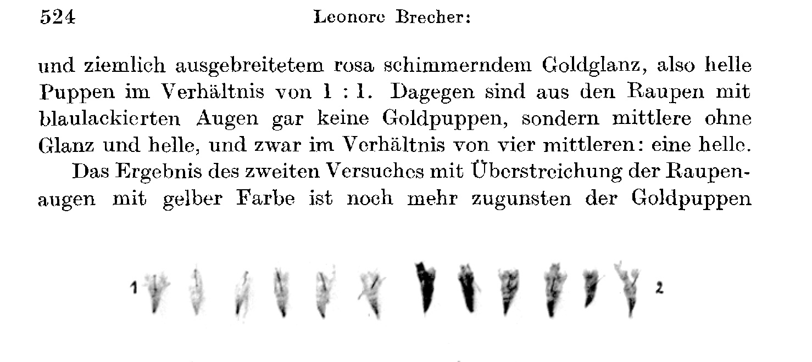

# The Pupal Colourations of the Vanessids (Vanessa Io, V. urticae).

By

Leonore Brecher.

(From the Biological Experimental Institute of the Academy of Sciences in Vienna [Zoological Division].)¹

With 1 text-figure.

(Received on 5 October 1923.)

*Archiv für mikroskopische Anatomie und Entwicklungsmechanik*, vol. 102 (1924).

> **Full translation.** A complete English rendering of the running text of “The Pupal Colourations of the Vanessids (Vanessa io, V. urticae)” (Leonore Brecher, 1924), including all tables, figure and plate legends, and footnotes. Numbers and table cells were transcribed from the page images, not the noisy OCR.

> ¹ An abstract of this work appeared, with the same title, as Communication No. 68 from the Biological Experimental Institute of the Academy of Sciences, Zoological Division. Director: H. Przibram, in the Academy's Proceedings Notices [Akad. Sitzungsanz.] 1922, No. 2–3.

### Table of Contents.

| | Page |
|---|---|
| I. Investigations to decide the question of whether the light-influence which conditions the colour-adaptation of the pupae passes through the caterpillar's eye | 517 |
| &nbsp;&nbsp;&nbsp;&nbsp;1. Establishment of a difference in the lower intensity threshold for the effectiveness of the environmental colours (yellow) in normal caterpillars and in caterpillars with eyes painted over black (experiments on *Vanessa urticae*) | 517 |
| &nbsp;&nbsp;&nbsp;&nbsp;2. Positive colour-adaptation of the pupae after coloured lacquering of the caterpillars' eyes | 521 |
| &nbsp;&nbsp;&nbsp;&nbsp;&nbsp;&nbsp;a) Keeping the caterpillars with eyes painted over in colour in a neutral environment (*Vanessa Io, urticae*) | 521 |
| &nbsp;&nbsp;&nbsp;&nbsp;&nbsp;&nbsp;b) Keeping the caterpillars with eyes painted over in colour under bell-jars of opposite colour (*Vanessa Io, urticae*) | 526 |
| II. Examination of the question of whether the environmental colour acts upon the pupation-ripe caterpillar through its specific colour-quality or its brightness, by means of carefully tested papers | 533 |
| &nbsp;&nbsp;&nbsp;&nbsp;1. Experiments with Hering's coloured and grey papers (*Vanessa urticae*) | 533 |
| &nbsp;&nbsp;&nbsp;&nbsp;2. Experiments with W. Ostwald's coloured papers of varying saturation (*Vanessa urticae*) | 536 |
| III. Summary | 539 |
| IV. Bibliography | 540 |
| V. Tables | 542 |

## I. Investigations to decide the question of whether the light-influence which conditions the colour-adaptation of the pupae passes through the caterpillar's eye.

### 1. Establishment of a difference in the lower intensity threshold for the effectiveness of the environmental colours (yellow) in normal caterpillars and in caterpillars with eyes painted over black.

In pursuing the question of by what path the light-influence that brings about the colour-adaptation of the pupae acts upon the pupationripe caterpillar, the following experiments were established (cf. *Brecher*, 1922, The Pupal Colourations of the Vanessids II. 237 ff.: Path of the light-influence).

According to *Poulton* (1887), as well as according to my own experiments, painting over the caterpillars' eyes with non-transparent colour had no influence upon the retention of the environmental colour in coloured boxes. In daylight, the same green (*Io*) gold-pupae [*Goldpuppen*] arose namely in the yellow as in the green ones (*Io*); gold-pupae (*urticae*) arose from caterpillars with painted-over eyes just as from normal caterpillars.

Total exclusion of the eyes by electrocaustic blinding or by ligaturing-off of the head (*Przibram* in *Brecher*, Pupal Colourations of the Vanessids, 1922, and *Przibram*: Pupation of headless caterpillars, 1922) abolished the colour-adaptation. There arose in all environmental colours and in darkness the same medium pupae, namely partly such in yellow-green (*Io*) or gold-pupae (*urticae*), as they otherwise would arise through the action of yellow light characteristic for it.

When *Io*-caterpillars with eyes painted over black were kept, as well as such [caterpillars] with normal eyes in dark little boxes in the dark chamber, the characteristic pupae arose at the various distances from a 16-candlepower incandescent lamp. The characteristic action of yellow light upon the colour from a removal of the light-source could not be recognized either in the pupae from the caterpillars with painted-over eyes or in those with normal eyes; that is, both showed the characteristic influencing of the environmental colour to no further extent.

These results spoke in favour of the fact that the influence of the environmental colour does not take place at all by light-perception from the eye, and that the maintaining of the colour-adaptation through the keeping of the caterpillars with eyes painted over black in yellow boxes in daylight could nevertheless be traced back to it, since despite the painting-over enough light reached the eye to bring about the colour-adaptation.

The difference of the lower intensity threshold for the effectiveness of the environmental colour in *Io*-caterpillars with normal and with painted-over eyes did not appear to me clear-cut enough in these experiments to be carried through with sharp delimitation. Whether a real difference of light-perception exists here at all, or whether a firmly established fact obtained, in order to be able to base further decisive experiments upon it, I had to decide.

I therefore set myself, before turning to the actual essential task of this work, this question, whether through light-influence the pupal colouration is conditioned, [whether] through the eye, gold-, green-, brown-pupae arise: namely [I set myself this question] more sharply still.

I first determined for *V. urticae* the above-mentioned [experiment of the] previous year on *Io*. The experimental setup was the following:

In the dark chamber, at various distances from a 16-candlepower incandescent lamp, pupation-ripe caterpillars were placed, [some] in yellow lined-out little boxes, partly with normal, partly with eyes painted over black.

For this, pupation-ripe wandering caterpillars of the same brood were used, and indeed for each experiment nine caterpillars of equal condition.

This experiment now shows very clearly and much more sharply than with *V. Io* (cf. *Brecher*, The Pupal Colourations of the Vanessids, 1922, p. 239) the action of the environmental colour (yellow) upon the caterpillars with eyes painted over black at the various distances from the light-source; it brings out the difference of the non-lacquered eyes by the non-influencing more sharply.

**Versuchsverlauf [Course of the experiment].** *(cf. concerning the pupation-site also Table A.)*

| Removal from the light-source | From caterpillars with non-painted-over eyes. | From caterpillars with eyes painted over black |
|---|---|---|
| 1 m | Uniform result, typical influence of yellow environment: throughout gold-pupae. | 6 typical gold-pupae¹)   2 show the transition-type between light and middle ones   1 dark |
| 2 m | 6 typical gold-pupae   1 at the limit of the yellow-action: yellow, but little gold-glossy pupa   1 dark   1 dead. | 2 typical gold-pupae   4 light   2 middle   1 dark |
| 3 m | Fairly uniform result: weak yellow-action. The pupae make a yellow impression, but they lack the gold-gloss characteristic for the typical yellow-action. The types of the arisen pupae passing into one another, without sharp differences, which I arranged into the pupal-colour-types as follows:   3 yellow-looking pupae like Type 7, almost without gloss.   3 light Type 5   2 middle Type 4   1 not pupated.   This arrangement into different pupal-colour-types is a rather artificial one: The pupae make rather a uniform impression, [a] yellow habitus, little gloss. It is a matter without doubt of the limit of the yellow-action. | 5 pupae which stand between gold- and light pupae   1 middle   1 dark   1 very dark |
| 4 m | These pupae let recognize still more the transition to the rosa-type (that is, light and middle ones), they have still less gloss:   1 bronze-coloured Type 7   1 whitish Type 6/7   light, rosa Type 5   light middle Type 4/5   2 middle   1 dark   1 very dark. | 3 pupae transition to the light ones (2 Type 7, 1 Type 5)   3 middle Type 4   3 dark |
| Darkness | Very uniform result: all are dark pupae quite without gold. | likewise as with the non-lacquered ones: all dark. |

> ¹ The designation of the types refers to *Brecher*, The Pupal Colourations of the Vanessids I, 1922, pp. 210–216.

I first repeated on *V. urticae* the above-mentioned experiments set up in the previous year on *Io*.

In the dark chamber, at various distances from a 16-candlepower incandescent lamp, two yellow lined-out little boxes were set up at each [distance], of which the one contained normal caterpillars, the other caterpillars with eyes painted over black.

For this, pupation-ripe wandering caterpillars of the same brood were used, and indeed nine caterpillars were given into each condition.

This experiment shows very clearly and much more strikingly than with *V. Io* (cf. *Brecher*, The Pupal Colourations of the Vanessids, 1922, p. 239) that the action of the environmental colour (yellow) upon the caterpillars with eyes painted over black ceases at a distance from the light-source at which the non-lacquered ones still show influencing.

Much more clearly than is possible in the reproduction by the description and the tabular compilation, this result came to bear in the consideration of the living pupae of this experimental series, which I had the opportunity to demonstrate to several persons.

A survey of the obtained results shows us that:

In the *non-lacquered ones*, at 1 m removal the typical yellow-action is to be recognized throughout, in that all delivered the strongly gold-glossy pupae.

At 2 m, half of the pupae are typical strongly glossy gold-pupae, the others, except for one, are at the limit of the yellow-action — these are yellow, not strongly gold-glossy pupae — and one pupa is of a deviating type, namely a very dark one.

At 3 m the result is very uniform: All pupae let the limit of the yellow-action be recognized, the pupae have a yellow habitus but little gloss.

At 4 m the transition to the type of the rosa pupae (light, middle ones) shows itself still more, they have still less gloss; two are dark pupae.

In darkness, throughout dark pupae without gloss [arise].

The limit of the yellow-action would thus lie, for the non-lacquered ones, at a distance between 3 and 4 m.

If we consider the pupae arisen from the caterpillars *with eyes painted over black*, then already at 1 m removal not throughout the typical gold-pupae have arisen: there are two-thirds typical gold-pupae, two transition-types between light and middle ones, one dark. It is thus actually the same result as with the "non-lacquered ones" at 2 m removal.

At 2 m only two pupae let the typical yellow-action be recognized, four are light, two middle, one dark. It is thus already at this removal that the limit of the yellow-action is to be recognized, whereas the "non-lacquered ones" at this removal yielded, except for one deviating dark one, throughout gold-pupae.

At 3 m, of the pupae arisen from the lacquered caterpillars five show the transition-type between gold- and light pupae; further, one middle, one dark, one very dark arose. It is a similar result as from the "non-lacquered ones" at 4 m.

Finally, at 4 m one third of the pupae belongs to the light type, one third to the middle ones, one third are dark pupae, a result that thus scarcely corresponds any longer to the action of yellow; it approaches rather the action of darkness, where all dark pupae [arise]. (In the rest, in darkness, the various types often occur side by side, cf. for example the other experiments with *urticae* in darkness in the tables.)

The limit of the yellow-action is thus, for the "lacquered ones", already at 2 and 3 m.

In the comparison of the effectiveness of the environmental colour upon the "lacquered ones" and "non-lacquered ones" at the various distances, it shows itself that they are always removed by one degree of the chosen distance from one another.

The repetition of this experiment, in which the little boxes were set up at the intermediate distances in order to establish the lower intensity threshold for the effectiveness of the yellow upon lacquered and non-lacquered ones more exactly, yielded less clear-cut results.

I could, however, dispense with a further repetition of such experiments, since the results obtained up to now from the experiments on *Io* (1922) and from the above-described first experiment on *urticae* are entirely in the same direction, the conclusion drawn from them is therefore likely to be correct, and all the more so as the question was completely decided in this sense by the experiments to be discussed in the now-following section, set up in the meantime, with coloured lacquering of the caterpillars' eyes.

### 2. Positive colour-adaptation of the pupae after coloured lacquering of the caterpillar eyes.
#### a) Keeping the caterpillars with eyes painted over in colour in a neutral environment.

*Vanessa Io.*

A number of caterpillars of the same brood were divided into three parties. With one party both eyes were painted over with yellow paint (gold-yellow lacquer of *Schönfeld*, Düsseldorf: gelber Lack hell [yellow lacquer light]), with another party both eyes were painted over with blue oil-paint (*Schönfeld*, Düsseldorf: Pariserblau [Paris blue]). The painting-over took place in the manner that the colour by means of a marten-brush was applied richly upon both eyes and, for the purpose of quicker drying, was renewed several times. Insofar as the caterpillars of a party had had their eyes painted over, it was insofar uncertain whether they had not been [painted] a second time with the paint; it was nevertheless possible that there was one [caterpillar] whose eyes were not yet covered.

Yet a third party of caterpillars was kept under the neutral Müller-gauze-cage in neutral light.

Each of these three parties was kept in a uniform, neutral light.

From the caterpillars with *yellow-lacquered eyes* there arose (cf. Table C):
6 green pupae typical for the action of yellow light,
3 greenish middle ones, and
6 non-green pupae (dark and middle ones).

There thus arose green and non-green in equal number, besides a few transition-types: greenish middle ones.

The caterpillars with *blue-lacquered eyes* gave:
1 green and
10 non-green (dark and middle).

The caterpillars with non-painted-over eyes gave:
1 not quite typical green pupa, rather to be classified as light Type 6, and
11 non-green (dark and middle).

Whereas thus in the control-experiments without painting-over of the eyes, as well as with painting-over of the eyes with blue colour, at most a tenth of the pupae belong to the green type, but all the others are non-green dark and middle pupae, the caterpillars with eyes painted over yellow yielded, in a much higher percentage — namely to one half — the typically green pupae characteristic for the action of the yellow rays.

At the repetition of this experiment, from nine caterpillars each there arose from the "yellow-lacquered ones":
4 green (one of which is a not quite typical light one) and
5 non-green,
thus likewise nearly in equal number green and non-green.

The "blue-lacquered ones" yielded not a single green one.

If one adds the results of both experiments, then among the pupae arisen from caterpillars with yellow-lacquered eyes there are, under 24 pupae, 13 green pupae, such as otherwise arise in yellow environment, and eleven dark and middle ones, namely six dark and five middle ones, such as occur in neutral environment.

Against this, among the pupae from caterpillars with blue-lacquered eyes, under 20 pupae only one green one arose. The other 19 are dark and middle ones in roughly equal number (10 dark and 9 middle ones).

*Vanessa urticae.*

The first experiment with coloured lacquering of the eyes, in the manner described above with *Io*, I had carried out on *Vanessa urticae*.

It yielded (cf. Table B):

From 10 caterpillars with yellow-lacquered eyes
5 gold-pupae, among them two of quite especially strong gold-gloss with green sheen, extreme gold-pupae,
5 light pupae Type 5¹) with rosa-shimmering gold-gloss.

The general impression that these pupae make is that as with typical yellow-action.

From just as many caterpillars with eyes painted over blue there were:
8 middle pupae Type 4, which besides three silvery-shimmering spot-pairs are quite without gloss, and
2 lighter pupae with stronger emergence of the rosa opacity and stronger spreading of the rosa-shimmering gloss, which to the light Type 5 can be counted, [these] arose.

These pupae make a completely different impression from the pupae arising from the caterpillars with yellow-lacquered eyes. They are pupae such as arise in neutral light and in grey, lighter than would otherwise correspond to the action of blue light (blue surfaces in more intensive white light).

At the repetition of this experiment (cf. Table B) there showed again with the pupae arising from caterpillars with yellow-lacquered eyes a quite strikingly typical influencing of yellow light. Except for three light Type 5, which differ only little from those arising from the blue-lacquered ones, all the rest, that is seven pupae, are the gold-pupae Type 8 typical for yellow environment. Among them are three pupae of a gold-gloss never before observed, with delicate green reflexes, as extremely golden as they have never before been seen up to now in yellow environment.

From the caterpillars with blue-lacquered eyes arose not one single gold-pupa, but seven typical middle pupae with small rosa-shimmering gold-flecks; one could rather be counted to Type 5, that is to the light ones, similar to the three non-influenced ones from the "yellow-lacquered ones", and two are rather dark, Type 2 (cf. the text-figure Group 2: pupal cases [Puppenhüllen]).

So in the first experiment there arose from caterpillars with yellow-lacquered eyes: On the one hand gold-pupae quite without pigment and of completely metallic appearance, such as are characteristic only for yellow light, and also pupae with rosa opacity, little dark pigment and rather extended rosa-shimmering gold-gloss, that is light pupae in the ratio of 1 : 1. Against this, from the caterpillars with blue-lacquered eyes [there are] no gold-pupae at all, but middle ones without gloss, and light ones, and indeed in the ratio of four middle ones : one light one.

> ¹ The designation of the types refers to *Brecher* 1922, Vanessids, pp. 210–216.

---

**Fig. 1.** The figure depicts the pupal cases of *Vanessa urticae*, preserved after the emergence of the butterflies.
Group 1: Cases of gold-pupae, arisen from caterpillars with yellow-lacquered eyes in neutral environment.
Group 2: Cases of dark to middle pupae, arisen from caterpillars with eyes painted over blue in neutral environment.
Group 3: Cases of gold-pupae, arisen from caterpillars with yellow-lacquered eyes under a blue bell-jar.
Group 4: Cases of dark to middle pupae, arisen from caterpillars with blue-lacquered eyes under a yellow bell-jar.
Group 5: Cases of gold-pupae, arisen from normal caterpillars under a yellow bell-jar.
Group 6: Cases of dark to middle pupae, arisen from normal caterpillars under a blue bell-jar.
Also on the cases the difference between the influence of yellow and the influence of blue light is very clear. The cases of the pupae from normal caterpillars under a yellow bell-jar, from caterpillars with eyes painted over yellow in neutral environment and from caterpillars with eyes painted over yellow under a blue bell-jar are quite alike among one another (cf. Groups 5, 1 and 3), and indeed they are yellowish with gold-shimmer and completely without black pigment. Against this, the cases of the pupae from normal caterpillars under a blue bell-jar (6), from caterpillars with eyes painted over blue in neutral environment (No. 2) and from caterpillars with eyes painted over blue under a yellow bell-jar (4) are likewise very similar among one another, but very different from the groups of the left side. They distinguish themselves from the yellow-influenced ones by strong development of black pigment in the case and the lack of gold-gloss. The photograph was, in obliging manner, produced by Dr. Leo Adolph, assistant from Riga, on the occasion of his sojourn at the Biological Experimental Institute, for which to him also at this place best thanks be given.  *(figure not reproduced)* and fairly extensive rosy-shimmering golden lustre, that is, light pupae, in a ratio of 1 : 1. By contrast, from the caterpillars with blue-lacquered eyes there arose no gold pupae at all, but rather medium ones without lustre and light ones, indeed in a ratio of four medium : one light.

The result of the second experiment, with the painting-over of the caterpillar eyes with yellow colour, turned out still more in favour of the gold pupae.

---

**Fig.** The illustration shows the pupal shells of *Vanessa urticae*, preserved after the emergence of the butterflies.

> Group 1: Shells of gold pupae, arising from caterpillars with yellow-lacquered eyes in neutral surroundings.
> Group 2: Shells of dark to medium pupae, arising from caterpillars with blue-painted-over eyes in neutral surroundings.
> Group 3: Shells of gold pupae, arising from caterpillars with yellow-lacquered eyes under a blue bell-jar.
> Group 4: Shells of dark to medium pupae, arising from caterpillars with blue-lacquered eyes under a yellow bell-jar.
> Group 5: Shells of gold pupae, arising from normal caterpillars under a yellow bell-jar.
> Group 6: Shells of dark to medium pupae, arising from normal caterpillars under a blue bell-jar.
> In the shells too, the difference between the influence of yellow and the influence of blue light is very distinct. The shells of the pupae from normal caterpillars under the yellow bell-jar, from caterpillars with yellow-painted-over eyes in neutral surroundings, and from caterpillars with yellow-painted-over eyes under the blue bell-jar are entirely alike among themselves (cf. Groups 5, 1 and 3), namely yellowish with a golden shimmer and completely without black pigment. By contrast, the shells of the pupae from normal caterpillars under the blue bell-jar (6), from caterpillars with blue-painted-over eyes in neutral surroundings (No. 2), and from caterpillars with blue-painted-over eyes under the yellow bell-jar (4) are likewise very similar among themselves, but very different from the groups on the left side. They are distinguished from the yellow-influenced ones by strong development of black pigment in the shell, and by the lack of golden lustre. The photograph was kindly produced by Herr Dr. Leo Abolin, assistant from Riga, on the occasion of his stay at the Biological Experimental Institute, for which he is here too most cordially thanked.

*(figure not reproduced)*

There are seven gold pupae: three light ones arose. From the blue-lacquered ones, two dark, seven medium, one light.

If we add together the results of the two experiments, then the caterpillars with yellow-lacquered eyes have yielded gold pupae and light ones in a ratio of three golden : two light, hence in any case predominantly gold pupae. From "blue-lacquered" not a single gold pupa [arose], but rather there arose dark, medium, and light ones in a ratio of three light : 15 medium : two dark, hence predominantly medium ones.

The pupal shells preserved after the emergence of the butterflies still allow the differences in colouration to be recognized very distinctly, according to whether they arose from caterpillars with yellow- or with blue-lacquered eyes.

The shells of the second experiment with *Vanessa urticae*, as well as those from the experiments on *V. urticae* described in the next section, were pinned up on white cardboard by means of insect needles and photographed. I owe the production of the photograph to the kindness of Herr Dr. Abolin from Riga.

Thus, in the accompanying illustration, one sees in the first row on the left (No. 1) the entirely pigmentless yellow (even in the dry state somewhat gold-shimmering) pupal shells which arose from the caterpillars with yellow-lacquered eyes, while on the right (No. 2) one can see the pupal shells appearing distinctly darker through the deposition of black pigment, [arising] from the caterpillars with blue-lacquered eyes.

The result of these experiments on *urticae* as well as on *Io* is completely unambiguous: when the animals were kept in neutral surroundings, the lacquering of the eyes with yellow colour sufficed to achieve the same effect on the pupal colouration as yellow surroundings exert, namely to bring about the arising of the gold pupae characteristic of yellow light (*urticae*), or of the gold-lustred green (*Io*) pupae. From the caterpillars with yellow-painted-over eyes kept in neutral light conditions there arose, in *urticae*, in predominant number the gold pupae characteristic of yellow, indeed among them even far more beautiful ones than ever occurred in yellow or gold-lustred surroundings; in *Io*, half of them became the green gold-lustred pupae characteristic of *yellow* light.

The arising of even a few deviating types as well, which do not exhibit this effect (light ones in *urticae*, medium and dark ones in equal number in *Io*), is presumably to be ascribed — as was set out in the *Pieris* work (Brecher, Cabbage-White VIII, see this issue) — to imperfections of the lacquering, so that in these cases the influence of the neutral surroundings asserted itself. Here it is shown that in *urticae* a far smaller number of such "uninfluenced" pupae arose than in *Io*.

The caterpillars with blue-lacquered eyes have yielded a completely different result in comparison to the caterpillars with yellow-lacquered eyes: From the "blue-lacquered" ones not a single gold pupa (*urticae*), or only so few gold-green ones (*Io*) (1 in 20) as can also occur sporadically under neutral conditions, arose, but rather dark and medium pupae without golden lustre, namely in *urticae* predominantly medium ones, in *Io* dark and medium ones in approximately equal number. The pupae arising after lacquering of the caterpillar eyes with blue colour are in general somewhat lighter than those which otherwise arose in blue light (blue surfaces in white light, and under the *Sennebier* bell-jar filled with blue copper-oxide-ammoniac solution), and correspond rather to the effect of grey or neutral surroundings. For this, a difference in the composition of the light transmitted by the colour layer would presumably be responsible.

These experiments with coloured lacquering of the eyes thus prove in a completely unambiguous and striking manner that the influence of the light which determines the pupal colour passes *through* the caterpillar eye.

This positive colour-adaptation following coloured lacquering of the eyes forms the counterpart to the extinction of the colour-adaptation following removal of the eyes in the earlier experiments, as they had been carried out by *Przibram* (Przibram, 1922, cf. also in Brecher, Vanessids, 1922), and which were recently repeated by me, as a check on my experiments with coloured lacquering of the eyes, by the method of *Przibram* — by cutting off the head after prior ligature (see Tables B and C).

### b) Keeping the caterpillars with eyes painted over in colour under bell-jars of opposite colour.

*(Io, urticae.)*

The experiments just discussed have, however, not yet entirely decided the question whether the colour-influence proceeds only through the caterpillar eye and not also directly through the caterpillar skin; for in this experimental arrangement the caterpillar received, through the eye, a strong colour-action — e.g. yellow rays — while the rest of the caterpillar body was exposed to mixed light, which has no specific effect on the pupal colouration.

This question — whether a direct light-influence through the skin of the caterpillar also takes place — could be decided by experiments in which the eyes are exposed to one colour and the rest of the caterpillar body to an oppositely-acting colour.

In order to decide the question whether the colour-influence proceeds through the eye or through the body of the caterpillar, *Poulton* had already, alongside the experiments with painting-over of the eyes with black colour, carried out the "conflicting colours experiments", in which he exposed the eye-bearing part to one colour and the rest of the caterpillar body to an oppositely-acting colour. He obtained pupae of intermediate colouration and such as approached more the effect of the one or the other surroundings-colour, and he arrived at the result that the light-influence proceeds independently of the eye, and that for the pupal colouration that colour was decisive which had acted on the larger area of the body — quite regardless of whether in this case it was a matter of the eye-bearing or the eyeless part of the caterpillar body.

From my own experiments, similar to those of *Poulton*, I had made the experience that in this rather complicated experimental arrangement, as a consequence of the all-too-long manipulation, the sensitive stage for influencing was lost, and the resulting medium colouration was to be ascribed merely to an extinction of the colour-sensitivity owing to the too-advanced stage. It is probable that this explanation applies also to a large number of the experiments of *Poulton*, in which he exposed the caterpillars to the "conflicting colours" only after the suspension [for pupation].

Various experimental arrangements in which the caterpillars were to be exposed to colour-conflicts right at the beginning of the sensitive stage — e.g. by means of coloured hoods, or two-coloured paper collars through which the head of the caterpillar was forced — led to no unambiguous results. In the case of many pupae it also gave the impression that in these experiments the head was constricted too much, whereby — similarly as with ligature of the head — the medium colouration that arose would be ascribable to non-influencing. It was very difficult to produce in this way a flawless experimental arrangement.

I therefore sought another method which would make it possible, in a flawless way, to expose, in the caterpillars in the sensitive stage, the body on the one hand and the eye on the other to different light-influences, without thereby placing them in a constrained position. On the basis of the results obtained with the coloured lacquering of the eyes, the following way seemed to me suitable:

I brought caterpillars with yellow-lacquered eyes, in a Müller gauze cage, under a blue *Sennebier* bell-jar filled with copper-oxide-ammoniac; caterpillars with blue-painted-over eyes under an orange-yellow bell-jar filled with potassium-bichromate solution. Beside these I set up, as a control, caterpillars with normal eyes under a yellow and likewise under a blue bell-jar. The bell-jars were exposed to daylight beneath a skylight. For such experiments caterpillars of a single brood were always used.

### *Vanessa Io* (cf. Table C).

There were 15 caterpillars each — namely from the same brood as for the experiments with coloured lacquering of the eyes in neutral surroundings — placed into each condition. The normal caterpillars gave:

under the yellow bell-jar, as always, typical transparent green gold-lustred pupae Typ 8 (14 pupae),

under the blue bell-jar, as always throughout (14 pupae) non-green dark pupae Typ 2.

The caterpillars with blue-lacquered eyes under the yellow bell-jar gave:

4 typical green, Typ 8,

2 light,

6 dark, Typ 2,

3 entirely dark, almost Typ 1,

thus at most six green : nine non-green (medium-to-) dark ones. There are therefore six pupae such as are characteristic of yellow, and nine pupae such as are characteristic of blue.

Thus under the yellow bell-jar there arose, from caterpillars with blue-lacquered eyes, in the greatest percentage the pupae characteristic of blue.

The caterpillars with yellow-lacquered eyes under the blue bell-jar gave:

4 typical green, Typ 8,

2 not-so-transparent green, Typ 7,

1 still more opaque, somewhat more strongly pigmented, hence light, Typ 6, and

7 entirely uniform, not very dark, Typ 2,

thus 7 green : 7 non-green.

Thus there arose under the blue bell-jar, from caterpillars with yellow-lacquered eyes, in equal number the pupae characteristic of yellow and those characteristic of blue light.

### *Vanessa urticae* (cf. Table B).

The experiment with *Vanessa urticae* gave still far more beautiful results. Here too caterpillars of a single brood were used, and 15 caterpillars placed into each condition.

The normal caterpillars gave: Under the yellow bell-jar throughout (9 pupae) extreme gold pupae with strong lustre, Typ 8 (cf. on the photograph Group 5, the photograph of the dry pupal shells of this experiment).

Under the blue bell-jar not a single gold-lustred pupa, but rather throughout (14 pupae) the medium pupae characteristic of blue (cf. illustration Group 6), namely:

3 light medium, Typ 5/4,

8 medium, Typ 4,

3 dark, Typ 2.

The caterpillars with blue-lacquered eyes under the yellow bell-jar gave:

2 typical gold pupae, Typ 8, 2 light rosy pupae with strong lustre, Typ 7,

7 medium pupae, Typ 4,

1 dark medium with strong black pigmentation, Typ 4,

1 dark, Typ 2.

Thus actually at most four pupae correspond to the yellow-effect and nine pupae to the blue-effect.

Hence under the yellow bell-jar the caterpillars with blue-lacquered eyes have, in predominant number, given the pupae characteristic of the effect of blue (cf. on the photograph Group 4, the shells of these pupae).

The caterpillars with yellow-lacquered eyes under the blue bell-jar gave throughout (14 pupae) strongly-lustred typical gold pupae, hence an entirely identical result to the normal caterpillars under the yellow bell-jar. They thus show a complete yellow-effect (cf. on the photograph Group 5).

So in these experiments, in *Io*, the normal caterpillars under the yellow bell-jar have, as always throughout, given the green gold-lustred pupae characteristic of this colour; under the blue bell-jar, as always throughout, the dark pupae without lustre characteristic of blue light. The caterpillars with blue-lacquered eyes under the yellow bell-jar have, in predominant number, given dark pupae corresponding to the effect of blue light, and only a small number of green pupae characteristic of yellow light. The caterpillars with yellow-lacquered eyes under the blue bell-jar have given, in equal number, the green pupae characteristic of yellow light and the dark pupae corresponding to blue light.

In *urticae*, from the normal caterpillars under the yellow bell-jar there arose throughout the strongly gold-lustred pupae characteristic of yellow light (illustration Group 5); under the blue bell-jar, pupae of the medium colour-types such as occur in blue (medium to dark) (illustration Group 6).

The "blue-lacquered" ones under the yellow bell-jar gave, in predominant number, the pupae characteristic of blue and only a few that correspond to the yellow-effect (illustration Group 4).

The caterpillars with yellow-lacquered eyes under the blue bell-jar gave throughout the strongly gold-lustred pupae characteristic of yellow light (illustration Group 3). These pupae, arisen under the blue bell-jar from "yellow-lacquered" caterpillars, are completely identical to the pupae from normal caterpillars under the yellow bell-jar (cf. illustration Groups 3 and 5).

These experiments show — what was moreover already known from the spectroscopic investigations (cf. *Jakobi*, 1914) — that the solutions used, in the layer-thickness used, in the bell-jars are not completely monochromatic, but also transmit other rays than those in whose colour they appear to us; that the yellow bell-jar must also transmit blue rays, the blue bell-jar also yellow rays. For the pupal colour this was always — so too in the present experiment with the normal caterpillars — without significance; the bell-jars had acted just the same as if only monochromatic light had been transmitted. It is otherwise with the caterpillars with lacquered eyes: here a second filter was interposed in front of the eyes of the caterpillars, namely the colour with which the eyes had been painted over.

Had the colour of the bell-jar and the colour of the eye-lacquer under the bell-jar in question been completely complementary to one another, then the eyes could have received no light at all, since the rays transmitted by the bell-jar would have been completely absorbed by the lacquer layer interposed in front of the eyes. In this case the eyes would have been exposed to darkness, which has no positive effect on the pupal colouration, [while] the entire rest of the caterpillar body [would have been exposed] to a strongly-acting colour, yellow or blue respectively. It would then have been approximately the counterpart to the experiment in which the eyes were exposed, through lacquering, to a strongly-acting colour, yellow or blue respectively, but the rest of the body to mixed light, which has no characteristic effect on the pupal colouration.

Were the light-influence to pass not only through the eye but also through the rest of the body, then in this experiment — where the eyes were in darkness, hence under no light-influence at all — the light-influence to which the caterpillar body had been exposed would have to come to expression in the pupal colour; that is, the "yellow-lacquered" ones under the blue bell-jar would throughout give the dark pupae characteristic of blue, the blue-lacquered ones under the yellow bell-jar would throughout give the pupae characteristic of yellow, gold or gold-green respectively — exactly as the normal caterpillars [do]. We have indeed seen that an apparently far-reaching darkening of the eyes by painting-over with black colour, when [the animals were] kept in daylight, had not abolished the influence of the surroundings-colour. (In the previous year such experiments had also been carried out under the bell-jars, with the same result as in the reflection boxes.)

Were the light-influence to proceed only through the eye and not also through the body, then — in the case where the colour of the solution and the colour of the eye-lacquer had been strictly monochromatic and complementary to one another — both the caterpillars with blue-painted-over eyes under the yellow bell-jar and the caterpillars with yellow-painted-over eyes under the blue bell-jar would have had to give pupae that equalled the pupae [arising] from darkness, hence medium pupae.

Now, the rays let through by the blue bell from the outset were not monochromatic, and from this circumstance the obtained result becomes understandable: under the blue bell, the yellow rays let through by the blue solution, which acted upon these eyes, indeed produced the specific yellow-effect of the pupal colouration in those animals in which the blue rays let through by the bell, far predominant in number, struck non-lacquered bodies; in any case the effect, as we are accustomed to seeing it, did not appear when larvae [Raupen] with non-lacquered eyes were placed under the blue bell.

If we consider the opposite experiment with larvae having blue-lacquered eyes under a yellow bell: here the few yellow rays let through by the yellow solution could act upon the non-lacquered bodies, and accordingly produce a dark yellow-effect, while indeed all the other bodies with yellow eyes were exposed, yet nevertheless the colour perceived by the eye was decisive for the pupal colouration.

The blue-lacquering succeeded with few pupae, whose colouration was not so much determined by the action of the blue eye as [it was with] the yellow-lacquering, which, as already shown earlier (see *Brecher, Pieris*, this issue), turns out to be more reliable, and the deficient covering of the eyes does not deceive.

After this experiment it now seems doubtful which light-influence — whether the one acting directly through the eye or that acting directly through the skin — the colouration follows.

It would indeed have been possible, through this experimental arrangement, to demonstrate whether a direct influence of the light through the skin is to be detected, that the eyes were not at all involved here, that, in other words, the direct influence of yellow light on the larval body would promote precisely the formation of the black pigment, while blue light would inhibit the formation of the black pigment and thus produce gold pupae. Furthermore, it might perhaps be inferred that white light, when it acts directly and not through the eyes, has dark pupae as a consequence, similar to the larvae which have black pupae as a consequence, as described in Crustacea (*Keeble* and *Gamble*, 1904), blinded fishes (v. *Frisch*, 1911), salamander larvae (*Fischel*, 1919, *Przibram-Dembowski*, 1922).

In that case one would have had to expect the same result in the present experiment as obtained here, namely, that the effect through the action of the light-influence through the eyes and the action of the light-influence directly upon the body would summate. For then there would show themselves precisely here the results in larvae which were over-lacquered on the eyes, that the action of the direct light, which would occur through the body, would at least predominate, or that in the pupal colouration this adaptive light-influence, which occurs directly through the skin, comes to bear.

It would have to result from the exclusion of the eyes whether a direct influence through the skin is to be demonstrated in opposition to the influence through the eyes. The previous experiments on the elimination of the eyes were, however, not numerous enough; in such larvae there are perhaps no detectable differences established with certainty. Even with very few [such experiments], perhaps a single experiment here with distinct fleck-lacquering and a more sharply characterized darkening of the eyes — e.g. on *Pieris brassicae* — would be more suitable.

After all these experiments it does not follow with certainty whether the pupal colouration is determined solely by the light, although the larvae in the sensitive pupae correspond [to the surroundings]. Or whether one would nevertheless wish to express it less carefully [as] the colour of the surroundings, and the colour-influence is conveyed by way of the eyes.

What now appears as the simplest process for the alteration of the chemism of the larva through light, which leads to the formation of the colour-substances in the pupal husk and to the adaptive colour-adaptation, lies in the following. In an earlier work (cf. *Brecher*, Vanessiden, 1922) I expressed on p. 269—271 the hypothesis "...that one must attribute to respiration a role in the formation of the colour-substances, in that it has changed there and the colour-substances are determined by the gas-exchange, and indeed that, with the influence of the colours and the action of the tyrosinase, the various conveyance of the oxygen happens — that the eyes take up the various conveyance of the oxygen in the various colours, and likewise the air-free oxygen-melting of the tyrosinase in vitro, also the rise in the colour-sensitivity of the tyrosinase, e.g. yellow, have [an effect]." This hypothesis, which is here taken up anew, finds general confirmation in the slowly progressing examination, while precisely in this stage of the gas-exchange-determinations on larvae in the sensitive "...tyrosinase" stage the work of *Bodine* (1922), on the gas-exchange CO₂-elimination in comparison to the pupation, [is] established.

On the other hand, one could also think of a relation between gas-exchange and acidity of the blood. Since the effectiveness of the tyrosinase depends in high degree on the acidity, and on the other hand in the course of my previous investigations a reference to an alteration of the acidity in the various stages of the pupation, as well as the influencing through light of various wavelengths, speaks [for this], so the real path of the influencing of the pupal colour through the light would perhaps be the following:

The larval eye has an influence on the gas-exchange; the latter has an influence on the acidity of the blood; the acidity of the blood influences the effectiveness of the tyrosinase and thereby determines the pigment-formation in the pupal husk.

This path, here only sketched, of the light-influencing of the pupal colour through the larval eye on the gas-exchange would yet have to be settled by experiment. It will be the next task to test this question experimentally.

## II. Examination of the question whether the colour of the surroundings acts on the pupation-ripe larva through its specific colour-quality or its brightness, by means of exactly tested papers.

### 1. Experiments with *Hering*'s colour- and grey-papers¹).
*(Vanessa urticae.)*

It was here from the standpoint of the question of these experiments on these animals (cf. *Brecher*, *Pieris*, VIII, this issue) interesting to analyze the question anew, in order to bring to the larval eye specifically the touching light, which here determines the pupal colour, in a certain brightness-equality.

For these experiments I used the *Hering* colour- and grey-papers used in those experiments described in *Pieris brassicae* (see this issue) (cf. Table D).

*Light Yellow (Gelb Hering Nr. 5)* yielded throughout gold pupae, yet not quite as strongly gleaming, Typ 8, as the intensive *Gelb Hering Nr. 4* (see further below), but somewhat more pigment-poor, Typ 7. It is here also a distinct yellow-action, gold pupae somewhat poorer in gold than under the intensive yellow.

*Light Grey (= Gelb Hering Nr. 5)* yielded a result somewhat different from this: this grey yielded one somewhat gold-gleaming pupa Typ 7, one light Typ 5, and all others middle pupae Typ 2.

*Intensive Yellow Hering Nr. 4* yielded throughout typical strongly gold-gleaming pupae of full, perfect gold-action.

*Grey = Gelb Hering Nr. 4* has yielded gold-gleaming pupae, but [also] three middle and five dark Typ 2 pupae.

*Blue Hering Nr. 12* yielded throughout middle (to Typus 2) pupae without gold.

*Grey = Blau Hering Nr. 12.* With the grey equal to blue in general comparison — the dome being comparable in brightness — the pupae [are]

> ¹) Each colour-paper corresponds exactly, for the action on the totally colour-blind human eye, to the corresponding grey.

> Archiv f. mikr. Anat. u. Entwicklungsmechanik Bd. 102. 35 somewhat lighter and some among them show somewhat gold-gloss, while those from blue are matt. They are, however, no all too significant differences.

*Violett Hering Nr. 14* yielded no gold pupae at all. Apart from one middle, all are dark and even very dark.

*Grey = Violett Hering Nr. 14.* Here arise lighter pupae than the brightness-equal Violett, namely one gold-gleaming Typ 7, two middle, all others dark.

*Rot Hering Nr. 1.* Here arose neither quite dark ones, as otherwise on red surfaces freely exposed to white light, nor gold pupae, as behind red filters, but middle pupae, among which some show somewhat gloss.

*Grey = Rot Hering Nr. 1 (Schwarz)* yielded throughout darker pupae than Rot: apart from one dark middle one, [they are] throughout dark, and indeed two very dark Typ 1 arose. It is actually the same result as with Violett.

*Finsternis [darkness]* has yielded very different pupae, and indeed two middle, the others six dark, in part very dark blackish.

If one now considers comparatively the action of the various surroundings, one sees that of all the used colours and grey-papers only the two yellows yielded gold pupae, and indeed the more intensive yellow the most beautiful gold pupae. Against this, the grey corresponding for the totally colour-blind human eye in brightness-value to this yellow yielded no gold pupae, but middle pupae (standing between Typ 2 and Typ 6).

As for the other colours, blue yielded middle pupae which are somewhat darker than the pupae from the brightness-equal grey. Violett yielded very dark pupae, darker than the pupae of the brightness-corresponding grey. Rot had middle pupae as a consequence, thus approximately the same result as blue; the grey (Schwarz) corresponding to it in brightness has darker pupae than Rot, and indeed very dark pupae, similar to Violett.

If one orders the toneless greys in the sequence of their brightness — Grau = Gelb *Hering* Nr. 5, Grau = Blau *Hering* Nr. 12, Grau = Violett *Hering* Nr. 14, this approximately equal with Grau = Gelb *Hering* Nr. 4, Grau = Rot *Hering* Nr. 1 (Schwarz) — and compares the pupae arising on them with one another, then there appears a parallelism between the brightness of the pupae and the steps of grey.

If one wishes to order the colour-papers in the same way according to their brightness, then by no means does such a correlation of the pupae result: Gelb *Hering* Nr. 5 has gold pupae, Blau middle, Violett very dark, the Gelb *Hering* Nr. 4 the most beautiful gold pupae, Rot middle pupae. Rather, this experiment shows, as has already emerged from earlier experiments by another route, that the action of the surroundings-colours on the pupal colouration does not rest on different brightnesses, but on the specific action of the colour-qualities. This comes to expression in a striking manner in particular in the present experiment. The experimental results yield that the action of yellow on the arising of gold pupae is to be attributed not to an action of the brightness, but to the specific action of the yellow rays, since only in yellow gold pupae arose, whereas in the grey corresponding completely in brightness to the used yellow for the totally colour-blind human eye no gold pupae, but middle pupae, arose.

Less clearly does the specific action of the blue, violet, and especially the ultraviolet rays on the dark colouration of the pupae — proven from other experiments (*Brecher*, Vanessiden, 1922) — emerge with the other surroundings-colours, namely with the blue, violet, red, and black papers. This was, however, to be expected with the experimental arrangement chosen for certain reasons (see *Brecher*, *Pieris* VIII, this issue), in which the larvae were located in a glass dish closed with an overlapping glass lid and surrounded above and at the sides by the colour-paper (see *Pieris* work), since through the interposition of several glass layers the yellow striking the larval eye would already have to be poor in the short-wave rays that come into consideration for these surroundings. Nevertheless, Blau yielded middle, somewhat darker pupae than the corresponding grey; Violett very dark, darker than Blau and than the grey corresponding to Violett, the latter [grey giving] somewhat lighter pupae than the Schwarz corresponding to it in brightness. For Rot, as emerges from earlier investigations (cf. *Brecher*, 1922), no specific effectiveness is demonstrated: with unhindered admission of the white light, red surfaces, just like Schwarz, produce dark pupae through the reflected ultraviolet rays; with the exclusion of the ultraviolet rays, the action of the red light approaches the action of the grey corresponding to Violett.

The arising of middle pupae in Rot in the present experiment, where the ultraviolet rays were greatly diminished through the glass lid, stands in accord with these observations.

In any case, also as a consequence of the more favourable season in which these Vanessa experiments were carried out, the darkening action of Blau, Violett, and Schwarz (ultraviolet rays) on the pupae came to light much more clearly than in the same experiments on *Pieris brassicae* in September (see this issue).

It is yet to mention that the action of the present experiment proved, at least for Gelb¹), in an unobjectionable manner that this [colour] influenced the pupal colouration through its specific colour-quality and not through its brightness. Since we now know that this light-influence determining the pupal colouration occurs through the larval eye, one might perhaps perceive in the pupal colouration an objective proof that the larva distinguishes Gelb from Grau of the same brightness.

### 2. Experiments with *W. Ostwald*'s colour-papers of various saturation.
*(Vanessa urticae.)*

These experiments, undertaken by me with regard to another question, I should like to adduce here as a further confirmation of the results gained from the experiments with *Hering*'s papers.

I used for these experiments colour-papers from the Großbothen Energy-Works, which Herr Geheimrat *Wilhelm Ostwald* had the kindness to send.

I took for the present experiment the complete grey-series from white to black, that is, according to the colour-primer of *Ostwald* p. 10: 1. Grau Nr. 30, 2. Grau Nr. 32, 3. Grau Nr. 33, 4. Grau Nr. 34, 5. Grau Nr. 35, 6. Grau (Schwarz) Nr. 36. Besides this I used yet a pure-white writing-paper; simultaneously with the toneless grey-series I tested Gelb in three various saturation-grades, and indeed: *Saturated Gelb* (colour-primer p. 19: Gelb Nr. 08), the same Gelb unsaturated, white-containing, as well as unsaturated, black-containing. Finally larvae were also given into darkness for control. In a second immediately following experimental-series I tested Blau in three saturation-grades, and indeed saturated Blau (colour-primer p. 19: Blau Nr. 54), the same Blau + Weiß and the same Blau + Schwarz, and as control darkness.

The brightness-value of these colours I established by comparing the individual colours with the various toneless greys after the onset of darkness, or in the dark-chamber at so low a light-intensity that I could distinguish the colours only as greys of various brightnesses. There corresponded at this examination the saturated Gelb to the 4. Grau Nr. 34 of *Ostwald* (and to the *Hering* grey = Gelb Nr. 4), the saturated Blau to the 3. Grau Nr. 33 *Ostwald* (lighter than the *Hering* grey = Gelb Nr. 4).

The experimental arrangement was the same as that applied for the examination of the *Hering* papers (cf. experiment-description *Brecher*, *Pieris*, this issue).

> ¹) The specific action of the ultraviolet rays in the effect of Schwarz on the dark-colouration of the pupa was indeed proven through exclusion-experiments with quinine-sulphate (see *Brecher*, Vanessiden, 1922).

It is yet to mention that all the larvae used for this experiment came from one egg-clutch [Gelege]. There came into each condition 10 larvae (see Table E).

*Saturated Gelb* has throughout yielded typical gold-gleaming pupae Typ 8.

*Gelb + Weiß* has likewise throughout typical gold-gleaming pupae Typ 8 as a consequence.

*Gelb + Schwarz* has yielded only two gold pupae Typ 8, four light ones with rosy gloss Typ 5, three middle Typ 4, one yet darker, quite without gloss, Typ 2.

The grey-series yielded:

*Weiß* (pure white writing-paper): three extremely light ones with very strong whitish rosy gold-gloss (Typ 5/6), three light Typ 5, four middle Typ 4.

1. *Grau:* Six extremely light ones with very strong whitish rosy gloss (Typ 5/6), three light Typ 5, one dark without gloss Typ 1.

2. *Grau:* Two strongly whitish rosy gleaming light ones (5/6), four light Typ 5, three middle Typ 4.

3. *Grau:* Two gold pupae Typ 8, two light Typ 5, five middle Typ 4, one dark quite without gold Typ 2.

4. *Grau:* One light Typ 5, four middle Typ 4, four dark Typ 2. In comparison to the 3. Grau a much smaller gloss of the pupae is striking here.

5. *Grau:* These pupae have no gloss at all; there are five middle Typ 4 and four dark Typ 2.

6. *Grau (Schwarz):* One light gleaming Typ 5, one middle Typ 4, three dark Typ 2, three very dark Typ 1.

*Finsternis:* One strongly gleaming Typ 7, one light Typ 5, six fairly light middle ones with rosy gloss Typ 4, one very dark Typ 1.

The experiment with the blue-series has yielded:

*Saturated Blau:* Three yellowish, fairly gold-gleaming pupae, which approach Typus 7, one middle Typ 4, six dark Typ 2.

*Blau + Weiß:* Four pupae of yellowish Typus, which approach Typus 7, one middle Typ 4, five dark Typ 2; there thus yielded a similar result as the saturated Blau.

*Blau + Schwarz* yielded darker pupae than the two other blues. These pupae have no gold at all; there are eight dark Typ 2, two very dark Typ 1.

*Finsternis* has yielded two light ones with gold-gloss Typ 5, one middle Typ 4, one dark Typ 2, three very blackish Typ 1.

The only surroundings which throughout yielded gold pupae are the saturated Gelb and the whitish Gelb; Gelb + Schwarz (dark-brown) no longer shows the typical yellow-action; there are only two gold pupae arisen, a number lighter with strong rosy gloss and a number middle without gloss.

From the grey series, not a single grey had an effect similar to that of yellow. In this series it shows itself very clearly that, with increasing darkness of the grey tone, the dark colouration of the pupae increases. Thus pure white produced very light, whitish-glossy, ordinary light and middle [pupae] in the ratio of 1 : 1 : 1; grey No. 1 *Ostwald*, with the exception of one pupa, throughout light ones, grey No. 2 in predominant number light ones, in grey No. 3 there are already few light and predominantly middle ones. In these pupae metallic gloss is still to be seen, but they are darker than in grey No. 2. Grey No. 4 yielded distinctly darker pupae than grey No. 3, the gloss is disappearing; they are middle and dark pupae. The pupae from grey No. 5 likewise have no gloss and are still darker. The pupae from grey No. 6 (black) are, down to one light Type 5 and one middle one, throughout dark and very dark pupae. They are therefore still darker than in grey No. 5. Darkness yielded much lighter pupae with strong extensive rosy gloss. They correspond to those that arose in grey No. 3. Sometimes, however, precisely in darkness, very dark pupae also occur in *urticae*, as, e.g., the control experiment in darkness with the blue series also shows.

As regards the blue series, saturated blue and likewise blue + white did not yield any quite dark pupae. The pupae from unsaturated black-containing blue are much darker.

Compared with the grey series, saturated blue yielded darker pupae than the grey equal to it in brightness, namely grey No. 3. They are also still darker than the pupae of grey No. 5. Unsaturated black-containing blue produced equally dark pupae as black.

These experiments show, in confirmation of the experiments with *Hering*'s papers, the specific action of yellow upon the formation of the gold pupae, which otherwise arose in none of the grey steps. Since in this experiment a more complete grey scale was used than in the experiments with *Hering*'s papers, it shows itself still more clearly than in that experiment that blue acts more strongly darkeningly upon the pupae than not only the grey of equal brightness, but also than the darker grey, consequently that blue acts specifically. Unsaturated black-containing blue seems to act still more darkeningly.

Yet, for the investigation of the surroundings that act through the short-wave rays, in later experiments a more favourable experimental arrangement, with avoidance of media that absorb ultraviolet, ought to be made.

## III. Summary

Overstriking [coating] the eyes of pupation-ripe caterpillars with yellow lacquer, together with keeping in neutral surroundings, had as a consequence the predominant formation of the gold-green pupae characteristic of the yellow surroundings in *Io*, or the gold pupae in *urticae* respectively. Overstriking the eyes with blue colour had dark or middle pupae respectively as a consequence.

If the caterpillars with coloured-overstriked eyes were set up, instead of in neutral surroundings, under coloured *Senebier* bell-jars for pupation, in such a way that caterpillars with yellow-lacquered eyes came under a blue (copper-oxide-ammonia) bell-jar, and those with blue-overstriked eyes under a yellow (potassium-bichromate) bell-jar, then the caterpillars with yellow-lacquered eyes under the blue bell-jar yielded for the half gold-green pupae (*Io*) or throughout gold pupae (*urticae*) respectively, thus the pupae characteristic of yellow; in the control experiment the caterpillars with non-lacquered eyes under the blue bell-jar yielded, as always, throughout dark or dark middle pupae respectively. The caterpillars with blue-lacquered eyes under the yellow bell-jar allowed, in the greatest percentage, the dark middle pupae characteristic of blue light to arise, whereas in the control experiment the caterpillars with non-lacquered eyes under the yellow bell-jar yielded, as always, throughout the gold-green (*Io*) and gold pupae (*urticae*) characteristic of yellow.

These experiments show in striking manner that the pupal colour is determined by the colour acting upon the eye. The obtained experimental results in the above experimental arrangement are to be ascribed to the circumstance — immaterial for non-lacquered caterpillars — that the dye-solutions used in the bell-jars were not monochromatic and also still let through rays of the other half of the spectrum.

When coloured papers determined according to their brightness-values quite exactly (after *Hering*: Yellow No. 4, Yellow No. 5, Blue No. 12, Violet No. 14, Red No. 1), as well as tone-free greys corresponding exactly to these brightness-values for the totally colour-blind human eye, were used as background colours for pupation-ripe caterpillars (*urticae*), in such a way that the caterpillars were placed in glass dishes with overlapping lid, which were covered with one of the coloured papers or grey papers respectively and lined on two sides, then only the yellow background (Yellow *Hering* No. 4, and likewise the lighter Yellow *Hering* No. 5) yielded gold pupae (*urticae*). By contrast the greys corresponding to this yellow in brightness-value (grey = Yellow No. 4 and grey = Yellow No. 5) yielded no gold pupae, but instead quite different middle pupae. Far less distinct differences appear between blue and the corresponding grey, violet and the grey of the same brightness-value, red and the black equivalent in brightness, since, owing to the experimental arrangement, the light had to pass through some glass layers, whereby the light acting upon the caterpillars was already poor in the short-wave rays that come into consideration with these surroundings. Nevertheless, blue gave middle, somewhat darker pupae than the corresponding grey, violet dark, indeed even very dark pupae, which are darker than those of the corresponding grey; whereas black gave distinctly darker pupae than those of the red corresponding to it in brightness. If one considers the tone-free grey series by itself alone, then a certain parallelism between the brightness of the pupae and the steps of grey shows itself.

Also the use of other coloured papers determined according to hue and saturation-degree (after *Wilhelm Ostwald*), namely of yellow and blue in comparison with a scale of grey tones, yielded only in yellow (saturated yellow and yellow + white) the gold pupae (*urticae*), whereas from the grey series not a single one produced an action similar to yellow. Pure blue yielded no quite dark, yet darker pupae than the grey corresponding to it in brightness. The darkest pupae resulted with an unsaturated blue mixed with black, and with black. Just as in the grey series of the *Hering* papers, so here too, with the tone-free grey series, there shows itself a stepwise darkening and decrease of the gloss with the pupae as the darkening of the grey increases.

Through these experiments a further proof is furnished that the surrounding colours act upon the pupal colouration not through their brightness, but specifically through their colour-quality.

Hitherto it has been possible (apart from the action of the ultra-red rays) to establish only for yellow on the one hand and blue up to ultraviolet on the other hand a specific and oppositely-directed action upon the pupal colouration, which may form a parallel to the fact established by some researchers (v. *Frisch*, *Knoll*) regarding the colour-sense of insects, that they indeed distinguish the colour-pair yellow and blue securely, but a specific colour-perception for red and green could not be demonstrated.

## IV. Bibliography

*Bodine, Joseph Hall:* The effect of light and decapitation on the rate of CO₂ output of certain orptoptera. Journ. of exp. zool. Vol. 35, Nr. 1, p. 47. 1922. — *Brecher, Leonore:* Die Puppenfärbungen der Vanessiden (*Vanessa Io, Vanessa urticae, Pyrameis cardui, Pyrameis atalanta*). Arch. f. Entwicklungsmech. d. Organismen. Bd. 50, S. 209. 1922. — Dies.: Die Puppenfärbungen der Kohlweißlings, *Pieris brassicae* L. 8. Teil: Die Farbanpassung der Puppen durch das Raupenauge. Ebenda, dieses Heft. — *Fischel, Alfred:* Beiträge zur Biologie der Pigmentzelle. Anat. Hefte, *Merkel-Bonnet*. Bd. 58. 1919. — *Frisch, Karl v.:* Beiträge zur Physiologie der Pigmentzellen in der Fischhaut. Pflügers Arch. f. d. ges. Physiol. Bd. 138, S. 319. 1911. — Ders.: Der Farbensinn und Formensinn der Biene. Zool. Jahrb., Abt. f. Zool. u. Physiol. Bd. 35, S. 1. 1914. — *Jacobi, Helene:* Wachstumsreaktionen von Keimlingen, hervorgerufen durch monochromatisches Licht. I. Rot. Sitzungsber. d. Akad. Wien. Bd. 123, Abt. I, S. 617. 1914. — *Keeble, Frederick* u. *F. W. Gamble:* The colour-physiology of higher Crustacea. Phil. transact. of the roy. soc., London. Series B, Vol. 196, p. 295. 1904. — *Knoll, Fritz:* Insekten und Blumen. Heft 1. Abhandl. d. zool.-bot. Ges. Wien. 1921. — *Ostwald, Wilhelm:* Farbenfibel. 2.—3. Aufl. Leipzig 1917. — *Porges:* Über Azidose und Alkalose. Naturwissenschaften. H. 5. 1923. — *Poulton, E. B.:* An enquiry into the cause and extent of a special colour-relation between certain exposed Lepidopterous pupae and the surfaces which immediately surround them. Phil. transact. of the roy. soc., London Series B, Vol. 158, p. 311. 1887. — Ders.: Further experiments upon the colour-relation between certain Lepidopterous larvae, pupae, cocoons and imagines and their surroundings. Transact. of the entomol. soc., London. 239. 1892. — *Przibram, Hans* unter Mitwirkung von *Jan Dembowski:* Der Einfluß gelber und schwarzer Umgebung der Larve auf die Fleckenzeichnung des Vollmolches von *Salamandra maculosa* Laur. *forma typica* (zugleich: Ursachen tierischer Farbkleidung. V). Arch. f. Entwicklungsmech. d. Organismen. Bd. 50, S. 108. 1922. — *Przibram, Hans:* Verpuppung kopfloser Raupen von Tagfaltern (zugleich: Ursachen tierischer Farbkleidung. VII). Ebenda. Bd. 50, S. 203. 1922.

## V. Tables

**Table A.** *Vanessa urticae.* Establishment of a difference in the lower inten-[sity threshold for the effectiveness of the surrounding colours (yellow) with normal and overstriked eyes — continued on facing page] in caterpillars with black [eyes].

The table is printed across the two facing pages 542 (left-hand columns) and 543 (right-hand columns, headed "A.—E. … intensity threshold for the effectiveness of the surrounding colours (yellow) with normal and overstriked eyes"). It is reproduced below combined; the sub-lines under "Place of pupation" (Verpuppungsort) and their type-counts (columns 1–8) are given as the original prints them. The column headings of the Puppenfarbtypen (pupal colour-types) are grouped: **Dark** (1 = Very dark, 2 = Dark, 3 = Dark with gold) | **Middle** (4 = Middle) | **Light** (5 = Light, 6 = Very light with white-shimmering gold-gloss) | **Gold pupae** (7 = Gold-glossy with very little pigment, 8 = Strongly gold-glossy).

| Designation of the section in the text | Serial no. of the experiment | Species | Date of setting up the experiment until removal from the conditions | Kind of experimental vessel used | Light source | Distance from the light source | Surrounding colour | Eyes not overstriked — normal — or overstriked black | Designation of the caterpillar stock used | Number of caterpillars put in |
|---|---|---|---|---|---|---|---|---|---|---|
| I. 1. | 1 | *Vanessa urticae* | 1921 21.—31. V. | small prismatic wooden box | 16 cp incandescent lamp in the dark chamber | 1 m | yellow | not lacquered | | 9 |
| | | | | | | 1 m | „ | lacquered | | 9 |
| | | | | | | 2 m | „ | not lacquered | | 9 |
| | | | | | | 2 m | „ | lacquered | | 9 |
| | | | | | | 3 m | „ | not lacquered | | 9 |
| | | | | | | 3 m | „ | lacquered | | 9 |
| | | | | | | 4 m | „ | not lacquered | | 9 |
| | | | | | | 4 m | „ | lacquered | | 9 |
| | | | | | | „ darkened by sudden darkening (Dunkelsturz) | „ | not lacquered | | 9 |
| | | | | | | „ | „ | lacquered | | 9 |
| | 2 | „ | 31. V. 3. VI. | „ | „ | 1½ m | yellow | not lacquered | | 10 |
| | | | | | | 1½ m | „ | lacquered | | 10 |
| | | | | | | 3½ m | „ | not lacquered | | 10 |
| | | | | | | 3½ m | „ | lacquered | | 10 |
| | | | | | | 4½ m | „ | not lacquered | | 10 |
| | | | | | | 4½ m | „ | lacquered | | 10 |
| | | | | | | 5½ m | „ | not lacquered | | 10 |
| | | | | | | 5½ m | „ | lacquered | | 10 | **Table A (right-hand portion, page 543, "A.—E."):** … intensity threshold for the effectiveness of the surrounding colours (yellow) with normal and overstriked eyes. — Pupal colour-types (Puppenfarbtypen): Dark (1 Very dark, 2 Dark, 3 Dark with gold) | Middle (4 Middle) | Light (5 Light, 6 Very light with white-shimmering gold-gloss) | Gold pupae (7 Gold-glossy with very little pigment, 8 Strongly gold-glossy). The rows align with the left-hand portion above; within each "Number of pupae" group the place-of-pupation (Verpuppungsort) sub-lines are listed. Column 3 (Dark with gold) is printed empty throughout this portion.

*Experiment 1 (the ten left-hand condition-rows; "Number of dead before or after pupation" left blank throughout):*

| Number of pupae | Place of pupation | 1 | 2 | 3 | 4 | 5 | 6 | 7 | 8 |
|---|---|---|---|---|---|---|---|---|---|
| 9 | | | | | | | | 5 | 4 (2 extreme) |
| 9 | ganz vorn (quite to the front) | | 1 | | | | | | |
| | ziemlich vorn (rather to the front) | | | | | | | | |
| | rückw. Wand (rear wall) | | | | 2 | | | 2 | 2 |
| 8 | ziemlich rückwärts (rather to the rear) | | 1 | | | 1 | | 3 | 3 |
| 9 | ganz vorn (quite to the front) | | 1 (dark) | | | 1 | | | |
| | Mitte (middle) | | | | | 2 | | | |
| | rückwärts (to the rear) | | | | 2 (1 without gold) | 1 | | | 2 |
| 8 | vorn (front) | | | | | | | 1 | |
| | Mitte (middle) | | | | | | | 1 | |
| | rückwärts (to the rear) | | | | 2 | 3 | | 1 | |
| 8 | vorn (front) | 1 | | | | | | | |
| | Mitte (middle) | 1 | | | 1 | 1 | | 3 | |
| | rückwärts (to the rear) | | | | | | | 1 | |
| 9 | Mitte (middle) | | | | | 1 | 1 | 1 | 1 |
| | rückwärts (to the rear) | 1 | 1 | | 2 | 1 | 1 | 1 | 1 |
| 9 | vorn (front) | 1 | 2 | | | 1 | | 1 | 1 |
| | Mitte (middle) | 1 | | | 1 | | | | 1 |
| | rückwärts (to the rear) | | | | 1 | | | | |
| 8 | | 1 | 8 | | | | | | |
| 9 | | 1 | 6 | | 1 | | | | |

*Experiment 2 (the eight left-hand condition-rows):*

| Number of pupae | Place of pupation | 1 | 2 | 3 | 4 | 5 | 6 | 7 | 8 |
|---|---|---|---|---|---|---|---|---|---|
| 8 | rückwärts (to the rear) | | | | 1 | | | 2 | 5 |
| 10 | | | | | | 4 | | 3 | 3 |
| 6 | rückwärts (to the rear) | | 1 | | 1 | | | 3 | 1 |
| 7 | | | | | 2 | | | 2 | 3 |
| 10 | vorn (front) | | | | 1 | 1 | | 1 | 1 |
| | Mitte (middle) | | 1 | | 1 | | | | |
| | rückwärts (to the rear) | 1 | 1 | | | 2 | | | |
| 9 | vorn (front) | | | | | 2 | | 2 | |
| | rückwärts (to the rear) | | 2 | | | 1 1 | | 1 | 1 |
| 10 | | | 2 | | 5 | 1 | | 1 | 1 |
| 10 | vorn (front) | | | | 2 | 5 | | 2 | | **Table B.** *Vanessa urticae.* The table is printed across pages 544 (left-hand columns) and 545 (right-hand columns, headed "Coloured lacquering of the eyes"). Left-hand portion (page 544):

| Designation of the section in the text | Serial no. of the experiment | Species | Date of setting up the experiment until removal from the conditions | Kind of experimental vessel used | Surrounding colour | Overstriking of the eyes with coloured lacquer | Designation of the caterpillar stock used | Number of caterpillars put in |
|---|---|---|---|---|---|---|---|---|
| I 2. a) | 1 | *Vanessa urticae* | 1921 20.—23. V. | large Müller-gauze cages | neutral conditions | Eyes yellow | | 10 |
| | | | | | „ | Eyes blue | | 10 |
| „ | 2 | „ | 26.—30. V. | large Müller-gauze cages | neutral conditions | Eyes yellow | | 10 |
| | | | | | „ | Eyes blue | | 10 |
| I 2. b) | 1 | „ | 12.—15. VII. | cylindrical Müller-gauze cage | under yellow bell-jar (potassium bichromate) | Eyes normal | | 15 |
| | | | | | „ | Eyes blue | | 15 |
| | | | | | under blue bell-jar (copper oxydammon.) | Eyes normal | | 15 |
| | | | | | „ | Eyes yellow | | 15 |
| I 2. | 1 | „ | 30. VI. 1. VII. | large reflection boxes (Reflexionskästen) | yellow | Eyes normal | | 10, 10 |
| | | | | | yellow | Without eyes (head) | | 10, 10 |
| | | | | | white | Eyes normal | | 10, 10 |
| | | | | | white | Without eyes | | 10, 10 |
| | | | | | black | Eyes normal | | 10, 10 |
| | | | | | black | Without eyes | | 10, 10 |
| | | | | | darkness (Finsternis) | Eyes normal | | 10, 11 |
| | | | | | darkness (Finsternis) | Without eyes | | 10, 10 | **Table B (right-hand portion, page 545): Coloured lacquering of the eyes (Farbige Lackierung der Augen).** — Pupal colour-types (Puppenfarbtypen): Dark (1 Very dark, 2 Dark, 3 Dark with gold) | Middle (4 Middle) | Light (5 Light, 6 Very light with white-shimmering gold-gloss) | Gold pupae (7 Gold-glossy with very little pigment, 8 Strongly gold-glossy (entirely without pigment)). The "Number of dead before or after pupation" and "Place of pupation" columns are left blank throughout this portion. The blocks (separated by rules) correspond to the experiments of the left-hand portion. Column 3 (Dark with gold) is printed empty throughout this portion.

| Number of pupae | 1 | 2 | 3 | 4 | 5 | 6 | 7 | 8 |
|---|---|---|---|---|---|---|---|---|
| 10 | | | | | 5 | | 2 | 2 (extreme with great shimmer); 1 |
| 10 | | | | 8 | 2 | | | |
| 10 | | | | | 3 | | | 3 (extreme); 4 |
| 10 | | 2 | | 7 | 1 | | | |
| 9 | | | | | | | | 9 (extreme) |
| 13 | | 1 | | 7  1 dark | 2 | | | 2 |
| 14 | | 3 | | 8  3 | | | | |
| 14 | | | | | | | | 12; 2 |
| 9 | | | | 2 | | | 3 | 4 |
| 10 | | | | | 1 | | | 9 |
| 6 | 5 | | | 1 | | | | |
| 5 | 2 | 1 | | 1 | 1 | | | |
| 9 | | | | 6 | 3 | | | |
| 9 | | | | 1 | 3 | 4 | | 1 |
| 9 | 7 | 2 | | | | | | |
| 5 | 1 | 2 | | 2 | | | | |
| 8 | 8 | | | | | | | |
| 10 | 2 | 3 | | 5 | | | | |
| 5 | 4 | 1 | | | | | | |
| 3 | | 2 | | 1 | | | | |
| 10 | 1 | 4 | | 5 | | | | |
| 11 | | 1 | | 8 | 1 | | 1 | |
| 8 | 4 | 3 | | | 1 | | | |
| 4 | | 3 | | | 1 | | | |

A note to the reviewer on the table reading (not part of the translation): in Table A right-hand portion, the "Number of dead before or after pupation" column is printed blank on these pages, and the row "1 1" under columns 5/6 for the "rückwärts" sub-line of experiment 2 is reproduced as printed; the column "3 Dark with gold" is printed empty throughout. In Table B right-hand portion, column 2 (Dark) carries the second numeric column of the lowest block (the *Reflexionskästen* experiment) and column 3 (Dark with gold) is empty; paired bracketed annotations such as "2 (extreme with great shimmer)" with a "1" beneath, and "12" with a "2" beneath, indicate two stacked figures in the same cell, reproduced here separated by a semicolon.

### Coloured lacquering of the eyes. (Farbige Lackierung der Augen.)

*(Right-hand portion of Table B. Vanessa urticae, continued onto page 545.)*

Pupal colour-types (Puppenfarbtypen): **Dark** [Dunkle] (1 Very dark, 2 Dark, 3 Dark with gold) | **Middle** [Mittlere] (4 Middle) | **Light** [Helle] (5 Light) | **Gold pupae** [Goldpuppen] (6 Very light with white-shimmering gold-gloss, 7 Gold-glossy with very little pigment, 8 Strongly gold-glossy (entirely without pigment)). The "Number of those dead before or after pupation" and "Place of pupation" columns are left blank throughout this portion; the blocks (separated by rules) correspond to the experiments of the left-hand portion. Column 3 (Dark with gold) is printed empty throughout.

| Number of pupae | 1 | 2 | 3 | 4 | 5 | 6 | 7 | 8 |
|---|---|---|---|---|---|---|---|---|
| 10 | | | | | 5 | | 2 | 2 (extreme with great shimmer); 1 |
| 10 | | | | 8 | 2 | | | |
| 10 | | | | | 3 | | | 3 (extreme); 4 |
| 10 | | 2 | | 7 | 1 | | | |
| 9 | | | | | | | | 9 (extreme) |
| 13 | | 1 | | 7  1 dark | 2 | | | 2 |
| 14 | | 3 | | 8  3 | | | | |
| 14 | | | | | | | | 12; 2 |
| 9 | | | | 2 | | | 3 | 4 |
| 10 | | | | | 1 | | | 9 |
| 6 | 5 | | | 1 | | | | |
| 5 | 2 | 1 | | 1 | 1 | | | |
| 9 | | | | 6 | 3 | | | |
| 9 | | | | 1 | 3 | 4 | | 1 |
| 9 | 7 | 2 | | | | | | |
| 5 | 1 | 2 | | 2 | | | | |
| 8 | 8 | | | | | | | |
| 10 | 2 | 3 | | 5 | | | | |
| 5 | 4 | 1 | | | | | | |
| 3 | | 2 | | 1 | | | | |
| 10 | 1 | 4 | | 5 | | | | |
| 11 | | 1 | | 8 | 1 | | 1 | |
| 8 | 4 | 3 | | | 1 | | | |
| 4 | | 3 | | | 1 | | | |

## Table C. *Vanessa Io.*

The table is printed across pages 546 (descriptive condition-columns) and the colour-type columns. **Experimental conditions** [Versuchsbedingungen]: Designation of the section in the text [Bezeichnung des Abschnittes im Text] · Serial no. of the experiment [Ordnungszahl des Versuches] · Species [Art] · Date of setting up the experiment until removal from the conditions [Datum der Versuchsaufstellung bis zur Herausnahme aus den Bedingungen] · Kind of experimental vessel used [Art des verwendeten Versuchsbehälters] · Surrounding colour [Umgebungsfarbe] · Overstriking of the eyes with coloured lacquer [Überstreichung der Augen mit farbigem Lack] · Designation of the caterpillar stock used [Bezeichnung der verwendeten Raupenzucht] · Number of caterpillars put in [Anzahl der hineingegebenen Raupen] · Number of those dead before or after pupation [Anzahl der vor oder nach Verpuppung Toten] · Number of pupae [Anzahl der Puppen] · Place of pupation [Verpuppungsort]. **Pupal colour-types** [Puppenfarbtypen]: **Dark** [Dunkle] (1 Very dark, 2 Dark, 3 Dark-green) · **Middle** [Mittlere] (4 Middle) · **Light** [Helle] (5 Extremely light, 6 Light) · **Green** [Grüne] (7 Green with some gold-shimmer and little black pigment, 8 Strongly gold-glossy green, without black pigment, entirely transparent).

| Text-section ref. | Serial no. | Species | Date of set-up until removal from conditions | Kind of vessel | Surrounding colour | Overstriking of eyes with coloured lacquer | Stock | No. caterpillars put in | No. dead before/after pupation | No. of pupae | Place of pupation | 1 Very dark | 2 Dark | 3 Dark-green | 4 Middle | 5 Extremely light | 6 Light | 7 Green w/ some gold-shimmer, little black pigment | 8 Strongly gold-glossy green, no black pigment, fully transparent |
|---|---|---|---|---|---|---|---|---|---|---|---|---|---|---|---|---|---|---|---|
| I 2. a) | 1 | *V. Io* | 1921 10.—16. VI. | gr. prism. Müller-gauze cage | neutral conditions | Eyes yellow | A | 15 | | 15 | | | 4 | | 2 / 3 greenish | | | 4 | 2 |
| „ | „ | „ | „ | „ | „ | Eyes blue | „ | 15 | | 11 | | | 5 | | 5 | | | 1 | |
| „ | „ | „ | „ | „ | „ | Eyes not over-striked | „ | 15 | | 12 | | | 7 | | 4 | | 1 | | |
| „ | 2 | „ | 17. VI. | „ | neutral conditions | Eyes yellow | | 10 | | 9 | | | 2 | | 3 | | 1 | 2 | 1 |
| „ | „ | „ | „ | „ | „ | Eyes blue | | 10 | | 9 | | | 5 | | 4 | | | | |
| I 2. b) | 1 | „ | 10.—16. VI. | zylindr. Müller-gauze cage | under *yellow* bell-jar (potassium bichromate) | Eyes normal | A | 15 | | 14 | | | | | | | | | 14 |
| „ | „ | „ | „ | „ | *yellow* bell-jar | Eyes blue | „ | 15 | | 15 | | 1 | 2 | | 5 / +1 | | 1 / +1 | | 4 |
| „ | „ | „ | „ | „ | under *blue* bell-jar | Eyes normal | „ | 15 | | 14 | | | | | 14 | | | | |
| „ | „ | „ | „ | „ | *blue* bell-jar | Eyes yellow | „ | 15 | | 14 | | | | | 7 | | 1 | 2 | 4 |
| I 2. | „ | „ | 11.—16. VI. | „ | under *yellow* bell-jar | without eyes (eyes and head cut off) | „ | 10 | | 4 | | | | | 4 | | | | |
| „ | | „ | „ | „ | under *blue* bell-jar | without eyes | | 10 | | 4 / 2¹) / 2²) | | | | | 4 / 2 / 2 | | | | |

> ¹) Half hatched out (Halb ausgeschlüpft).
> ²) Caterpillar skin split only at the front (Raupenhaut nur vorn aufgesprungen).

## Table D. *Vanessa urticae.*

Examination of the question whether the surrounding colour acts upon the pupation-ripe caterpillar through its specific colour-quality or through its brightness, by means of *Hering* papers.

**Experimental conditions** [Versuchsbedingungen]: Designation of the section in the text · Serial no. of the experiment · Species · Date of setting up until removal from the conditions · Kind of experimental vessel used [Art des verwendeten Versuchsbehälters] · Surrounding colour — Numbers after *Hering* [Umgebungsfarbe — Nummern nach Hering] · Designation of the caterpillar stock used [Bezeichnung der verwendeten Raupenzucht] · Number of caterpillars put in [Anzahl der hineingegebenen Raupen] · Number of those dead before or after pupation [Anzahl der vor oder nach Verpuppung Toten] · Number of pupae [Anzahl der Puppen] · Place of pupation [Verpuppungsort]. **Pupal colour-types** [Puppenfarbtypen]: **Dark** [Dunkle] (1 Very dark, 2 Dark, 3 Dark with gold) · **Middle** [Mittlere] (4 Middle) · **Light** [Helle] (5 Light) · **Gold pupae** [Goldpuppen] (6 Very light with white-shimmering gold-gloss, 7 Gold-glossy with very little pigment, 8 Strongly gold-glossy).

| Text-section ref. | Serial no. | Species | Date of set-up until removal from conditions | Kind of vessel | Surrounding colour (Numbers after *Hering*) | Stock | No. caterpillars put in | No. dead before/after pupation | No. of pupae | Place of pupation | 1 Very dark | 2 Dark | 3 Dark with gold | 4 Middle | 5 Light | 6 Very light with white-shimmering gold-gloss | 7 Gold-glossy with very little pigment | 8 Strongly gold-glossy |
|---|---|---|---|---|---|---|---|---|---|---|---|---|---|---|---|---|---|---|
| II 1. | 1 | *Vanessa urticae* | 1921 8.—11. VII. Reg. 13. VII. | round glass dishes, 10 cm diam., 6 cm height | Light-yellow No. 5 | | 8 | | 8 | | | | | | | | 8 | |
| „ | „ | „ | „ | „ | Grey = Yellow No. 5 | | 8 | | 6 | | | | | 4 | 1 | | 1 | |
| „ | „ | „ | „ | „ | Yellow No. 4 | | 8 | | | | | | | | | | 2 | 6 |
| „ | „ | „ | „ | „ | Grey = Yellow No. 4 | | 8 | | | | | 5 | | | 3 | | | |
| „ | „ | „ | „ | „ | Blue No. 12 | | 8 | | | | | 2 | | 5 with very little gold | | | | |
| „ | „ | „ | „ | „ | Grey = Blue No. 12 | | 8 | | | | | | | 5 | 2 | | | |
| „ | „ | „ | „ | „ | Violet No. 14 | | 8 | | | | 3 | 3 | | 1 | | | | |
| „ | „ | „ | „ | „ | Grey = Violet No. 14 | | 8 | | | | 1 | 4 | | 2 | | | 1 | |
| „ | „ | „ | „ | „ | Red No. 1 | | 8 | | | | | | | 3 | 1 | | | |
| „ | „ | „ | „ | „ | Grey = Red No. 1 | | 8 | | | | 6 | | | 4 (4/₂) | 1 (4/₂) | | 1 | |
| „ | „ | „ | „ | „ | Darkness (Finsternis) | | 8 | | | | 3 | 4 | | 1 | | | | |

## Table E. *Vanessa urticae.*

Experiments with *W. Ostwald's* colour-papers of differing saturation.

**Experimental conditions** [Versuchsbedingungen]: Designation of the section in the text · Serial no. of the experiment · Species · Date of setting up until removal from the conditions · Kind of experimental vessel used [Art des verwendeten Versuchsbehälters] · Surrounding colour — Ostwald papers / colour-primer [Umgebungsfarbe — Ostwald-Papiere / Farbenfibel] · Designation of the caterpillar stock used [Bezeichnung der verwendeten Raupenzucht] · Number of caterpillars put in [Anzahl der hineingegebenen Raupen] · Number of those dead before or after pupation [Anzahl der vor oder nach Verpuppung Toten] · Number of pupae [Anzahl der Puppen] · Place of pupation [Verpuppungsort]. **Pupal colour-types** [Puppenfarbtypen]: **Dark** [Dunkle] (1 Very dark, 2 Dark, 3 Dark with gold) · **Middle** [Mittlere] (4 Middle) · **Light** [Helle] (5 Light) · **Gold pupae** [Goldpuppen] (6 Very light with white-shimmering gold-gloss, 7 Gold-glossy with very little pigment, 8 Strongly gold-glossy).

| Text-section ref. | Serial no. | Species | Date of set-up until removal from conditions | Kind of vessel | Surrounding colour (Ostwald papers) | (Colour-primer page/no.) | Stock | No. caterpillars put in | No. dead before/after pupation | No. of pupae | Place of pupation | 1 Very dark | 2 Dark | 3 Dark with gold | 4 Middle | 5 Light | 6 Very light with white-shimmering gold-gloss | 7 Gold-glossy with very little pigment | 8 Strongly gold-glossy |
|---|---|---|---|---|---|---|---|---|---|---|---|---|---|---|---|---|---|---|---|
| II. 2. | 1 | *Vanessa urticae* | 1921 11.—16. VII. | round glass dishes | ges. Gelb [pure yellow] | Page 19, No. 08 | | 10 | | 8 | | | | | | | | | 8 |
| „ | „ | „ | „ | „ | Gelb + W [yellow + white] | | | 10 | | 8 | | | | | | | | | 8 |
| „ | „ | „ | „ | „ | Gelb + S [yellow + black] | | | 10 | | 10 | | | 1 | | 3 | 4 | | | 2 |
| „ | „ | „ | „ | „ | Weiß (gewöhnl. Papier) [white (ordinary paper)] | | | 10 | | 10 | | | | | 4 | 3 | 3 | | |
| „ | „ | „ | „ | „ | 1. Grau (Weiß : Ostwald) [1st Grey (white : Ostwald)] | Page 10, No. 30 | | 10 | | 10 | | 1 | | | | 3 | 6 | | |
| „ | „ | „ | „ | „ | 2. Grau [2nd Grey] | „ , „ No. 32 | | 10 | | 9 | | | | | 3 | 4 | 2 | | |
| „ | „ | „ | „ | „ | 3. Grau [3rd Grey] | „ , „ No. 33 | | 10 | | 10 | | | 1 | | 5 | 2 | | | 2 |
| „ | „ | „ | „ | „ | 4. Grau [4th Grey] | „ , „ No. 34 | | 10 | | 9 | | | 4 | | 4 | 1 | | | |
| „ | „ | „ | „ | „ | 5. Grau [5th Grey] | „ , „ No. 35 | | 10 | | 9 | | | 4 | | 5 | | | | |
| „ | „ | „ | „ | „ | Schwarz [black] | „ , „ No. 36 | | 10 | | 8 | | 3 | 3 | | 1 | 1 | | | |
| „ | „ | „ | „ | „ | Finsternis [darkness] | | | 10 | | 9 | | 1 | | | 6 | 1 | | 1 | |
| „ | 2 | „ | 15.—19. VII. | „ | ges. Blau [pure blue] | Page 19, No. 54 | | 10 | | 10 | | | | | 6 | 1 | | 3 (almost 7) | |
| „ | „ | „ | „ | „ | Blau + W [blue + white] | | | 10 | | 10 | | | | | 5 | 1 | | 4 (almost 7) | |
| „ | „ | „ | „ | „ | Blau + S [blue + black] | | | 10 | | 10 | | 2 | 8 | | | | | | |
| „ | „ | „ | „ | „ | Finsternis [darkness] | | | 10 | | 10 | | 3 | 1 | | 1 | 2 | | | |

## Figures

**Fig. ildung.**

---

*Translator's note.* One of the Biologische Versuchsanstalt (Vienna Vivarium) papers flagged on the project site as a modern rediscovery target. Claims are rendered as stated in the original, not endorsed.
