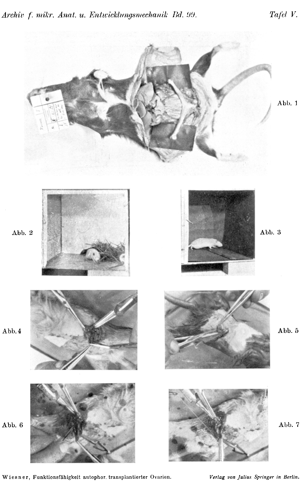

# The Functional Capacity of Autophorically Transplanted Ovaries in Rats

By

Bertold P. Wiesner.

(From the Biologische Versuchsanstalt of the Academy of Sciences in Vienna [Zoological Division]¹).)

With Plate V.

(Received on 25 January 1923.)

*Archiv für mikroskopische Anatomie und Entwicklungsmechanik*, vol. 99 (1923).

> **Full translation.** A complete English rendering of the running text of “The Functional Capacity of Autophorically Transplanted Ovaries” (B. P. Wiesner, 1923), including all tables, figure and plate legends, and footnotes. Numbers and table cells were transcribed from the page images, not the noisy OCR.

### Table of Contents.

|  | Page |
|---|---|
| I. Statement of the Problem | 140 |
| II. Methods | 142 |
| III. Result of the Experiments | 144 |
| IV. Summary | 148 |
| V. List of References | 148 |

## I.

Ovary transplantation has been carried out in mammals for very diverse purposes; however, all the investigations pertaining here fall into one of two groups, according to whether they trace the action of the ovary upon the body, or conversely the action of the body upon the ovary or its derivatives.

The present work, too, wishes to be reckoned to this second group. Its problem has been spoken of as that of somatic transmission of characters [somatischen Artübertragung], and there are indeed already a few investigations that have approached the problem by means of ovary transplantation. They proceeded from the idea that the sojourn of the ovary in an altered environment, that is, after a transplantation, might have an influence upon the properties of the individuals descended from this ovary. In order to achieve such an influence, one transplanted, e.g., ovaries of a white-colored race into an animal of a black race; any influence, as was assumed, would then have to show itself in the color of the animals.

Such or similar experiments were first carried out by *Heape*, who, as is well known, removed the eggs of rabbits from the oviduct and brought them into the tube of a female of another race, where the eggs also developed, though without the young — according to *Heape's* report —

> ¹) A short abstract of this work appeared under the title: Mitteilungen aus der Biologischen Versuchsanstalt der Akademie der Wissenschaften in Wien, Zoologische Abteilung, Vorstand H. Przibram, Nr. 94.

showing an influence corresponding to the "carrier-mother" [Tragamme]. The objection that the influence by the properties of the carrier-mother comes too late — since ripe eggs were after all transferred! — was eliminated in *Guthrie's* experiments. This author exchanged ovaries of black and white hens and reported that from the ovaries of white hens transplanted into black hens, upon mating with white cocks, there hatched both white and black-marked chicks. However, the critiques of *Przibram* and *Schultz* have already rightly pointed out that *Guthrie's* experiments cannot decide the question, for in his experiments, firstly, no material sufficiently tested with respect to its hereditary behavior was used, and, secondly, it is to be assumed that remnants of the body's own ovary were in function. *Davenport* re-examined *Guthrie's* experiments and, using hereditarily tested material, was unable to establish any influence.

Furthermore, an investigation was undertaken by *Castle* and *Philipps*, whose material consisted of various guinea-pig races. It has already been mentioned that in *Guthrie's* work it was not certain whether the young did not perhaps descend from the remnants of the animal's own ovary. For white hens, too, as is well known, can bring forth pigmented offspring if they are not "bred pure," i.e., are not homozygous with respect to coloration. From this follows the postulate of using only homozygous races for transplantation experiments; but since colored races dominant with respect to color can only with great difficulty be bred pure and frequently split [spalten], it is advisable to use purely recessive races, which are available to the experimenter in the albinos. It will doubtless happen that pigmented parent-animals throw albinos, but never that from the mating of albinos pigmented animals arise. This fact *Castle* and *Philipps* took into account and exploited. They transplanted the ovaries of black and brown guinea pigs into albinos and observed in two cases the birth of pigmented young, although the father was an albino. If in the case of the carrier-mother, that is, of the albino female, it was really a matter of a recessive animal, then at least the proof has been furnished that from transplanted ovaries offspring can really be obtained. However, *Schultz* has already drawn attention to the fact that in most guinea pigs which are designated as albinotic it is not a matter of entirely pigment-free animals, but that rather in most such animals traces of pigment are present, and that among their offspring pigmented animals are frequently found. Thus also in the cases adduced by *Castle* and *Philipps* a sure judgment is not possible — even though it is of importance that these authors, in contrast to *Guthrie*, nowhere indicate an "influence"! — This uncertainty applies, according to the methods hitherto available, naturally still much more to the reports from the medical side, in so far as they report not merely an influence of the transplant upon the animal's own ovary but also the obtaining of offspring from the transplanted human ovary. While the former is beyond doubt, according to the extensive and careful investigations of *Steinach*, *Haberlandt*, and very many others, it has — to repeat what has been said — hitherto remained unproven that a transplanted mammalian ovary can exercise its function undisturbed.

Admittedly there is a great series of investigations which have egg-ripening in the transplant as their subject, and the majority of them report positive observations. However, the histological finding is not sufficient; a biological confirmation was therefore necessary as the foundation of every further investigation. In other words: the transplantation had to be carried out in such a way that really only from the transplant, and not from the highly restitution-capable remnants of the animal's own ovary, eggs reached nidation. Furthermore, it seemed advisable to undertake the method, already applied by *Castle* and *Philipps*, of transplanting ovaries with respect to color from dominant races into animals of recessive races.

## II.

To satisfy these two conditions was not difficult in the case of the experimental animal, the (tame) brown rat (*Epimys norvegicus* Erxl.) [*Rattus norvegicus*]. The anatomical relations of the female sexual apparatus, thoroughly investigated by *Fischel*, show some peculiarities. The ovary is surrounded on all sides by a capsule, which is broken through only by the opening of the oviduct. *Fischel* has now shown that this structure is to be conceived as a hydraulic apparatus, in that the contraction of the ovarian capsule, brought about by certain muscles, drives the eggs through the single "exit" into the tube. If one destroys this ovarian capsule, which possesses no regenerative capacity, then henceforth the eggs fall freely into the abdominal cavity but no longer reach the uterus.

On the other hand, this also closes off the possibility of undertaking a transplantation onto the abdominal wall. Thus the only remaining way out was the possibility of producing, as it were artificially, an ovarian capsule from which the ripe eggs had only one way out — namely into the uterus — and to this end I brought the ovaries into the uterus itself, by which method very favorable results were obtained. Be it remarked that *Schultz* already in 1913, in his treatise "Suggestions for the Study of Somatic Heredity, etc.," emphasized the favorable prospects of such a methodology (which, incidentally, I learned of only after the completion of this work. Nevertheless, I accordingly record his priority).

The operation is very simple and scarcely harms the animals, asepsis being of course presupposed. However, the possibility of transplantation is restricted by the fact that one can transplant only into gravid uteri or such as are post partum, since the normal rat uterus has much too small a lumen for it to be able to take up the after all sizable ovary. The animals were therefore narcotized with ether either during gravidity or ½ to (at most) 3 days after birth, shaved on the back, and bound down lying on the belly. An incision of about 1 cm in length opens the abdominal cavity wide enough that one can draw out the uterus and ovary, which together with the tube form a connected apparatus, by means of this [tube] or of the adherent fat bodies, with a clamping forceps [Klemmpinzette], and lay them comfortably in position. If need be (see later), the animal's own ovary is now removed, or at least the ovarian capsule destroyed and the tube resected. Thereupon a small incision is made in the uterine wall and the ovary to be transplanted is brought into the uterine cavity with a forceps. Be it remarked that this ovary must be carefully freed of the ovarian capsule. One can prepare it before transplantation and also let it stand for a longer time (up to about 20 minutes at any rate) in a small dish, so that an assistant is dispensable.

Once one has brought the ovary into the uterus, one must immediately place a clamp on the wound. For it regularly showed itself that after the implantation of the ovary a peristalsis of the uterus in the direction toward the tube set in, by which the ovary, if it were not hindered by a clamp, was quickly forced out of the uterine cavity again¹). For the transplanted ovary was in no way fixed; it was not sutured in, but lay free in the uterus. It is accordingly a matter of an "autophoric transplant" [autophores Transplantat] (*Przibram*). The general characters and the advantages of "self-holding" [Selbsthalten] have already been set forth elsewhere by *Przibram*. In this case the muscular uterine walls form, even after the involution brought about by the birth (or by interruption of the gravidity; for the transplantation of the ovaries requires the removal of the fetuses!), a cavity adapted to the ovary, so that this already after a short time enjoys a sufficient blood supply. It is self-evident that the above-mentioned clamp must be replaced by a ligature of the uterus above the implanted ovary, and that the peritoneal wound must be carefully sutured. If this is done, and if one uses

> ¹) Be it remarked that this peristalsis seems to stand in connection with the gravidity, without, however, anything more definite being able to be said at present.

Xeroform (or Dermatol), which is powdered onto the peritoneum in a thin layer, then the wound heals very quickly. After the operation the animals were kept in glass tubs and recovered so quickly that they could often be mated with the buck [Bock] already after two or three days.

In order to be able to test the influence of race and of blood-relationship, the animals were bred in four "strains" [Stämmen]. These strains, which were propagated only by inbreeding, were founded upon non-blood-related pairs, and shall in the following be named according to the color of the cage-labels. In the strain "Red" [Rot] there were animals of various color; the strain "Blue" [Blau] and the strain "Yellow" [Gelb] consisted only of white (albinotic) rats; the strain "Green" [Grün] yielded spotted [gescheckte] animals. This division into strains was, however, only introduced later (as can also be seen from the table in III).

The animals actually used for the experiment were marked partly by a system of incisions in the auricle [of the ear], partly by small numbered aluminum plates which a silver wire drawn through the auricle held fast.

## III.

At first it seemed to me of importance to try the method presented above under the most favorable conditions, and I therefore undertook a few autoplastic transplantations, and indeed always on both sides. The operation was always performed post partum. I operated on seven animals. Five remained infertile; one threw two young 5 weeks after the operation; the second brought three young after 7 weeks; the first probably threw more young but presumably devoured them, for I also found the two remaining young bitten [angebissen] in the nest.

Then I tried homoioplastic transplantation. I expected that the secretion [Inkret] of the animal's own ovary would act favorably upon the transplants. For such a favorable action has indeed been indicated by many authors not only for uterus, vagina, etc., but also for the ovary itself (*Steinach* and others); admittedly it was always a matter of the action of the transplant upon the animal's own ovary. According to the results of the experiments reported here, however, the reverse conclusion is not permissible. Rather, in the 32 cases of homoioplastic transplantation in which the animal's own ovaries were left in place, there occurred without exception cystic degeneration of the transplants. Perhaps one might not yet draw any further conclusions from this, were it not that in the publication of *Bondy* and *Neurath* similar observations had been reported at the time of the writing of this work. These authors report on the decay of ovaries which they, for the purpose of "hyperfeminization" [Hyperfeminierung], had transplanted into normal females (whereby rats were likewise used as experimental animals). Thus the non-healing-in of the ovaries in the 32 experiments seems to me to be after all more than a chance. It might well be quite possible that the ovary needs for its thriving some substances or other from the bloodstream which it does not receive upon transplantation, because the body's own ovary has already used them up. I am indebted to Prof. *Steinach* for the indication that analogous observations were already made earlier by *Sand* in testicle transplantation, and that *Sand* also expressed the analogous interpretation.

In homoioplastic transplantation, offspring from the transplants could be obtained only when the body's own ovaries had been removed. In 14 (see table!) cases, animals so operated brought forth young; in three cases the "carrier-mother" [Tragamme] (let the female in whose uterus the young grow up be so named, after *Heape*) was an albino, the ovary-donating animal a pigmented female, the father an albino, but the young pigmented; herewith a final proof is furnished that the autophorically transplanted ovary is functional — for never could eggs from the ovary of an albinotic carrier-mother, fertilized with the sperm of an albinotic buck, give pigmented young —; but that it is really a matter of truly albinotic animals is, in view of all the so numerous genetic investigations on murids hitherto available, self-evident.

Since I undertook the homoioplastic transplantation in 68 animals, about 20% of the experiments are to be reckoned as having succeeded. —

The transplantation of "blue" ovaries [Blausovarien] into the uterus of the rat (albino into albino) failed completely without exception, despite careful and repeated attempts. The transplants very soon perished.

In the following table let an overview be given of the experiments of homoioplastic transplantation. The abbreviations are to be read: 1. for the color of the animals: a = albino, g = spotted [gescheckt], s = uniformly dark (black). 2. for the strains (designated according to the label-color) ge = yellow, gr = green, r = red, b = blue. 3. In the column "Earlier litters" [Frühere Würfe]: 0 = the animal had not yet, 1 = once, m = already several times thrown. 4. In the column "State of the uterus" [Zustand des Uterus]:

g = at the time of the operation the uterus was gravid
p = " " " " " " " " post partum
n = " " " " " " " " normal
i = " " " " " " " " infantile.

Let "Mother" [Mutter] be the name of the female from which the ovaries were taken.

> *Archiv f. mikr. Anat. u. Entwicklungsmechanik Bd. 99.* 10

### Table of the homoio- and alleloplastic transplantations.

| Carrier-mother (Tragamme) Number | Strain | Color | Age in months ca. | Earlier births | State of uterus | Date of operation | Mother (Mutter) Number | Strain | Color | Age in months ca. | Earlier births | State of uterus | Color of father | Birth date | albino | spotted | uniformly dark |
|---|---|---|---|---|---|---|---|---|---|---|---|---|---|---|---|---|---|
|  |  |  |  |  |  | **1921** |  |  |  |  |  |  |  | **1921** |  |  |  |
| 38 | ? | a | 5 | 1 | g | 17. VI. |  | ? | s | 2 | 0 | i | a | 23. VII. | 1 | 0 | 0 |
| 46 | ? | a | ? | m | p | 27. VI. |  | ? | a | 3 | 0 | n | a | 8. IX. | 3 | 0 | 0 |
| 56 | ? | a | 5 | 1 | g | 3. VII. |  | ? | g | 2 | 0 | i | a | 26.(?)VIII. | 2 | 1 | 0 |
| 62 | ? | a | ? | m | g | 7. VII. |  | ? | s | ? | m | g | a | 14. VIII. | 1 | 0 | 1 |
| 68 | r | a | ? | m | p | 2. IX. | 67 | b | a | ? | m | p | a | ? X. | 3 | 0 | 0 |
| 72 | r | a | ? | 1 | p | 22. XI. |  | b | a | ? | ? | n | a | 16. XI. | 1 | 0 | 0 |
|  |  |  |  |  |  |  |  |  |  |  |  |  |  | **1922** |  |  |  |
|  |  |  |  |  |  |  |  |  |  |  |  |  |  | 9. II. | 2 | 0 | 0 |
| 77 | r | s | 4 | 1 | p | 29. IX. |  | r | a | 3 | 0 | n | a | 2. XI. | 2 | 0 | 0 |
|  |  |  |  |  |  | **1922** |  |  |  |  |  |  |  |  |  |  |  |
| 78 | ge | a | ? | m | p | 14. III. | 79 | r | g | 5 | ? | g | a | ? IV. | 1 | 0 | 0 |
| 83 | b | a | ? | m | p | 18. III. | 84 | r | a | 5 | 1 | g | a | ? IV. | 3 | 0 | 0 |
| 87 | ge | a | 6 | 1 | g | 22. IV. |  | r | a | 3 | 0 | n | a | 30. V. | 2 | 0 | 0 |
| 91 | r | s | ? | ? | p | 21. VI. |  | r | a | ? | ? | n | g | ? VIII. | 0 | 1 | 0 |
| 94 | gr | g | ? | m | p | 2. VII. | 95 | r | g | ? | m | g | a | ? VIII. | 0 | 1 | 0 |
| 96 | r | a | 5 | 1 | p | 15. VII. |  | r | s | 2½ | 0 | n | a | ? IX. | 0 | 1 | 1 |
| 98 | r | g | ? | ? | p | 22. IX. |  | r | a | ? | ? | n | ? | 27. X. | 0 | 0 | 2 |

Remark: Animal 98 was put into a cage with several differently-colored bucks. It is naturally to be assumed that the father was black. — The exact birth date was not known everywhere, since I was not always present at the time of the throwing.

From the table it is to be gathered that the relationship of the animals plays no perceptible role for the transplantability [Verpflanzungsfähigkeit]. The same holds for the age of the animals and their color.

Of particular interest is animal "Nr. 72." This female threw for the first time 6 weeks after the operation, and for the second time 4½ months after the operation. This speaks for the long durability of the transplants.

Furthermore, let attention be drawn to the without-exception so greatly reduced number of young of the experimental animals as compared with the normal. It is not a matter here of a chance, as the histological investigation has shown. For even though the previous working-up of the histological material does not yet permit a conclusive judgment, let attention nonetheless be drawn to two circumstances which perhaps offer an explanation.

Firstly, the transplants show a more or less far-reaching reduction of the number of follicles, which can indeed be sufficiently explained by the not perfectly adequate nutrition of the transplant. Secondly, however, only the rutting [brünstige] rat permits the "leap" [Sprung], during which copulation takes place. But if ovulation is no longer regulated (by nervous influences upon the ovarian capsule and its "hydraulic" action¹)), then it no longer occurs uniformly, that is, during the rutting period [Brunstzeit], but is rather distributed over a longer time, so that at the time of rut only a few eggs are accessible to fertilization, with the result that the unregulated ovulation can be explained by the absence of the ovarian capsule described above after *Fischel*, and of its function. Further matters are reserved for a later communication taking the histological relations especially into account, and here only let it once more be pointed out that the reduction of the number of young requires an explanation. That this cannot be traced back, say, to a possible shortening of the uterus is also shown by the accompanying illustration; in fact the uterus is scarcely shorter than normal.

As regards now the actual problem of this investigation, the answer to the question posed at the outset must turn out negative. No influence of the carrier-mother upon the pigmentation of the offspring was to be noticed.

On this, however, something must be said. The investigations hitherto, and among them also this one, have applied an unskillful posing of the question, unskillful with respect to the choice of the "pairs of characters" [Merkmalspaare]. Such a pair of characters is, for example, white and black color, and the posing of the problem was, e.g.: Can "the soma" of a black rat influence the ovary of a white rat, so that the young arising from the influenced ovary likewise possess black pigment?

But these were unnecessary questions: for the experiment of nature had already decided a thousand times in the negative, since (under the supervision of biologists) black rats or dark guinea pigs had often enough borne albinos. But no one was ever able to establish an influence that would have had to express itself numerically.

If I nonetheless, despite this obvious consideration, now make a communication about a similar experiment, then I have two reasons to adduce in my excuse. For, firstly, it is a matter of the testing of a method which may perhaps gain importance for the problem of the transplantability of the ovary and the analysis of its functions; secondly, however, I believe that the problem of somatic character-influence could be solved by choosing other "pairs of characters." Thus it may be that the use of carrier-

> ¹) [Footnote marker ¹) appears in the source text after "'hydraulic' action." The corresponding footnote text is not printed at the foot of page 8 in the owned region; it presumably falls on a subsequent (un-owned) page. Marker preserved here.] Firstly, the transplants show a more or less far-reaching reduction of the follicle count, which can already be explained by the not entirely adequate nourishment of the transplant.

Secondly, however, it can be shown that the rhythm of estrus [*Brunst*] is altered by the transplantation. When ovulation is no longer regulated (through nervous influences upon the ovarian capsule and its "hydraulic" effect¹), then it no longer occurs uniformly, that is, during the period of heat [*Brunstzeit*], but rather distributes itself over a longer period, so that at the time of heat only a few days are accessible to fertilization. Thus the unregulated ovulation can be explained by the absence of the function of the ovarian capsule described above (after *Fixel*). Further details are here reserved for a later communication that will take the histological relationships in particular into account; here it is only once more pointed out that the diminution of the young-count requires an explanation. That this cannot be traced back to an accompanying shortening of the uterus is also shown by the appended illustration; in fact the uterus is scarcely shorter than normal.

> ¹ [Footnote marker as printed in the text. The note concerns the "hydraulic" effect upon the ovarian capsule.]

As regards now the actual problem of this investigation, the answer to the question posed at the outset must turn out negative. No influence of the transplant-bearer [*Tragamme*] upon the pigmentation of the offspring was to be found.

On this, however, something must be said. The previous investigations, and among them this one too, have employed an awkward way of posing the question—awkward with respect to the choice of the "pairs of characters" [*Merkmalspaare*]. Such a pair of characters is, for example, white and black color, and the problem was posed thus, e.g.: Can "the *soma*" of the transplant-bearer influence a white color tone upon the ovary, so that the young arising from the influenced ovary likewise possess black pigment? But these were unnecessary questions; for the experiment of nature [*Naturexperiment*] had already decided a thousand times over in the negative whether there (under the supervision of biologists) often enough black rats or dark guinea-pigs had given birth to albinos. No one, however, could establish an influence that would have had to express itself numerically.

Yet if I myself now, despite this obvious consideration, wish to make a communication about a similar experiment, I have two grounds to adduce in my excuse. First, it is a matter of the trial of a method that may perhaps gain importance for the problem of the transplantability of the ovary and the analysis of its functions; secondly, however, I believe that the problem of the somatic influencing of characters could be solved through the choice of other "pairs of characters." So it may be that the use of transplant-

> ¹ This footnote belongs to the running text and is reproduced here as it falls on the page. *(The footnote text continues the discussion of the "hydraulic" effect upon the ovarian capsule.)* bearers [*Tragammen*] of *larger* breeds for the ovaries of *smaller* breeds (or vice versa) yields an influence; for, as is well known, the newborn rat is the larger, the fewer siblings the litter has, that is, the more favorable the developmental conditions were. Further investigation, which is to be reported on in due course, can decide the question.

## IV.

## Zusammenfassung. [Summary.]

1. In the case of the brown rat [*Wanderratte*], ovaries were transplanted, self-maintaining, into the uterus dilated by gravidity. From the auto- and homoioplastically transplanted ovaries, offspring was obtained; from the homoioplastically transplanted ovaries even after the transplant-bearer's [*Tragamme*'s] own ovaries had been removed.

2. In the experiments reported, no noticeable influence of the age, of the developmental stage, or of the race (color) of the test-animals upon the transplantability of the ovaries resulted.

3. That the offspring obtained actually stems from the transplant follows—apart from the special anatomical relationships—from experiments in which albino transplant-bearers [*Tragammen*], mated with an albino buck, threw pigmented young after ovaries of pigmented animals had been implanted into these transplant-bearers.

4. No influence of the transplant upon the young-count was to be detected.

5. The number of the offspring was, compared with the normal number, essentially diminished; this must provisionally be explained by a certain reduction of the follicle count and by deficient innervation; through this abnormal innervation the normal relation between ovulation and heat [*Brunst*]—and thus also fertilization—is likely to be disturbed, so that a diminished number of eggs reaches fertilization.

## V.

### Schriftenverzeichnis. [Bibliography.]

*Bondy* u. *Neurath:* Über experimentellen Hyperfeminismus. Wien. med. Wochenschr. 1922. — *Castle* u. *Philipp:* On germinal transplantation in Vertebrates. Publ. by the Carn. Inst. of Wash. 1911. — *Fischel, Alfred:* Zur normalen Anatomie und Physiologie der weiblichen Geschlechtsorgane von *Mus decumanus* usw. Arch. f. Entwicklungsmech. d. Organismen Bd. 39. 1917. — *Guthrie, C.:* Further results of Transplantation of Ovaries in Chickens. Journ. of exp. zool. Bd. 5. 1908. — *Halsteludt:* Wien. med. Wochenschr. 1921. — *Hospe:* Further note on Transplantation and Growth of mammalian Ova within a uterine foster mother. Proc. of the royal soc. Vol. 62. — *Magnus:* Transplantation of Ovary and analysis [Henrytt till Afkommet]. In: Norsk Magazin for Laegevidenskab, 1907 (zit. nach *Schultz*). — *Pribram, H.:* Experimentalendokrinologie. Bd.: Phylogenese. Wien u. Leipzig 1910. — *Ders.:* Die Replantation von Augen. I. Die autophore Methode. Sitzungsber. d. Akad. d. Wiss. Wien 1921 und Arch.

f. mikr. Anat. u. Entwicklungsmech. Bd. 99. 1923. — *Schultz, Walth.:* Vorschläge zum Studium der somatischen Vererbung der Bastardunfruchtbarkeit und der blastogenen Insertion mit Hilfe der Keimzellenverpflanzung. Arch. f. Entwicklungsmech. d. Organismen Bd. 37. 1913. — *Steinach:* Verjüngung durch experimentelle Neubelebung der alternden Pubertätsdrüse. Archiv f. Entwicklungsmech. d. Organismen. 1920.

### Erklärung der Abbildungen. [Explanation of the Figures.]

#### Tafel V. [Plate V.]

**Abb. 1.** Animal 77 (see Table), preserved on the 16th day after the litter [*Wurf*]. At the place where the ovaries lie, the uteri are dilated.

**Abb. 2.** Animal 96 (see Table) with both young (1 piebald [*gescheckt*], 1 uniformly dark).

**Abb. 3.** The father of these young.

**Abb. 4.** Operation: Opening of the uterus of the transplant-bearer [*Tragamme*].

**Abb. 5.** Operation: The ovary to be transplanted is prepared out of the capsule.

**Abb. 6.** Operation: The ovary is pushed with a forceps [*Pinzette*] into the uterus of the transplant-bearer [*Tragamme*].

**Abb. 7.** Operation: The uterus is tied off [*abgebunden*].

The photographs are taken partly from picture-films [*Bildbänder*] of the Austrian Federal Film Bureau [*Österreichische Bundesfilmstelle*], partly from own exposures.

*Archiv f. mikr. Anat. u. Entwicklungsmechanik Bd. 99.* — *Tafel V.* [Plate V.]

**Abb. 1.** *(figure not reproduced)*

**Abb. 2.** *(figure not reproduced)*

**Abb. 3.** *(figure not reproduced)*

**Abb. 4.** *(figure not reproduced)*

**Abb. 5.** *(figure not reproduced)*

**Abb. 6.** *(figure not reproduced)*

**Abb. 7.** *(figure not reproduced)*

Wiesner, *Funktionsfähigkeit autophor transplantierter Ovarien.* — *Verlag von Julius Springer in Berlin.*

## Figures

**Plate V.**

---

*Translator's note.* One of the Biologische Versuchsanstalt (Vienna Vivarium) papers flagged on the project site as a modern rediscovery target. Claims are rendered as stated in the original, not endorsed.
