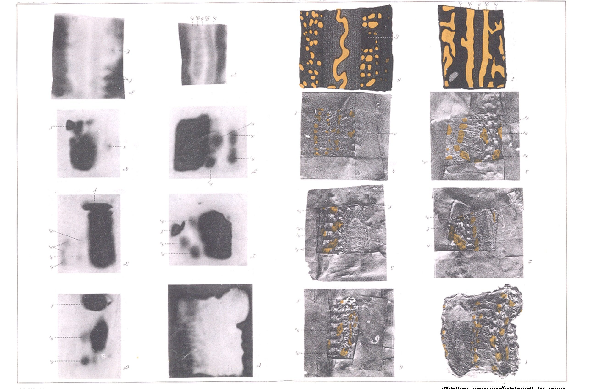
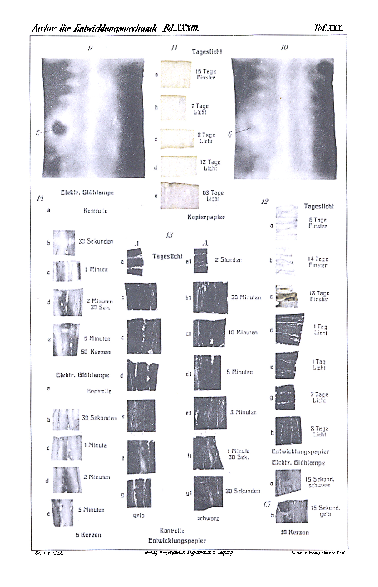

# The Environment of the Germ-Plasm.

## II. The Enjoyment of Light in the Body of *Salamandra*.

By

Dr. Slavko Šećerov.

*(From the Biological Experimental Institute in Vienna.)*

With 4 figures in the text and Plates XXIX and XXX.

Received 13 September 1911.

*Archiv für Entwicklungsmechanik der Organismen*, vol. 33 (1912).

> **Full translation.** A complete English rendering of the running text of “The Environment of the Germ-Plasm” (Secerov, 1912), including all tables, figure and plate legends, and footnotes. Numbers and table cells were transcribed from the page images, not the noisy OCR.

### Table of Contents

|  | Page |
|---|---|
| I. Introduction | 682 |
| II. Description of the Experiments | 687 |
| III. Determination of the Penetration Coefficient | 695 |
| IV. Conclusions | 698 |
| V. Summary | 699 |
| VI. List of Literature | 700 |
| VII. Explanation of the Figures | 701 |

## I. Introduction.

Concerning the penetration of light into the interior of the animal body, work has hitherto been done only from the medical standpoint, and even these data extend only to the penetration of light into the skin and the layers lying immediately beneath it. In the literature, by contrast, we find no experiments that have as their object the possibility of light penetrating as far as the sexual organs, that is, through skin, musculature, and peritoneum. One must indeed regard the glass-clear plankton organisms as permeable to light, and thereby the direct influencing of the gonads by light would be very well possible; but this possibility, too, has not been sufficiently exploited in the discussion of biological questions.

The animal body can, as the physical discoveries of the last years have taught, be permeable to a whole series of rays, such as Röntgen rays, ultraviolet and likewise visible spectral rays.

From the abundant literature on the penetration of Röntgen rays into the body and on the β-radiations, I refer to the comprehensive presentation by Meirowsky. It is only in the most recent time that a drastic example of the efficacy of the Röntgen rays has been provided, after it had already been demonstrated that the whole body is permeated by them: the observation by Krenböck that hens whose plumage was illuminated by Röntgen rays lost the hair-mantle of the feathers on the abdominal side. Battelli endeavored to measure and determine the penetrability of the Röntgen rays by the photometric route. He arrived at the result that various tissues let the Röntgen rays through in inverse relation to their density; yet there exists no exact proportion between the gradations of density and the penetration of the Röntgen rays. The blood and the tendons are transparent like the other tissues. The penetrability of a tissue is the less, the thicker it is; yet the diminution of the penetrability is not as rapid as the increase of the thickness.

Thus the sections through hearts of 4, 8, 16 mm have a penetrability of 1, 0.56, 0.36; those of the liver in the same way at 4, 8 and 16 mm a penetrability of 1, 0.58 and 0.30.

Strebel has, with the help of the fluorescing effect on certain solutions, investigated whether dead, dull, bloodless, then variously thick excised skin lets the ultraviolet rays through. Jansen has carried out experiments behind variously thick skin pieces by setting up bacterial cultures of various thickness. The more refrangible rays of the spectrum are held back behind a 2 mm thick skin from the killing of the bacteria; behind a 1.5 mm thick piece they are attenuated. The outer ultraviolet rays were already let through behind 0.8 mm thick skin, after it had been freed of blood.

The distinction between the penetrations of the outer and inner ultraviolet rays was first more closely demonstrated by Freund. With the help of fluorescence on bromine-glass and quartz glass, Thirasche transplantation-soap was photographed by Freund through the spectrum of the Leiden flasks, photographed with reinforced electric light source, and it showed itself that the more strongly refrangible ultraviolet rays beyond the cadmium line do not produce blackening. These rays are absorbed by the membrane, whereas the outer rays this side of the cadmium line are permeable through the epidermis.

From Hertel's investigations it follows, too, that the more strongly refrangible rays are absorbed in the epidermis and in the upper cutis sheaths. Hertel opines that the superficial blood-vessel network effects the absorption. He quantitatively determined the absorption capacity of the human skin for the ultraviolet rays, on the basis of the Bunsen-Roscoe law $z = s_1 t_1$, that is, with the help of the coefficient $\frac{10}{9}$ corrected, photometrically, by means of photography of the spectrum. The figures for Hasselbalch vary from 2.3 to 39.0. He determined the absorption coefficient on the basis of the formula $\frac{i}{J} = 10^{kn}$, in which $J$ means the incident quantity of light, $i$ that quantity of light which has passed through, $n$ the thickness, and $k$ means the coefficient.

Concerning the penetration of the visible, especially of the chemically active rays, the experiments of Godneff, Onimus, Gebhardt, Sarason and Darbois, Solucha, Finsen, Busck and Lenkei report.

Godneff brought dull glass tubes filled with chlorine-silver gelatin under the skin of dogs and cats and set one piece of the animal in direct sunlight, the others were held back from the start in darkness. After the lapse of one hour the tubes in the sunlight-exposed animals were blackened; whereas in the control animals kept in darkness no blackening had set in.

Onimus has experimented directly on his own hand. Hand and arm rested on an orthochromatic plate; after 5 minutes a distinct reaction was constated. The thickness of the lying hand required 26—30 min.

Similarly Gerhardt (after Jesionek) proceeded; after 20 minutes' illumination the hand, embedded in plaster, was blackened. As light source served an electric arc lamp. Sarason and Darbois have likewise constated a blackening of the photographic paper, which they held in the mouth under the cheek mucous membrane, after illumination with the Finsen accumulation apparatus.

After the experiments of Solucha, bromine-silver decomposes under the skin of dogs after one hour's illumination, behind the ear of a human being after half a minute; the tubes filled with streaky bromine-silver gelatin were illuminated behind the light source of an electric projection apparatus of 10 to 20 ampère and from 50 to 60 volts. In the same way Solucha constated that the bromine-silver also decomposes behind the ear of a human being after one hour's illumination, behind the cheek after 2 minutes. Even with the use of an electric arc light of 25 ampère and 110 volts the tubes blacken at the nape of the neck after one minute's illumination, when they are held behind the nape of a person at the same side of the illumination. The experiments of Finsen show that the blood is no obstacle for the chemically active rays to penetrate through the tissue, yet it lets the rays through more weakly. The blood present in the living tissue absorbs the Finsen rays altogether and likewise the red rays.

The experiments of Busck give the best analysis of the penetration of the rays. He showed that the rays produce a decomposition on the bromine-silver plate through the middle of the hand, where the tissue is fine, in 2.8 cm thickness, in 1 second, through the ball of the thumb, the thickness 3.4 cm, in 3 minutes, through the joint of the hand 3.7 cm thick in 4 minutes.

By interposition of the solutions, a potassium bichromate and an ammoniacal copper-oxidule solution, Busck shows that the red, orange-yellow and yellow rays of the hand are let through, whereas the blue-violet are wholly absorbed and therefore produce a weak effect on the plate. Busck pushed the tube of a metal tube through, pressed onto the hollow hand, so that no light could penetrate into the tube at the sides; the red and red-yellow rays were perceived with one eye at the extremity from the joint of the hand. There he constated blue-white, yet only the edges blinded; red-yellow light penetrated through the middle of the 2.8 cm thick hand. The penetrating light is clearer at thinner places than at thicker places.

The diminution of the penetration capacity for the short-wave rays Busck has cleared up through the following experiments. If one sets two rabbit ears with normal blood-fill before the spectroscope, then the blue-violet rays disappear from the spectrum, and the green, blue and red rays still penetrate through; if one increases the number of the ears before the spectroscope by setting them one upon another, then the green rays also disappear, and one now sees only still the red end of the spectrum. After the reckoning according to Busck, 5 to 23 percent of the outer ultraviolet, 22 percent of the red-yellow and 1 percent of the blue-violet rays go through one rabbit ear.

After Lenkei only ¹⁄₁₀₀ part penetrates to the depth of 0.5 cm into the skin-tissue: 85 percent of the penetrating sunlight fall to the yellow and 5 percent to the blue rays. According to Lenkei, traces of blue rays penetrate through the skin and the tissue lying thereunder only still 3 cm, if no muscle layers are found between these tissues. A smaller part of the light penetrates only 6 cm even into the tissue, where the muscle layers begin; behind the muscle layers, however, no red light is found, there only blue rays.

It may here, in addition, be mentioned some botanical statements. So J. Sachs has shown in a fundamental work on the penetration of the plant parts that the chemical rays already penetrate weakly from thin pieces of glass, and that the violet rays penetrate even deeper; red, orange and yellow rays, according to Sachs, not seldom penetrate even thick parts; last to disappear are blue and blue-green, that is, the more refrangible elements of the light are absorbed first and in the outer layers, the less refrangible penetrate very deep. So Sachs constated that a 3 cm thick piece of unripe apple, kohlrabi or potato (3.2 cm) still lets the red rays through.

Pfeffer comes, in his "Pflanzenphysiologie" (Vol. I, p. 329), to the conclusion concerning the absorption of the rays that it results from the literature that already through a thin and translucent green leaf mostly less than half of the total energy of the incident sunlight penetrates, and that in particular the assimilatorily most effective rays are extinguished to a very high degree. Such sunlight, already passing through a thin green leaf, is ordinarily able still better to bring about the starch formation and the secretion of gas-bubbles. Already in the colorless tissues the light experiences, through absorption and reflection, a considerable weakening, which is considerably increased with the addition of foreign coloring substances. Especially the chlorophyll acts as light-absorbing substance.

## II. Description of the Experiments.

My experiments divide into different experiment-series: namely into skin-experiments, into duration-experiments, that is, where the skin-experiments are of shorter duration and the wound was set on the light, and into such where, after the firm closure of the wound, the wound was otherwise illuminated — these being the experiments on the determination of the penetration coefficients.

A. The skin-experiments I first set up thus, that I cut the animal *Salamandra maculosa* L., my experiment-animal, removed and cut away the inner organs, intestine, liver, lungs, gonads etc., and fastened the piece of skin on a glass plate in such a way that the outstretched animal lay with its skin on the glass plate. Under the glass plate I fastened photographic paper, after a little board. Since now there lay for 2 to 6 hours old and insensitive copying-paper (Celloidin-Matt-Paper, Platin-Imitation, "Mimosa"-Dresden, Rhenish Emulsion-Paper Factory) that had been used, I achieved no results in a short time, 6 hours. I have therefore for a longer test, also closed light-tight with black paper, left it lying and only opened it afterwards under red light, after the setting-up of the experiment had taken place.

So we have in Fig. 1 of Plate XXIX a photograph of the skin-piece, Fig. 1 Plate XXIX; the skin-piece was uncovered, the edges free, the darker [parts]; the experiment [lasted] 3 days (12. to XII. 1910). One sees that the lateral light penetrated very strongly, that the edges were not closed light-tight; the blackening is distinct only at the thinner parts of the skin-piece and at the thicker parts that were uncovered outside the skin-piece. Fig. 2a and 2 Plate XXIX show the photograph of the chief preparation and the corresponding photogram. At the place f the paper lifted itself, loosened, in the course of the experiment, and in consequence one will [recognize] in the photogram the place f, whose intense blackness points to the freed rays. The little spots $s_1$ $s_2$ derive from two yellow spots lying [along] the vertebral column, and indeed $s_1$ and $s_2$ represent on the original preparation a continuous large yellow spot, which extends over both sides of the vertebral column; in the photogram, however, there it appears to be interrupted and split into two spots, and that through the vertebral column, which holds back a dark light sitting on it. On the photogram one can clearly recognize these relationships anyway. The experiment lasted 2 months (3. XII. 1910 to 3. II. 1911). At the thinner parts no lateral light-effect is present. At the thinner parts there is no difference between the effects of the light at the yellow and black places, but [there is one] at the thicker layers. So one sees the yellow spots $s_1$, $s_2$, $s_3$, $s_4$ in the photogram [as] $s_1$, $s_2$, $s_3$, $s_4$, while the thicker black layers show no blackening. In the direction of the vertebral column one notices no effect of the light-rays.

The photographs of the preparations 4 and the corresponding photogram $4\alpha$ were on the light from 30. XI. 1910 to 17. I. 1911, 5 and $5\alpha$ from 7. XII. 1910 to 25. I. 1911, 6 and $6\alpha$ from 7. XII. 1910 to 22. II. 1911. In all three cases one sees clearly the difference between the yellow spots and black places; so one sees in photogram $4\alpha$ the spot $s$ of Fig. 4, which lies over the vertebral column; in photogram $5\alpha$ the blackened places $s_1$, $s_2$, $s_3$ are present, corresponding to the spots of Fig. 5, and indeed $s_1$ which is divided in two, $s_2$ and the opposite-lying $s_3$; $s_4$ of Fig. 5 is not visible in Fig. $5\alpha$, because this spot lies entirely behind the vertebral column. The black parts $f$ in the photograms $4\alpha$, $5\alpha$ as well as $6\alpha$ derive from the tears, shrinkages and loosenings of the experiment-piece arising by chance in the course of the experiment. The spots $s_1$, $s_2$ of Fig. 4 are represented by $s_1$ and $s_2$ in photogram $4\alpha$. At the thinner places, at the thinner length-stretch of the vertebral column, no light-effect shows itself, and there shows itself, furthermore, no reaction under the thicker, black-colored layers. That, however, derives from the insensitivity of the copying-paper, because, as we shall see, a developing-paper that is sufficiently sensitive shows the blackening not only after days, but after a second of illumination, and not only at the thicker parts, but also in the direction of the vertebral column. Such a sensitive developing-paper is the bromine-silver gelatin [enlarging- and contact-paper, N.P.G.-brand, Neue Photographische Gesellschaft, A.-G., Berlin].

We have in Fig. 7 and $7\alpha$ a photograph and a photogram of the photographed skin-pieces, which were cut out from the strongly yellow variety of the salamander [from Verwolde in Germany]. The duration of the illumination by the sunlight was one second. As one can see from the comparison, the differences between the yellow streaks, streaks and spots and the black ones are not so great and distinct as was the case with the black preparations. That is to be traced back to the great sensitivity of the developing-paper, with which the smallest quantities of the passed-through light evoke [a reaction] without decomposition, and the differences of the light thereby become blurred. However, one notices the yellow streaks $g_1$ $g_1$ in the preparation Fig. 7 as dark parts in the photogram Fig. $7\alpha$. In the direction of the vertebral column a bright streak $s$ is present in the photogram; this bright streak is interrupted by transverse, dark bridges. The transverse bridges derive from the junction-places of the vertebrae, for they arrange themselves as if they would bound the vertebrae. The bright lines $s_1$ and $s_1$ in the photogram derive from the black, almost continuous places $s_4$ and $s_1$ of the preparation. The animal which was used for this purpose was anesthetized and prepared in the anesthetized condition, so that one must regard the tissue which was used for the photogram as living. For when one does not anesthetize the animal, but cuts off head and tail in the unanesthetized condition and then takes out the inner organs, then the head-, tail- and When one cuts out a piece of skin with muscles and peritoneum, without extremities, head, tail, and inner organs, seals the edges light-tight with black paper, and also delimits a quadrangle by means of black paper strips on the underside of the glass plate on which the piece of skin lies, then one has thereby excluded the lateral light-effect. — If one now holds the piece of skin against the light, the space delimited within the quadrangle proves to be translucent. When one makes a kind of box of black paper around the glass plate and the preparation, by folding the paper around the edges of the glass plate and fastening it with clamps, then one has a convenient apparatus with which one can obtain many photograms in a short time. One needs only to remove the two clamps fastened at the corners, to insert the developing-paper, and to fold the edges over again and fasten them with clamps.

In Fig. 7 and 7a we have a photograph and a photogram of the photographed pieces of skin, which were cut out from the strongly yellow variety of the salamander (from Verwohle in Germany). The duration of the illumination by the sunlight was about one second. As one sees from the comparison, the differences between the yellow places, streaks, and flecks and the black ones are here not so great and clear as was the case with the upper preparations of the previous case. That is to be attributed to the great sensitivity of the developing-paper, in which the smallest quantities of the transmitted light produce a decomposition; it makes the differences thereby blurred. Nevertheless one notices the yellow streaks g₁ g₁ in preparation Fig. 7 as dark patches in photogram Fig. 7a. In the direction of the spinal column there is a brighter streak s present in the photogram; this brighter streak is interrupted by transverse, darker bridges. The transverse bridges derive from the connecting-points of the vertebrae, for they arrange themselves in such a way as if they delimited the vertebrae. The brighter lines s₁ and s₁ in the photogram derive from the black, almost continuous places s₄ and s₁ of the preparation. The animal that one uses for both purposes was anesthetized, prepared in the anesthetized condition, so that the tissue which is used for the photogram has no doubt to be regarded as living. For if one does not anesthetize the animal but cuts off the head and tail in the un-anesthetized condition and then removes the inner organs, then the head-, tail-, and

extremity-less trunk still moves for about two hours. Therefore such un-anesthetized trunk-pieces are not usable for these purposes. So much light is thus transmitted in one second after this photogram that it produces a distinct, intensive blackening on a photographically sufficiently sensitive paper. From later presentations we shall see how great the quantity of the transmitted light is. The intensive blackening is also connected with the fact that I made these photograms in June 1911 (on the 8th and 9th), whereas the photograms printed off on copying-paper had been illuminated in the middle of winter. There was therefore certainly also a difference between the quantity of the incident sunlight in summer and in winter. However, that does not explain the weak blackening of the copying-paper photograms, for the very next preparation, Fig. 8, was illuminated by electric light (50-candle incandescent lamp) for 15 minutes, and yet the photogram Fig. 8a Pl. XXIX is blackened exactly as intensively as 7a. Only the direction of the spinal column is brighter, and likewise the parts lying laterally from the spinal column. The yellow flecks in the photogram are not so distinctly delimited as was the case with the copying-paper photograms, but rather the darker streaks indicate the flecks. In any case one sees the more intensive blackening of the places below the yellow flecks, as against those under the black ones. In Fig. 9 and 10 Pl. XXX we have photograms of the same preparation. Fig. 9 was produced by illumination from direct, and Fig. 10 from diffuse daylight in one second. The difference between the two photograms lies in the intensity of the blackening. Photogram 9 is so intensively blackened that one can scarcely distinguish the yellow places from the black ones, while the position of the yellow flecks, especially on the left side of the photogram, is sharply marked by the regular distribution of the flecks in the form of rib-like streaks. Toward the spinal column there come further longitudinal darker streaks and then the bright parts under the spinal column, which in photogram 9 and 7a are interrupted in places by the intermediate spaces of the vertebrae. In any case photograms 9 and 10 show that the sunlight, already in one second, penetrates the body-layers in sufficient quantity to decompose the paper.

B. The following experiments were set up on living salamanders, with and without healing of the wound.

The animals were operated on one side by a transverse incision in the direction of the extremities, or somewhat higher up. The wound was usually small and lies between the extremities, but more toward the front; when one makes the right incision, one can at once hit upon the gonads without searching. The salamanders were mostly operated on on the left side, but also on the right side. In most cases the experimental animals were males, but more rarely also females. The extirpation of the testes or of the ovaries I carried out in such a way that, through the wound, with a fine forceps, I pulled out from the interior of the salamander-body the gonads or the ovaries on one side and mostly completely, and then cut them off. When the incision for the opening of the animal had been carried out in the right position, then one at once saw the testes or the ovaries appearing white, and the pulling-out and the cutting was without trouble.

The little tubes, which I cut and fused shut myself, were 1 to 1.5 cm long, their diameter scarcely 1 mm. They were stopped up with caoutchouc stoppers specially manufactured for the purpose, and in almost all cases without fault, i.e. without any fluid having penetrated in from the body-cavity. The strips of photographic paper were cut by red light and rolled up in such a way that the coated side lay outward. The filling of the little tubes I usually carried out before the operation, namely in a tube wrapped around with black paper, which was kept until the operation in a box likewise surrounded with black paper. After the insertion of the little tube the wound was sewn shut with sterilized surgical silk and additionally glued over with plaster. Later I also used liquid, commercially available plaster. The animals were kept in glass tubs sterilized with hot water, which were lined inside with likewise sterilized filter-paper. The filter-paper was continually sprayed with boiled water. The sterilization of the instruments was effected by carbolic acid.

In text-figure 1 one sees the position of the little tube, and in text-figure 2 the position is drawn in situ in an animal without extirpation of the gonads. The little tube lies over the gonads, which in the later experiments I no longer extirpated, because it is

> Archiv f. Entwicklungsmechanik. XXXIII.  45 unnecessary, since the light still penetrates these too. *L* denotes liver-lobe, *D* gut, *R* little tube, *G* testis, and *W* the wound of the incision-site. However, the position of the little tube did not always remain the same, but rather sometimes, especially in the long-term experiments, it has come, as a result of the movement of the animals, between the

**Fig. 1.**  *(figure not reproduced)*

gut-loops or beneath the urinary bladder. The varying position, however, has not impaired the positive reaction on the paper.

In the long-term experiments, in which the healing of the wound was absolutely necessary, the animals were, after the operation, kept 6–7 days in the dark, in the dark-chamber, under the bell-jars, and tended only by red light. The operation was carried out, up to the insertion of the little tubes, by ordinary electric

**Fig. 2.**  *(figure not reproduced)*

light in the dark-chamber; the pushing-in of the little tube, the sewing-up of the wound, and also the tending of the animals were undertaken only by ruby-red light. Of the animals that succeeded and were kept alive, one part was set out to the light, the other was kept further in the dark as well and treated like the animals after the operation. The number of the animals kept alive was very small at the beginning of the experiment, later I learned to keep almost all of the newly operated animals alive long enough. In the course of the experiments I operated on over 50 animals and investigated them in two larger sections, from 26. X. 1910 to 2. II. 1911 and from 9. III. 1911 to 5. V., from which latter time-point on I abandoned this method and began to use another, with the employment of clamps, which will be described later.

In these experiments too I worked at first with copying-paper ("Mimosa", as with the skin-experiments). And here too the weak sensitivity proves unfavorable. So we see in Fig. 11 Pl. XXX a few probes. At *a* we have a paper that lay 15 days in the animal in the dark, and, as was to be expected, no blackening was present; *b*, *c*, and *d* represent probes from the animals that were 7, 8, and 12 days in the light, and the reaction was imperceptible. Only after 63 days (*e*) does the paper begin to decompose, which shows in the darker tone. In the experiments too, which were carried out on the living animals with the transplanted little tube, the greater sensitivity of the bromsilver-gelatine proved suitable for the detection of the penetrated light. Already after one day's stay in the light the paper shows complete blackening, and likewise after the longer time, while the control animals in the dark show no indication of blackening. In Figure 12 we have probes of the papers after 6, 14, and 18 days' stay in the dark and after 1, 7, and 8 days' stay in the light. In probe *e* some blood had penetrated into the little tube, but the non-bloody parts of the paper show the normal white of the unilluminated, developed, and fixed paper. The white lines are the consequences of the detachment of the sensitive layer at the cracks of the rolled-up paper.

C. As I had noticed that even one day's illumination is sufficient to produce a noticeable blackening, I wanted to determine the shortest time and the quantity of the penetrating light. The skin-preparations (Fig. 7, 8 Pl. XXIX) I in fact photographed in June, after the experiments to be described, although in the presentation they have come first.

In order to be able to work more quickly, I dropped the above method of the healing of the wound and sought to seal the wound light-tight if possible. This I did, on the one hand, by means of clamps (text-figure 3), between which I pinched the wound, and on the other hand by gluing-shut the wound with black plaster and enveloping the whole front part of the animal, the wound included, in a black paper which absorbs the light; besides this I pressed the little tube in fairly deeply from the wound-site tailward, so that it came to lie about 1–2 cm distant from the wound. These precautions have made it possible, under continual control of the unilluminated material, to work flawlessly and without error. I have furthermore fastened the little tube also with the clamps, in such a way that I raised the little tube in its new position together with the body-layers lying over it and clamped it between the clamps (text-figure 4 [*R* = little tube, *K* = clamps]). The little tube with the photographic paper lies under skin, musculature, and peritoneum, above the gonads, as text-figure 2 also shows.

By this method I have undertaken over 100 determinations. Thus we have in Fig. 13 a few probes which were produced by daylight-illumination. The first row *A* shows papers which lay underneath a yellow place of the yellow-striped salamander, the row *A₁* those which lay underneath a black place of an ordinarily flecked salamander. For the latter

**Fig. 3.**  *(figure not reproduced)*

**Fig. 4.**  *(figure not reproduced)*

experiments salamanders with as few flecks as possible were chosen. When one proceeds forward from top to bottom in the row, one notices, especially at *e*, *f*, *g* and *e₁*, *f₁*, *g₁*, the gradual diminution of the blackening and the enlargement of the lighter parts. The transverse light streaks, which stand perpendicular to the light longitudinal-streak and form a cross, derive from the clamps, which weakened the light-influence at those places. The probe *h* is a control from the packet, which was developed and fixed unilluminated.

As I had come up to 30 seconds in this experiment-series, I interrupted the experiments with daylight-illumination and began to work further with electric light of various strengths. The electric incandescent lamp was of 50, 25, 10, and 5 candle strength. By variation of the time and the strength I obtained probes of very various tones, with whose help the determination of the penetration-coefficient of the tissue lying above the little tube, or of the quantity of the penetrating light, was then undertaken. In Fig. 14 we have a few probes which were produced by illumination with a 50-candle electric lamp, namely after 30 seconds, 1, 2½, and 5 minutes at 1 m distance. One sees that with the longer time both the intensity of the blackening and at the same time the spread of the blackening become greater. In Fig. 15 we have two probes, each from a yellow place of the ordinarily flecked salamander, which were of equal size and of equally thick skin. The illumination lasted 15 seconds with a 10-candle lamp at 1 m distance. The difference in the intensity of the blackening is very clear and distinct.

Finally we have in Fig. 16 probes which were produced by 5-candle electric illumination at 1 m distance. When one compares the probes of 5 and 50 candles, one sees distinctly how, at equal time, the intensity of the blackening and the size increase with the 50-candle illumination. The transverse streaks are still distinct with the 50-candle illumination, whereas with the 5-candle one they are scarcely perceptible (weak at *e*). One obtains a reaction, though a very weak one, in a shorter time as well, so e.g. with 5 candles in 1.5 seconds at 1 m distance.

## III. Determination of the Penetration-coefficient.

The method on the basis of which I have undertaken the determination of the penetration-coefficient or of the quantity of the transmitted light rests upon the presupposition of the validity of the Bunsen-Roscoe law, namely that equal blackenings correspond to equal products of the illumination-duration (*t*, *t₁*) and the chemical light-intensity (*J*, *J₁*). There thus exists the equation *Jt = J₁ t₁*. Since the bromsilver-gelatine-paper is very sensitive and in general cannot practically be utilized with Bunsen- or Bunsen-Edersche or with normal-paper as comparison-papers, I have, on the basis of the above law, constructed an own scale out of the same paper. I have illuminated strips of this paper at equal distance (1 m) with various durations of time, and at various distances with equal time, freely with a 5-candle electric incandescent lamp. Thus I have, in 1 second at 1, 2, 3, 4, 5 m distance, illuminated strips, and at 1 m distance papers illuminated for 1, 2, 3, 4, 5 seconds. This scale served as the basis for the measurements, comparisons, and computations. With the help of this photographic scale and through comparison of the tone of a probe with the paper of the scale one can compute the penetration-coefficient. At first *Jt = J₁ t₁*, but this equation does not suffice for our purposes, because we do not always operate with equal distance. When one, however, completes the above equation *Jt = s₁ t₁* with the known photometric one *J/r² = J₁/r₁²*, then one has the equation

$$J\,\frac{t}{r^2} = J_1\,\frac{t_1}{r_1^2}.$$

According to this equation, the product of the illumination-strength of the incident light, which falls on the scale-paper, and time, divided by the square of the distance of the scale-paper from the light-source, must be equal to the product of the illumination-strength which penetrates to the little tube in the salamander-body, and time, divided by the square of the distance of the animal-body from the light-source. However that is not the case, because a quantity of the incident light is absorbed by the body-layers of the salamander, skin, muscles, peritoneum, and because the intensity is also weakened by the reflection-relations. If then *J* is the illumination-strength of the incident light which acts on the scale-paper, *t* the time of the duration-of-action and *r* the distance of the light-source from the scale-paper, *J₁* the illumination-strength of the light falling on the animal, *r₁* the distance of the animal from the light-source and *t₁* the time of the action, then in the equation $\frac{Jt}{r^2} = \frac{J_1 t_1}{r_1^2}$ the right side, $\frac{J_1 t_1}{r_1^2}$, will always be smaller than the left, $\frac{Jt}{r^2}$, on account of the weakened light-intensity falling on the animal. The equation is therefore valid through the addition of *k*: $\frac{Jt}{r^2} = k\,\frac{J_1 t_1}{r_1^2}.$ Thus, according to this equation, the product of the illumination strength of the incident light that falls on the scale-paper, and time, divided by the square of the distance of the scale-paper from the light source, equals the product of the illumination strength that penetrates into the little tube inside the salamander body, and time, divided by the square of the distance of the animal's body from the light source. However, this is not the case here, because the amount of incident light is absorbed by the body layers — the salamander's skin, muscle, peritoneum — and reaches the little tube weakened. If, then, in the equation $J \dfrac{t}{r^2} = J_1 \dfrac{t_1}{r_1{}^2}$, $J$ denotes the illumination strength of the scale-paper, $r$ the distance of the light source from the scale-paper, $J_1$ the illumination strength of the animal that falls on the light source [*sic*], and $t_1$ the time of action — then in the equation $\dfrac{J t}{r^2} = \dfrac{J_1\, t_1}{r_1{}^2}$ the right-hand side, $\dfrac{J_1\, t_1}{r_1{}^2}$, is always smaller than the left, $\dfrac{J t}{r^2}$, because of the weakened light intensity falling on the animal. Therefore the equation is made valid by adding $k$: $\dfrac{J t}{r^2} = k\,\dfrac{J_1\, t_1}{r_1{}^2}$, where $k$ denotes how much light was absorbed, weakened, along the way through the tissue, and one may call it briefly the penetration coefficient.

If, then, the scale-paper and the paper from the salamander body have the same toning, then one must complete the known quantities in the equation $\dfrac{J t}{r^2} = \dfrac{J_1\, t_1}{r_1{}^2}$ with $k$, whereby $k$ becomes an unknown quantity: $k = \dfrac{J t\, r_1{}^2}{J_1\, t_1\, r^2}$.

One compares the tone of the paper from the *Salamandra* body with the various scale-papers under the WIESNER chromo-insolator, and when one finds that a tone of the scale-paper is equal to the tone of the paper from the *Salamandra* body, then one inserts the known quantities — illumination strength or intensity, which had fallen on the scale-paper and on the *Salamandra* body, the time, and the distances — and one obtains a fraction, which is to be regarded as the penetration coefficient. For example: 5 candles of light at 2 m distance in 1 second produce such a tone on the scale-paper as 50 candles at 1 m distance in 3 seconds in the *Salamandra* body, thus $\frac{5}{4} = k\,3.50$ or $k = \frac{1}{120}$. At the distance $r_1$ of the light source from the *Salamandra* body, the body layers through which the light passes were not taken into account. It is to be noted that, for the comparison of the toning of the paper blackened inside the animal with the toning of the scale-paper, it is necessary to take the darkest spot of the paper blackened inside the animal, because this spot shows the effect of the perpendicularly incident rays, whereas those falling laterally or obliquely produce a weaker effect (see RIECKE, pp. 360 and 361). Or another example: 5 candles at 1 m distance in 1 second produce the same tone as 50 candles at 1 m distance in 3 seconds inside the animal, thus $5\cdot1 = k\,3.50$ or $k = \frac{1}{30}$. As one can already see from these equations, the quantities are different, which is connected with the position of the little tube — whether it lies more toward the back or toward the belly — and further with whether the layers in question are yellow or black. The arithmetic mean of 15 measurements is $\frac{1}{173}$. The figures vary between $\frac{1}{30}$ and $\frac{1}{330}$.

The yellow spots let through on average 3–4 times as much light as the black ones of equal thickness. The thickness of the cut-out pieces amounts, for the belly skin, to about 0.4 mm, and reaches almost up to 1.5 mm on the back; the thickness of the vertebral column is 2.5 mm to 3.7 mm.

If one follows JANSEN's investigations, the ultraviolet rays penetrate to a depth of up to 1.5 mm in such quantity that they kill bacteria, and up to 4 mm depth they weaken the cultures, but not much more; and if one follows LENKEI's investigations, that the effect of light on the photogramme and on the *Salamandra* body is the combined effect of the various spectral rays — consequently we may say that the penetration coefficient pertains here neither solely to the blue-violet or ultraviolet rays alone, nor exclusively to all the rays — excluding the red ones, which the photographic layer renders to only a small degree — and that in a short time they were indeed in a position to produce the blackenings presented here.

## IV. Conclusions.

KAMMERER, in his comprehensive investigations into the inheritance of acquired characters in the amphibia, established that these properties of salamanders, which had turned yellow on yellow earth, are inherited and pass over into a new kind of inheritance. How this inheritance comes about, whether the acquired property has been entered into the somatogenic inheritance, was not investigated by KAMMERER. For both a somatogenic inheritance, as well as a parallel induction, would be possible. PRZIBRAM, in his discussion of the grounds for and against parallel induction, pointed out that, on the basis of the results obtained hitherto, one cannot decisively conclude that the direct effect of the light, and none whatsoever, could have been excluded. The investigations presented here clearly show the possibility of an influence on the gonads on the part of the light, and indeed give about the quantitative relations an approximate disclosure. $\frac{1}{173}$ of the incident light can come inside, and it is now possible that this quantum also brings about changes in the germ-cells, when one bears in mind how great the amount of daylight is, and that the long-lasting effect, which in this way is made evident over the whole growth period, allows us to determine exactly the light enjoyment of the gonads.

If one divides the respective amount of daylight by 173, so much penetrates into the gonads, indeed; but since the gonads are pressed into the body, the actual amount is in nature without doubt smaller, because the gonads are most of the time hidden in shadow. If, however, one wished to follow the manner of life of the salamanders during the day quite exactly, then one could also determine for the plants quite exact mean values about the light enjoyment of the *Salamandra* body.

It is further to be considered that the animals, which lie on various backgrounds counted as yellow, also enjoy various amounts of light, for example, as W. WIESNER showed for the plants. One could then also calculate exact mean values about the light enjoyment of the gonads, when one held the salamanders on differently colored backgrounds — black and yellow. Such experiments, which busy themselves with these questions, are under way.

## V. Summary.

1) The light enjoyment in the bodies of *Salamandra maculosa* was demonstrated by means of skin preparations and the introduction of little tubes with photographic paper into the body.

2) The direct photogrammes, which appear under the skin preparations, also show, when applying the same procedure with the genuine, sensitive paper, a positive reaction, while all controls with complete shutting-out of light turned out negative.

3) On the basis of the BUNSEN-ROSCOE law and the equation $\dfrac{J}{r^2} = \dfrac{J_1}{r_1{}^2}$, which can then be supplemented by the photometric equation $\dfrac{J t}{r^2} = \dfrac{J_1\, t_1}{r_1{}^2}$, one can also indicate the amount of light penetrating inward. By adding $k$ on the right-hand side of the equation $\dfrac{J t}{r^2} = k\,\dfrac{J_1\, t_1}{r_1{}^2}$, one obtains a true fraction, which indicates the amount of light let through, penetrated. This fraction amounts to $\frac{1}{30}$ — $\frac{1}{330}$, or, on average, $\frac{1}{173}$ (penetration coefficient).

4) The yellow spots on the *Salamandra* body let through on average 3–4 times as much light as the surrounding black ones. The greater permeability of the yellow patches is especially illustrated by the copying-paper photogrammes.

## VI. Literature index.

(For some literature references I am indebted to Prof. A. JESIONEK in Gießen, who communicated them to me in writing.)

1) BATELLI, F., Sur le passage et l'action des rayons de Röntgen dans l'œil. Sur la transparence de tissus de l'organisme par rapport au rayon de Röntgen. Arch. it. Biol. 25. 1896.

2) BUNSEN, R., und ROSCOE, Photochemische Untersuchungen. POGGENDORFS Annalen f. Phys. u. Chem. Bd. 100. 1857. Bd. 101. 1857. Bd. 108. 1859. Bd. 117. 1862.

3) BUSCK, G., Beitrag zu den Untersuchungen über die Durchstrahlungsmöglichkeit des Körpers. Mitteil. aus FINSENS Medezinske Lysinstitut zu Kopenhagen. Heft 4. 1903.

4) — Über die relative Penetrationsfähigkeit der verschiedenen Spektralstrahlen gegenüber tierischem Gewebe. Mitteil. aus FINSENS Medezinske Lysinstitut. Heft 4. 1903.

5) DARBOIS, Traitement du lupus vulgaire suivant les indications. Thèse de Paris. 1901.

6) DAVENPORT, CH. B., Experimental Morphology. New York. Part I. 1897. Part II. 1899.

7) ENGELMANN, W., Über Licht- und Farbenperzeption niederster Organismen. PFLÜGERS Archiv f. d. ges. Phys. Bd. 29. 1882.

8) GODNEFF, Zur Lehre vom Einfluß des Sonnenlichtes auf die Tiere (russisch). Kazan 1882.

9) FINSEN, N. R., Über die Anwendung von konzentrierten chemischen Lichtstrahlen in der Medizin. Leipzig 1899.

10) FREUND, L., Beitrag zur Physiologie der Epidermis mit Beziehung auf deren Durchlässigkeit für Licht. Arch. f. Derm. u. Syph. Bd. 10. 1905.

11) HASSELBALCH, K. A., Quantitative Untersuchungen über die Absorption der menschlichen Haut von ultravioletten Strahlen. Skand. Arch. f. Phys. Bd. 25. Heft 1—3. 1911.

12) HEINEKE, Über die Einwirkung der Röntgenstrahlen auf innere Organe. Münch. med. Wochenschr. Bd. 51. 1885.

13) HERTEL, E., Über die Beeinflussung des Organismus durch Licht, speziell durch chemisch wirksame Strahlen. Zeitschr. f. allg. Phys. Bd. 4. 1904.

14) JANSEN, H., Untersuchungen über die Fähigkeit der bakteriziden Lichtstrahlen, durch die Haut zu dringen. Mitteil. aus FINSENS Medezinske Lysinstitut. Heft 4. 1903.

15) JESIONEK, A., Lichtbiologie. (Die Wissenschaft. Bd. 32.) Braunschweig 1910.

16) KAMMERER, P., Vererbung künstlicher Farbenveränderungen. Umschau. XIII. Jahrg. 1909.

17) — Vererbung erzwungener Farb- und Fortpflanzungsanpassungen. Vortrag in der 81. Vers. Deutsch. Naturf. u. Ärzte in Salzburg. Heft 6. 1909.

18) LENKEI, W. D., Die Durchdringungsfähigkeit der Sonnenstrahlen durch Kleiderstoffe und tierische Gewebe (ung.). Orvosi Hetilap. No. 42, 3. Budapest. (Referat in Zeitschr. f. phys. u. diät. Therapie. Bd. 8. 1905.)

19) — Die Durchdringungsfähigkeit der blauen und gelben Strahlen durch tierische Gewebe. Zeitschr. f. phys. u. diät. Therapie. Bd. 10. 1906.

20) MEIROWSKY, E., Entwicklung und gegenwärtiger Stand der Röntgen- und Radiumtherapie. Prakt. Ergebn. auf d. Gebiete d. Haut- u. Geschlechtskrankheiten. I. Jahrg. 1910.

21) ONIMUS, E., Pénétration de la lumière dans les tissus vivants. C. R. Soc. de Biol. XLVII. Paris 1895.

22) QUINKE, H., Über den Einfluß des Lichtes auf den Tierkörper. PFLÜGERS Arch. f. d. ges. Phys. Bd. 57. 1894.

23) PFEFFER, W., Pflanzenphysiologie. 2. Aufl. Leipzig 1897. Bd. 1. S. 328 u. 329.

24) PRZIBRAM, H., Experimental-Zoologie. III. Phylogenese. Leipzig u. Wien 1910.

25) RIECKE, E., Lehrbuch der Physik. 2. Aufl. Leipzig.

26) SACHS, J., Über die Durchleuchtung der Pflanzenteile. Sitzungsber. d. k. Akad. d. Wiss. Wien. XLIII. Abt. 1. 1860. Auch in Gesamm. Abhandl. über Pflanzenphysiologie. Leipzig 1892.

27) SARASON, D., Über die FINSENsche Lupusbehandlung. Deutsche Medizinal-Zeitung. Jahrg. 1899.

28) SOLUCHA, Wratsch. No. 18. 1900 (nach JESIONEK).

29) STREBEL, Ein Beitrag zur Frage der lichttherapeutischen Instrumentierung. Verhandl. d. Deutsch. derm. Ges. Breslau. 1901.

30) WIESNER, J., Der Lichtgenuß der Pflanzen. Leipzig 1907.

## VII. Explanation of the figures.

Figs. 1–7 are photographs with the yellow spots drawn in, Figs. 7 and 8 are drawings, Figs. 1a, 8a, 9 and 10 are photogrammes of skin preparations, Figs. 11–16 are copying-paper and developing-paper samples from the interior of the body with control samples. Developing fluid: fresh Rodinal; the fixing fluid was the ordinary, normal one, freshly prepared.

### Plate XXIX.

**Fig. 1 and 1a.** Skin preparation with corresponding skin photogramme. At light from 12. XII. to 15. XII. 1910. The preparation was not closed off light-tight at the sides.  *(figure not reproduced)*

**Fig. 2 and 2a.** Skin piece, closed off light-tight, and the corresponding photogramme. *f* denotes the spot, both in the preparation and in the photogramme, where the light had penetrated. At light from 30. XI. 1910 to 28. I. 1911. *s* the yellow spots of the skin piece, *s₁* and *s₂* the corresponding, more intensely blackened spots of the photogramme, *s₃* the yellow spots in the preparation, *s₃* [*sic*] the corresponding blackened spot of the photogramme.  *(figure not reproduced)*

**Fig. 3 and 3a.** Skin preparation and the corresponding photogramme. *s₁, s₂, s₃, s₄* denote the yellow spots in the preparation and the corresponding blackened spots in the photogramme. At light from 3. XII. 1910 to 3. II. 1911.  *(figure not reproduced)*

**Fig. 4 and 4a.** Skin preparation and the corresponding photogramme. *f* an accidentally perforated spot in the preparation and a blackened one in the photogramme. *s₁* and *s₂* the yellow spots in the preparation and the correspondingly blackened spots in the photogramme. At light from 29. XI. 1910 to 17. I. 1911.  *(figure not reproduced)*

**Fig. 5 and 5a.** Skin preparation and the corresponding photogramme. *f* denotes the spot raised in the course of the experiment in the preparation and the corresponding blackened spot in the photogramme. *s₁, s₂, s₃, s₄* as above. *s₁* in the photogramme is divided in two by the vertebral column; *s₄* in the preparation is, in the photogramme, not visible, because it lies above the vertebral column. At light from 7. XII. 1910 to 25. I. 1911.  *(figure not reproduced)*

**Fig. 6 and 6a.** Skin preparation and the corresponding photogramme. Designations as above. At light from 7. XII. 1910 to 22. II. 1911.  *(figure not reproduced)*

**Fig. 7 and 7a.** A skin preparation from a yellow-striped salamander and the corresponding photogramme. 1 second daylight exposure. Bromide-silver-gelatine paper. *s, s₁* denote the black areas of the preparation, which are represented by light lines in the photogramme *s, s₁*; *g* yellow stripes in the preparation, which are represented by dark lines (*g*).  *(figure not reproduced)*

**Fig. 8 and 8a.** Skin preparation and photogramme. Photogramme made according to the method described in the text. Exposed for 15 minutes with a 50-candle electric lamp. *λ* denotes the spot where, on the animal, there was a wound on which black paper was glued. The paper, however, let some light through at the sides (*λ* in the photogramme).  *(figure not reproduced)*

### Plate XXX.

**Fig. 9.** Photogramme of preparation 8 (Pl. XXIX). Direct sunlight. Exposed 1 second. Designation as in Fig. 8 and 8a.  *(figure not reproduced)*

**Fig. 10.** Photogramme of preparation 8 (Pl. XXIX). Diffuse sunlight. Exposed 1 second. Designations as above.  *(figure not reproduced)*

**Fig. 11a, b, c, d, e.** Copying-paper samples that were in the animal, partly in the dark, partly at light. *a* 15 days (18. XI. to 3. XII. 1910) dark, *b* 7 days (4. XI. to 11. XI. 1910) light, *c* 8 days (22. XI. to 30. XI. 1910) light, *d* 12 days (28. XI. to 10. XII. 1910) light, *e* 63 days (5. XII. 1910 to 6. II. 1911) light. *e* reddish on account of penetrated blood.  *(figure not reproduced)*

**Fig. 12a, b, c, d, e, g, h.** Developing-paper samples from the interior of the animal. Daylight. — *a* 6 days (30. III. to 6. IV.) dark, no reaction, *b* 14 days (22. III. to 6. IV.) dark, no reaction, *c* 18 days (11. III. to 29. III.) dark, bloody as a result of the deficient closure, *d* 1 day (5. IV. to 6. IV.), *e* likewise (6. IV. to 7. IV.), *g* 7 days (5. IV. to 12. IV.) and *h* 8 days (5. IV. to 13. IV. 1911) light.  *(figure not reproduced)*

**Fig. 13.** A: *a, b, c, d, e, f, g*; A₁: *a₁, b₁, c₁, d₁, e₁, f₁, g₁, h*. In the A-row are the samples from yellow-striped animals, in the A₁-row from the yellow-spotted ones below the black spot. Daylight. *a* and *a₁* 2 hours, *b* and *b₁* ½ hour, *c* and *c₁* 10, *d* and *d₁* 5, *e* and *e₁* 3 minutes, *f* and *f₁* 1 minute and 30 seconds, *g* and *g₁* 30 seconds exposed. *h* is an unexposed developed and fixed control sample from the packet. *a* developed on 12. V., *b–e* on 13. V., *e–g* on 15. V. 1911.  *(figure not reproduced)*

**Fig. 14a, b, c, d, e.** Developing-paper samples from the interior of the salamander, which had been exposed with an electric arc lamp of 50 candles strength. *b* was 30 seconds, *c* 1 minute, *d* 2½ minutes, *e* 5 minutes exposed. *a* control paper, developed and fixed unexposed.  *(figure not reproduced)*

**Fig. 15a, b.** Developing-paper samples. Exposed 15 seconds. 10 candles. *a* below black, *b* below yellow spot of the striped salamander. In proportion to the 50-candle ones, darker on account of the long development time.  *(figure not reproduced)*

**Fig. 16a, b, c, d, e.** Developing-paper samples. Electric exposure of 5 candles strength. *a* control paper, *b* 30 seconds, *c* 1, *d* 2, *e* 5 minutes.  *(figure not reproduced)*

**Plate XXIX** *(figure not reproduced — photographic plate, headed "Taf. XXIX"; figures as described under Plate XXIX above).*

**Plate XXX** *(figure not reproduced — photographic plate, headed "Archiv für Entwicklungsmechanik Bd. XXXIII, Taf. XXX"; figures as described under Plate XXX above).*

## Figures

**Taf. XXIX.**

**Taf. XXX.**

---

*Translator's note.* One of the Biologische Versuchsanstalt (Vienna Vivarium) papers flagged on the project site as a modern rediscovery target. Claims are rendered as stated in the original, not endorsed.
