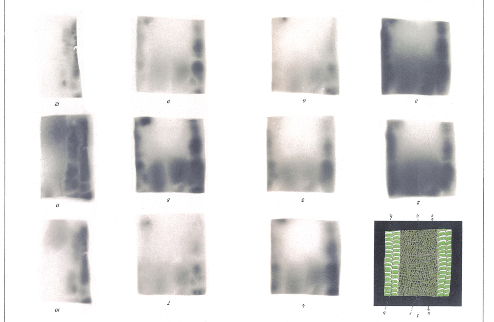

# Die Umwelt des Keimplasmas.
# The Environment of the Germ-Plasm.
## IV. The Light-Enjoyment in the *Lacerta* Body.¹

By

Dr. Slavko Šećerov.

*(From the Biologische Versuchsanstalt in Vienna.)*

With 2 figures in the text and Plate XXIII.

Received on 18 March 1912.

*Archiv für Entwicklungsmechanik der Organismen*, vol. 34 (1912).

> **Full translation.** A complete English rendering of the running text of “The Environment of the Germ-Plasm. IV.” (Secerov, 1912), including all tables, figure and plate legends, and footnotes. Numbers and table cells were transcribed from the page images, not the noisy OCR.

> ¹ Cf. Hans Przibram, The Environment of the Germ-Plasm. I. The Research Programme. Arch. f. Entw.-Mech. Vol. 33. p. 666. 1912. [In particular p. 678.]

### I.

The two methods, on the basis of which I carried out the measurement of the penetrated light and the determination of the penetration coefficient of light in *Salamandra*,² I have also applied to the Lacertids. But whereas in the case of *Salamandra* I worked predominantly with the little tubes, in the case of the Lacertids I used chiefly the photograms.

> ² Slavko Šećerov, The Environment of the Germ-Plasm. II. The Light-Enjoyment in the *Salamandra* Body. Arch. f. Entw.-Mech. Vol. 33. p. 682. 1912.

The paper was again the bromosilver-gelatine development paper N. P. G. of the Neue Photographische Gesellschaft in Berlin. The development was done with the aid of the fresh Rodinal developer, the fixing with fresh, prescribed fixing fluid.

In the determination of the penetration coefficient I used the same scale as with *Salamandra*, namely papers exposed for 1, 2, 3, 4, 5 seconds at 1 mm distance, and papers exposed for 1 second at 1, 2, 3, 4, 5 mm distance.

As light sources I employed artificial ones (electric incandescent lamps) and the natural, direct or diffuse sunlight.

The penetration relations of light are, in the case of the lacertas, *Lacerta serpa* and *viridis*, of a considerably more complicated nature than was the case with *Salamandra*. Whereas with *Salamandra* one could establish a continuous decrease of the penetration of the light from the belly toward the back, with the lacertas there are, firstly, two sharply distinguishable trunk zones (Plate XXIII Fig. 1 *b*, *b₁*). The two zones are distinguished by the colouring of the peritoneum; whereas the front part of the animal, lying in front of the lungs, is not pigmented at the peritoneum, the rear part, lying ringwise around the gonads, is black and almost light-impermeable. The pigmentation of the peritoneum plays, as we shall see later, a certain protective role against the light-penetration in the Lacertilians. Furthermore there is a difference between the back and the belly. One could thus assume four zones in all: a pigmented belly-zone (*b₁ b₁* Fig. 1 in the text) and back-zone (*r₁* Fig. 1 in the text), and an unpigmented belly-zone (*b b* Fig. 1 in the text) and back-zone (*r* Fig. 1 in the text). In Fig. 1 in the text I denote by *s₁ s₂ s₃ s₄* the boundary-lines of the paper strips that were glued onto the glass on which the preparation lay. Text-figure 1 represents the preparation drawn on Plate XXIII Fig. 1, seen from below.

**Fig. 1.** *(figure not reproduced)* — [labels: Kopf (Head); *b*, *b₁*; *r*, *r₁*; *s₁ s₂ s₃ s₄*; at bottom: *b₁ s₂ r₁* Schwanz (Tail) *b₁*]

Of the influence on the light-penetration of the skin-covering, the scales, we shall speak further below. One can namely establish that the greatest part of the penetrating light forces its way through the interspaces of the scales; this is shown by the darker and lighter streaks, especially distinctly visible at weak illumination on the paper. At intense illumination the boundaries become blurred.

This fact, that the light penetrates between the scales, is also explained by some figures in the penetration coefficient.

The scales are a significantly better protection against the penetration of the light than any strong pigmentation. Whereas in the salamanders the black skin-pigmentation scarcely has so great a significance against the light-penetration, because it absorbs only three to four times as much as the yellow places, in the Lacertids the scaling, in connection with the pigmented peritoneum, is a significantly better protection against the light-penetration.

The following figures refer to the *Lacerta viridis*. 5 candles in 1 and 5 minutes call forth no reaction in development paper which is stuck in little tubes into the animal in the region of the gonads and exposed to the electric incandescent lamp; 50 candles likewise show no reaction in 1 minute. Only 50 candles in 2 minutes call forth a distinct blackening of the paper. The position of the little tubes with photochemically light-sensitive paper was, as with the salamanders, along the gonads. The gonads I did not extirpate in these experiments, since it did not appear necessary to me. The lizards were anaesthetized, and in this anaesthetized state they could be used for several samples one after another. This time I did not keep the lizards for any length of time at all, as I had done with the salamanders, but used them only for short determinations. The thickness of the body-layers in the lizards used was, at the belly, 0.2—0.45 mm; at the sides of the trunk, 0.5—0.75 mm. The thickness of the vertebral column amounted to from 1 mm to 4.25 mm.

The determination of the penetration coefficient was carried out, as in the *Salamandra* work, with the aid of the equation $J t = J_1 t_1 \cdot k$ or $k = \dfrac{J t}{J_1 \, t_1}$, or, when the distances of the papers to be compared were not the same, with the equation $k = \dfrac{J t \, r_1{}^2}{J_1 \, t_1 \, r^2}$.

The arithmetic mean of 7 measurements, which I obtained on the basis of papers that I had stuck in little tubes into the animals in the region of the gonads (description in the *Salamandra* work) and exposed, was $k = \frac{1}{2058}$. This value, however, is too large, and it really holds only for the interspaces of the scales; on the sample one can namely always perceive lighter and darker places arranged in scale-like fashion. The dark ones come from the light that had penetrated through the interspaces of the scales; in the determination only these blackenings were taken into account, since here the tinting was most distinctly pronounced, and since I also proceeded thus in the *Salamandra* work. The figures obtained on the basis of the comparison of the tinting of the photograms with the scale-papers are considerably smaller. So we obtain for the permeability of the light at the belly the figure $k = \frac{1}{4500}$. This figure refers both to the pigmented zone; it is the arithmetic mean of several measurements.

The back-region, however, yields a considerably lower penetration coefficient. The penetration coefficient amounts to $k = \frac{1}{202500}$. This figure refers only to the unpigmented zone of the back; in the pigmented zone the blackenings are so minimal that one could not measure them with the aid of the scale that I used. One can say that the quantity of the penetrated light in the region of the pigmented back-zone is so minimal that it is to be regarded as a *quantité négligeable*. One sees, then, that the light penetrates into the region of the gonads and sexual organs from the back only with difficulty, or, one may say, scarcely at all. The path on which the light can reach the gonads can only be from the belly; on this path approximately $\frac{1}{6000}$ of the incident light can reach the gonads.

### II.

The fact that the region of the sexual organs in the *Lacerta viridis* and also *serpa* is, with the aid of the pigmented peritoneal covering on the one hand and the scale-clothing on the other, almost completely protected from the action of the incident daylight, is also of interest from another standpoint. We have seen that the quantity of light penetrated into the interior of the *Salamandra* amounts to $\frac{1}{173}$. The quantity of light penetrated into the interior of the *Lacerta* body, however, is only $\frac{1}{69686}$, if we take this figure as the arithmetic mean of the above three coefficients $\frac{1}{2058}$, $\frac{1}{4500}$, $\frac{1}{202500}$ — which is admittedly scarcely entirely permissible. The *Salamandra* is a shade-loving animal, the *Lacerta* however a sun-loving one, and when we take this fact into account, then the light-enjoyment in the *Salamandra* and *Lacerta* body must be as greatly different as these figures would lead one to believe.

The scales on the one hand and the pigmented peritoneum on the other thus appear to be obstacles against the penetration of light into the interior of the *Lacerta* body. Now does the pigmented peritoneum really stand in connection with the protective function against the light-penetration? If the pigmented peritoneum really has the function of preventing the penetration of light in the day-lizards, then in the night-lizards the pigmentation must fail to appear, since the daylight as the cause of the formation of the pigment in the peritoneum has dropped away.

I have now examined some forms from the suborder of the Lacertilia with regard to this question and found the following:

*Lacerta viridis* Laur. is pigmented at the peritoneum, *Lacerta serpa* Raf. likewise, *Hemidactylus turcicus* L. shows on the whole an unpigmented peritoneum. *Lygodactylus picturatus* Peters, on the contrary, is black at the peritoneum. *Tarentola mauretanica* L. shows in the young specimens weak, in the older ones stronger pigmentation of the peritoneum. *Phelsuma laticauda* Bttgr. is black over the whole peritoneum (right up to the top, also the back-zone which in *Lacerta viridis* is unpigmented). *Hemidactylus platyurus* Schneid. is likewise black at the peritoneum.

On the whole, therefore, the night-geckos show no pigmentation of the peritoneum (*Hemidactylus turcicus*, *Tarentola* young). The day-animals *Lygodactylus picturatus* and *Phelsuma laticauda* have strong black pigmentation. Of *Hemidactylus platyurus*, which likewise showed black pigmentation, the time of day of its activity is not known; the nearest relatives, however, are night-animals.¹ In the *Tarentola* the origin of the pigmentation is directly perceptible; in the young ones it is still weak, in the older ones, on the contrary, stronger.

**Fig. 2.** *(figure not reproduced)* — [a male *Lacerta serpa* dissected from below; label: Hoden (testis), pointing to the gonad]

> ¹ Note during printing. The following night-geckos, which I was further able to examine from the P. Kammerer collection in the Biologische Versuchsanstalt, all exhibit a white peritoneum: *Hemidactylus mabouia* Mor., *H. Brookii* Gray, *Phyllodactylus europaeus* Gené, *Stenodactylus elegans* Fitz., *St. Petrii* Anders., *Gecko verticillatus* Laur. A young *Lygodactylus picturatus* already had a black-pigmented peritoneum. Hans Przibram.

Sometimes an asymmetrical distribution of the pigmentation is to be observed; thus, for example, in the *Lacerta serpa*, male, one sees (text-fig. 2) such a case. The pigmentation follows the position of the testes and is not symmetrical on both sides.

The animals come from the collection of the Biologische Versuchsanstalt in Vienna.

It is therefore, after all, probable that the pigmentation of the peritoneum, as a light-impermeable layer, has the function of preventing the penetration of light into the interior of the body.

### III.

The results of this communication can be summarized in the following manner:

1) The Lacertids also let light into the interior, like *Salamandra*, though to a lesser degree. The conditions of the light-penetration are, in the Lacertids, of a considerably more complicated nature than was the case with *Salamandra*. One can distinguish 4 zones of light-permeability in the *Lacerta viridis*: unpigmented back- and belly-zone, and pigmented back- and belly-zone.

2) In the region of the belly, $\frac{1}{4500}$ of the incident light penetrates; in the region of the unpigmented back-zone, $\frac{1}{202500}$ of the incident light, in *Lacerta viridis* — on the basis of the determinations with the aid of the photograms, by the equation $k = \dfrac{J t \, r_1{}^2}{J_1 \, t_1 \, r^2}$.

3) The pigmentation of the peritoneum can have the function of preventing the penetration of light into the interior of the animal body through absorption. With this agrees the fact that the night-animals of the suborder *Lacertilia* as a rule possess no pigmented peritoneum, and that in the case of its occurrence the pigmentation of the peritoneum appears more strongly only in the older animals.

### Explanation of the Figures.

#### Plate XXIII.

Fig. 1. Skin-preparation, *Lacerta viridis*. The head cut off, likewise the tail, the inner organs removed. The black streaks show the black paper strips with which the preparation was glued, in order to exclude lateral light-action. *r* unpigmented, *r₁* pigmented back-zone, *b* unpigmented, *b₁* pigmented belly-zone. Painted with watercolours, 26. VI. 1911.

Fig. 2. Photogram (negative) of Fig. 1. Duration of the exposure 1 second, direct sunlight, 22. VI.

Fig. 3. Photogram of Fig. 1. 2 seconds, direct sunlight, 22. VI.

Fig. 4. Photogram as above. 1 second, direct sunlight, 23. VI. forenoon.

Fig. 5. Photogram as above. 1 second, diffuse daylight, 22. VI.

Fig. 6. Photogram as above. 50-candle electric incandescent lamp, exposed 15 minutes.

Fig. 7. Photogram as above. 50-candle electric incandescent lamp, exposed 10 minutes.

Fig. 8. Photogram as above. Electric arc lamp, exposed 5 minutes.

Fig. 9. Photogram as above. Electric arc lamp, exposed 1 minute.

Fig. 10. Photogram of a preparation, in which the section had not been led through the middle of the belly, but between trunk and belly. For that reason the left side is considerably darker, because it lay under the skin-layer of the belly. 50-candle electric incandescent lamp, exposed 10 minutes.

Fig. 11. Photogram of the same preparation as Fig. 10. Direct sunlight, 1 second, 22. VI.

Fig. 12. Photogram as above (Fig. 10). Diffuse room-light, exposed 1 second.

Printed by Breitkopf & Härtel in Leipzig.

**Plate XXIII** *(plate not reproduced)* — [The plate reproduces the twelve photograms described above (Fig. 1 the watercolour skin-preparation at lower left, and the photographic prints Fig. 2–12). Caption on plate: "Archiv f. Entwicklungsmechanik Bd. XXIII." / "Tafel XXIII."]

## Figures

**Plate XXIII.**

---

*Translator's note.* One of the Biologische Versuchsanstalt (Vienna Vivarium) papers flagged on the project site as a modern rediscovery target. Claims are rendered as stated in the original, not endorsed.
