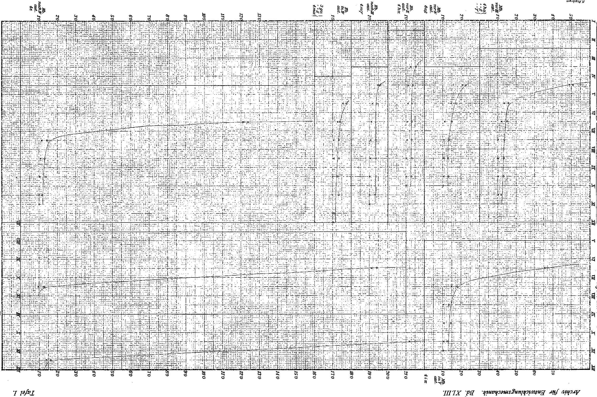

# Growth Measurements on Sphodromantis bioculata Burm.

## III. Length of regenerating and normal walking legs.

### (At the same time: Rearing of the praying mantises. VII. Communication.)

By

Hans Przibram.

(From the Biological Experimental Institute of the Imperial Academy of Sciences in Vienna. — Zoological Department.)¹)

With Plate I.

Received on 3 July 1916.

*Archiv für Entwicklungsmechanik der Organismen*, vol. 43 (1917).

> **Full translation.** A complete English rendering of the running text of “Growth Measurements on Sphodromantis bioculata Burm.” (Przibram, 1917), including all tables, figure and plate legends, and footnotes. Numbers and table cells were transcribed from the page images, not the noisy OCR.

### Table of Contents.

|  |  | Page |
|---|---|---|
| I. | Connection to earlier investigations . . . . . . . . . . . . . . . | 1 |
| II. | Measurements on normal walking legs . . . . . . . . . . . . . . | 2 |
| III. | Measurements on regenerating walking legs . . . . . . . . . . . | 3 |
| IV. | Comparison of the regeneration and normal growth curves . . . | 5 |
| V. | Setting up of formulae and discussion . . . . . . . . . . . . . | 8 |
| VI. | Summary . . . . . . . . . . . . . . . . . . . . . . . . | 13 |
| VII. | List of literature . . . . . . . . . . . . . . . . . . . . . . . | 14 |
| VIII. | List of the tables . . . . . . . . . . . . . . . . . . . . . | 14 |
| IX. | List of the figures . . . . . . . . . . . . . . . . . . . . . | 14 |

## I. Connection to earlier investigations.

Investigations on *Sphodromantis bioculata* Burm., an Egyptian praying mantis, had shown that the mass of this animal doubles from moult to moult, while individual length measurements, e.g. of the neck shield [pronotum] (Przibram and Megušar 1912), of the mesothorax, of the eye facets (Stern 1914) accordingly enlarge by the cube root of two = 1.26. It had been

> ¹) An abstract of this work appeared under an identically worded title as Communication No. 11 from the Biol. Experimental Institute of the Imp. Academy of Sciences, Zoological Department, in the Academic Gazette No. XIII, 1915.

Archiv f. Entwicklungsmechanik. XLIII. &nbsp;&nbsp;1 furthermore shown that, in place of the living tissue, the cast-off skins could be used for the measurement without any noteworthy error.

These circumstances allow me to subject the material — published earlier (Przibram 1909) — of the regeneration experiments to a renewed and indeed measuring investigation. It is a matter here of 56 specimens, whose dry-preserved skins had been preserved unchanged since 1906, and of the likewise dry-preserved imagines, of which unfortunately some could, in consequence of various accidents, no longer be drawn upon for measurement. Of these 56 praying mantises, 29 were quite normal with respect to the legs, the rest fitted with regenerates. The regeneration experiments had extended to amputations of various kinds of the fore-leg, of the middle-leg and of the hind-leg. Since the middle- and hind-leg autotomize easily, but the fore-leg does not, the regenerations of the fore-leg were related to various places, while those of the middle- or hind-leg took their starting point from the preformed autotomy place lying between trochanter and femur. For this reason, as well as also because the fore-leg has no sharply demarcated straight stretches, I have restricted myself to the measurement of the two posterior leg-pairs, and indeed the length of the tibia served as the comparison-magnitude. In this way I had at my disposal 5 complete series of the regeneration course on the middle-leg and 8 such on the hind-leg. The measurements themselves were carried out with the slide gauge [Schublehre] also used earlier (by C. N. Richter-Vienna), which allows twentieths of a millimetre to be estimated, and indeed just as the earlier ones on the neck shield by means of adjustable callipers [Greifzirkel]. Table A gives a compilation of all the measurements carried out, with the eventual operations, in hundredths of a millimetre.

## II. Measurements on normal walking legs.

In order to be able to compare later the regeneration course with the normal growth, I measured the tibiae of all 29 normal control animals and calculated the increase-quotients (final length divided by initial length) from moult to moult. Although it was to be foreseen that here too this length would enlarge by the cube root of two, I nevertheless held it advisable not to relate to the growth-quotients of another body-part, e.g. of the neck shield [pronotum], since this saving in labour might have led to misgivings concerning the consistency of the later assertions. Table B now gives a compilation of the growth of normal middle- and hind-legs, whereby left and right legs are not listed separately, since the eventual differences would fall within the measuring-error limit.

Through addition in the vertical direction, the average for the tibia-length of the middle- and respectively of the hind-leg of the 29 specimens has been ascertained, and through division of this average by the average of the preceding moult the growth-quotient from moult to moult has been determined. The quotients for the middle-leg move between 1.162 and 1.324 and give on average 1.249; the quotients for the hind-leg move between 1.077 and 1.341 and give on average 1.245, whereby I always disregard the quotient "eleventh to tenth moult" represented by only one specimen. The justification for this follows from the individual calculation of this quotient as 1.294 for the middle-leg, 1.323 for the hind-leg. If we include this corrected quotient in our general average, we obtain for the middle-leg 1.254 and for the hind-leg 1.256. A better agreement of the experiments with the expected quotient 1.26 = ∛2 we can no longer demand. We are accordingly fully justified in saying that in normal growth the length of the tibia [Schiene] too enlarges from moult to moult by the cube root of two, and that the tibia-length is to be taken as a quite typical magnitude for the proportional leg-enlargement. (Probably even the quotients occurring at the first moults, which keep more strongly below 1.26, are to be traced back to the fact that, with very small dimensions, the callipers deliver somewhat too large values, because in spite of caution an elastic rebound occurs on setting down.)

## III. Measurements on regenerating walking legs.

The regenerates of the walking legs are clearly compiled in Table C: first the middle-legs, then the hind-legs, and indeed within each group first the limbs regenerating after earlier amputations, then those after later amputations. Where several specimens had been operated upon in like manner, the increase-quotients from moult to moult are calculated from the averages, otherwise individually. These increase-quotients are set down beneath the respective moults as a velocity between them; they no longer move within narrow values around 1.26, but from 1.051 up to infinity. This infinite value comes about because we have to proceed from a null-size of the regenerate, which however does not properly hold, since cells are already present at the amputation place that supply the regenerate. But even if we set aside this infinity, we still find values greater than 21.50 (Hb. Ex. 1e₂) or 19.1 (Hb. Ex. 4k). And if we still exclude the values rendered insecure by the smallness of the regenerate (tibia under 0.5 mm), there still always appear numbers like 2.21 (Mb. Ex. 8a₂) and 1.738 (Hb. 3 Ex.), which still can by no means be identified with 1.26. While, then, the normal tibia enlarges from moult to moult by the cube root of two, this is by no means the rule in the regenerates.

If we compare the increase-quotients of the regenerates from moult to moult with the corresponding increase-quotients of the non-regenerating opposite sides of the same specimens, we find that in general the increase-quotients of the regenerates are higher than those of the opposite sides. This could permit a twofold interpretation: either the regeneration is an acceleration of the normal growth, or the growth of the opposite side could be essentially depressed by the regeneration.

Which of these alternatives applies can be easily decided in our case, if we compare the quotients of the opposite sides with respect to their absolute value with the quotients of normal specimens, the latter of which may be taken as practically and theoretically established at about 1.26. I have calculated the quotients for the legs lying opposite to the regenerating ones and obtain an average of 1.249 for our 13 regenerate-series; the quotients fluctuate between 1.209 and 1.276. If the regenerate exerts a depressing influence on the opposite side, then it can only be extraordinarily slight, and we are at any rate here justified in regarding the regeneration as an acceleration of the normal growth, as I already set forth in 1905. We can obtain an expression for the magnitude of this acceleration if we divide the regeneration-quotient by the quotient of the opposite side. These values are written down in our Table C beneath the regeneration-quotients. Now one sees at once that the acceleration of the regeneration against the normal growth is a very considerable one, since through this division the large regeneration-quotients are scarcely altered. If we turn our attention to the end of the regeneration process, we find that here the division delivers numbers near 1, sometimes somewhat above, sometimes also somewhat below, and indeed then, when the absolute tibia-length of the opposite side has been reached again. The acceleration in growth thus disappears, and can even reverse into its opposite, when the length of the opposite side has been overtaken again. These small final fluctuations can be compared with pendulum-swings in the oscillation about a disturbed equilibrium position; given the slight accuracy of the decimal places coming into consideration, we cannot yet attach any great importance to these fluctuations. We will now consider how the very large initial accelerations of the regenerative growth pass over into the normal growth velocity.

## IV. Comparison of the regeneration- and normal growth-curve.

In order to obtain a good view of the quantitative course of the regeneration, I have for our Table C drawn curves of the increase-quotients from moult to moult (Plate I), whereby each moult-interval is represented by 10 mm of abscissa, the ordinates being designated by the numbers of the increase-quotients. These ordinates I have everywhere entered at the middle of the interval, since here the velocity changing during the regeneration will behave most similarly to the obtained average-quotients. The connection of the points designated with little rings gives the curve for the increase-quotients of the regenerates; by crosses the corresponding points after division by the normal growth-quotients of the opposite side are made identifiable; the curve of these normal growth-quotients would, according to the already mentioned ascertainments, represent a straight line running approximately at 1.26.

The curve of the increase-quotients of the regenerates begins falling very steeply downward, bends, before the middle of the regeneration-completion, rapidly off into a much less steep section, and then runs almost rectilinearly, until in the vicinity of 1.26 it reaches the horizontal, as does the normal growth. Sometimes the course of the curve is disturbed by irregularities, which lift individual points too strongly upward or lower them downward. For example, in the specimens 3g α, β and 4m α the increase-quotient from tenth to eleventh moult lies above the curve-course, the point from eleventh to twelfth below the curve-course. The explanation for this is supplied to us by the little crosses, which do not follow these irregularities: the irregularity thus lies not in the regeneration-acceleration, but in the growth of the specimens concerned. Other examples, and indeed for individual specimens, are given in the moult-quotients IX/X and X/XI of 4e and IX/X of 4i, and could be multiplied at will upon individual treatment of the cumulatively presented series. We have here before us the interesting phenomenon that regenerates strictly follow the peculiarities of their bearer, on which I have called attention on other occasions: "In direct regeneration and in claw-reversal of the *heterochelous Crustaceans*, individual characters of the removed claws reappear at the claw-form concerned, whether it now comes to stand again on the same or on the opposite side of the body." (Przibram 1907, p. 312). The regeneration of the Sphodromantis legs had furnished the first such example not in regard to a form: "striking, however, was the coloration of the regenerates, in that they mostly show not the colour which just prevails at the time of the becoming-visible of the newly formed parts on the limb concerned, but that of an earlier traversed stage: thus the regenerates of larvae operated upon in the original brown stage, but in the meantime turned green, showed yellowish-brown tones, whereas the regenerates of larvae originally green, but then secondarily turned brown, showed green tones; the various shadings of green too followed the up and down of the traversed stages. Finally, however — always, when the imago state had been reached — the colour of the regenerate had caught up with that of the opposite side (which harmonized with the overall coloration of the animal), even when it had by far not been able to reach the size of the latter." (Przibram 1906, p. 173).

Now we see that, besides form and colour, the velocity-degree of the regeneration too is influenced by the "individuality" of the regenerating animal, but not, say, in a lawless manner, but in relation to growth-anomalies of the individual, which are likewise present in the non-regenerating legs of the same. The acceleration of the growth through the regeneration remains, precisely, untouched by this.

Since from one moult to the other not always the same time elapses, but rather as a rule the later moult-intervals demand more time, the moult-quotients do not actually give us directly a velocity, but must first be divided by the time-duration of the interval, in order to deliver strictly comparable build-up velocities.

In one of the earlier treatises (1912) it was set forth that, with consideration of the time, in normal growth the growth-curve otherwise rising logarithmically from moult to moult with the exponent 1.26 passes over into an S-shaped curve, as it is characteristic for autocatalyses and has also been found otherwise in growth processes.

Since the regenerates follow the individual fluctuations of the growth, the temporally constructed curve for the regeneration-velocity likewise undergoes such changes as the normal growth, but retains the overall type deviating from the normal growth-curve: at first a steep descent, then a sharp curvature, and finally a course in the horizontal; the quotient of regeneration- and normal growth-velocity behaves likewise.

The interpretation of this regeneration-velocity-curve I have already given by the example of the claw-regeneration of a crab in my "Application of elementary Mathematics to biological Problems" (1908, p. 37). "Actually the regeneration can everywhere be demonstrated as an acceleration of the normal growth, and this acceleration can be expressed by the ratio of regeneration- (v_r) to normal growth-velocity (v_w). This quotient $\frac{v_r}{v_w}$ will have to decrease with increasing size of the regenerate and become $\frac{v_r}{v_w} = 1$ when the normal ratio of the form-building-forces to the surface-tension-pressure $a - a = v_w$ has been reached again." I had thereby started out from the idea that every just-reached normal growth-form is the expression for a dynamic equilibrium between the form-building-forces (a) and the surface-tension-pressure (a), and that with the removal of a part the surface-tension-pressure suddenly sinks, in order gradually, upon the regrowing of the part, to reach again its original magnitude.

Elsewhere (1906 Crystal-analogies and 1909 Exp. Zool.²) I have also drawn in the chemical equilibrium for elucidation.

## V. Establishment of Formulae.

For the velocity of the equalization between two sites of differing potential, the simple relation of proportionality to the potential difference holds.

If, then, an equalization proceeds undisturbed by external influences, the initially large potential difference becomes gradually ever smaller, in that ever more flows off from the higher potential level to the lower one, hence the velocity of the current also becomes ever smaller, until, upon the entry of complete potential equality, it is wholly extinguished. If, however, it is a matter of a constant force source, then the velocity will not be wholly extinguished, but rather a certain potential difference will always remain upright (which we can designate as 1).

If we regard such a potential-equalization curve more closely, we see here, as is in fact the case with our regeneration-velocity curve, an initially steep drop, then a bending and finally a gradual transition into the horizontal.

If we designate the potential of a site nearer to the force source as P, that of a site farther from the force source as p, then the potential difference P — p = Kv, where v is the velocity of equalization, K must be a not more precisely specified constant given by the choice of the units of measure. In the choice of the units of measure it lies near, with the regeneration process, to consider that acceleration which the growth experiences through the removal of a part; this acceleration I can ascertain as the quotient of the normal growth velocity (vw) into the regeneration velocity (vr) from moult to moult, whereby I must still divide by the time duration (t) of the interval, in order to obtain temporally comparable velocities.¹

> ¹ Cf. Przibram 1909, Exp. Zool. 2, p. 229.

The formula would then accordingly read: P — p = K/t · vr/vw.

In this expression vr is known to us as the quotient of the regenerate magnitude (R) at the end of the time t divided by the regenerate magnitude (r) at the beginning of the time t, likewise vw as the quotient of the growth magnitudes (vw = W/w). Since we have found that this latter magnitude, for the length-growth of the praying-mantises, is a constant = 1.26, we can unite this constant with the other and obtain the simplified formula P — p = k · vr/t, where k = K/1.26.

If we wished to produce a higher gradient through the removal, say, of a warmed quantity of space-content in the vicinity of a heat source, and were able to equalize this difference through the temperature difference, then I now assume that, upon the removal of a "built-up" animal part, a potential difference arises at the site of injury, which relates to the formation-building. If I designate the definitive building-magnitude of a particular part as Z, then I can regard this magnitude as the result of an effective potential difference which has now found its equalization. If this equalization is prevented in the course of the force-flow by the removal of already built-up parts, then a rise of the potential difference to the original value sets in, in case the whole part has been removed. With Z I can therefore also designate the potential difference arising at the moment of the loss. If the regeneration proceeds, then the potential difference is to decrease in equal measure as the regenerate increases; Z — r therefore gives me an expression for the respective effective potential difference.

If I therefore set Z — r in place of P — p in our formula for the regeneration velocity, then it appears that

Z — r = k · vr/t.

We can now calculate the constant K; it must be

K = (Z — r) · vw · t / vr.

Conversely, in the concrete cases, we shall see a proof for the correctness of the considerations presented, if Z — r divided by vr/(t · vw) really yields a constant.

This calculation for the group of 3 specimens, 4h α — γ, is to be found in Table D. The constant (K) is calculated from the secure values as 151.6 ± 29.5; plotted as a curve, the values for the constant show no "trend." I have also calculated k according to the formula Z — r = k · vr/t and obtain for it the value 121.2 ± 23.4; on the other hand, k × 1.26 = K must hold; indeed there results, according to this equation, K = 152.7, hence a value agreeing well with 151.6. Since the values found for each constant still deviate from one another by about a third (oscillating by about a sixth around the mean value), only further calculations will be able to show whether it is here a matter of the experimental errors or whether corrections to our formula, valid in first approximation, are necessary, which will probably relate chiefly to the fact that the assumption that Z — r corresponds precisely to the potential difference is indeed the simplest, but not the only admissible one. To me, however — and this I should especially emphasize — it is here only a matter of showing how we arrive, through the line of thought presented, at verifiable quantity-relations.

The formula set up, however, still permits an interesting discussion if we write vr as the quotient R/r. The whole expression then reads:

Z — r = (k · 1.26)/t · R/r.

Directly we can read off that after the removal of an organ

1) with increasing regeneration the regeneration velocity decreases ever more.

We now do not wish, however, to remove the whole organ, but to leave a part n standing. The potential difference thus created we may no longer designate as Z, but merely as Z — n; if we set this expression in place of Z in our formula, then we obtain

Z — n — r = (k · 1.26)/t · R/r, and we see that the right-hand expression for the regeneration velocity becomes ever smaller, the larger n is, that is to say, we read off from this formula that, under otherwise equal conditions,

2) with the migration of the loss-site in distal direction the regeneration velocity decreases ever more, and likewise,

3) the later the loss was suffered at an analogous site, the smaller the regeneration velocity is (because then n is absolutely so much larger).

If we understand by specific regeneration velocity the absolute regeneration-increase within a certain time divided by a number stating the relative magnitude of various specimens to one another (thus, say, the total length of the animal or of the normal part up to the loss-site), then this relative regeneration-increase is expressed by the formula (R — r)/(t · x).

If I take as the comparison-part the absolute regenerate magnitude at a certain initial time, then I can write (R — r)/(t · r) = 1/t (R/r — 1) and see at once that this number too must decrease with rising n, since in our earlier equation, in place of R/(t · r), I can also set 1/t (R/r — 1 + 1), without the relation to the left-hand side being able to be altered. We can thus still read off:

4) the larger, under otherwise equal conditions, the loss-bearer is — or, better said, the closer it came to its end-magnitude — the smaller the specific regeneration velocity.

We can now again convince ourselves of the correctness of the last-named derivation by calculation of the specific regeneration velocity. If we select for the regeneration-series to be compared a corresponding stage and measure their regenerate-lengths (R), then the differentiation of these lengths by the length of the removed part (x) existing at the time of amputation must be a measure for specific regeneration velocity, for (R — 0)/x must likewise show the values falling with the increase of x. As corresponding interval I chose the moult-interval second-following upon the loss, because, as already emphasized, the earlier very small values of the regenerate would carry too great sources of error with them.

On Table E the results for all normal regeneration-series are presented. It shows that for the hind-legs the value in question for amputation in the second moult amounted to 1.23 (Ex. 4h α), in the fourth moult 1.145 (Ex. 3g α, β, 4m α, γ), in the fifth moult 1.12 (Ex. 4e), in the eighth moult 0.882 (Ex. 4k) and in the ninth moult 0.727 (Ex. 1e β). Likewise the values fall, for the middle-leg, from loss after the third moult, with 0.945 (Ex. 4h α, β, γ, 8a β), to 0.896 (Ex. 4i α) upon loss in the fifth moult.

The time required for the regeneration I have, as "time for the elapse of two moults," everywhere at first not taken into consideration, as yielding for the normal growth the same coefficients. Since the time required for one moult-interval as a rule increases with the number of the moults, the division of our values by the duration of the regeneration calculated in days would yield still far more divergent values. Unfortunately, however, the times used by the individual specimens, operated upon at different times, for the normal moult-intervals are too irregular for a comparison of the moult-interval just coming into consideration, with respect to the days, to be admissible.

Point 2) too — that with the migration of the loss-site in distal direction the regeneration becomes smaller — agrees with facts already known earlier. I will here adduce only such ones as I had occasion to observe on our object itself in my regeneration-experiments on legs:

»The occasional observation that larvae in the 2nd stage were often encountered with non-autotomized, injured walking-legs induced me to repeat the experiment on larvae three days after leaving the egg-cocoon. In fact it succeeded, at this stage, to force regeneration from the middle of the femur, from the last third of the femur, from the end of the femur.«

»Most uniform was the regeneration after autotomy or amputation from the middle of the femur; then followed only those after amputation from the last third and from the end of the femur.«

»Regeneration therefore proceeded the better the more was removed from the femur: this behavior finds numerous parallels¹) in other regeneration-cases, in case it is a matter of the removal of a larger or smaller part of one and the same organ« (Przibram 1909 III, p. 581/2).

> ¹) Cf. Przibram 1909, Exp. Zool. 2, p. 229.

The application of the ideas and formulae presented here to growth in general I reserve for a further treatise, which will no longer have to do merely with "Growth-measurements on Sphodromantis bioculata."

## VI. Summary.

1) The investigation of 56 Sphodromantis bioculata Burm. has shown that the length-increase of the tibia on normal walking-legs from one moult to the other proceeds on average in the cube-root of 2 = 1.26 (middle-legs found 1.254, hind-legs 1.256).

2) The investigation of 13 regenerating walking-leg-series, on the other hand, yielded increase-quotients far over this value, whose average also does not even approximately agree with 1.26.

3) With each individual regeneration-course the initially very high increase-quotients fall from moult to moult, until, upon the reaching of the absolute magnitude of the opposite side, an oscillating with small swings around the value 1.26 takes place.

4) Individual irregularities of the normal growth come to the fore with the regeneration in quite analogous manner, without altering the acceleration of the regenerate-increase relative to the normal growth.

5) Under otherwise equal conditions the analogous increase-quotients are the smaller, the later the loss occurred (decrease of the specific regeneration velocity with the age).

6) All these relations, as well as the earlier observed fact that walking-legs regenerating distal of the autotomy-site increase rather more slowly than ones lost at the autotomy-site, thus more proximally, can be summarized in one formula, which reads:

Z — n — r = K / (t · vw) · R / r,

where Z is to mean the normal end-magnitude of the injured limb, n the rest of the same remaining at the moment of the loss, r the absolute magnitude of the regenerate at the beginning of the time t, R the absolute magnitude of the regenerate at the end of the time t, vw the increase-quotient of the limb in question with normal growth during the time t, K a constant (in our case 151.6 ± 29.5).

7) This formula is set up under the assumption that in the regeneration it is a matter of the automatic equalization of a potential difference of the growthstate suddenly evoked from without, and its applicability in first approximation therefore supports the view that regeneration is the consequence of disturbed equilibrium of the otherwise stationary growth-state.

## VII. Literature-index.

Przibram, Hans, Quantitative Wachstumstheorie der Regeneration. Zentralbl. f. Physiologie. XIX. Heft 18. 1905.

— Aufzucht, Farbwechsel und Regeneration einer ägyptischen Gottesanbeterin (Sphodromantis bioculata Burm.). Arch. f. Entw.-Mech. XXII. 149. 1906.

— Kristall-Analogien zur Entwicklungsmechanik der Organismen. Arch. f. Entw.-Mech. XXII. 207. 1906.

— Die »Scherenumkehr« bei decapoden Crustaceen. Arch. f. Entw.-Mech. XXV. 266. 1907.

— Anwendung elementarer Mathematik auf biologische Probleme. (Vorträge u. Aufsätze über Entwicklungsmech., herausg. v. W. Roux, Heft III.) 1908.

— Aufzucht, Farbwechsel und Regeneration der Gottesanbeterinnen (Mantidae). III. Temperatur- und Vererbungsversuche. Arch. f. Entw.-Mech. XXVIII. 561. 1909.

— Experimental-Zoologie. 2. Band: Regeneration. Leipzig u. Wien, F. Deuticke. 1909.

— Das innere Gleichgewicht der Lebewesen. 42. Bericht d. Senckenbergischen Gesellschaft, Frankfurt a. M. 2. Heft. 139. 1911.

— u. F. Megušar, Wachstumsmessungen an Sphodromantis bioculata Burm. I. Länge und Masse. Arch. f. Entw.-Mech. XXXIV. 680. 1912.

Sztern, Henryk, Wachstumsmessungen an Sphodromantis bioculata Burm. II. Länge, Breite und Höhe. Arch. f. Entw.-Mech. XL. 429. 1914.

## VIII. Index of the Tables.

A. Measures of the shanks (Tibia) in hundredths mm, direct measurement on the moults and imagos p. 14.

B. Calculation of the increase-quotients of normal specimens p. 15.

C. Increase-quotients of regenerating walking-legs and calculation of the acceleration relative to normal ones of the opposite side p. 16 and 17.

D. Calculation of the constants for the regeneration velocity and the growth-acceleration through regeneration p. 18.

E. Specific regeneration velocities of the moult-interval second-following upon the loss p. 18.

F. Moult-data for all specimens (under correction of writing- and printing-errors of the earlier published data) p. 19.

## IX. Index of the Figures.

### Plate I.

Curves of the regeneration increase-quotients from moult to moult without regard to the time required for the moult-interval.

*Archiv für Entwicklungsmechanik. Bd. XLIII.* — *(To H. Przibram p. 14.)*

## Table A. Measurements of the middle-leg (Mb.) and hind-leg tibiae (Hb.) on moults and imagos, in 1/100 mm.

Sub-columns within each moult [Haut] and within Imago: **Mb.** (middle-leg) **r.** = right, **l.** = left; **Hb.** (hind-leg) **r.** = right, **l.** = left. The year heading **1905/–06** stands above the first moult column. Measurements begin at moult [Haut] II.

**Legend of the symbols used in the body of the table:**
- **? = lost with the cast skin** (an der Haut verloren) — i.e. the value was lost together with the shed skin.
- **???? = imago lost** (Imago verloren).
- **?? = hind leg on the right cut through in the femur 5 days after moult II, later autotomized** (Hinterbein rechts 5 Tage nach II. Htg. im Schenkel durchschnitten, später autotomiert).
- **—— = autotomized in (the) moult** (in Häutung autotomiert).
- **—— = tarsus four-segmented, regenerated** (Tarsus viergliedrig reg.).
- **—— = somewhat bent/crooked** (etwas verkrümmt).
- **( ) = broken off** (abgebrochen); **( ) = all broken off** (alle abgebrochen).
- **( ) = dead in the moult** (in Häutung tot).

### Table A — Part 1 (moults [Haut] II–VIII)

| Specimen | Remarks | II Mb. r. | II Mb. l. | II Hb. r. | II Hb. l. | III Mb. r. | III Mb. l. | III Hb. r. | III Hb. l. | IV Mb. r. | IV Mb. l. | IV Hb. r. | IV Hb. l. | V Mb. r. | V Mb. l. | V Hb. r. | V Hb. l. | VI Mb. r. | VI Mb. l. | VI Hb. r. | VI Hb. l. | VII Mb. r. | VII Mb. l. | VII Hb. r. | VII Hb. l. | VIII Mb. r. | VIII Mb. l. | VIII Hb. r. | VIII Hb. l. |
|---|---|---|---|---|---|---|---|---|---|---|---|---|---|---|---|---|---|---|---|---|---|---|---|---|---|---|---|---|---|
| 1a |  | 235 | 235 | 335 | 335 | 265 | 265 | 415 | 415 | 350 | 350 | 480 | 480 | 385 | 385 | 550 | 550 | 445 | 445 | 630 | 630 | 540 | 540 | 795 | 795 | 665 | 665 | 965 | 965 |
| 1b |  | 215 | 215 | 335 | 335 | 270 | 270 | 385 | 385 | 315 | 315 | 415 | 415 | 435 | 435 | 645 | 645 | 525 | 525 | 780 | 780 | 700 | 700 | 980 | 980 | 885 | 885 | 1270 | 1270 |
| 1c | ? = lost with the cast skin | 230 | 230 | 310 | 310 | 280 | 280 | 385 | 385 | 310 | 310 | 470 | 470 | 340 | 340 | 500 | 500 | 480 | 430 | 675 | 675 | 525 | 525 | 800 | 800 | 700 | 700 | 1010 | ? |
| 1d |  | 210 | 210 | 320 | 320 | 260 | 260 | 390 | 390 | 340 | 340 | 465 | 465 | 400 | 400 | 575 | 575 | 500 | 500 | 760 | 760 | 630 | 630 | 935 | 935 | 860 | 860 | 1240 | 1240 |
| 1eα |  | 240 | 240 | 335 | 335 | 260 | 260 | 395 | 395 | 295 | 295 | 465 | 465 | 390 | 390 | 605 | 605 | 505 | 505 | 700 | 700 | 600 | 600 | 870 | 870 | 755 | 755 | 1105 | 1105 |
| 1eβ |  | 215 | 215 | 325 | 325 | ? | 295 | 375 | 375 | 315 | 315 | 435 | 435 | 335 | 335 | 495 | 495 | 390 | 390 | 600 | 600 | 515 | 515 | 765 | 765 | 610 | 610 | 915 | 915 |
| 1f |  | 215 | 215 | 310 | 310 | 245 | 245 | 415 | 415 | 336 | 335 | 450 | 450 | ? | ? | 520 | 520 | 440 | 440 | 560 | 560 | 545 | 540 | 695 | 695 | 635 | 635 | 870 | 870 |
| 1jβ |  | 205 | 205 | 315 | 315 | 270 | 270 | 415 | 415 | 300 | 300 | 440 | 440 | 370 | 370 | 550 | 550 | 440 | 440 | 655 | 655 | 540 | 540 | 810 | 810 | 680 | 680 | 960 | 960 |
| 1kα |  | 220 | 220 | 315 | 315 | 245 | 245 | 395 | 395 | 310 | 310 | 450 | 450 | 385 | 385 | 540 | 540 | 420 | 420 | 635 | 635 | 545 | 545 | 810 | 810 | 720 | 720 | 1035 | 1035 |
| 1kβ | ? = lost with the cast skin | 210 | 210 | 320 | 320 | 250 | 250 | 385 | 385 | 310 | 310 | 435 | 435 | 370 | 370 | 515 | 515 | 480 | 480 | 675 | 675 | 555 | 555 | 840 | ? | 740 | 740 | 1060 | 1060 |
| 1n | ? = lost with the cast skin | 220 | 220 | 330 | 330 | 245 | 245 | 375 | 375 | 295 | 295 | 400 | 400 | 380 | 380 | 530 | 530 | 430 | ? | 615 | 615 | 540 | 540 | 800 | 800 | 685 | 685 | 970 | 970 |
| 2a | ???? = imago lost | 215 | 215 | 325 | 325 | 235 | 235 | 360 | 360 | 310 | 310 | 430 | 430 | 370 | 370 | 540 | 540 | 405 | 405 | 580 | 580 | 545 | 545 | 885 | 885 | 790 | 790 | 1145 | 1145 |
| 2dβ | ???? = imago lost | 205 | 205 | 325 | 325 | 240 | 240 | 385 | 385 | 300 | 300 | 440 | 440 | 370 | 370 | 555 | 555 | 480 | 460 | 670 | 670 | 525 | 525 | 820 | 820 | 770 | 770 | 1130 | 1130 |
| 3a |  | 200 | 200 | 310 | 310 | 245 | 245 | 380 | 380 | 295 | 295 | 450 | 450 | 380 | 380 | 545 | 545 | 480 | 480 | 660 | 660 | 590 | 590 | 870 | 870 | 790 | 790 | 1115 | 1115 |
| 3b |  | 225 | 225 | 335 | 335 | 265 | 265 | 410 | 410 | 380 | 380 | 480 | 480 | 385 | 385 | 555 | 555 | 480 | 480 | 705 | 705 | 615 | 615 | 950 | 950 | 890 | 890 | 1250 | 1250 |
| 3c |  | 210 | 210 | 320 | 320 | 235 | 235 | 380 | 380 | 280 | 280 | 430 | 430 | 350 | 350 | 535 | 535 | 465 | 465 | 690 | 690 | 530 | 530 | 730 | 730 | 700 | 700 | 1000 | 1000 |
| 3d | ? = lost with the cast skin | 210 | ? | 325 | ? | 240 | 240 | 380 | 380 | 340 | 340 | 465 | 465 | 370 | 370 | 590 | 590 | 520 | 520 | 700 | 700 | ? | ? | ? | ? | 905 | 905 | 1265 | 1265 |
| 3eα | ? = lost with the cast skin | 230 | 230 | 315 | 315 | ? | 265 | 355 | 355 | 290 | 290 | 460 | 465 | 385 | 385 | 565 | 565 | 350 | 350 | 535 | 535 | 465 | 465 | 690 | 620 | 835 | 835 | 1200 | 1200 |
| 3eβ | ? = lost with the cast skin | 220 | 220 | 315 | 315 | 250 | 250 | 340 | ? | 295 | 290 | 435 | 435 | 380 | 380 | 555 | 555 | 425 | 420 | 635 | 635 | 535 | 535 | 785 | 885 | 740 | 740 | 1060 | 1060 |
| 3gα | ?? = hind leg on the right cut through in the femur 5 days after moult II, later autotomized | 230 | 230 | 315 | 315 | ? | 265 | 355 | 355 | 310 | 310 | 450 | 450 | 295 | 0 | 475 | 0 | 395 | 320 | 575 | 0 | 450 | 450 | 705 | 0 | 825 | 880 | 1080 | 1200 |
| 3gβ | ?? = (ditto); ? = lost with the cast skin | 220 | 220 | 315 | 315 | 245 | 245 | 380 | 380 | 295 | 295 | 0 | 475 | 295 | 295 | 0 | ? | 320 | 320 | 0 | 480 | 480 | 480 | 0 | 615 | 950 | 950 | 1235 | 1235 |
| 3hα |  | 210 | 210 | 335 | 335 | 245 | 245 | 410 | 410 | 280 | 280 | 440 | 440 | 350 | 350 | 535 | 535 | 405 | 405 | 605 | 605 | 405 | 410 | 605 | 605 | 940 | 940 | 790 | 790 |
| 3hβ |  | 205 | 205 | 335 | 335 | 250 | 250 | 380 | 380 | 310 | 310 | 435 | 435 | 380 | 380 | 545 | 545 | 410 | 410 | 605 | 605 | 605 | 605 | 870 | 870 | 935 | 935 | 1200 | 1200 |
| 3hγ | ? = lost with the cast skin | 205 | 205 | 335 | 335 | 270 | 270 | 415 | 415 | 350 | 350 | 480 | 480 | 410 | 410 | 605 | 605 | 605 | 605 | 870 | 870 | 745 | 745 | 995 | 995 | 910 | 910 | 1215 | 1215 |
| 3hδ |  | 235 | 235 | 340 | 340 | 245 | 245 | 365 | 365 | 290 | 290 | 460 | 465 | 380 | 380 | 545 | 545 | 535 | 535 | 750 | 750 | 880 | 880 | 1170 | 1170 | 850 | 850 | 1055 | 1055 |
| 3iα |  | 205 | 205 | 305 | 305 | 275 | 275 | 395 | 395 | 420 | 420 | 610 | 610 | 490 | 490 | 715 | 715 | 685 | 685 | 970 | 970 | 855 | 855 | 1240 | 1240 | — | — | — | — |
| 3iβ | ? = lost with the cast skin | 205 | 205 | 305 | 305 | 235 | 235 | 370 | 370 | 345 | 345 | 510 | 510 | 410 | 410 | 630 | 630 | 575 | 575 | 830 | 830 | 760 | 760 | 1090 | 1090 | 965 | 965 | 1155 | 1155 |
| 3j | ? = lost with the cast skin | 215 | 215 | 325 | 325 | 260 | 260 | 410 | 410 | 420 | 420 | 575 | 575 | 515 | 515 | 670 | 670 | 895 | 895 | 1260 | 1260 | 825 | 825 | 1015 | 1015 | — | — | — | — |
| 4aα | Fore leg on the left, hind leg on the right amputated at the autotomy site 7 days after moult VIII. ? = lost with the cast skin | 210 | 210 | 335 | 335 | 280 | 280 | 460 | 460 | 350 | 350 | 567 | 575 | 410 | 410 | 670 | 670 | 565 | 565 | 825 | 825 | 745 | 745 | 1090 | 1090 | 860 | 860 | 1175 | 0 |
| 4aβ | —— = somewhat bent | 205 | 205 | 335 | 335 | 280 | 280 | 460 | 460 | 350 | 350 | 565 | 565 | 410 | 400 | 630 | 630 | 825 | 825 | 1090 | 1090 | 735 | 735 | 995 | 995 | 935 | 935 | 1195 | 0 |
| 4b |  | 220 | 220 | 330 | 330 | 260 | 260 | 405 | 405 | 340 | 340 | 465 | 465 | 380 | 380 | 565 | 565 | 470 | 470 | 670 | 670 | 830 | 620 | 1050 | 885 | 830 | 620 | 1050 | 885 |
| 4d | ? = lost with the cast skin | 205 | 205 | 330 | 330 | 280 | 280 | 460 | 460 | 305 | 305 | 445 | 445 | 360 | 360 | 565 | 565 | 0 | 410 | 635 | 0 | 780 | 780 | 1035 | 1035 | 780 | 780 | 1035 | 1035 |
| 4e | ? = lost with the cast skin | 215 | 215 | 330 | 330 | 270 | 270 | 370 | 370 | 325 | 325 | 455 | 455 | 360 | 360 | 565 | 0 | 410 | 410 | 635 | 0 | 895 | 895 | 1150 | 1150 | 895 | 895 | 1150 | 1150 |
| 4fα | Fore leg on the right amputated between moults II and III (malformed regenerate) | 200 | 200 | 300 | 300 | 255 | 255 | 355 | 355 | 310 | 310 | 450 | 450 | 365 | 365 | 515 | 515 | 425 | 425 | 615 | 615 | 915 | 915 | 1200 | 1200 | 745 | 745 | 995 | 995 |
| 4fγ | (normal regenerate) | 210 | 210 | 335 | 335 | 255 | 255 | 395 | 395 | 335 | 335 | 485 | 485 | 405 | 405 | 595 | 595 | 480 | 480 | 710 | 710 | 745 | 745 | 995 | 995 | 880 | 880 | 1170 | 1170 |
| 4fδ |  | 215 | 215 | 330 | 330 | 240 | 240 | 380 | 380 | 305 | 305 | 480 | 480 | 405 | 405 | 580 | 580 | 640 | 640 | 915 | 915 | 805 | 805 | 1080 | 1200 | 850 | 850 | 1055 | 1055 |
| 4fε | ? = lost with the cast skin | 215 | 215 | 305 | 305 | 245 | 245 | 365 | 365 | 295 | 295 | 430 | 430 | 365 | 365 | 540 | 540 | 480 | 480 | 685 | 680 | 695 | 695 | 995 | 995 | 875 | 875 | 1165 | 1165 |
| 4gα |  | 215 | 215 | 315 | 315 | 245 | 245 | 385 | 385 | 360 | 365 | 545 | 545 | 405 | 405 | 685 | 685 | 615 | 615 | 905 | 905 | 875 | 875 | 1245 | 1245 | 970 | 970 | 1145 | 1145 |
| 4gβ |  | 215 | 215 | 330 | 330 | 255 | 255 | 370 | 370 | 350 | 350 | 545 | 545 | 405 | 405 | 580 | 580 | 555 | 530 | 800 | 800 | 700 | 700 | 1025 | 1025 | 835 | 835 | 1160 | 1160 |
| 4gγ |  | 225 | 225 | 330 | 330 | 245 | 245 | 380 | 380 | 300 | 300 | 425 | 425 | 395 | 395 | 585 | 585 | 565 | 565 | 765 | 765 | 745 | 690 | 1065 | 1065 | 745 | 690 | 1065 | 1065 |
| 4gδ | ? = lost with the cast skin | 225 | 225 | 330 | 330 | 245 | 245 | 380 | 380 | 300 | 300 | 460 | 460 | 390 | 390 | 560 | 560 | 695 | 695 | 875 | 875 | 855 | 845 | 1165 | 1165 | 875 | 875 | 1165 | 1165 |
| 4hα | Hind leg on the left autotomized in moult II, middle leg on the right before moult III | 210 | 210 | 315 | 315 | ? | 265 | 365 | 365 | 360 | 460 | 540 | 660 | 370 | 270 | 540 | 410 | 460 | 480 | 670 | 710 | 695 | 690 | 850 | 850 | 805 | 805 | 1180 | 1180 |
| 4hβ | Middle leg on the right autotomized before moult III. ? = lost with the cast skin | 230 | 230 | 320 | 320 | 270 | 270 | ? | 365 | 365 | 580 | 530 | 660 | 0 | 355 | 0 | 580 | 405 | 405 | 730 | 730 | 850 | 850 | 1180 | 1180 | 805 | 805 | 1180 | 1180 |
| 4hγ |  | 230 | 230 | 320 | 320 | 245 | 245 | 365 | 365 | 0 | 355 | 0 | 580 | 365 | 0 | 580 | 0 | 405 | 405 | 730 | 730 | 915 | 930 | 1165 | 1245 | 915 | 930 | 1165 | 1245 |
| 4hδ |  | 225 | 225 | 320 | 320 | 250 | 250 | 365 | 365 | 365 | 365 | 580 | 580 | 405 | 405 | 730 | 730 | 900 | 900 | 1260 | 1260 | 900 | 900 | 1260 | 1260 | 960 | 965 | 1260 | 1260 |
| 4iα | Middle leg on the left autotomized in moult V. ? = lost with the cast skin | 215 | 215 | 305 | 305 | 250 | 250 | 370 | 370 | 295 | 460 | 460 | 0 | 0 | 620 | 0 | 620 | 375 | 375 | 585 | 585 | 750 | 750 | 990 | 990 | 700 | 725 | 990 | 990 |
| 4iβ | Hind leg on the left, tarsus abnormal from the start. ( ) = broken off | 225 | 225 | 340 | 340 | 275 | 275 | 400 | 400 | 345 | 345 | 510 | 540 | 440 | 0 | 620 | 0 | 455 | 455 | 690 | 690 | 670 | 700 | 1000 | 1000 | 670 | 700 | 1000 | 1000 |
| 4k | Fore leg on the right and hind leg on the left amputated at the autotomy site 8 days after moult VII | 225 | 225 | 310 | 310 | 240 | 240 | 380 | 380 | 295 | 295 | 445 | 445 | 545 | 545 | 545 | 545 | 735 | 735 | 980 | 980 | 735 | 735 | 980 | 980 | 885 | 885 | 1090 | 0 |
| 4mα | Hind leg on the right autotomized before moult IV, tarsus of the middle leg injured in moult VI, abnormal | 225 | 220 | 310 | 310 | 240 | 240 | 380 | 380 | 285 | 285 | 0 | 460 | 335 | 335 | 300 | 535 | 425 | 425 | 610 | 495 | 575 | 575 | 770 | 820 | 575 | 575 | 770 | 820 |
| 4mγ | Hind leg on the right autotomized after moult III. ( ) = all broken off | 210 | 210 | 320 | 320 | 255 | 255 | 385 | 385 | 290 | 290 | 460 | 460 | 340 | 340 | 510 | 510 | 415 | 415 | 615 | 615 | 670 | 670 | 955 | 980 | 670 | 670 | 955 | 980 |
| 6b | Fore leg on the right torn off from the patella in moult VII. —— = lost with the cast skin | 215 | 215 | 315 | 315 | 245 | 245 | 405 | 405 | 350 | 350 | 540 | 540 | 540 | 540 | 730 | 730 | 820 | 820 | 1245 | 1245 | 820 | 820 | 1245 | 1245 | 910 | 910 | 1245 | 1245 |
| 7a |  | 215 | 215 | 315 | 315 | 245 | 245 | 385 | 385 | 300 | 300 | 470 | 470 | 405 | 405 | 645 | 645 | 835 | 835 | 1245 | 1245 | 835 | 835 | 1245 | 1245 | 970 | 970 | 1145 | 1145 |
| 7c |  | 215 | 215 | 315 | 315 | 245 | 245 | 365 | 365 | 285 | 285 | 420 | 420 | 335 | 335 | 510 | 510 | 700 | 700 | 1025 | 1025 | 700 | 700 | 1025 | 1025 | 835 | 835 | 1025 | 1025 |
| 8aα | Fore leg on the right injured from the patella on in moult VIII. ? = lost with the cast skin | 215 | 215 | 335 | 335 | 235 | ? | 345 | 345 | 290 | 290 | 450 | 450 | 390 | ? | 555 | 555 | 805 | 805 | 1160 | 1160 | 805 | 805 | 1160 | 1160 | 870 | 870 | 1070 | 1070 |
| 8aβ | Middle leg on the left amputated before moult IV; in moult IV the tarsal segments not yet formed. ( ) = dead in the moult | 215 | 215 | 315 | 315 | 255 | 255 | 385 | 385 | 295 | 95 | 430 | 430 | 340 | 210 | 505 | 505 | 440 | 360 | 635 | 635 | 745 | 690 | 1065 | 1085 | 745 | 690 | 1065 | 1085 |
| 8f |  | 210 | 210 | 345 | 345 | 240 | 240 | 360 | 360 | 300 | 300 | 435 | 435 | 365 | 365 | 525 | 525 | 450 | 450 | 655 | 655 | 740 | 740 | 1075 | 1075 | 740 | 740 | 1075 | 1075 |

### Table A — Part 2 (moults [Haut] IX–XI, Imago, Sex)

| Specimen | IX Mb. r. | IX Mb. l. | IX Hb. r. | IX Hb. l. | X Mb. r. | X Mb. l. | X Hb. r. | X Hb. l. | XI Mb. r. | XI Mb. l. | XI Hb. r. | XI Hb. l. | Imago Mb. r. | Imago Mb. l. | Imago Hb. r. | Imago Hb. l. | Sex |
|---|---|---|---|---|---|---|---|---|---|---|---|---|---|---|---|---|---|
| 1a | 835 | 835 | 1220 | 1220 | 1055 | 1055 | 1495 | 1495 | 1365 | 1365 | 1980 | 1980 | 1690 | 1690 | 2490 | 2490 | ♀ |
| 1b | 1100 | 1100 | 1610 | 1610 |  |  |  |  |  |  |  |  | 1470 | 1470 | 2010 | 2010 | ♂ |
| 1c | 925 | 925 | 1340 | 1340 | 1200 | 1200 | 1730 | 1730 |  |  |  |  | 1420 | 1420 | 2090 | 2090 | ♂ |
| 1d | 1100 | 1100 | 1595 | 1595 |  |  |  |  |  |  |  |  | ?? | ?? | ?? | 1965 | ♂ |
| 1eα | 950 | 950 | 1355 | 1355 | 1210 | 1210 | 1655 | 1655 |  |  |  |  | 1430 | 1430 | 2005 | 2005 | ♀ |
| 1eβ | 795 | 795 | 1170 | 1170 | 1030 | 1030 | 1460 | 0 | 1335 | 1335 | 1920 | 1920 | 1690 | 1690 | 2435 | 2435 | ♂ |
| 1f | 815 | 815 | 1110 | 1110 | 1100 | 1100 | 1565 | 1565 | 1495 | 1495 | 2085 | 2085 | 1825 | 1825 | 2630 | 2630 | ♂ |
| 1jβ | 885 | 885 | 1300 | 1300 | 1145 | 1145 | 1725 | 1725 |  |  |  |  | 1410 | 1410 | 2045 | 2045 | ♀ |
| 1kα | 910 | 910 | 1300 | 1300 | 1145 | 1145 | 1685 | 1685 |  |  |  |  | 1415 | 1415 | 2030 | 2030 | ♀ |
| 1kβ | 985 | 985 | 1430 | 1430 | 1215 | 1215 | 1790 | 1790 |  |  |  |  | 1545 | 1545 | 2275 | 2275 | ♀ |
| 1n | 870 | 870 | 1245 | 1245 | 1135 | 1135 | 1615 | 1615 |  |  |  |  | 1395 | 1395 | 2015 | 2015 | ♂ |
| 2a | 980 | 980 | 1410 | 1410 | 1230 | 1230 | 1705 | 1705 |  |  |  |  | ? | ? | ? | ? | ♀ |
| 2dβ | 1025 | 1025 | 1505 | 1505 |  |  |  |  |  |  |  |  | ? | ? | ? | ? | ♂ |
| 3a | 1020 | 1020 | 1440 | 1440 | 1305 | 1305 | 1880 | 1880 |  |  |  |  | 1640 | 1640 | 2390 | 2390 | ♀ |
| 3b | 1240 | 1240 | 1790 | 1790 |  |  |  |  |  |  |  |  | ? | 1515 | 2235 | 2235 | ♂ |
| 3c | 960 | 960 | 1340 | 1340 | 1335 | 1335 | 1870 | 1870 |  |  |  |  | 1755 | 1755 | 2465 | 2465 | ♀ |
| 3d | 1220 | 1220 | 1680 | 1680 | 1595 | 1595 | 2245 | 2245 |  |  |  |  | 1955 | 1955 | 2810 | 2810 | ♀ |
| 3eα | 1115 | 1115 | 1595 | 1595 |  |  |  |  |  |  |  |  | 1385 | 1385 | 1950 | 1950 | ♂ |
| 3eβ | 1010 | 1010 | 1430 | 1430 | 1375 | 1375 | 1950 | 1950 |  |  |  |  | 1745 | 1745 | 2545 | 2545 | ♂ |
| 3gα | 1045 | 1045 | 1430 | 1550 |  |  |  |  |  |  |  |  | ? | ? | ? | ? | ♂ |
| 3gβ | 1095 | 1095 | 1535 | 1550 | 1445 | 1445 | 2065 | 2080 |  |  |  |  | 1860 | 1860 | 2665 | 2675 | ♀ |
| 3hα | 1165 | 1165 | 1645 | 1645 |  |  |  |  |  |  |  |  | 1415 | 1415 | 1985 | 1985 | ♂ |
| 3hβ | 1110 | 1110 | 1560 | 1560 | 1480 | 1480 | 2135 | 2135 |  |  |  |  | 1840 | 1840 | 2730 | 2730 | ♀ |
| 3hγ | 1140 | 1140 | 1680 | 1680 |  |  |  |  |  |  |  |  | 1395 | 1395 | 2135 | 2135 | ♂ |
| 3hδ | 1085 | 1085 | 1535 | 1535 | 1430 | 1430 | 2010 | 2010 |  |  |  |  | 1835 | 1835 | 2600 | 2600 | ♀ |
| 3iα | 1160 | 1160 | 1510 | 1510 | 1475 | 1475 | 2145 | 2145 |  |  |  |  | 1860 | 1860 | 2720 | 2720 | ♀ |
| 3iβ | 1010 | ? | 1475 | 1475 | 1400 | 1400 | 1965 | 1965 |  |  |  |  | ? | 1000 | ? | 2265 | ♂ |
| 3j | 1155 | 1155 | 1660 | 1660 |  |  |  |  |  |  |  |  | 1435 | 1435 | 2025 | 2025 | ♀ |
| 4aα | 1015 | 1015 | 1415 | 0 | 1250 | 1250 | 1750 | 0 |  |  |  |  | 1655 | 1655 | 2355 | 0 | ♀ |
| 4aβ | 970 | 970 | 1340 | 0 | 1220 | 1220 | 1705 | 0 |  |  |  |  | 1775 | 1775 | 2505 | 1465 | ♀ |
| 4b | 1125 | 1125 | 1590 | 0 | 1450 | 1450 | 2080 | 0 | 1505 | 1505 | 2155 | 0 | 1385 | 1385 | 1975 | 0 | ♂ |
| 4d | 1105 | 1105 | 1585 | 0 | 1450 | 1450 | 2080 | 0 |  |  |  |  | 1860 | 1860 | 2740 | 0 | ♀ |
| 4e | 945 | 945 | 1285 | 1145 | 1235 | 1235 | 1725 | 1580 |  |  |  |  | 1485 | 1465 | 2075 | 1880 | ♀ |
| 4fα | 990 | 990 | 1390 | 1390 | 1320 | 1320 | 1885 | 1885 |  |  |  |  | ? | ? | ? | ? | ♂ |
| 4fγ | 1060 | 1060 | 1505 | 1505 | 1385 | 1385 | 1990 | 1990 |  |  |  |  | 1825 | 1825 | 2505 | 2505 | ♂ |
| 4fδ | 1145 | 1145 | 1670 | 1670 |  |  |  |  |  |  |  |  | 1395 | 1395 | 2025 | 2025 | ♂ |
| 4fε | 875 | 875 | 1190 | 1190 | 1145 | 1145 | 1595 | 1595 |  |  |  |  | 1390 | 1390 | 2005 | 2005 | ♂ |
| 4gα | 1115 | 1115 | 1605 | 1605 |  |  |  |  |  |  |  |  | 1405 | 1405 | 2045 | 2045 | ♂ |
| 4gβ | 975 | 975 | 1410 | 1410 | 1280 | 1280 | 1885 | 1885 |  |  |  |  | 1635 | 1635 | 2395 | 2395 | ♀ |
| 4gγ | 1095 | 1095 | 1550 | 1550 |  |  |  |  |  |  |  |  | 1395 | 1395 | 1990 | 1990 | ♂ |
| 4gδ | 1065 | 1065 | 1550 | 1550 |  |  |  |  |  |  |  |  | 1345 | 1345 | 1935 | 1935 | ♂ |
| 4hα | 1215 | 1155 | 1565 | 1670 | 1610 | 1500 | 2050 | 2120 |  |  |  |  | 1530 | 1530 | 2290 | 2290 | ♀ |
| 4hβ | 1320 | 1280 | 1780 | 1780 |  |  |  |  |  |  |  |  | 1950 | (?) | 2325 | 2325 | ♀ |
| 4hγ | 970 | 1015 | 1365 | 1365 | 1380 | 1345 | 1835 | 1835 |  |  |  |  | 1685 | 1685 | 2485 | 2485 | ♀ |
| 4hδ | 880 | 900 | 1215 | 1215 | 1190 | 1225 | 1650 | 1650 |  |  |  |  | 1395 | 1395 | 1940 | 1940 | ♂ |
| 4iα | 885 | 800 | 1250 | 1250 | 1190 | 1145 | 1645 | 1645 |  |  |  |  | 1660 | 1660 | 2405 | 1710 | ♀ |
| 4iβ | 985 | 985 | 1430 | 1430 | 1335 | 1335 | 1875 | 1875 |  |  |  |  | 1750 | 1750 | 2390 | 2390 | ♀ |
| 4k | 1050 | 1050 | 1435 | ?0 | 1390 | 1390 | 1870 | 970 |  |  |  |  | ? | ? | ? | ? | ♂ |
| 4mα | 720 | 720 | 1040 | 995 | 950 | 950 | 1345 | 1380 | 1345 | 1345 | 1885 | 1885 | 1750 | 1750 | 2390 | 2390 | ♀ |
| 4mγ | 860 | 860 | 1205 | 1250 | 1160 | 1160 | 1655 | 1680 | 1445 | 1445 | 2155 | 2155 | ? | ? | ? | ? | ♂ |
| 6b | 1075 | ? | 1565 | 1565 | ? | 1265 | ? | 1920 |  |  |  |  | 1530 | 1530 | 2290 | 2290 | ♂ |
| 7a | 1145 | 1145 | 1635 | 1635 | 1540 | 1540 | 2160 | 2160 |  |  |  |  | 2135 | 2135 | ? | ? | ♂ |
| 7c | 980 | 980 | 1375 | 1375 | 1285 | 1285 | 1890 | 1890 |  |  |  |  | 2010 | 2010 | ? | ? | ♀ |
| 8aα | 1070 | 1070 | 1565 | 1565 |  |  |  |  |  |  |  |  | 1965 | 1965 | ? | ? | ♂ |
| 8aβ | 980 | 895 | 1345 | 1345 | 1160 | 1170 | 1700 | 1700 | ( | ? |  |  | 1700 | 1700 | 2490 | 2490 | ♀ |
| 8f | 980 | 980 | 1415 | 1415 | 1360 | 1360 | 1925 | 1925 |  |  |  |  | 1720 | 1720 | 2490 | 2490 | ♀ |

*(Empty cells under moults X and XI denote that the specimen had already reached the imago stage, or that no measurement exists; a "0" denotes a leg autotomized/regenerating and measured as 0, a "?" a value lost with the cast skin. "—" denotes the autotomized/absent state as explained in the legend.)* **Wachstumsmessungen an Sphodromantis bioculata Burm. III.** — 15

## Table B. Increase-quotients (Zq.) from moult to moult: normal walking-leg tibiae.

Averages from the specimens 1a, 1b, 1c, 1d, 1eα, 1jβ, 1kα, 1kβ, 1n, 2a, 2dβ, 3a, 3b, 3c, 3d, 3eα, 3eβ, 3hα, 3hβ, 3hγ, 3hδ, 3iα, 4gα, 4gβ, 4gγ, 4gδ, 7a, 7c and 8f. (Mb. = middle-legs, Hb. = hind-legs in 1/100 mm.)

| Moult [Häutung] | II | III | IV | V | VI | VII | VIII | IX | X | XI |
|---|---|---|---|---|---|---|---|---|---|---|
| Number of specimens: | 29 | 29 | 29 | 29 | 29 | 29 | 29 | 29 | 19 | 1 |
| Mb.: | 217.8 | 253.0 | 304.5 | 386.3 | 476.7 | 604.4 | 785.2 | 1039.2 | 1305.0 | 1365 |
| Zq.: |  | 1.162 | 1.203 | 1.269 | 1.234 | 1.268 | 1.278 | 1.324 | 1.260 | (1.050; corrected single Zq. = 1.294) |
| Hb.: | 324.2 | 380.9 | 410.3 | 560.5 | 692.1 | 844.5 | 1132.4 | 1484.7 | 1868.0 | 1980 |
| Zq.: |  | 1.175 | 1.077 | 1.366 | 1.236 | 1.220 | 1.341 | 1.311 | 1.258 | (1.060; corrected single Zq. = 1.323) |

*(The increase-quotients [Zq.] stand between the two moult-columns whose values they relate, i.e. each Zq. is the quotient of one moult-value divided by the preceding one.)*

General average of the increase-quotients over all moults (exclusive of XI : X) Mb. 1.249, Hb. 1.245; on calculation (inclusive of the corrected single Zq. XI : X) Mb. 1.254, Hb. 1.256.

16 — **Hans Przibram**

## Table C. Increase-quotients (Zq.) from moult to moult: regenerating walking-leg tibiae (mm/100).

| Moult [Häutung]: | II | III | IV | V | VI | VII | VIII | IX | X | XI | XII |
|---|---|---|---|---|---|---|---|---|---|---|---|

**3 Ex. Mb. autotomized before moult III:**

| Row | II | III | IV | V | VI | VII | VIII | IX | X |
|---|---|---|---|---|---|---|---|---|---|
| r. 4hα ♀ | 0 | <50 | 245 | 430 | 650 | 905 | 1215 | 1610 |  |
| r. 4hβ ♂ | 0 | <50 | 265 | 405 | 655 | 960 | 1320 | 1670 |  |
| r. 4hγ ♂ | 0 | <50 | 255 | 380 | 545 | 700 | 970 | 1380 | 1860 |
| Average | 0 | <50 | 255 | 405 | 617 | 855 | 1168 | 1553 | 1860 |
| Zq.: Average | ∞ | >5.100 | 1.588 | 1.524 | 1.386 | 1.366 | 1.330 | 1.176 |  |

Zq. divided by Zq. of the opposite side:

| | III | IV | V | VI | VII | VIII | IX | X |
|---|---|---|---|---|---|---|---|---|
| 4hα | ∞ | >4.567 | 1.527 | 1.218 | 1.112 | 0.984 | 1.060 |  |
| 4hβ | ∞ | >5.075 | 1.305 | 1.212 | 0.927 | 1.049 | 0.959 |  |
| 4hγ | ∞ | >5.020 | 1.147 | 1.235 | 0.944 | 0.989 | 1.098 | 1.014 |
| Average | ∞ | >4.887 | 1.326 | 1.222 | 0.934 | 1.007 | 1.039 | 1.014 |

**1 Ex. Mb. aut. before moult IV. 8aβ ♀, l.:**

| | III | IV | V | VI | VII | VIII | IX | X |
|---|---|---|---|---|---|---|---|---|
| (values) | 0 | 95 | 210 | 360 | 530 | 690 | 895 | 1170 † |
| Zq.: | ∞ | 2.210 | 1.715 | 1.473 | 1.302 | 1.297 | 1.307 |  |
| Zq. divided by Zq. of the opposite side | ∞ | 2.060 | 1.422 | 1.121 | 1.050 | 1.042 | 1.046 |  |

**1 Ex. Mb. aut. in moult V. 4iα ♂, l.:**

| | V | VI | VII | VIII | IX | X | XI |
|---|---|---|---|---|---|---|---|
| (values) | 0 | <50 | 335 | 600 | 800 | 1145 | 1395 |
| Zq.: | ∞ | >6.700 | 1.790 | 1.333 | 1.431 | 1.218 |  |
| Zq. divided by Zq. of the opposite side | ∞ | >6.540 | 1.474 | 1.023 | 1.086 | 1.045 |  |

**1 Ex. Hb. aut. before moult II, 4hα ♀, l.:**

| | II | III | IV | V | VI | VII | VIII | IX | X |
|---|---|---|---|---|---|---|---|---|---|
| (values) | 0 | 245 | 370 | 510 | 695 | 930 | 1245 | 1670 | 2120 |
| Zq.: | ∞ | 1.510 | 1.379 | 1.362 | 1.338 | 1.328 | 1.340 | 1.269 |  |
| Zq. divided by Zq. of the opposite side | ∞ | 1.240 | 1.0[..] | 1.0[..] | 1.066 | 1.0[..] | 0.[...] | 0.960 |  | **Wachstumsmessungen an Sphodromantis bioculata Burm. III.** — 17

*(Table C, continued.)*

**1 Ex. Hb. aut. immediately after moult III., 4mγ ♀, r.:**

| | III | IV | V | VI | VII | VIII | IX | X |
|---|---|---|---|---|---|---|---|---|
| (values) | 0 | 245 | 390 | 530 | 710 | 955 | 1205 | 1655 (… 2155) |
| Zq.: | ∞ | 1.590 | 1.360 | 1.340 | 1.346 | 1.366 | 1.373 | 1.302 |
| Zq. divided by Zq. of the opposite side | ∞ | 1.445 | 1.166 | 1.103 | 1.056 | 1.090 | 1.029 | 1.010 |

**3 Ex. Hb. aut. shortly before or in moult IV:**

| Row | III | IV | V | VI | VII | VIII | IX | X | XI |
|---|---|---|---|---|---|---|---|---|---|
| r. 3gα ♂ | 0 | 285 | 520 | 785 | 1085 | 1430 | ? |  |  |
| r. 3gβ ♀ | 0 | 320 | 565 | 825 | 1080 | 1535 | 2065 | 2665 |  |
| r. 4mα ♀ | 0 | 300 | 490 | 620 | 770 | 1040 | 1345 | 1885 | 2390 |
| Average | 0 | 302 | 525 | 743 | 978 | 1335 | 1705 | 2275 | (2390) |
| Zq.: Average | ∞ | 1.738 | 1.415 | 1.316 | 1.365 | 1.277 | 1.334 | 1.051 |  |

Zq. divided by Zq. of the opposite side:

| | IV | V | VI | VII | VIII | IX | X |
|---|---|---|---|---|---|---|---|
| 3gα | ∞ | 1.560 | 1.280 | 1.054 | 0.999 | ? |  |  |
| 3gβ | ∞ | 1.539 | 1.211 | 0.946 | 1.129 | 1.001 | 1.005 |  |
| 4mα | ∞ | 1.493 | 1.070 | 1.119 | 1.136 | 0.906 | 1.036 | 1.000 |
| Average | ∞ | 1.531 | 1.187 | 1.040 | 1.088 | 0.953 | 1.020 | 1.000 |

**1 Ex. Hb. aut. 42 days after moult IV., 4e ♂, r.:**

| | IV | V | VI | VII | VIII | IX | X |
|---|---|---|---|---|---|---|---|
| (values) | 0 | <50 | 620 | 885 | 1145 | 1580 | 1880 |
| Zq.: | ∞ | >12.400 | 1.428 | 1.295 | 1.380 | 1.190 |  |
| Zq. divided by Zq. of the opposite side | ∞ | >12.094 | 1.161 | 1.071 | 1.035 | 0.987 |  |

**1 Ex. Hb. aut. 8 days after moult VII., 4k ♀, l.:**

| | VII | VIII | IX | X |
|---|---|---|---|---|
| (values) | 0 | <50 | 970 | 1710 |
| Zq.: | ∞ | >19.40 | 1.763 |  |
| Zq. divided by Zq. of the opposite side | ∞ | >19.096 | 1.477 |  |

**1 Ex. Hb. aut. in moult IX., 1eβ ♀, r.:**

| | IX | X | XI |
|---|---|---|---|
| (values) | 0 | <50 | 1060 | 1740 |
| Zq.: | ∞ | >21.500 | 1.642 |  |
| Zq. divided by Zq. of the opposite side | ∞ | >21.185 | 1.374 |  |

*Archiv für Entwicklungsmechanik. Bd. XLIII. Tafel I.*

### Plate I.

Curves of the regeneration increase-quotients from moult to moult, without regard to the time required for the moult-interval.

*(Przibram, 1917 — Wachstumsmessungen an Sphodromantis. — The plate shows the regeneration increase-quotient curves plotted on logarithmic ruling; figure not reproduced here.)* 18 — **Hans Przibram**

## Table D. Calculation of the regeneration constants for the specimen-group 4hα, β, γ.

| Measure for moult [Maß für Häutung] | I | II | III | IV | V | VI | VII | VIII | IX | X |
|---|---|---|---|---|---|---|---|---|---|---|
| Measured on moult [Gemessen an Haut] | II | III | IV | V | VI | VII | VIII | IX | X | Imago |
| r |  | 0 | ? <50 | 255 | 405 | 617 | 855 | 1168 | 1553 | 1860 |
| Z − r | 1860 | >1810 | 1605 | 1455 | 1243 | 1005 | 692 | 307 | 0 |  |
| t | 15 | 12 | 14.3 | 14.3 | 11.3 | 11 | 13.3 | 26.7 | 40.5 |  |
| R/r |  | ∞ | >5.100 | 1.588 | 1.524 | 1.386 | 1.366 | 1.330 | 1.176 |  |
| k |  |  | >5086 | 14480 | 10820 | 9867 | 9807 | 13830 | 10380 |  |
| R/r : v_w |  |  | >4.887 | 1.326 | 1.222 | 0.994 | 1.007 | 1.039 | 1.014 |  |
| K |  |  | >5308 | 17350 | 13810 | 13760 | 13300 | 18110 | 12210 |  |

## Table E. Specific regeneration velocity of the second moult-interval following upon the autotomy.

| a) No. of the specimen | b) Hind leg autotomized in or near moult | c) Regenerate measured at moult | 1/100 mm | d) Normal magnitude at the time of the autotomy | e) Quotient of column d by c | f) Average of e for specified moults after autotomy (b) |
|---|---|---|---|---|---|---|
| 4hα | II | IV | 370 | 300 | 1.23 | 1.23 |
| 3gβ | IV | VI | 565 | 475 | 1.19 | ⎫ |
| 4mγ | - | - | 530 | 450 | 1.18 |  |
| 3gα | - | - | 520 | 450 | 1.15 | ⎬ 1.145 |
| 4mα | - | - | 490 | 460 | 1.06 | ⎭ |
| 4e | V | VII | 620 | 555 | 1.12 | 1.12 |
| 4k | VIII | X | 970 | 1090 | 0.882 | 0.882 |
| 1eβ | IX | XI | 1060 | 1460 | 0.727 | 0.727 |
| **Middle leg** |  |  |  |  |  |  |
| 4hβ | III | V | 265 | 255 | 1.04 | ⎫ |
| 4hγ | - | - | 255 | 255 | 1.00 |  |
| 4hα | - | - | 245 | 265 | 0.924 | ⎬ 0.945 |
| 4aβ | - | - | 210 | 255 | 0.824 | ⎭ |
| 4iα | V | VII | 335 | 375 | 0.893 | 0.893 | **Wachstumsmessungen an Sphodromantis bioculata Burm. III.** — 19

## Table F. Moult-data for the *Sphodromantis bioculata* listed in Table A.

| 1906 | Moult I | Moult II | Moult III | Moult IV | Moult V | Moult VI | Moult VII | Moult VIII | Moult IX | Moult X | Moult XI |
|---|---|---|---|---|---|---|---|---|---|---|---|
| 1a | 21. II. | 28. II. | 7. III. | 14. III. | 22. III. | 1. IV. | 16. IV. | 29. IV. | 9. V. | 25. V. | **16. VI.** |
| 1b | - | 1. III. | 10. III. | 19. III. | 13. IV. | 24. IV. | 4. V. | 18. V. | 2. VI. |  |  |
| 1c | - | 2. III. | 9. III. | 16. III. | 23. III. | 4. IV. | 14. IV. | 25. IV. | 6. V. | 31. V. |  |
| 1d | - | 2. III. | 9. III. | 16. III. | 24. III. | 6. IV. | 16. IV. | 26. IV. | 16. V. |  |  |
| 1eα | - | 3. III. | 11. III. | 20. III. | 26. III. | 14. IV. | 26. IV. | 5. V. | 18. V. | 3. VI. |  |
| 1eβ | - | 3. III. | 13. III. | 19. III. | 27. III. | 15. IV. | 29. IV. | 7. V. | 20. V. | 13. VI. | **3. VII.** |
| 1f | - | 5. III. | 12. III. | 20. III. | 28. III. | 18. IV. | 28. IV. | 7. V. | 27. V. | 11. VI. | **2. VIII.** |
| 1jβ | - | 5. III. | 12. III. | 20. III. | 28. III. | 18. IV. | 28. IV. | 7. V. | 27. V. | 11. VI. |  |
| 1kα | - | 6. III. | 12. III. | 18. III. | 26. III. | 15. IV. | 29. IV. | 25. V. | 1. VI. | 7. VII. |  |
| 1kβ | - | 6. III. | 12. III. | 26. III. | 4. IV. | 16. IV. | 25. IV. | 3. V. | 21. V. | 15. VI. |  |
| 1n | - | 10. III. | 22. III. | 31. III. | 14. IV. | 25. IV. | 3. V. | 14. V. | 2. VI. | 23. VI. |  |
| 2a | - | 1. III. | 9. III. | 18. III. | 25. III. | 4. IV. | 12. IV. | 21. IV. | 21. IV. | 22. V. |  |
| 2dβ | - | 5. III. | 13. III. | 20. III. | 30. III. | 10. IV. | 23. IV. | 4. V. | 28. V. |  |  |
| 3a | - | 1. III. | 14. III. | 21. III. | 31. III. | 8. IV. | 19. IV. | 30. IV. | 14. V. | 3. VI. |  |
| 3b | - | 2. III. | 13. III. | 21. III. | 28. III. | 5. IV. | 17. IV. | 28. IV. | 21. V. |  |  |
| 3c | - | 3. III. | 13. III. | 23. III. | 5. IV. | 16. IV. | 27. IV. | 7. V. | 25. V. | 27. VI. |  |
| 3d | - | 4. III. | 13. III. | 21. III. | 28. III. | 6. IV. | 17. IV. | 26. IV. | 8. V. | 3. VI. |  |
| 3eα | - | 7. III. | 19. III. | 26. III. | 5. IV. | 16. IV. | 1. V. | 13. V. | 1. VI. |  |  |
| 3eβ | - | 7. III. | 20. III. | 2. IV. | 18. III. | 5. V. | 14. V. | 25. V. | 16. VI. | 25. VII. |  |
| 3gα | - | 9. III. | 19. III. | 30. III. | 11. IV. | 20. IV. | 2. V. | 16. V. | 9. VI. | 21. VI. |  |
| 3gβ | - | 9. III. | 20. III. | 31. III. | 13. IV. | 17. IV. | 27. IV. | 6. V. | 23. V. | 19. VI. |  |
| 3hα | - | 9. III. | 19. III. | 27. III. | 11. IV. | 16. IV. | 27. IV. | 6. V. | 28. V. |  |  |
| 3hβ | - | 9. III. | 20. III. | 28. III. | 12. IV. | 26. IV. | 9. V. | 18. V. | 19. VI. | 10. VII. |  |
| 3hγ | - | 9. III. | 20. III. | 28. III. | 11. IV. | 30. IV. | 11. V. | 24. V. | 3. VII. |  |  |
| 3hδ | - | 9. III. | 20. III. | 28. III. | 5. IV. | 19. IV. | 4. V. | 22. V. | 7. VI. | 2. VII. |  |
| 3iα | - | 10. III. | 20. III. | 29. III. | 8. IV. | 16. IV. | 25. IV. | 6. V. | 21. V. | 18. VI. |  |
| 3iβ | - | 10. III. | 23. III. | 3. IV. | 24. IV. | 4. V. | 14. V. | 25. VI. | 15. VIII. |  |  |
| 3j | - | 11. III. | 23. III. | 3. IV. | 15. IV. | 30. IV. | 11. V. | 1. VII. |  |  |  |
| 4aα | - | 3. III. | 13. III. | 27. III. | 6. IV. | 18. IV. | 28. IV. | 11. V. | 9. VII. |  |  |
| 4aβ | - | 3. III. | 13. III. | 28. III. | 7. IV. | 28. IV. | 8. V. | 21. V. | 16. VI. | 23. VII. | **20. IX.** |
| 4b | - | 3. III. | 13. III. | 28. III. | 19. IV. | 4. V. | 16. V. | 3. VI. | 16. VII. |  |  |
| 4d | - | 4. III. | 30. III. | 10. IV. | 20. IV. | 1. V. | 13. V. | 28. V. | 27. VI. | 11. VIII. |  |
| 4e | - | 6. III. | 19. III. | 6. IV. | 24. V. | 6. VII. | 3. VIII. | 22. VIII. | 12. IX. | 23. X. |  |
| 4fα | - | 7. III. | 21. III. | 3. IV. | 20. IV. | 7. V. | 16. V. | 31. V. | 28. VI. | 3. VIII. |  |
| 4fγ | - | 7. III. | 21. III. | 9. IV. | 17. IV. | 27. IV. | 13. V. | 26. V. | 21. VI. | 27. VII. |  |
| 4fδ | - | 7. III. | 21. III. | 10. IV. | 21. IV. | 3. V. | 16. V. | 31. V. | 30. VI. |  |  |
| 4fε | - | 7. III. | 24. III. | 17. IV. | 28. IV. | 10. V. | 19. V. | 6. VI. | 1. VIII. | 9. VIII. |  |
| 4gα | - | 7. III. | 20. III. | 2. IV. | 15. IV. | 26. IV. | 11. V. | 5. VI. | 9. VII. |  |  |
| 4gβ | - | 7. III. | 20. III. | 4. IV. | 20. IV. | 1. V. | 13. V. | 28. V. | 2. VII. | 16. VIII. |  |
| 4gγ | - | 7. III. | 21. III. | 4. IV. | 16. IV. | 3. V. | 15. V. | 6. VI. | 6. VII. |  |  |
| 4gδ | - | 7. III. | 21. III. | 7. IV. | 22. IV. | 9. V. | 18. V. | 3. VI. | 12. VII. |  |  |
| 4hα | - | 8. III. | 18. III. | 1. IV. | 17. IV. | 28. IV. | 7. V. | 8. V. | 5. VI. | 18. VII. |  |
| 4hβ | - | 8. III. | 18. III. | 1. IV. | 17. IV. | 28. IV. | 7. V. | 21. V. | 28. VI. |  |  |
| 4hγ | - | 8. III. | 24. III. | 8. IV. | 22. IV. | 5. V. | 17. V. | 1. V. | 5. VI. | 2. VIII. |  |
| 4hδ | - | 8. III. | 27. III. | 17. IV. | 15. V. | 28. V. | 16. VI. | 1. VII. | 27. VIII. | 19. IX. |  |
| 4iα | - | 8. III. | 21. III. | 3. IV. | 18. IV. | 4. V. | 16. V. | 30. V. | 27. VI. | 5. VIII. |  |
| 4iβ | - | 8. III. | 25. III. | 9. IV. | 6. V. | 23. V. | 19. VI. | 11. VII. | 24. VIII. |  |  |
| 4k | - | 9. III. | 21. III. | 2. IV. | 19. IV. | 30. IV. | 11. V. | 24. V. | 27. VI. | 6. VIII. |  |
| 4mα | - | 10. III. | 23. III. | 27. IV. | 9. V. | 21. V. | 10. VI. | 23. VI. | 3. VIII. | 14. IX. |  |
| 4mγ | - | 10. III. | 25. III. | 13. IV. | 25. IV. | 1. V. | 19. V. | 1. VI. | 25. VI. | 19. VII. | **7. IX.** |
| 6b | - | 31. III. | 16. IV. | 27. IV. | 5. V. | 19. V. | 29. V. | 18. VI. | 5. VII. | 23. VII. |  |
| 7a | - | 15. III. | 26. III. | 10. V. | 6. VI. | 18. VI. | 28. VI. | 10. VII. | 25. VII. | 22. IX. |  |
| 7c | - | 27. III. | 10. IV. | 21. IV. | 3. V. | 16. V. | 1. VI. | 22. VI. | 16. VII. | 19. VIII. |  |
| 8aα | - | 7. III. | 26. III. | 14. V. | 30. IV. | 11. V. | 22. V. | 29. VI. | 8. VIII. |  |  |
| 8aβ | - | 7. III. | 5. IV. | 18. IV. | 2. V. | 12. V. | 21. V. | 12. VI. | 25. VI. | 19. VII. | **1. X.** |
| 8f | - | 23. III. | 5. IV. | 20. IV. | 1. V. | 13. V. | 25. V. | 23. VI. | 14. VII. | 16. VIII. |  |

*(In Table F the bold date in the last filled column gives the date of the imago moult. A dash "-" denotes no separate datum for moult I, the first larval stage being the one reared from the egg-cocoon.)*

## Figures

**Plate I.**

---

*Translator's note.* One of the Biologische Versuchsanstalt (Vienna Vivarium) papers flagged on the project site as a modern rediscovery target. Claims are rendered as stated in the original, not endorsed.
