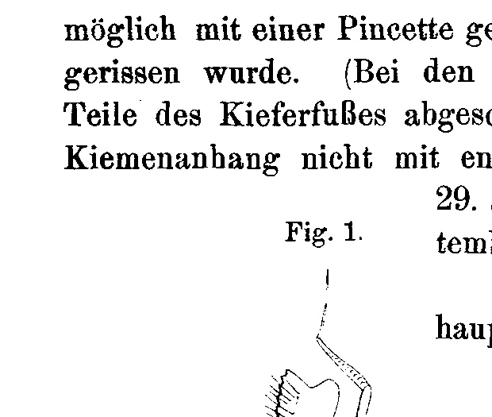
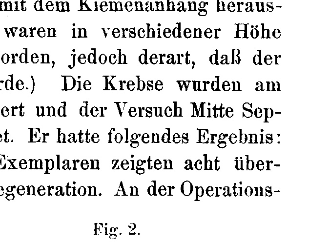
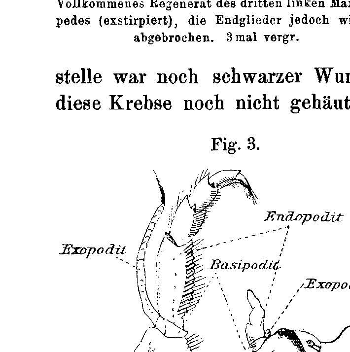
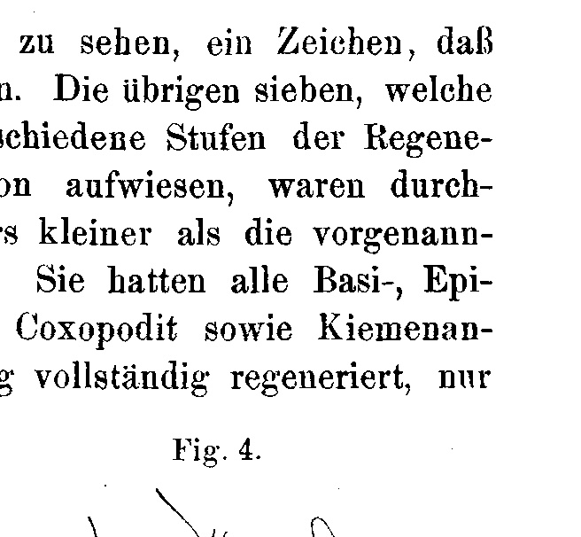
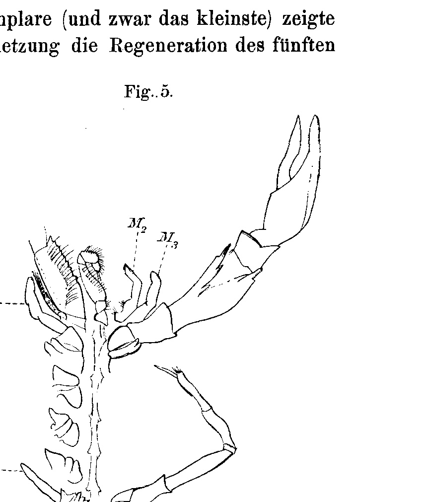

## Über Regeneration des dritten Maxillipedes beim Flußkrebs (Astacus fluviatilis).
## On the Regeneration of the Third Maxilliped in the Crayfish (Astacus fluviatilis).

By

**Raoul Biberhofer.**

*(From the Biologische Versuchsanstalt in Vienna.)*

With 5 figures in the text.

Received on 7 December 1904.

*Archiv für Entwicklungsmechanik der Organismen*, vol. 19 (1905).

> **Full translation.** A complete English rendering of the running text of “On the Regeneration of the Third Maxilliped in the Crayfish (Astacus)” (Biberhofer, 1905), including all tables, figure and plate legends, and footnotes. Numbers and table cells were transcribed from the page images, not the noisy OCR.

In a manner similar to that in which Hans Przibram had carried out his investigations on the regeneration of the third maxilliped in crabs,¹ I investigated the regeneration of the same limb in *Astacus fluviatilis*. In crabs it had been shown that the intermediate stages of regeneration were similar to a walking leg. In *Astacus*, as the lower-standing genus, it was to be expected that the individual regeneration stages would exhibit an even greater similarity to the development of the walking leg. This was indeed confirmed by the investigation.

100 specimens of *Astacus fluviatilis* about 3–4½ cm in length were placed in a stone trough about 2 m long with running water. Despite sufficient nourishment, most of the animals perished as a consequence of moulting and the resulting softness of the body, since they were devoured by the others that were not in the act of moulting, so that at the close of the investigation (after 2½ months) 15 specimens remained. About 10 specimens had perished a short time after the operation. The operation consisted in the total extirpation of the third left maxilliped together with the epi-, basi-, and coxopodite with the gill appendage. It was carried out in such a way that the endopodite was [grasped] as deep as

> ¹ Experimentelle Studien über Regeneration [Experimental Studies on Regeneration] by H. Przibram. Archiv f. Entw.-Mech. Vol. XI. p. 325 ff. 1901.

Archiv f. Entwicklungsmechanik. XIX. 10 136 — Raoul Biberhofer

possible with forceps and torn out together with the gill appendage. (In crabs, parts of the maxilliped had been cut off at various heights, but in such a way that the gill appendage was not removed along with it.) The crayfish were operated on on 29 June and the experiment was concluded in mid-September. It had the following result:

Of 15 specimens, eight showed no regeneration whatsoever. At the operation

**Fig. 1.** Regenerate of the third left maxilliped (extirpated), but with the terminal segments broken off again. Magnified 3×.  *(figure not reproduced)*

**Fig. 2.** Third maxilliped (from below), of which the left one has regenerated, in its natural position on the animal. Magnified 2½×.  *(figure not reproduced)*

site a black wound scab was still visible, a sign that these crayfish had not yet moulted. The remaining seven, which exhibited various stages of regeneration, were throughout smaller than the aforementioned ones. They had all completely regenerated the basi-, epi-, and coxopodite as well as the gill appendage, only

**Fig. 3.** Third maxilliped (from below), extirpated, of which the left one is in regeneration. Magnified 6×.
[Labels: Endopodit; Exopodit; Epipodit; Basopodit; Coxopodit]  *(figure not reproduced)*

**Fig. 4.** Third maxilliped (from below) in its natural position on the animal (more strongly magnified).  *(figure not reproduced)*

these parts were less developed in comparison with the right maxilliped.

One specimen had the endo- and exopodite completely developed, only it had lost the four terminal segments of the latter (Fig. 1 and 2). One specimen showed an earlier stage (Fig. 3 and 4). The On the Regeneration of the Third Maxilliped in the Crayfish, etc. — 137

endopodite was in the process of regrowing and formed a white, finger-shaped peg of soft consistency and indicated articulation. The exopodite could be recognized at the base of the endopodite as a cone-shaped elevation.

The remaining five specimens had regenerated the endopodite after the manner of the aforementioned specimen, but no rudiment of the exopodite could yet be perceived.

One of the aforementioned specimens (namely the smallest) showed, in addition, as a consequence of natural injury, the regeneration of the fifth right walking leg, of the right claw, and of the second left maxilliped (Fig. 5). In particular, the regenerate of the last-named limb was very distinctly developed, so that on this limb too, just as on the three others, the walking-leg-like rudiment could be perceived. The regenerate of the second maxilliped showed, deviating from the normal form of this limb, the same peg-shaped form as the regenerate of the third maxilliped, and had at its base two bristle-bearing tubercles, which corresponded to the basi- and coxopodite.

**Fig. 5.** Regenerates of the second (M₂) and third left maxilliped (M₃), of the right claw leg (S₁) and last walking leg (S₅), and the normal limbs of the opposite side for comparison (from below). Magnified 3×.  *(figure not reproduced)*

The investigation thus yielded the complete regeneration of the third maxilliped together with the gill appendage after complete extirpation. As a consequence of the phylogenetically lower position of the genus *Astacus*, the individual transitional stages of the development resemble the walking legs to a much higher degree than had been observed in crabs.

10*

## Figures

**Fig. 1.**

**Fig. 2.**

**Fig. 3.**

**Fig. 4.**

**Fig. 5.**

---

*Translator's note.* One of the Biologische Versuchsanstalt (Vienna Vivarium) papers flagged on the project site as a modern rediscovery target. Claims are rendered as stated in the original, not endorsed.
