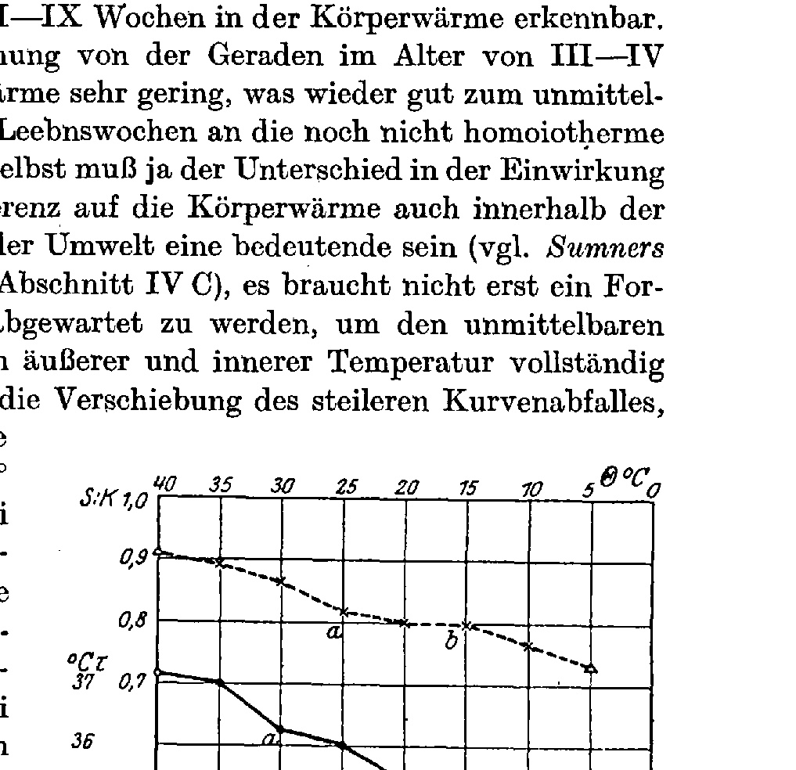

# The Tail Length of the Offspring of Temperature-Modified Rats, Mus (Epimys) decumanus Pall. and M. (E.) rattus L.
## (The Environment of the Germ Plasm. XIII.)

By

### Hans Przibram.

(From the Biological Experimental Institute of the Academy of Sciences in Vienna [Zoological Department].)¹)

With 1 text-figure.

*(Received on 2 August 1924.)*

*Archiv für mikroskopische Anatomie und Entwicklungsmechanik*, vol. 104 (1925).

> **Full translation.** A complete English rendering of the running text of “The Tail Length of the Offspring of Temperature-Modified Rats” (Przibram, 1925), including all tables, figure and plate legends, and footnotes. Numbers and table cells were transcribed from the page images, not the noisy OCR.

> ¹) An abstract of this work appeared under the title: Mitteilungen aus der Biologischen Versuchsanstalt usf. No. 91 in the Akad. Anzeiger, Vienna, No. 24–25 of 30 November 1922. — In point 4 of that communication the words "longer" ["längere"] and "shorter" ["kürzere"] were inadvertently transposed; this sense-distorting error, recognizable as such from the whole context, is hereby corrected (the correct presentation is also found in "Temperatur und Temperatoren" 1923, p. 65, and Table E).

### Contents.

| | Page |
|---|---|
| I. Statement of the Problem | 549 |
| II. Methodology and Technique | 550 |
| &nbsp;&nbsp;A. Apparatus, Accuracy | 550 |
| &nbsp;&nbsp;B. Elimination of subjective errors | 551 |
| &nbsp;&nbsp;C. Elimination of objective errors | 551 |
| &nbsp;&nbsp;&nbsp;&nbsp;1. Breadth of the material | 551 |
| &nbsp;&nbsp;&nbsp;&nbsp;2. Prevention of segregation | 552 |
| &nbsp;&nbsp;&nbsp;&nbsp;3. Health | 555 |
| &nbsp;&nbsp;D. Experimental plan | 555 |
| III. Material and Pedigrees, Arrangement | 557 |
| &nbsp;&nbsp;A. House rat, *Epimys rattus*, "Semmering" | 559 |
| &nbsp;&nbsp;B. Brown rat, *Epimys decumanus* | 559 |
| &nbsp;&nbsp;&nbsp;&nbsp;a) Wild, agouti-colored, "Wien" | 559 |
| &nbsp;&nbsp;&nbsp;&nbsp;b) Tame, albinotic α) Strain "Ställe" | 559 |
| &nbsp;&nbsp;&nbsp;&nbsp;&nbsp;&nbsp;β) &nbsp;&nbsp; " &nbsp;&nbsp; "Molkerei" | 560 |
| &nbsp;&nbsp;&nbsp;&nbsp;&nbsp;&nbsp;γ) Cross "St." × "M." | 560 |
| &nbsp;&nbsp;C. House mouse, *Mus musculus*, α) after Sumner | 561 |
| &nbsp;&nbsp;&nbsp;&nbsp;&nbsp;&nbsp;β) &nbsp;&nbsp; " &nbsp;&nbsp; Sundstroem | 561 |
| IV. Experimental Results on Tail Length of the Offspring | 561 |
| &nbsp;&nbsp;A. Without temperature change; Result: Constancy | 561 |
| &nbsp;&nbsp;B. Displacement by 10° C, " Transgression | 563 |
| &nbsp;&nbsp;C. Back-displacement " Transversion | 564 |
| &nbsp;&nbsp;D. Offspring of (back-)displaced " Regression | 565 |
| &nbsp;&nbsp;E. Slight influencing " Reapparation | 566 |
| &nbsp;&nbsp;F. Transitional cases " Progression | 568 |
| V. Interpretation of the Results | 569 |
| | Page |
|---|---|
| &nbsp;&nbsp;A. Connection between body warmth and tail length | 569 |
| &nbsp;&nbsp;B. &nbsp;&nbsp; " &nbsp;&nbsp; " &nbsp;&nbsp; " &nbsp;&nbsp; Metabolism | 570 |
| &nbsp;&nbsp;C. &nbsp;&nbsp; " &nbsp;&nbsp; " &nbsp;&nbsp; Metabolism and tail length | 572 |
| VI. Does the duration of time or the number of generations act? | 576 |
| VII. The deviation from the straight line in the dependence of body warmth and the K.S.-relation at various external temperatures | 577 |
| VIII. Summary | 580 |
| IX. List of References | 582 |
| X. Tables | 583 |

(Tables I–X see "Umwelt XI"; Tables XI–XXI see "Umwelt XII"; these tables are not repeated for reasons of economy; for the sake of clarity, however, those of the present communication are numbered continuously following those.)

| | | Page |
|---|---|---|
| Table XXII. | Pedigree and K.S.-relation House rat, *E. rattus*, "Semmering". | 583 |
| Table XXIII. | Pedigree and K.S.-relation Brown rat, *E. dec.*, agouti "Wien" | 596 |
| Table XXIV. | Pedigree and K.S.-relation Brown rat, *E. dec.*, albino, "Ställe", start of experiment 15° and 30° | 584 |
| Table XXV. | Pedigree and K.S.-relation Brown rat, *E. dec.*, albino, "Ställe", start of experiment 0° and 34–40° | 586 |
| Table XXVI. | Pedigree and K.S.-relation Brown rat, *E. dec.*, albino, "Ställe", start of experiment 5° and 20° | 588 |
| Table XXVII. | Pedigree and K.S.-relation Brown rat, *E. dec.*, albino, "Molkerei", start of experiment 15° and 35° | 590 |
| Table XXVIII. | Pedigree and K.S.-relation Brown rat, *E. dec.*, albino, "Molkerei", start of experiment 25° | 592 |
| Table XXIX. | Pedigree and K.S.-relation Brown rat, *E. dec.*, albino, "Molkerei", start of experiment 25° A, 20°–15° A (moisture experiments) | 594 |
| Table XXX. | Pedigree and K.S.-relation Brown rat, *E. dec.*, albino, "Ställe" × "Molkerei", start of experiment 20°–15° A | 597 |
| Table XXXI. | Tail length — Constancy in rats | 598 |
| Table XXXII. | " — Transgression and Transversion in rats | 601 |
| Table XXXIII. | " — Transgression, Transversion and Reapparation in mice | 604 |
| Table XXXIV. | " — Regression in rats | 602 |
| Table XXXV. | " — Reapparation in rats | 605 |
| Table XXXVI. | " — Progression in rats | 606 |
| Table XXXVII. | Changes in body warmth in starving rats at various external temperatures, after Goto | 607 |
| Table XXXVIII. | Quantities of heat given off by the same through water vapor, after Goto | 608 |
| Table XXXIX. | Oxygen consumption of rats, after Goto and Giaja-Maleš | 609 |
| Table XL. | Metabolic figures of various mammals at various external temperatures | 610 |

## I. Statement of the Problem.

In the work program for the study of the "Environment of the Germ Plasm" (1912, p. 667) I had set up the apprehension of three¹) larger problem-

> ¹) At the place cited, "two" has inadvertently been printed instead of "three"; but the three problem-complexes are correctly listed.

complexes: "firstly, the establishment of the physical conditions under which the germ glands normally stand in the body, secondly, the changes that these conditions undergo upon a change of the environment (external factors and soma), and thirdly, the interaction relations between the germ glands and the rest of the body, between their inner world and their 'environment' in the narrower sense." For the germ glands of the rat (and of similar mammals) the thermal environment has been elucidated through the preceding communications (Umwelt III, VI, VIII, X, XII), and furthermore the dependence of the tail length on the external and internal temperature of these animals has been quantitatively established (Umwelt VIII–XI), so that we may now set about sketching a picture of the interactions that exist between the germ cells and their producers, by way of the mediation of the parental soma, as the "environment in the narrower sense", and that come into consideration for the transmission of acquired properties. Does the change of the relative tail length forced by temperature-influence pass over to the offspring even on back-displacement into a moderate external temperature, and how does the matter stand in this regard with the dependence of the tail length on the inner temperature?

## II. Methodology and Technique.

Almost all investigations on the inheritance of acquired properties have been reproached with certain defects of methodology and technique, and on these grounds their probative force has been denied. It was therefore necessary to shape the experiments from the outset in such a way that these objections could not be raised against them with any right; one may distinguish three groups of them: A. Defective accuracy, B. Unintentional or arbitrary grouping of the material in favor of a preconceived opinion, C. Error from material that is too scanty or not uniform. Let it first be set forth what I had done to eliminate these error-sources.

### A. Apparatus, Accuracy.

The temperature installations, control, measurement and registration of the warmth constancy have already been described in detail (Umwelt XI A). As against the warmth and cooling cabinets that had been available up to then, the chambers offered complete reliability of the desired temperature, for years with scarcely half-degree fluctuations, together with an uninterrupted series of all five-degree intervals that came into consideration at all. In this respect, therefore, the investigations available up to now on the inheritance of temperature-influences, e.g. those of *Sumner* on mice, could be far surpassed. The adoption of the relative tail length, also used by *Sumner*, as a modifiable character permitted a quantitatively wellexecutable measurement. Advantages here were the more considerable size of our experimental rats as against *Sumner's* mice, and the more widely separated temperature intervals, because these two factors necessarily entailed a more considerable difference of the absolute measured values and thereby a narrowing-down of what still fell under a possible measurement-error threshold. The isolation of each rat-family (cf. Umwelt XI B) and the distinct marking of the young at the first measurement (Umwelt XI C) practically excluded any confusion.

Ether-narcosis and the very simple measuring aids (Umwelt XI D) made errors through false reading improbable; moreover, every measurement was carried out at least twice. The repeated protocoling (Umwelt XI E) and the working-up of the results by means of complete auxiliary tables (Umwelt XI F) guarantee that no essential omissions have occurred. On the accuracy of the temperature measurements in the animals one may read the discussions in Umwelt XII (Section VII), and look up especially, on account of the consideration of the measuring depth, Tab. XIX!

### B. Elimination of subjective errors.

An error-source not to be underestimated arises from the involuntary "bias" of our fingers and eyes in favor of a desired result. This source could be stopped up entirely by the fact that I myself carried out no measurement at all, but only gave the directions for it, while the observer himself could not survey how the problem took shape at all in the experiments, so that consequently a "correcting of luck" was also excluded. In addition, the person of the observer was also changed. A difference in the measuring was in each case sought to be prevented by direct handover of a measurement-series from the earlier to the later observer, in which both had to obtain the same numbers. Only quite at the end of the experiments, when no sufficiently trained assistant was any longer at my disposal, did a small inaccuracy thereby creep in. The affected values I have designated in my tables with F (false). Fortunately, however, they do not concern such as could essentially influence the overall result. In order to exclude calculation-errors, I have re-calculated every computation myself at least twice; the average values of the litters, which form the basic material for the tables, I also had my assistant Dr. Jan Dembowski re-calculate. The errors found were slight.

### C. Elimination of objective errors.

#### 1. Breadth of the material.

As the subjective bias must, so must also the objective chance be eliminated. This is best achieved through a great number of the experiments and the use of various breeding strains. The brown-rat material comprises two color-races in three strains with 264 litters and 1346 young and stem-parents, apart from the preliminary experiments. To this come further data on the house rat, 12 litters with 60 specimens, and albinotic house mouse, the latter supplied by other authors (cf. Section III below; as well as Tab. X in Umwelt XII). For the phenomena to be taken into consideration, comparisons with other warm-blooded animals have moreover also been drawn upon: thus for the dependence of the inner upon the external temperature (Umwelt XII, Section IV and VII, Tab. XIV and XIX), of the metabolism upon the external temperature (below Section V C, Tab. XL), of the behavior of lengths upon crossing (as follows immediately).

#### 2. Prevention of segregation.

The greatest weight one usually lays, in inheritance experiments after the *Mendelian* method, on the purity of the starting material. There is no doubt that severe defects in this respect cling to many earlier investigations on the inheritance of acquired properties (literature in Experimentalzoologie III). *Standfuss* (l. c. 168) and *Fischer* (l. c. 175) bred further only from the most extremely altered butterfly individuals with positive result; a selection has thus been made which favored a segregation of mutants that did not need to be directly dependent on the modifying factor. *Tower's* beetles (l. c. p. 161–163) yielded, on the action of external factors, a heightened variability, but no definite assignment of a character to the degree of one or the other factor: the immediate fixation, occurring according to Mendelian numbers, of the newly appearing characters shows that it was a matter of mutation in the sense of separation of formerly coupled dispositions, a kind of "crossing-over", which indeed can also be largely modified through external factors in the combination-numbers. It is now easy to exercise this critique, but so much the harder to fulfill the postulate of the "pure line" in animal objects. Experiments in this direction are planned by *Kammerer* with *Ciona*, whose eggs can be self-fertilized by *Morgan's* method, but have not yet been carried out on account of external circumstances. The stick insects, which propagate parthenogenetically for many generations, likewise offer an opportunity to eliminate the error-source given by mixture of material. Such experiments, concerning the induced colorations, Mrs. Dr. Brecher and I have carried out (Die Farbmodifikationen der Stabheuschrecke *Dixippus morosus*, Arch. f. Entomol. 50, 147. 1922), yet there stood opposed to the assessment the impossibility of permanently realizing illuminations of the same degree, since only natural light was at our disposal, standing hindering in the way. We hope to attain the goal through dark-breeding. The result up to now was an increase of the color-influence in the second generation upon continuance of the modifying light-factor, despite counter-selection. In his salamander experiments (Arch. f. Entw.-Mech. 1910) *Kammerer* sought to replace the production of pure lines through selection of the starting specimens, not feasible in the fire-salamander, in a sense opposite to that which would correspond to the influencing by the underground¹). His cross of *Salamandra maculosa forma typica* with *forma taeniata* yielded Mendelian relations with dominance and segregation; one must thus after all still reckon with the appearance of mutants in his experiments, although it is in the highest degree improbable that the results — passing-over of the color-adaptation that appeared in the parent onto the offspring — can be explained thereby. In rats and mice the production of pure lines of the relative tail length is rendered difficult in consequence of the far-reaching influencing of this character through domestication. Thus, according to *Sumner* (1923, p. 246), in the American deer-mice, *Peromyscus*, the tail becomes shorter in captivity. Also, a race multiplied in strict inbreeding soon shows such a decrease of fruitfulness, namely as regards the number of young in a litter, that the danger arises of, upon undoubted attainment of purity, no longer having usable breeding material before one. Moreover, even with the apparently purest line one is not safe from the sudden appearance of mutations, which the geneticists are now already inclined to concede. In fact my rat experiments too were threatened by the occasional appearance of tailless and stump-tailed rats. Yet these mutations are separated by so wide a margin in the tail length itself from the shortest variants of the normally-tailed rats that they introduced no errors. They could be eliminated without disturbance of the experiments. In order to obtain a phenotypically as homogeneously-reacting material as possible, I resorted, with the strictest inbreeding, to the method of preventing segregation as far as possible. It is known that shortness and length of body-appendages upon crossing mostly yield a middle length, which moreover does not distinctly segregate in the second generation. As examples may be named the ears of rabbits (Lit. Experimentalzool. 3, 116, Lang 1910) and sheep (Wriedt in Castle 1924, p. 19), but especially the tail lengths of the deer-mice according to *Sumner's* (1923, p. 245) cross of local races. After his data I have compiled the following little table:

> ¹) It is thus an error of *Morgan's* to ascribe to him the selection of the desired adaptation colors.

**554 H. Przibram: The Tail Length of the Offspring of Temperature-Modified**

| | Tab. | Page | Local race | Gen. | No. | Tail % | Gen. | No. | Tail % | Gen. | No. | Tail % |
|---|---|---|---|---|---|---|---|---|---|---|---|---|
| *Peromyscus manicul.* | 1 (3) | 276 | *Calistoga* | P | 118 | 85.48±0.32 | | | | | | |
| | 1 | 276 | *Cal. × Carl.* | F₁ | 152 | 94.73±0.31 | F₂ | 84 | 93.28±0.42 | | | |
| | 1 (3) | 276 | *Carlotta* | P | 108 | 104.42±0.36 | | | *earlier broods* | | *later* | |
| | 3 | 278 | *Carl. × Vict.* | F₁ | 96 | 94.48±0.33 | F₂ | 56 | 84.75±0.51 | F₂ | 65 | 91.26±0.36 |
| | 2 (3) | 277 | *Victorville* | P | 136 | 81.17±0.31 | | | | | | |
| | 2 | 277 | *Vict. × Eur.* | F₁ | 94 | 91.40±0.31 | F₂ | 85 | 89.44±0.41 | | | |
| | 2 | 277 | *Eureka* | P | 141 | 104.21±0.30 | | | | | | |

This table brings a welcome confirmation of the assumption which I had made for the method for the prevention of segregation. It was assumed that, when such sexual animals of one litter as deviate least in the average of their tail lengths from the average of the whole litter were united into a pair, animals of approximately equal tail length should again come out, naturally under unchanged external conditions. There were first paired the longest-tailed female of the litter with the shortest-tailed male, then the female with somewhat less long tail with the male with somewhat less short tail, and so on, until the most similar partners, also those standing nearest to the general average, met¹). Since this manipulation was repeated in every generation, no segregation at all was to occur. From *Sumner's* table there results, from the given deviation-values, that in the second hybrid generation the variation-breadth went only very little beyond that of the first, which does not differ from the parental races at all with regard to variability and always stands almost exactly in the middle with regard to the relative tail length itself²). My rats can hardly have behaved otherwise, yet the variation-breadths are not calculated. Unfortunately I could not finish the begun crossings of various strains. There lie merely a few litters from the cross ♂ "Molkerei" × ♀ "Ställe". The tail lengths conformed in the

| Temp. | Type | No. | Strain | Gen. | Age Weeks | K : S | Age Weeks | K : S |
|---|---|---|---|---|---|---|---|---|
| 20°–15° External. *Epimys decumanus albinoticus* | | 95×106 | "Ställe" | P | II | 1.604 | VIII–IX | 1.250 |
| | | 139×150, I | "Mo." × "St." | F₁ | II | 1.644 | VIII–IX | 1.241 |
| | | 171×182, I, II | | | | | | |
| | | 115×126 | "Molkerei" | P | II | 2.175 | VIII–IX | 1.315 |

> ¹) In a few cases, in the absence of a suitable brother, the father was used. This is of course noted at the corresponding place.

> ²) After *Sumner*, Journ. of exp. zool. 38, 271. 1923, *Bonhote* (Vigour and Heredity, London 1915) observed the absence of any segregation in F₂ in two subspecific crosses of *Meriones crassus*.

**Rats, Mus (Epimys) decumanus Pall. and M. (E.) rattus L. 555**

offspring of the pairs 95 × 106 of the strain "Ställe" and 115 × 126 of the strain "Molkerei", both albinotic brown rats, according to the strain "Ställe":

[The first complete paragraph of p.555 — "Dieses Verhalten ist unklar…" — begins on this page and belongs to the next chunk; it is therefore not translated here.] This behavior is unclear, and until further data have been obtained it cannot be decided whether it is after all a matter of the presence of a "dominance", of the predominant influence of the female, or of the long-continued "Ställe" strain. On the differences of the strains and their consideration, see further below, Section III. The experimental results show, however, that the purpose of non-segregation within each strain has been achieved, that the presupposition for lines within each strain therefore held true.

### 3. Health.

An important factor for the success of the experiments had to be the health of the material employed. Quite apart from possible sources of error that could arise from pathological alteration of the tail length itself or of the general state of growth (cf. Umwelt IX, p. 27; X), any disease would, in the rats bred onward in strict inbreeding, undergo a catastrophic intensification, which would not only yield abnormal animals, but would soon also bring with it the dying-out of the strains. In any case, fertility declines under inbreeding without exception. The experiments would already suffer from high mortality, for thereby a selection of the breeding-pairs according to the principles just stated would not be possible.

To prevent disease, only such strains were used among the tame rats as had shown themselves healthy for generations. In particular, all families with signs of rickets, hyperthyroidism (see Umwelt XIV), lung disease, and labyrinth disturbance (turning) were excluded from the outset. A special sieving was, moreover — even among the rats brought in from the open — brought about by the placement in the constantly tempered rooms. Only a part of the breeding-pairs was able to propagate further under these new conditions. The rest either died themselves or remained childless. In this way a very healthy material was preserved, which exhibited only quite isolated cases of disease (cf. Umwelt XI, Section VIII), and whose mortality was so low that it does not at all come into consideration in the assessment of the results. On the lack of influence of the ether narcosis used in the measurements upon the tail length, a report will be given in Umwelt XIV.

### D. Experimental plan.

The strain-pairs first brought into the constant temperatures, not yet reared in them, were designated as the parental or parental generation (P). Their children are the first filial generation (F₁), their grandchildren the second (F₂), etc. (... F_n). A part of the descendants remained in the temperature chosen for the parents, while another part was in each case transferred into the temperature 10° higher or 10° lower. In this new temperature one part of their descendants again remained over several generations, while another part, from the next generation onward, was transferred back into the original temperature, in order to be reared onward there once more over several generations. In this way, strictly mutually-comparable cousin-lineages were formed. A special consideration required the point in time at which the rats were to be transferred into the new temperature. Since it is a matter of mammals, the separation of the generations could not be so arranged that the fertilized eggs would already be brought into the new environment immediately after the impregnation. Because, moreover, the rats are "nest-squatters" (Nesthocker), the young absolutely requiring the care of the mother, it was also impossible to bring the young from birth on into new conditions without transferring the parents at the same time, or to separate them by leaving the male behind. In order to obtain a precise reference-point for the back-transfer, I therefore preferred to transfer the pairs in each case, at the first litter, together with it. Thus this first litter shows us the behavior of rats which were themselves still conceived and carried under the earlier outside temperature; the next, that of rats which, as germ cells, still ripened under the earlier outside temperature, but already reached gestation in the new one; the further litters indicate the behavior of rats which, as germ cells, already ripened in the new temperature, and were of course also conceived and carried in it. The births of the rats are easily ascertained on the daily round, because the newborns squeak at once, so that, without disturbing the nests, the check can be made merely by ear. Curiously, the young rats seem to squeak no longer spontaneously after the first day. The choice of ten-degree differences between new and old outside temperature was made only once we had convinced ourselves of the small difference which 5 degrees produce in the relative tail length (cf. Umwelt XI), of which we had to fear that it would yield unclear results. Yet some experiments had been carried out with merely five-degree difference of the transfer-temperatures. Further, there exist a few experiments with a direct back-transfer of the F₁ generation into the initial temperatures, so that the germ cells becoming the F₂ generation could still be formed in the initial temperature. In further cases, just as in the two cases just discussed, a lesser influence of the modifying factor was present than that which would correspond to a ten-degree difference (from the ripening of the germ cells onward), because the outside space of the cold chambers had only 15° in winter, but 20° in summer. As we shall see, these groups of experiments deviating from the general experimental plan are especially interesting (cf. below, Section IV E), and I very much regret that the shutting-down of the chamber operation no longer made a resumption of them possible, once their significance had become clear to me.

The following scheme may serve to illustrate the experimental plan for experiments proceeding from an outside temperature of n° C:

| n + [x > 10] | n + 10 | n + 5 | n | n − 5 | n − 10 | n − [x > 10] |
|---|---|---|---|---|---|---|
| | | | P | | | |
| F₁ etc. | F₁ | F₁ | F₁ | F₁ | F₁ | F₁ etc. |
| | F₂ | F₂ | F₂′ | F₂ | F₂ | |
| | F₃ | | F₃ | | F₃ | |
| | F₄ | | F₄ | | F₄ | |
| | F₅ | | F₅ | | F₅ | |
| | F₆ | | F₆ | | F₆ | |

*(The fully drawn-out direction-lines indicate translation and back-translation with 10° temperature difference; those with broken direction-lines indicate it with 5° temperature difference. The dotted lines indicate immediate back-transfer of the F₁ generation.)*  *(directional flow-figure; arrows not reproduced)*

## III. Material and Stem-trees.

As experimental material served those strains which have already been adduced in Umwelt XI (Section III). There too are to be found all the technical particulars concerning housing (II B), designation (II C), measurement (II D), record-keeping (II E), and processing of the data (II F). I have represented the execution of the individual heredity-experiments in the form of the stem-trees in the Tables XXII–XXX appended here. A description of each experiment for itself therefore becomes superfluous. For the understanding of the tables, let the following be remarked: The first horizontal row of each table contains all the available outside conditions with respect to temperature, the second those with respect to humidity, which were found at the corresponding temperatures. Each table contains in the upper part the measurements of the K.S. relation of our rats at the age of two (II) weeks, in the lower part those of the same at the age of eight to nine (VIII–IX) weeks. These two age-levels are chosen because for them

> Archiv f. mikr. Anat. u. Entwicklungsmechanik Bd. 104.    36 the most data are available. For the rest, at an earlier age the influence of the litter-number and of the mother-care upon growth would be even greater than [the influence] which, in any case, still makes itself disturbingly felt at the age of III weeks (cf. Umwelt XI, Section III B β; VI–VIII). Measurement-numbers of later age do not come into consideration for the present communication, precisely because, in the comparison of the rats that remained with the transferred rats, [the comparison] would suffer from the fact that the latter had had the females exposed to the new temperature ever since the first litter. The growth-state thus is composed of the growth influenced by the earlier temperature and the transfer, and of that influenced by the later [temperature] together with the transfer. These all-too-complicated relations may here serve as the evaluation for our theme. Yet in the following communication on the course of growth (Umwelt XIV), data for all age-levels will be given.

Let us return to the explanation of the tables: The numbers connected by multiplication signs are the numbers of the rats set up in pairs, whereby the odd number standing before the multiplication sign denotes the male, the even number standing after the sign the female. On the left margin of the table the generation-sequence is noted in the abbreviation just described, beside it the sequence of the litters stemming from one female in Roman numerals. The numbers standing beside the litter-numerals, under the multiplication sign, computed to three decimals, are the averages of the body-tail relations of all young belonging to the litter and still alive on the day of measurement (sum of all K.S. relations divided by the number of the young, without regard to sex). By strokes the connections of the generations are indicated for those which did not remain in the same temperature. With those that remained, the descendants stand simply beneath the parents. If several pairs are to be taken into account, the K.S. averages are placed under or beside one another, from which results the multiple occurrence of the same generation on the left margin of the table (e.g. Tab. XIV, F₃ F₃), or from which the delimitation of an outside-condition not corresponding to the first head-designation (e.g. Tab. XIV at F₃ ... 25 A in place of 25, or 15° in place of 10°) is explained. To simplify the printing, the numbers of the pairs and the descent-lines have not been repeated once more for the lower part of each table. They are so easily to be supplied by comparison from the entirely identical arrangement of the numbers for the K.S. relation and the generation-sequence placed on the left margin. Likewise to save space, experiments with different starting temperatures, in which a confusion through joint representation could not arise, have been united on one and the same table (e.g. Tab. XXIV, beginning 30° and 20—15° A). Each table relates, with the exception of the cross-experiment Tab. XXX, only to one and the same strain, so that the numbers too in the experiments united on one table are comparable. Concerning the breeding-success in the individual strains it is to be remarked:

### A. House rat, *Epimys rattus*, black wild race from the Semmering (Table XXII),

was difficult to rear; in the deep temperatures 5°, 10°, and 15° it could not be reared at all; in 20—15° A, 25° A, and 40° it succeeded in bringing up one litter each, but the latter died off before further propagation. House rats further kept from 25° A in 25° and then transferred to 30° brought up several litters, but F₃ was obtained only once, in 25° A, and upon transfer from 25° to 15° only in a single male. The measurements extend almost only to animals II weeks old. With such scarcity of the data, no especially instructive result is to be expected. Yet there is found no contradiction over against the results to be drawn from the more complete material in the albinotic wandering rat, which are to be discussed further below jointly for all strains (Section IV).

### B. Wandering rat, *Epimys decumanus*

#### a) Agouti-colored wild race from Vienna (Table XXIII)

likewise did not yield much that was favorable. The transfer from 20—15° A to 10° on the one hand, to 25° on the other, did however succeed, as did the back-transfer from 10° to 20(—15)° or 25° A. Here too only few measurements of the VIII.—IX. week were to be obtained. It is of interest, in connection with the differing ecology of the two European rat species, that it did not succeed in obtaining descendants upon transfer of the wild wandering rat from 20—15° A into 35° or 40°, whereas we have just heard that the house rat came to propagation at the high temperatures, but not, as succeeded with the wild wandering rat, at the low ones (cf. on this my remarks on the house rat as a warmth-animal in "Österr. Sanitätswesen" 1912 and "Temperatur und Temperatoren" p. 74). The main value of the sparse experiments with the wild races of *Rattus* and *Decumanus* lies in this, that they confirm the results obtained on the albinotic tame wandering rats, which have already stood many generations in domestication, so that the objection that these are to be traced back merely to states of continued captivity can be rejected.

#### b) Tame, albinotic wandering rat.
##### α) Strain "Ställe" (Tab. XXIV–XXVI).

These albinos, stemming from breeds of the institution earlier kept in relatively low temperatures (around 16° C), could, in all temperatures from 5—30°, but not in the still higher ones, be brought to further breeding. The rats first set up in the cooler outside space (20—15° C) yielded numerous litters, of which pairs were brought, at the first birth, into 25° A, 15°, and 5°. From 25° A there followed, in the next and later generation (Tab. XXIV), and further from those first set up in 5° (Tab. XXVI), back-transfer into the middle temperature of 15°. Likewise the transfer from 30° to 20° (Tab. XXIV) and from 20° to 30° together with back-transfer (Tab. XXVI) was carried out, further transfer from 20° to 10° (Tab. XXV and XXVI). Up to four generations are followed; the important K.S. relations of the VIII.—IX. week were measured almost everywhere alongside those of the II. The material requires a supplementation with respect to the two highest outside temperatures, 35 and 40°, on account of which the bringing-in of a second strain had to be very desirable.

##### β) Strain "Molkerei" (Tab. XXVII–XXIX).

Fortunately the albinotic strain "Molkerei", brought in later, furnished this supplementation. It showed itself resistant against 35° and, after previous sojourn in this high temperature, also against 40°. Whether its failure in 5° rested on a corresponding sensitivity against cold, I do not venture to assert, since only one pair had been brought to 5°. Of the intermediate outside temperatures, 30° was not used with this strain, but indeed 25° A, 20—15° A, and 10°. On account of the lack of space in individual chambers, not all strains could be investigated simultaneously at all temperatures. Transfer has been successful from 35° to 25° A, from 20(—15)° A to 10° and back (Tab. XXVII), from 25° to 35° and 15° and back (Tab. XXVIII). With the Molkerei strain the experiments for the testing of the humidity-influence (Tab. XXIX) were also undertaken (cf. Umwelt XI, Section VI). In these experiments too there appear results agreeing with the rest with respect to the transfer and back-transfer, if, as will later be done, the alternation of the temperature of 20° and 15° in the cooler outside space is taken into consideration. In the comparison of the "Molkerei" with the "Ställe" strain it is always to be observed that the latter has on average a longer tail, hence a smaller K.S. number, than the former. The Molkerei strain, like the Ställe strain, was reared in the chambers for four generations.

##### γ) Cross "Ställe" × "Molkerei" (Tab. XXX).

On the premature interruption of this series, report has already been given above (II C 2). There are indeed likewise four generations obtained, but the pairs are not numerous. To a transfer, or even back-transfer, out of the set-up temperature 20—15° in the cooler outside space, it no longer came.

### C. House mouse, *Mus musculus*, Albino.

For comparison with our rats, experiments by two researchers working in America on the albinotic house mouse can be brought in (cf. Umwelt XI, Section III C).

α) *Sumner* tested, on the mouse, the same problem with which the present treatise deals. His experiments therefore comprise transfer into two diverging temperatures, and a back-transfer into a middle temperature was intended, but was not attained for lack of suitable installations. The significance of his experiments will be appreciated later.

β) *Sundstroem* had in view not the inheritance of acquired characters, but adaptation to a tropical climate. In his experiments we shall therefore encounter merely transfers, descendants of transferred animals, but not back-transfers.

## IV. Experimental Results on the Tail Length of the Offspring.
### A. Without temperature-change (Result: Constancy).

Before we examine a definite behavior at transfer, or even back-transfer, of rats into other temperatures, it is necessary to investigate the behavior of the generations left in a constant temperature. Should a tendency toward a displacement of the body-tail relation be ascertainable even without temperature-change, as *Sumner* has stated for the domestication of *Peromyscus*, then this would have to be reckoned in as well, whereby a very essential complication in the interpretation of the results would have to enter. Whether such a tendency appeared in our rats we can test in two ways: either by comparison of the successive litters of one and the same female, or by comparison of the average-numbers which the litters of successive generations yield. In Tab. XXXI are compiled the litters usable in this respect (Roman figures) and average-numbers (D), thus only those rat-series taken into consideration which had been bred onward for several generations without change of the temperature-conditions. The parental generation I have taken into consideration only when the housing-temperature in the warm position did not lie far from the normal average temperature (20°). For otherwise errors would namely already arise thereby, that the setting-up in a higher or lower temperature itself amounts to a "transfer", hence is able already to exert an influence, which at real temperature-constancy would not need to occur.

**562 H. Przibram: The Tail Length of the Offspring of Temperature-Modified**

[The opening paragraph of p.562 — "üben vermochte, der bei wirklicher Temperaturkonstanz nicht vorzukommen brauchte…" — is the continuation of a paragraph that began on the preceding page (561) and therefore belongs to the previous chunk; it is not translated here. Its content: I had to refrain (after the discussion of the cross) from setting numbers into the table for the extreme temperatures, in which continued breeding was rarely possible; from 10–30° all the five-degree intervals are documented by examples, be it from one or several strains and species. Both rat species are, all our strains are, represented. The table is arranged by species and strains, then by temperatures in descending order.]

The K.S.-relation [tail-to-body-length ratio] is set side by side for II and VIII—IX weeks. For the rapid apprehension of the overall results, I have, in each case, joined by a bracket two successive litters or generation-averages at the age of VIII—IX weeks and written the mean figure to the right beside [them]. Were there a tendency toward lengthening or shortening of the tail under a sustained temperature condition, then in every single one of our examples a distinct "Gang" [run] ought to be present. Either the first litter ought to exhibit the greatest, the second the next-greatest K.S.-relation, and so on down to the last with the smallest, or the reverse. Likewise the mean figures of two successive litters or generation-averages would have to fit themselves into this series. If we now consider any one of our examples (these are not selected or arbitrarily picked out, but bring [together] all the material occurring in our experiments with temperature constancy), then we find not a single time a regular "Gang" [run]. The non-existence of such a one is emphatically brought out by the great similarity between each two of the mean figures indicated by the bracket. For if it is merely a matter of "chance" fluctuations of the successive values, then, according to probability, the mean of two values will have a smaller deviation from the true "non-chance" figure than [does] a single value. If this repeats itself with two successive values, then the two means will both have a smaller deviation from the true figure than [does] each value alone, and must therefore become more similar to one another, just as [they must] to the true value. Again, this assumption holds without exception for the litters of every female, often so exactly that the mean values agree to two decimals where the single values still diverge in the first decimal place (e.g. albinotic Ställe ♀ 198 ♂ I—V, 20° C.).

In the case of the generation sequences, there is found a single exception among the measurements at VIII—IX weeks, namely in alb. Molk. 25 A. This is, however, without significance, because the moisture factor was not constant; **Rats, Mus (Epimys) decumanus Pall. and M. (E.) rattus L. 563**

moreover, for these same experiments no such "Gang" [run] is found in the measurement of II weeks. The measurement at II weeks is, as we have seen, not so reliable as that at VIII—IX weeks, which is why I should not wish to attach so great a value to its special utilization for ascertaining the behavior under temperature constancy. But even among the measurements at II weeks there is found in our examples only a single "Gang" [run], namely in the generation averages of alb. Ställe 20°, and here the P-[generation], which grew up still in an unconstant temperature of about 16°, as well as the F₁-generation drawn from it as the first in 20°, are included in the reckoning. The overall result regarding the fluctuations of relative tail lengths under the retention of one and the same external temperature is therefore quite unambiguous: there was no tendency toward a change in the K.S.-relation [tail-to-body-length ratio] as long as temperature and moisture had not changed. We can attain this same result by yet a second, more indirect way: all the generations together show, although somewhat less regularly, just as does the F₂-generation of the albinotic wandering-rat [brown rat] alone, the correlation of increasing tail length to increasing temperature (cf. Umwelt XI, Tab. I and IV). Since now of the extreme temperatures very few — at most one or two — but of the middle ones four generations are present, then, given an essential influence of the generation sequence, a corresponding disturbance of the correlation would have made itself noticeable. We are in any case entitled to pronounce the proposition that, with the external temperature remaining constant, no change in the tail length of our rats has occurred — neither in the successive litters of a female, nor in the generation averages, under otherwise equal conditions.

### B. Displacement by 10° C (Result: Transgression).

The starting point of our rat experiments on the question of the influence of acquired characteristics upon the offspring had been formed by the investigation of the relative tail length at various temperatures of the external world. I had (Umwelt XI, Section III B b, IV b, Tab. IV) regarded, in particular, the second generation reared in a constant temperature as the norm for the magnitude of the temperature modification, and indeed for the reason that the parental generation brought into new temperature conditions already harbors the germs of the first filial generation, so that these [germs] might still correspond to earlier conditions. If we compare the first filial generations of the rats displaced into a temperature deviating by 10°, on our pedigree-trees, with the second filial generations that have remained in the displacement temperature, we notice that the K.S.-relations at every temperature deviate from the one designated as the norm in two **564 H. Przibram: The Tail Length of the Offspring of Temperature-Modified**

directions from [that of] the generations of rats bred on at the same temperature. This is no peculiarity of the keeping in the temperature chambers, for the same phenomenon came under observation also after the cessation of the operation [of the chambers] (cf. Umwelt X). The constant occurrence in all the pertinent experimental series with ten-degree displacement also entirely excludes chance. The deviation lies, moreover, always in a quite definite direction: the normal relation of the F₂-generation that has remained in any arbitrary constant temperature is overshot. Therefore I use for this phenomenon the name "transgression." The transgression thus appears to be the opposite of what one would expect from an action of the parents modified by external temperature upon displaced offspring. For if the modified character is to let something of its alteration still be noticed in the offspring, then not a transgression, but rather a lagging behind the normal value for the new external temperature ought to come into appearance. With this conclusion we are, to be sure, anticipating a result that is only now to be discussed. If we displace our rats, bred for at least two generations in a temperature deviating by 10°, back again into the original temperature, then transgression makes itself just as noticeable as at the first displacement. The displacement over the norm now proceeds in the opposite direction to the first time. This behavior is readily intelligible, for every back-displacement must of course at the same time also be a "displacement." For us, however, the back-displacements are particularly important, because they permit us to reunite, in the original middle temperature, kinship-groups [Vetterschaften] shifted by 10° upward and by just as many degrees downward from the original temperature, and also to compare them with the cousins that have always remained in this [middle temperature]. If now, regularly, both upon displacement into a higher and upon displacement into a lower temperature, a transgression of the tail length over the normal figure occurs — only, of course, in opposite directions — then upon the simultaneous carrying-out of both back-displacements a crossing-over of the K.S.-relations ought to be able to occur, which I will designate as "transversion" (as Haecker [did] for species characters).

### C. Back-displacement (Result: Transversion).

In Tab. XXXII all series of experiments with rats are entered, with average figures of the treated litters, in such a way that a rapid survey of the phenomena of transgression is made possible. In horizontal rows beneath one another, the rat strains, generations, and age-stages used are listed. The table is divided, on the right side, into three vertical sections, which contain the K.S.- **Rats, Mus (Epimys) decumanus Pall. and M. (E.) rattus L. 565**

relations for rats in high, respectively middle, [respectively] low external temperature. Each of these sections falls again into vertical columns, of which one in each case describes the rats reared for generations in the indicated temperature, while the others describe the rats back-displaced from high, middle, or low [temperature], in respect of tail length. Most instructive is the middle vertical section, which records in three columns the K.S.-relation in middle external temperatures. If we compare the rats standing at the age of VIII—IX or II weeks with one another, each in the same horizontal column, then we find, in those back-displaced from high, throughout higher K.S.-relations; in those back-displaced from low, in 12 out of 18 numerical series, lower ones than would correspond to the normal value of those that have remained in the middle temperature. The six exceptions from the transgression in no case concern simultaneously the age of II and of VIII—IX weeks, and therefore do not have so great a significance as the rest; besides, in three cases (ag. Wien 25 F₃, F₁; al. Molk. 20 F₃) it is a matter of back-displacement without an intermediate generation [Zwischengeneration] (cf. below, Section E), in one case (al. Molk. F₂ Feuchte [moist]) only of a displacement somewhat altered by wetness, in no way one that had differed by 10°, [and] in yet another, the generation drawn in for comparison (al. Ställe 20 F₁) is not the same as the back-displaced ones (F₃), even though these generations correspond to one another according to the displacement; the last exception (al. Molkerei 20 F₃) alone remains unexplained. Among the series back-displaced from middle into low we find none, [and] among those back-displaced from middle into high only two (al. Ställe 30 F₂) exceptions, which, however, concern only the age of II weeks. Where, in the middle table-section, strictly comparable back-displacements from high and from low together with middle are present, the regular ascending of the figures from left to right shows itself. On the other hand, it remains undetermined whether, in the transversion, the normal value for those lying 10° away from the middle temperature is still surpassed or not. In the former case (e.g. al. Ställe F₂ 30—20—10 II weeks) this manifests itself in the table through a two-fold interruption of the ascent of the figures of a horizontal row; in the latter case there is from left to right an uninterrupted ascent of the K.S.-relations (e.g. al. Ställe 25 VIII—IX weeks). The interruption can also be at only one place (e.g. das. [ibid.] II weeks). What causes these variations in the transversion, I am unable to state (if they are of any significance at all?).

### D. Offspring of (Back-)Displaced [Rats] (Result: Regression).

If the first litter in the new temperature exhibits a transgression of the normal value of the K.S.-relation valid for this [temperature], then in **566 H. Przibram: The Tail Length of the Offspring of Temperature-Modified**

some way or other the equalization to this normal value must take place. In order to investigate this, we can compare, on the one hand, the successive litters of a female, [and] on the other hand, the average figures for successive generations with one another. Tab. XXXIV contains the compilation of the rat material utilizable here. It turns out that, almost throughout, a "regression" to the normal value for the new temperature took place when the rats were now left in this [temperature] and bred on. This is self-evident, since we had after all set up the normal values for the second generation grown up entirely in the conditions. Surprising, however, is nevertheless the regularity with which this regression occurs where several litters of a female are present; especially at the age of VIII to IX weeks we find among 24 cases only three exceptions. But even these still show, although less regularly, an indication of regression. In the ♀ alb. Ställe 140, the mean of the third and fourth litter gives regression if we compare it with the mean of the first and second; in the ♀ alb. Molk. 238 the second litter shows regression, the third indeed not at the age of VIII—IX weeks, but yet at the age of II weeks; at this age the second litter again does not show the regression. Both at II and at VIII—IX weeks, the ♀ alb. Molk. 156 has no regression in the fourth litter, but the measurements for the third litter are lacking. Somewhat less regularly than in the litters of a single female is the regression in successive generations, occurring among eight comparison-series twice at VIII—IX weeks (♀ al. Molk. 308 D.; 358 D.), at II weeks (♀ al. Molk. 160 F₃ D; 376 F₄ D) just as often, but never in the same rats at both age-stages. The assumption of the tail length valid for a definite temperature thus takes place, from the transgression value onward, gradually in the course of the litters and generations. The definitive value is, as a rule, as our fluctuation-table (XXXI) has elucidated, reached already before the third generation.

### E. Slight Influencing (Result: Reapparation).

I have earlier mentioned that in a few cases the back-displacement was carried out immediately with the F₁-rats reared in the new temperature, without having awaited an intermediate generation in this new temperature. The result was, in these cases, a different one than otherwise: no transgression set in in the back-displacement temperature, but rather an attenuated retention of the modification (examples on Tab. XXXV: rattus 90, 102; aguti 226, 228; alb. Ställe 74). The same showed itself when the displacement temperature differed from the original temperature not by 10°, but only by 5 degrees, which could occur upon use of the cooler external space [Außenraum], which in **Rats, Mus (Epimys) decumanus Pall. and M. (E.) rattus L. 567**

summer could be 5° warmer than in winter (examples das. [ibid.] alb. Molk. D; the figures printed in italics are, as in the earlier tables, exceptions from the rule just to be elucidated, at VIII—IX weeks only once among six cases, never in the same way in II and VIII—IX weeks). The relatively not very extensive material on the behavior of offspring of rats that were not intensively influenced receives an essential supplement through Sumner's experiments on mice. This investigator has, on repeated occasions, kept albinotic house-mice in a high and a low temperature, and intended to breed their offspring on in a middle temperature, in order to study the recurrence of the tail-alteration that had been brought about. He has now actually found, in most¹) of the experimental series, that the offspring of rats [recte: mice] back-displaced from a lower temperature had retained, in attenuated measure, the short-tailedness of the cold-modification. Analogously it stood with the long-tailedness of the warmth-modification; yet it must be remarked that Sumner's middle temperature, on the average, stood too close to the warm temperature to be able to be regarded as modifying; in his first series the common back-displacement temperature was even higher than the warm temperature. In order to make possible a rapid survey of Sumner's results, I have, following his tables scattered at various places, drawn them together into one Tab. XXXIII, which in its arrangement agrees with our Tab. XXXII (on transgression and transversion). Sumner has used the generation-designation not from the stem-parents employed, but only from the animals born under the altered temperature onward; he thus designates by P that which I designate by F₁, by F₁ that which I call F₂, and so on. This must be kept in view, so that one does not fall into the error of believing that he, as in most of our rat experiments, had first kept two generations in the alteration temperature before back-displacement took place. In fact he always back-displaced immediately after one generation, thus following that method which I had applied only in a few cases, more for accidental reasons. His result therefore agrees with ours, insofar as, with this manner of back-displacement, reapparation ("reappearance" Sumner 1910) comes under observation. The single case of apparent transversion observed by Sumner, in the third broods of the B-animals, was not measured by him at the same age-stage as the rest, and is therefore excluded already for this reason. Upon the necessity of keeping the age exactly, I will come back again in the following communication (Umwelt XIV). But also with respect

> ¹) On his transversion case cf. Umwelt XIV, Section V.

**568 H. Przibram: The Tail Length of the Offspring of Temperature-Modified**

to the temperature difference applied, Sumner's reapparation results agree with mine. He has, to be sure, apparently employed even greater temperature differences than I, namely 15°. But this is only apparent, for, firstly, on account of the closeness of his high and middle temperature this difference must be halved in order to be able to be compared with our procedure, and, secondly, he was not able to work with constant temperatures. Fluctuations of these, however, very strongly diminish the effect in the warm-blooded animal, because through such [fluctuations] it remains in a position to keep its body-warmth constant, whereas a constant extreme temperature makes the regulation difficult. Now it is, however, as I have already demonstrated earlier (Umwelt XI, Section V), the inner temperature, not the outer, that is directly responsible for the tail length. That this [inner temperature] was in fact much less influenced in Sumner's mice than in my rats, has likewise already been set forth there.

### F. Transition Cases (Result: Progression).

If, as Sumner's mice and our rats yield, a weak influence has reapparation in attenuated measure as its consequence, whereas, according to our rat experiments, a stronger influence has transgression [as its consequence], then in between a domain must be to be expected, in which the tendency toward transgression is indeed already present, but this [tendency], in consequence of an as yet insufficient strength of influence, does not at once come to expression in full extent. It would be to be expected that cases would emerge in which the only-weak transgression would advance, in the course of the litters of a female or in the course of the generations, without further temperature-change of the external surroundings, until it eventually reaches the highest degree possible to it. Such cases were observed several times in our rat material. Tab. XXXVI gives a compilation of all these "progressions." In some of them (alb. St. ♀ 148, 130; Mo. 186; St. 152, 222; × all) the temperature influence was demonstrably weaker than in our "transversion"-cases, stronger than in our "reapparation"-cases; in others (alb. St. ♀ 192—356; 140; Mo. 242; St. 180; Mo. 342) this cannot be demonstrated. But also through the [fact] that the progression is found in both experimental groups, whereas transversion and reapparation [are found] only in one of them each, the transition-character of the "progression"-cases shows itself. Likewise in the [fact] that some progression-cases of the generations, in the litter-sequences of the individual females, already exhibit middle fluctuation (Tab. XXXVI, al. St. ♀ 272, 350) or even regression (das. [ibid.] al. St. ♀ 148).

Now here is the complete faithful translation of pages 22–28 (printed 569–575):

## V. Interpretation of the Results. [Deutung der Resultate]

### A. Relationship between body temperature and tail length.

In the preceding communications (Umwelt IX—XII) the dependence of the relative tail length on body temperature was established. As earlier (Umwelt VI—VIII), the relation of the latter to the external temperature was likewise quantitatively determined with certainty, so that we are now able, with reasonable certainty, to draw up the picture of the body-temperature relations in our heredity experiments, which yields the explanation for the various forms of behaviour of the tail length: namely a) Constancy, b) Transgression, c) Transversion, d) Regression, e) Reapparation, and f) Progression — and likewise it must be made clear how the dependence of the relative tail length on the inner temperature is maintained even through the change of generations.

a) The constancy of the relative tail length under unchanged keeping of the rat generations in one and the same external temperature corresponds to the possibility of being able at all to specify determinate body temperatures for determinate external temperatures and other factors (humidity).

b) The transgression rests on the fact that, with unmediated displacement into an external temperature differing by 10° from the earlier one, a going-beyond the normal value valid for this [external temperature] takes place. Quite accordingly, Wiesner and the author (Umwelt X) observed, in cool-kept rats suddenly displaced into the warmth, the body temperature being higher than normal in respect of the long-tailed young, after Congdon (Umwelt III) had already brought out, in rats and mice, the difference which the measurement of body temperature yields according to whether the animals are left in the accustomed temperatures or are suddenly displaced into far-distant ones.

c) The transversion signifies nothing other than that for the tail length the same phenomena emerge as for the transgression, only that here the displacement into a higher, or into an external temperature lower by the same amount, has taken place. There is therefore no need for a closer investigation of the body temperature than the one already cited for the transgression, since the displacement in both directions yields analogous results.

d) The regression — the tail-ratios shot up over the norm — of these [ratios] to the normal value for the new temperature finds its parallel in the return of the body temperature to the normal value in the second generation (Umwelt VI, XI).

e) The reapparation of an, albeit strongly weakened, tail length of the parents in the back-displaced children at lesser temperature-action, which emerged especially in Sumner's mouse experiments (in the rats it could be confirmed only occasionally), stands in agreement with Sumner's (1913) temperature measurements of the body temperature of his mice. His differences are, in both respects — relative tail length and body temperature — correspondingly smaller than in our rats (cf. Umwelt XI, Section V). The temperature contrast turned out just as well [here], as the transgression of the tail length; there occurs merely a gradual equalization to the new normal value.

f) The progression is just as little as the reapparation directly investigated in our rats with respect to its relation to the body temperature, for the phenomena were found only in the working-out of the K.S.-relations [tail-skull relations]. One may, however, certainly relate these transitional cases just as much to transitional cases of the body temperature as to those of the tail length.

### B. Relationship between body temperature and metabolism. [Zusammenhang zwischen Körperwärme und Stoffwechsel]

Since the body temperature of the warm-blooded animals belongs among the "physiological" characteristics (cf. Experimentalzool. 3, 4), which can be determined only in the living animal and which rest on the metabolism still proceeding [in it], we shall put to ourselves the question, to what extent we are able to make the metabolism directly responsible for the various body temperatures at various external temperatures. How does the basal metabolism first of all change when warm-blooded animals are exposed to a higher or lower external temperature than the ordinary, "comfortable" one? It has long been known that the carbonic-acid production of the human being rises in cold baths, while in such [baths] at the temperature of our skin (27°) it remains constant. But even at over-elevation of the latter there follows a rise of the carbonic-acid production (Gildemeister 1870; cf. our Tab. XL). The calorie output likewise rises with falling temperature (Lefèvre 1907, 1911). For the human being I know of no analogous investigation of the influence of high temperature, but for the rabbit we owe a good series of experiments to the one who worked under Pflüger, Jakob Dürrbeck (1889). Here the calorie production rises on both sides of the external temperature from 10° C on and reaches at 20—25° higher values than at 1° C. By contrast the oxygen consumption of the guinea pig at 5° is higher than at 18°. From these data, known to me in the working-out of the preliminary communications (appeared Akad. Anz. 1922, "Temperatur und Temperaturen" 1923), I could conclude only quite in general that for every kind of warm-blooded animal there is a particular point of the external temperature at which a minimum of metabolism takes place at all. The causes of the mutual rise from this point seem indeed to be clear: the nature of the "warm-bloodedness" consists in the ability, through alteration of the metabolic processes, to bring up a greater quantity of heat with sinking external temperature — a quantity which has to paralyze the inbreak of cold. Conversely, with elevation of the external warmth, an increased removal of inner heat takes place; we see this in the evaporation through the sweat, [and] the onset of intensified throat-breathing (dog), [whereby] removal through body-parts (heat-stroke) can take place. But against all the efforts of the warm-blooded animal toward these regulations stands the inexorable temperature-reaction-velocity law, which demands an elevation of the metabolism with the rise of the effective body temperature (cf. "Temperatur und Temperaturen" 1923, Kap. 3). In the contest between the heat-producing automaton and the heat-supplying external world, the external temperature finally comes into play, in which the supply outweighs the removal, [so that] the body temperature, notwithstanding the defence, rises and the metabolism now, bound to this [body temperature] through the named law, again increases. Finally there comes, accordingly, the heat-death. One opposite, but finally just as deleterious, process developed itself at lowering of the temperature in the surroundings of the warm-blooded animal. This [process] raises the heat production, whereby it comes at most to a temporarily emerging temperature-rise in its body. In the contest between the heat-producing metabolism and the heat-withdrawing cold there enters that point at which the body, in the supply of sufficient calories, slackens, [and] its body temperature sinks. Gradually the freed-up energy reserves no longer suffice for the movements of the animal, and the end is cold-death. That precisely the same relations would prevail in our rats and mice as in the rest of the warm-blooded animals was to be foreseen, and I had indeed made this the basis of my explanation of the interesting heredity phenomena for us, in the expectation that, from metabolism experiments on our objects themselves, especially because of their strongly fluctuating body temperature, interesting disclosures were to be expected (Temperatur und Temperaturen, S. 68). The shutting-down of our temperature apparatus made it impossible for me, even therein, to still carry out such [experiments]. Since then, however, precisely the metabolism of rats and mice, with consideration of the external and internal temperature at the various places of working, has undergone treatment. In the Tangl laboratory at Budapest his successor Hári had Aszódi (1921) experiment on mice, [and] Goto (1923) on rats; from the Physiological Institute at Belgrade Giaja and Maleš (1922) have published experiments on the same animal species; finally F. B. Benedikt, according to a personal communication, is occupying himself with metabolism experiments at the Physiological-Chemical Laboratory of the Carnegie Foundation at Boston. The metabolism experiments on rat and mouse so far available to me in print are added in Tab. XL to the earlier experiments on guinea pig, rabbit and human. For the sake of better survey I have drawn together the individual experiments into average values for five-degree intervals of the external temperature. In the rat the minimum of the calorie output lies at 28° (Goto 1923), the oxygen consumption at 33° (Giaja and Maleš 1922), and according to the same authors likewise for the mouse at 33° C. By contrast the oxygen consumption in Aszódi's experiments on the mouse rises only until sinking 18° C is reached, then it declines again. But that is certainly a consequence of the experimental arrangement, in which the mice already fell into cold-rigor between 15 and 10° C, which the sinking of their body temperature also confirms (cf. Umwelt XIII, Tab. XIX). The experiments important for us on oxygen consumption in the rat are given somewhat more fully in Tab. XXXIX, while the changes of the body temperature in Goto's experiments are reproduced in Tab. XXXVII. The quantity of heat given off through water vapour in relation to the total calorie number given off in the same experiments is shown by Tab. XXXVIII. In the enormous rise of this percentage figure at temperatures above 28° is visible the picture of the struggle of the heat-regulation by means of accelerated evaporation against the inbreak of heat. At a single glance the last three lines of the table disclose this.

According to all criteria — oxygen consumption, total calorie output, and percentage of heat output through water — we have to regard, for the rat (and mouse), the five-degree temperature interval of external warmth characterized by 30° as that one which corresponds to the minimal metabolism. Upward of it, despite vigorous defence through respiratory regulation and sweat, increased oxidation and body temperature appear. Downward from 30° there appears an increase of the metabolism, which nevertheless is ever less able to keep the body temperature fully upright. Now we are in possession of those data which were still lacking to us for the clarification of the behaviour of the tail length in heredity.

### C. Relationship between metabolism and tail length. [Zusammenhang zwischen Stoffwechsel und Schwanzlänge]

The increase of the basal metabolism upward and downward from a well-defined temperature interval with minimal oxygen uptake and calorie production gives us the full certainty that the magnitude of the turnover itself cannot be decisive for the relative tail length either, since this [tail length], under otherwise equal circumstances, continually increases from the lowest to the highest usable and actually used external temperatures. This result stands quite in agreement with the [conclusions] earlier [drawn] from the starvation experiments of various authors on rats — namely that the long-tailedness of the heat-rats is not to be ascribed to a defective nutritional condition, and just as little the short-tailedness of the cold-rats (Umwelt IX, Section III A; X; XI, Section VIII; Temperatur und Temperaturen S. 61). The parallel between body temperature and tail length shows, on the other side, that in each individual case it must be a matter of a process dependent on the inner temperature, directly affecting the tail-root via the body temperature. This [process] should accordingly follow the RGT-laws [reaction-velocity-temperature laws] (cf. Temperatur und Temperaturen, Kap. 3—4 and Tab. F—K).

In the next communication (Umwelt XIV) the calculations will be brought, which confirm the realization of this expectation. For the present it is of interest, however, the question how the alteration comes about not in the course of an individual life, but in the course of several generations. What is transmitted from one generation to the other, so that a difference is made [perceptible], whether the parents have stood under other conditions or not? We have just convinced ourselves of this, that the basal metabolism itself cannot be it. Just as little is it naturally possible to think of the body temperature itself as passing over from one generation to the other, for the temperature regulation, which produces the constancy of the body temperature, undergoes a manifold interruption in the course of the maturing toward a new generation. The germ cell and the embryo are at first merely passively warmed; later, through the strong metabolism and the cooling-free situation of the fruit [foetus], the over-warming sets in, which we have likewise already discussed (Umwelt VII, S. 171). Immediately upon birth the body temperature of the child sinks considerably and in the rats (as well as mice) the complete regulation, which delivers the normal values for given external temperatures, is first reached in II to III weeks (cf. Umwelt XI, Section IV C). The tail itself, too, cannot be it, that, in some mysterious way — for instance in the sense of Darwin's pangenesis or Semon's mneme — supplies or suggests to the germ cells the lengthening or shortening, for the alteration in the next generation is indeed not in the same sense as the earlier 10° external difference, [it is] no reapparation, but transgression of the modified character. Can we then, after the exclusion of all these possibilities, make for ourselves any conception at all of the manner in which the effects of the modification on the offspring interpret themselves in a satisfying way according to the actual state of affairs?

Let us introduce the concept of "physiological tuning" [Stimmung].

a) It is known that the hand dipped in water of the skin temperature perceives no temperature sensation, [and] thus in this respect receives no occasion for a reaction. For the constancy of the growth of the rats under unchanged external temperature we shall need no further explanation.

b) If one hand is dipped into colder water, it perceives cold, [if] dipped into warmer [it perceives] warmth, and will, as the case may be, set in with defensive reactions (rapid withdrawal, e.g.). Here it depends essentially on the temperature state, the "tuning" of the hand, whether it perceives a determinate external temperature as colder or as warmer. The warm-tuned hand will perceive the external temperature as cold and react strongly to it, when a cool-tuned [hand] finds no occasion at all for this. If a "warm-tuned" rat comes into a mean temperature differing by 10°, it perceives this as cold and reacts with a thermal adjustment as though it had been displaced into a cold temperature. The consequence is the transgression of the tail length. Analogously it stands in the reversed case.

c) A warm- and a cold-tuned hand will, at simultaneous dipping into a water bath of mean temperature, have opposite sensations. Likewise, at simultaneous carrying-out of the back-displacement experiments, the transversion of the tail lengths is observed in the mean temperature.

d) If both hands remain in the fluid, they will gradually take on the same temperature and receive the same sensation. So upon the transversion follows the regression of the tails.

e) If we take the hands out of the fluid before they have reached the normal tuning, they will keep further their earlier preserved temperature tuning for some time. But that will be possible only when the fluid has not had so strongly an acting temperature degree that the tuning of the hands has been rapidly altered. Thus the "reapparation" appears in the tails of the rats and mice tuned to a different temperature only at short and at not far-distant temperature [for] moving-about stay.

f) At somewhat longer duration or stronger degree of effect of the temperature the hands will move ever closer to the normal tuning. Analogously, progression of the tails takes place at medium-strong action.

It must be especially emphasized that I do not, say, mean to assume a nervous transmission of the "warmth-tuning"; it is merely a matter of a representation made vivid by this physiological example. Of a transmission from one generation to the other one can hardly think, applied to a net of functioning nerves and to a sensation in the sense of a nerve function, when it is a matter of the morphological processes. I assume rather a not yet more closely definable "tuning" of the metabolism (Temperatur und Temperaturen S. 67), which, as we saw, is by no means identical with the basal turnover, but represents a kind of reaction.¹) If we have long since freed ourselves from the conception, as though the visible body characteristics were what is required for the transmission to the offspring, then it is not difficult to imagine this "tuning" as a potency.

a) At various external temperatures this potency has a various level of metabolism which it maintains. The potency transmits itself to the germs and offspring; the result is a various one, according to which external temperature conditions these meet.

b) If rats descending from the heat have received their potency of heat-production from the parents, [a potency] which possesses a "level" well adapted to the warmth, then now in the cooler external temperature the maintained potential will carry through a stronger cooling in the body's interior than would correspond to the temperature. Conversely, the brood suddenly displaced from the cold into a temperature higher by 10° will keep the potential adjusted to strong heat-production, and the consequence will be too great a body temperature. That is to say, in the first case the tail lengths directly correlated with the rectal temperature will turn out too small, in the second too large — "transgression" of the normal values for the external temperature in question.

c) Therewith the "transversion" is also made vivid.

d) Gradually, under the influence of the new temperature, there comes about a re-tuning of the "potency" (an alteration of its potential) and therewith the "regression" of the body temperature and tail length to the value valid for this temperature at permanent stay.

e) If, on the contrary, in consequence of too short a duration or too small an intensity of the modifying temperature factor on the parents, no re-tuning of the "potency" taken over from earlier has yet taken place, then this will come to expression in the partial retention of the induced (body temperature and) tail length in the back-displaced offspring: "reapparation".

f) If the re-tuning of the potency which has occurred could not yet make itself felt in a back-displaced generation, because its somatic development still under the influence of the not-re-tuned

> ¹) Through the kindness of Prof. Starling there comes to me, after the writing-down of this passage, a volume of the works carried out in his institute since the year 1914. According to it, C. Lovatt Evans has found, on the denervated lung-heart preparation of the dog, that the oxygen consumption per beat is indeed constant for smaller intervals of the body temperature, but not for the temperature extremes attainable through artificial cooling or warming of the through-flow blood, in both of which it is increased. Evans therefore makes, alongside the basal metabolism, particular kinds of reaction responsible. (Journ. of physiol. 52, 6. 1918.)

potency had taken place, then it will further be able to come to a "progression", in the sense of the re-tuning which the re-tuned potency maintained for some time.

---

Notes on this chunk:
- Source page images: `/Users/eranhorowitz/Documents/Claude/Projects/BVA/translations_full/_work/img/91_Przibram_1925_Rat-tail-offspring/p022.png` through `p029.png` (printed pages 569–575).
- The chunk begins at section "V. Deutung der Resultate" (top of source p.22 / printed 569) and runs through the end of the f) paragraph that began on p.28 and finishes at the top of p.29. The next paragraph "Die Frage, ob der Sitz der Potenzen…" begins on p.29 and is not owned by this chunk (it carries footnote ¹ on p.29, also not included).
- Names/figures verified against page images: Congdon, Wiesner; Sumner 1913; Gildemeister 1870; Lefèvre 1907, 1911; Pflüger / Jakob Dürrbeck 1889; Hári, Aszódi 1921, Goto 1923, Giaja and Maleš 1922, F. B. Benedikt; Tables XL, XXXVII, XXXVIII, XXXIX, XIX; the footnote cites C. Lovatt Evans, Journ. of physiol. 52, 6. 1918, and Prof. Starling.

**576 H. Przibram: The Tail Length of the Offspring of Temperature-Modified**

The question of where the seat of the potencies is to be sought we are unable to answer¹). Perhaps, however, for the further development of this problem the answering of another question will become important, namely whether the number of generations or merely the duration of the temperature influence is decisive for the transmission of modifications?

> ¹) To call upon the thyroid gland — as an organ effective without nervous connection, and to which, according to more recent investigations, a thermoregulatory function would belong — there is so far still no occasion, since it too is just as little present in the egg as are the nerves; the relations between tail growth and the thyroid gland are moreover still unclarified (cf. Umwelt XIV). Yet the iodine metabolism itself might play a role.

## VI. Does the Duration or the Number of Generations Act?

This alternative can now be decided with certainty on our rat material. As set out earlier (Section IV D), both the successive litters of back-transferred females and the successive generations bred from them show regression toward the normal value of the external temperature in which they have now remained. Since the successive generations in many cases already appeared during the same time at which the original mother was still producing further litters, a comparison could be made between the regression-magnitude of the litters of the same female and the average of the litters of her children, grandchildren, even great-grandchildren. It turned out that the regression in one of the last litters of a back-transferred female is just as great as that of a litter born simultaneously by one of her descendant generations; it even occurred that it was smaller in these. Examples in which the successive litters of a female and the averages of the litters of generational sequences are in each case compared are recorded in our Tab. XXXIV (alb. St. ♀ 168; F₃ F₄; alb. Mo. ♀ 134, 190; F₁ F₂; ♀ 238; F₃, F₄; ♀ 284; F₂, F₃; ♀ 358; F₂ F₃). An analogous case for a progression is found in Tab. XXXVI (alb. St. ♀ 152; F₁, F₂, F₃). The interruption of individual life by the release of germ cells, the reduction divisions, and the fertilization processes thus appears irrelevant for the effectiveness of our "potency" as carrier of a warmth-attunement. Decisive is solely the duration and intensity of the temperature acting upon the totality of the living substance. With this, the possibility of an explanation of the transmission through "exercise" in Lamarck's sense also seems to fall away, for the duration of this exercise of the parents would, in the last litter of one and the same female, **Rats, Mus (Epimys) decumanus Pall. and M. (E.) rattus L. 577**

have lasted considerably longer than in the simultaneous litters of the offspring; the latter would therefore have to show the slighter regression — the opposite of what was found. Heat regulation and exercise-effect thus drop out alike here for the functional transmission of the temperature-modification, and indeed in both cases for the same reason.

The solution of the question of the inheritance of acquired characteristics now ever more presses one toward an assumption of a parallel induction, when one moreover thinks of the penetration of external factors through certain portals of the body to be modified, not of the indirect influence by way of the nervous system, with which we are here not concerned at all, in the sense of a "holozoic somatic induction" according to Bernhard Dürken's nomenclature. A general discussion of these problems would lead us too far beyond the framework of the present communication; it shall therefore first be reserved for the conclusion of the communications on the environment of the germ plasm. As an experiment that otherwise harmonizes well with our expositions presented here, Sumner (1915, S. 353) carried out the following on his mice: If mice were placed into a cool temperature during their early youth, but transferred at the age of 14 days into a high one, then their offspring, in contrast to such constantly warm-kept parents, showed no echo of the lengthened warmth-tail. Thus this after-effect drops away when the germ-cell rudiments, still exposed during the suckling period to the fluctuations of the external temperature, had been affected by the coolness. The later adjustment of the parents to the new temperature is no longer able to influence the offspring. Still less than upon the question of the inheritance of acquired characteristics can we here enter into that question of the displaceability of one kind beyond the boundaries of another ("true species-transversion"). Only one unfortunately isolated experiment may find mention, because it seems to show that a cumulation of temperature influences, as soon as the normal value for the new temperature is reached, also comes about through breeding in many genera- **578 H. Przibram: The Tail Length of the Offspring of Temperature-Modified**

tions; the experiment can be cited here only with reservation, for the time elapsed since the back-transference, not the number of generations, is decisive for it (see Tab. XXXII, last experiments).

The deviations of the relative tail length from the inner body temperature here constitute an objection that must be more closely considered. We deal with this in the following section.

### VII. The Deviation from the Straight Line in the Dependence of Body Warmth and K.S.-Relation at Different External Temperatures.

In the course of the recent communications (on the environment of the germ plasm) I have repeatedly pointed out that, although a rectilinear dependence of the K.S.-relation, just as of the inner body warmth, upon the external temperature does exist, yet certain deviations from this straight line are present, which permit us to regard the latter merely as a first approximation to the actual conditions. The deviations consist namely in the insertion of a less steeply running curve-segment in the middle of its course (cf. Abb. 1—6 in Umwelt XI, particularly at the age of VIII to IX weeks. The K.S.-relation at the age of II weeks is disturbed by several circumstances; cf. ibid. Sections IV—VIII). The de- **Rats, Mus (Epimys) decumanus Pall. and M. (E.) rattus L. 579**

viation from the straight line in the body warmth becomes recognizable only after the age of VIII—IX weeks. Admittedly the deviation from the straight line at the age of III—IV weeks in the body warmth is very slight, which again fits well with the immediate attachment of these weeks of life to the not-yet-homoiothermic period. In this period itself the difference in the effect of the same temperature difference upon the body warmth must indeed be a considerable one even within the "comfortable" limits of the environment (cf. Sumner's measurements, Umwelt XI, Section IV C); there is no need first to await a forcing through extremes in order to attain completely the immediate connection between outer and inner temperature. Now as to the displacement of the steeper drop of the curve, which in the inner warmth is apparently already present at 20°, to 15° Θ in the case of the relative tail length, a necessary thermometer-thread-correction may play a role with the former; with lower temperatures the immediate influence of the external temperature upon the warmth of the tail itself might condition a steeper drop of the tail length than would correspond to the rectal temperature. In an analogous manner one might picture to oneself the steeper rise of the relative

**Fig.** (△--✕--△) relative tail lengths in their dependence on the inner temperature, and (○—●—○ τ) on the external temperature (Θ°) in the albinotic *Epimys decumanus*. △ F₁; ✕ F₂; VIII—IX weeks old. ○ F₁; ● F₂; XIII—XXXIV weeks old.  *(figure not reproduced)*

tail length in the interval from 25 to 30° external temperature, in which the rectal warmth can still be preserved by thermoregulation from a strong rise. Yet I would, before more numerous measurements of the body warmth are available, place no great weight upon the differences, which in any case extend only over an interval of 5 degrees without intermediate figures. (That the deviations of the curves from the straight line at the two endpoints, both with body warmth and with relative tail length or body-tail relation, have their ground in the use of the first instead of the second filial generation, has already been explained several times. Our curves have therefore been prolonged above 35° and below 10° also as a straight line, which probably **580 H. Przibram: The Tail Length of the Offspring of Temperature-Modified**

would correspond to the course with the use of F₂ also at the extreme temperatures of 40 and 5°.) In no case do the deviations from the parallel course of the relative tail length and inner body temperature have such a magnitude that they could in any way weaken the facts ascertained over the effect of the parental environment upon the offspring and the conclusions drawn therefrom.

## VIII. Summary.

1. Rats reared for several generations in constant temperatures show, at the same degree of warmth, quite definite values of the ratio between body and tail length (K : S), whether the successive litters of one generation or the mean values of the successive generations be considered.

2. The fluctuation of the individual values (litter averages) from the mean is slight, and no "trend" of it is to be noted in the temporal curve.

3. If, on the other hand, rats are placed at birth into a constant external temperature deviating by 10° C, then there appears in them an overshooting of the tail length compared with those rats that had remained in this second temperature for several generations: with transfer into a higher temperature the tails thus become still longer, with transfer into a lower one still shorter, than would correspond to the normal values for this degree of warmth ("transgression").

4. These conditions can be recognized most clearly when the rats, brought from a middle temperature partly into one 10° higher, partly into one 10° lower, are after onward breeding through two generations brought back again into the middle temperature: the rats back-transferred from the high temperature receive shorter, those back-transferred from the lower one longer tails than those that simultaneously remained in the middle temperature ("transversion").

5. In the offspring of the back-transferred rats, on remaining in the back-transference temperature, there sets in — both in the successive litters of the same generation and in the mean of those of successive generations — a gradual approach to the normal value valid for the back-transference temperature ("regression").

6. For the magnitude of the regression, the time elapsed since the back-transference, not the number of generations, is decisive.

7. For the "transversion" the strength of the temperature effect is of importance: if the rats had remained too short a time in the transfer temperature, or this lay only a few degrees from the middle temperature, then in place of the "transgression" there occurred, on back-transference, a partial retention of the tail length acquired in the transfer ("reapparation").

**Rats, Mus (Epimys) decumanus Pall. and M. (E.) rattus L. 581**

8. Yet in such cases the tail length can in the next generation develop further beyond the normal ("progression"), so that the "transgression" nevertheless comes about afterward.

9. Since in the preceding communications (Umwelt IX—XII) the direct dependence of the relative tail length upon the body temperature prevailing during growth has been proved, the described conditions can be referred merely to a difference of the "temperature-attunement" of the rats.

10. In agreement with our earlier results on rats (and mice; Congdon, Umwelt II), there does in fact take place, on transfer into a higher temperature, a displacement of the body warmth that goes beyond the normal measure (Przibram and Wiesner, Umwelt X), which runs parallel to the "transgression" of the tail length.

11. We can form for ourselves the conception of this, that the great warmth-requirement present at a lower temperature is linked with a livelier metabolism and stronger warmth-production: if now the rat with this higher metabolic level is suddenly transferred into a much higher temperature, then, in consequence of the inertia of the level-change, an elevated warmth-production will for a while still continue, and thereby a body temperature going beyond the normal will be attained.

12. In analogous manner, with sudden strong cooling, at first no sufficient elevation of the warmth-production will take place, and the body temperature sinks below the normal measure for the lower temperature.

13. With smaller temperature differences the required re-attunement of the metabolism can be reached more readily, and thereby regression of the body warmth toward the mean be initiated at once.

14. The transmission of the "warmth-attunement" to the offspring represents an after-effect of the preceding temperature upon the general metabolism, whether it be a matter of direct regression or of transgression (and transversion), for the nerves are indeed at first not present in the germs, and the function of warmth-regulation is still very imperfect even II weeks after birth.

15. This after-effect cannot, however, concern the basal metabolism alone, which is dictated by the prevailing inner temperature — which in turn depends on the external temperature — but must indicate a special mode of reaction, "attunement", of the living substance, which determines the level of metabolism to be maintained.

Archiv f. mikr. Anat. u. Entwicklungsmechanik Bd. 104.

**582 H. Przibram: The Tail Length of the Offspring of Temperature-Modified**

## IX. Bibliography.

(See also the preceding communications Umwelt XI and XII, this issue.)

*Bonhôte*: Vigour and Heredity, London, 1915 (cited after *Sumner* 271. 1923). — *Dürken, B.*: Über die Wirkung farbigen Lichtes auf die Puppen des Kohlweißlings und das Verhalten der Nachkommen, ein Beitrag zur Frage der somatischen Induktion. Arch. f. mikroskop. Anat. u. Entwicklungsmech. 99, 222. 1923. — *Castle, W. E.*: Does the Inheritance of Differences in General Size depend upon general or special size factors? Proc. of the nat. acad. of sciences (U. S. A.) 10, 19. 1924. — *Kammerer, P.*: Vererbung erzwungener Farbveränderungen, IV. Das Farbkleid des Feuersalamanders in seiner Abhängigkeit von der Umwelt. Arch. f. Entwicklungsmech. d. Organismen 36, 4. 1913. — *Lang, A.*: Die Erblichkeitsverhältnisse der Ohrenlänge der Kaninchen nach Castle und das Problem der intermediären Vererbung und Bildung konstanter Bastardrassen. Zeitschr. f. indukt. Abstammungs- u. Vererbungslehre 4. 1910. — *Przibram, H.* und *Brecher, L.*: Die Farbmodifikationen der Stabheuschrecke *Dixippus morosus* Br. et Redt. Arch. f. Entwicklungsmech. d. Organismen 50, 147. 1922. — *Sumner, F. B.*: Geographic Variation and Mendelian Inheritance. Journ. of exp. zool. 30, 369. 1920. — Derselbe: Size factors and Size Inheritance. Proc. of the nat. acad. of sciences (U. S. A.) 9, 391. 1923. — Derselbe: Results of Experiments in Hybridizing Subspecies of Peromyscus. Journ. of exp. zool. 38, 245. 1923.

## X. Tabellen.

**Tabelle XXII.** Stammbaum und Körperschwanzrelationen der Hausratte [house rat], *E. rattus* „Semmering" in den Temperaturkammern und Außenräumen A (in Klammern: nachkommenlose Pärchen [no-offspring pairs]).

> *Translator's note:* In these genealogical breeding tables the data are arranged in twelve vertical columns headed by Temperature °C and Humidity %. Each table is printed across a landscape spread: an upper section "Age in weeks: II." and a lower section "Age in weeks: VIII–IX.", which share the same Gen. / ♂ × ♀ / litter row structure. Breeding-pair codes in parentheses, e.g. (17×18), denote pairs that left no offspring. Diagonal connector lines drawn between cells (indicating descent) and the small inline temperature labels (e.g. "20°", "10°", "25° A") written on those lines cannot be reproduced in Markdown; their content is given in brackets within the relevant cells. A few founding-cross cells are printed straddling two ruled columns. The German decimal comma is retained (e.g. 1,100 = 1.100). "F" appended to a value marks a litter with only one measurable young (see the boxed note). Dashes (—) appear exactly as printed.

### Tabelle XXII — Alter in Wochen: II. (Age in weeks: II.)

Header — Temperatur °C: 40 | 35 | 30 | 25 | 25 A | 25 A | 20 | 20–15 A | 20–15 A | 15 | 10 | 5  
Header — Feuchtigkeit % (Humidity %): 28 | 30 | 38 | 45 | 45 | 95 | 67 | 67 | 99 | 68 | 70 | 68

| Gen. | ♂×♀ / Wurf | 40 (28%) | 35 (30%) | 30 (38%) | 25 (45%) | 25 A (45%) | 25 A (95%) | 20 (67%) | 20–15 A (67%) | 20–15 A (99%) | 15 (68%) | 10 (70%) | 5 (68%) |
|---|---|---|---|---|---|---|---|---|---|---|---|---|---|
| P | I | (17×18) / 63×18 | (15×16) | (13×14) | | 19×20 | (11×12) | (4×4) / (71×64) | (1×2) / 81×0 / 1,432 | | 5×6 | (7×8) / 61×64 | (9×10) |
| F₁ | II | | | | | | | 1,100 | | | | | |
| F₁ | III | | | | | | | | | | | | |
| F₁ | IV | 0,958 | | | | | | | (103×116) / (105×118) | | | | |
| F₂ | I | | | 93×102 / 1,075 | | 91×100 / 1,627 | | | | | | | |
| F₂ | II | | | 1,115 | | 1,291 | | | | | | | |
| F₂ | III | | | 1,168 | | — | | | | | | | |
| F₂ | IV | | | 1,280 | | 1,520 | | | | | | | |
| F₂ | V | | | — | | 1,294 | | | | | | | |
| F₃ | I | (183×200) / (317×334) | 319×332 | 325×336 / (327×338) | | (367×380) | 309×324 / 369×382 / 1,162 | 313× / 315×326 / 329×330 | | | 185×202 | 1,440 ♂ | |

> *Note printed at the right of the II.-section:* „Die in den Tabellen mit Geschlecht bezeichneten Würfe hatten nur ein meßbares Junge." (The litters marked with sex in the tables had only one measurable young.)

### Tabelle XXII — Alter in Wochen: VIII–IX. (Age in weeks: VIII–IX.)

| Gen. | ♂×♀ / Wurf | 30 (38%) | 25 (45%) |
|---|---|---|---|
| F₂ | I | 0,830 | 0,950 |
| F₂ | II | 0,850 | 0,927 |
| F₂ | III | 0,882 | — |
| F₂ | IV | 0,891 | 0,950 |
| F₂ | V | — | 0,925 | **Tabelle XXIV.** Stammbäume und Körperschwanzrelationen der Wanderratte [migratory rat / brown rat], albino, „Ställe", anfänglich aufgestellt in 20–15° A und 30°. (Pedigrees and body–tail relations of the brown rat, albino, "Stables," initially set up at 20–15° A and 30°.)

> Annotation under the Gen. row: [Käfig V 21 I 1,400] (Cage V 21 I 1,400)

### Tabelle XXIV — Alter in Wochen: II. (Age in weeks: II.)

Header — Temperatur °C: 40 | 35 | 30 | 25 | 25 A | 25 A | 20 | 20–15 A | 20–15 A | 15 | 10 | 5  
Header — Feuchtigkeit %: 28 | 30 | 38 | 45 | 45 | 95 | 67 | 67 | 99 | 68 | 70 | 68

| Gen. | ♂×♀ / Wurf | 30 (38%) | 25 (45%) | 25 A (95%) | 20 (67%) | 20–15 A (67%) | 20–15 A (99%) | 15 (68%) | 10 (70%) |
|---|---|---|---|---|---|---|---|---|---|
| P | — | 111×122 [vgl. Tab. XXVI] | | | | | | | |
| F₁ | I | 1,744 | | | | | | | |
| F₁ | II | 1,588 | | | | | | | |
| F₂ | (founding) | (165×176) / 123×130 [167×178 to the left, in col 35] | 143×148 | | 99×110 / 95×106 | 137×152 | | 141×154 [vgl. Tab. XXVI: 97×108] | |
| F₂ | I | 1,576 | 1,602 | | 1,604 | 1,355 | | — | |
| F₂ | II | 1,516 | 1,603 | | 1,641 | 1,726 | | 1,792 | |
| F₂ | III | 1,592 | 1,640 | | 1,625 | | | | |
| F₂ | IV | 1,522 | 1,740 | | 1,805 | | | | |
| F₂ | V | 1,705 | | | 2,059 | | | | |
| F₂ | VI | 1,500 | | | (127×182) / (139×150) [vgl. Tab. XXX] | | | | |
| F₃ | (founding) | (191×208) / (393×406) / 259×272 [25° A] | 189×206 | | 169×180 | | 243×222 | | |
| F₃ | I | 1,659 | 1,740 | | 1,717 | | 1,627 | | |
| F₃ | II | | 1,748 | | 1,839 | | 1,659 | | |
| F₃ | III | | 1,592 F | | | | | | |
| F₃ | (founding) | 343×352 / 341×350 [381×394 between cols] | (267×280) / 187×204 | | (463×476) / (465×478) | 187×204 [früher 20° A] | 1,592 / (431×444) / (433×446) | (205×224) / (241×224) [15° annotations flanking] | |
| F₃ | I | — | 1,690 | | | | | | |

### Tabelle XXIV — Alter in Wochen: II. (continuation)

| Gen. | ♂×♀ / Wurf | 30 (38%) | 25 (45%) | 20 (67%) | 20–15 A (67%) | 20–15 A (99%) |
|---|---|---|---|---|---|---|
| F₃ | II | 1,563 | | | | |
| F₃ | III | 1,610 | | | | |
| F₃ | IV | | 1,470 F | | | |
| F₃ | (founding/IV) | | 1,612 [später 15°] / 339×348 | 1,804 | 275×288 / 2,121 | 273×286 / 1,500 |
| F₄ | I | | — | 1,710 | — | — |
| F₄ | II | | — | | — | — |
| F₄ | III | | 1,620 | | — | — |

### Tabelle XXIV — Alter in Wochen: VIII–IX. (Age in weeks: VIII–IX.)

| Gen. | ♂×♀ / Wurf | 30 (38%) | 25 (45%) | 20 (67%) | 20–15 A (67%) | 20–15 A (99%) | 15 (68%) | 10 (70%) |
|---|---|---|---|---|---|---|---|---|
| P | — | | | 1,218 | | | | |
| F₁ | I | 1,201 | | — | | | | |
| F₁ | II | 1,115 | | 1,250 | | | | |
| F₁ | III | | | — | | | | |
| F₁ | IV | | | — | | | | |
| F₁ | V | | | 1,221 | | | | |
| F₁ | VI | | | 1.238 | | | | |
| F₁ | VII | | | 1,285 | | | | |
| F₂ | I | 1,125 | 1,192 | 1,232 | | 1,233 | | — |
| F₂ | II | 1,190 | 1,198 | 1,252 | | 1,340 | | 1,470 |
| F₂ | III | 1,156 | — | — | | | | |
| F₂ | IV | 1,152 | 1,197 | | | | | |
| F₂ | V | 1,150 | | | | | | |
| F₂ | VI | 1,170 | | | | | | |
| F₃ | I | 1,123 [25° A] | 1,210 | | [15°] | 1,256 | [15°] | |
| F₃ | II | | — | | | 1.274 | | |
| F₃ | III | | 1.169 | | | — | | |
| F₃ | IV | | | | | 1.313 | | |
| F₃ | I | 1,110 | 1,178 [— between] | | 1.398 | | | |
| F₃ | II | 1,140 F [1.143 between] | 1,180 | | 1.225 F | | | |
| F₃ | III | | | | | | | |
| F₃ | IV | | | | | | | |
| F₄ | I | | | | | 1,307 | 1,359 | |
| F₄ | II | | | | | | | |
| F₄ | III | | 1,105 F | | | | | | **Tabelle XXV.** Stammbäume und Körperschwanzrelationen der Wanderratte, albino, „Ställe", anfänglich aufgestellt 10° (35° u. 40°). (Pedigrees and body–tail relations of the brown rat, albino, "Stables," initially set up at 10° (35° and 40°).)

> Annotation under the Gen. row: [♂ Käfig V 45 II ♀ Käfig V 21 I] (♂ Cage V 45 II ♀ Cage V 21 I); a value [1,400] stands at the head of the col-20 lineage (Käfig V 45 III).

### Tabelle XXV — Alter in Wochen: II. (Age in weeks: II.)

Header — Temperatur °C: 40 | 35 | 30 | 25 | 25 A | 25 A | 20 | 20–15 A | 20–15 A | 15 | 10 | 5  
Header — Feuchtigkeit %: 28 | 30 | 38 | 45 | 45 | 95 | 67 | 67 | 99 | 68 | 70 | 68

| Gen. | ♂×♀ / Wurf | 40 (28%) | 35 (30%) | 20 (67%) | 20–15 A (67%) | 20–15 A (99%) | 15 (68%) | 10 (70%) | 5 (68%) |
|---|---|---|---|---|---|---|---|---|---|
| P | — | (77×70) | (109×120) | 1,769 | | | | | |
| F₁ | I | | | 69×72 / 1,665 | | | | 193×210 [10°] / 1,689 | |
| F₁ | II | | | 1,774 | | | | 1,860 | |
| F₁ | III | | | 113×124 / 1,820 | | | | 1,750 | |
| F₂ | I (sub) | | | 153×164 / 1,600 | | | | | |
| F₂ | I | | | 1,806 | | | | | |
| F₂ | II | | | 1,712 | | | | | |
| F₂ | III | | | 155×160 / 1,820 / 1,788 [— between] | | | | | |
| F₃ | I | | | 157×168 / 1,602 | | 245×258 / 1.816 | | | |
| F₃ | II | | | 1,523 | | 1,792 | | | |
| F₃ | III | | | 1,677 | | 1,897 | | | |
| F₃ | IV | | | 1,652 | | 247×260 / 1,736 | | | |
| F₃ | V | | | 1,616 | | [folgende früher 20°] / 201×220 | | | |
| F₃ | (founding) | | | 201×220 / 1.919 [col 20] | 357×370 / 2,088 | | | | |
| F₄ | I | | | 203×218 / 1,708 | | | | | |
| F₄ | II | | | 2,260 | | | | | |
| F₄ | III | | | | | | | | |
| F₃ | IV | | | 1,873 | | | | | |
| F₃ | V | | | | | 203×218 / 1,820 | | | |
| F₃ | VI | | | 249×262 | 277×290 / 1,982 | 1,940 / 249×262 | | | |
| F₄ | I | | | 1,727 | | — | | | |
| F₄ | II | | | 1,582 | | — | | | |
| F₄ | III | | | | | 1,962 | | | |
| F₄ | IV | | | (295×310) | | 1,855 / (459×472) / (461×474) | | | |

### Tabelle XXV — Alter in Wochen: VIII–IX. (Age in weeks: VIII–IX.)

| Gen. | ♂×♀ / Wurf | 20 (67%) | 20–15 A (67%) | 20–15 A (99%) | 10 (70%) |
|---|---|---|---|---|---|
| F₂ | I | 1,240 [20°] | 1,210 | 1,300 [10°] | [10°] |
| F₂ | I | | | 1,335 | 1,300 |
| F₂ | II | | | 1,322 | 1,232 |
| F₂ | III | | | 1,297 | — |
| F₃ | I | 1,175 | | — | |
| F₃ | II | 1,295 | | — | |
| F₃ | III–V | — | | — | |
| F₃ | I | | | 1.376 | |
| F₃ | III | | | 1,405 | |
| F₃ | IV | | | 1,205 | |
| F₃ | I | | | — | |
| F₄ | I | 1,233 | 1,275 / 1,315 | | |
| F₄ | II | — | | | |
| F₄ | III | — | | | |
| F₄ | IV | 1,262 | | [1,260 ... 50 Tage alt] | |
| F₄ | V | | | 1,425 | |
| F₄ | VI | | | — | |
| F₄ | I | | 1,357 | — | |
| F₄ | II | 1,250 | | | |
| F₄ | III | | | 1,425 | |
| F₄ | IV | | | — | | **Tabelle XXVI.** Stammbäume und Körperschwanzrelationen der Wanderratte, albino, „Ställe" anfänglich aufgestellt in 5 und 20° C. (Pedigrees and body–tail relations of the brown rat, albino, "Stables," initially set up at 5 and 20° C.)

> Annotation under the Gen. row: [Käfig V21 I] (Cage V21 I)

### Tabelle XXVI — Alter in Wochen: II. (Age in weeks: II.)

Header — Temperatur °C: 40 | 35 | 30 | 25 | 25 A | 25 A | 20 | 20–15 A | 20–15 A | 15 | 10 | 5  
Header — Feuchtigkeit %: 28 | 30 | 38 | 45 | 45 | 95 | 67 | 67 | 99 | 68 | 70 | 68

| Gen. | ♂×♀ / Wurf | 40 (28%) | 30 (38%) | 20 (67%) | 20–15 A (67%) | 20–15 A (99%) | 15 (68%) | 10 (70%) |
|---|---|---|---|---|---|---|---|---|
| P | — | | | 111×112 [vgl. Tab. XXIV] | | | | |
| F₁ | I | | | 99×110 / 1,594 | 1,400 / 95×106 [vgl. Tab. XXIV] | 133×140 [connected to 97×108] | | 97×108 / 1,722 |
| F₁ | II | | | 1,544 | | 1,570 | | — |
| F₁ | III | | | (135×142) / (135×144) / 135×146 | | 1,586 | | 1,890 / (— × 184) |
| F₂ | I | | | | | 1,630 | | |
| F₂ | II | | | | | 1,789 | | |
| F₂ | III | | | | | 1,493 | | |
| F₂ | (founding) | (— × 196) | 179×192 [bloß bei Geburt gemessen] | 181×198 | | | | |
| F₂ | I | | — | 1,659 | | | | |
| F₂ | II | | 1,523 | 1,580 | | | | |
| F₂ | III | | 1,632 | 1,645 | | | | |
| F₂ | IV | | | — | | | | |
| F₂ | V | | | 1,598 | | | | |
| F₃ | (founding) | | (287×300) / [Vater] 179×356 | (419×432) / (421×434) / 347×354 | | (445×458) / (447×460) | (— × 194) / 285×298 | |

### Tabelle XXVI — Alter in Wochen: II. (continuation)

| Gen. | ♂×♀ / Wurf | 30 (38%) | 25 A (95%) | 5 (68%) |
|---|---|---|---|---|
| F₄ | I | 1,950 / (423×436) / (425×438) | 1,617 / 2,084 / (429×442) / (427×440) | 1,767 |
| F₄ | II | | | |

### Tabelle XXVI — Alter in Wochen: VIII–IX. (Age in weeks: VIII–IX.)

| Gen. | ♂×♀ / Wurf | 30 (38%) | 20 (67%) | 20–15 A (99%) | 10 (70%) | 5 (68%) |
|---|---|---|---|---|---|---|
| P | — | — | | | | |
| F₁ | I | | 1,218 | | (62 Tage alt) | 1,257 |
| F₁ | II | | | | | — |
| F₁ | III | | | | | 1,420 |
| F₂ | I | | | 1,221 | | |
| F₂ | II | | | 1,197 | | |
| F₂ | III | | [20°] | 1,243 | | |
| F₂ | IV | | | 1,232 | | |
| F₂ | V | | | — | | |
| F₃ | I | — | 1,195 | | | |
| F₃ | II | 1.115 | 1,250 | | | |
| F₃ | III | 1,120 | 1,260 | | | |
| F₃ | IV | | — | | | |
| F₃ | V | | 1,177 | | | |
| F₄ | I | 1,097 | 1,286 | 1,320 F | | |
| F₄ | II | — | 1,425 | | | |

> Left-margin footer (vertical): „Archiv f. mikr. Anat. u. Entwicklungsmechanik Bd. 104." — Signature mark at lower left: „38a".

> Running heads of the table spread: the verso (even-numbered) pages 584, 586, 588 carry „H. Przibram: Die Schwanzlänge der Nachkommen temperaturmodifizierter" (H. Przibram: The tail length of the offspring of temperature-modified [rats]); the recto (odd-numbered) pages 583, 585, 587, 589 carry „Ratten, Mus (Epimys) decumanus Pall. und M. (E.) rattus L." (… rats, Mus (Epimys) decumanus Pall. and M. (E.) rattus L.).

## Tabelle XXVII. Pedigrees and body-tail relations of the brown rat [*Rattus norvegicus*], albino, "Molkerei", initially set up at 20–15° A and 35°.

*Row labels:* Generation, ♂×♀ pairing, Litter (Wurf); "Alter in Wochen: II." = Age in weeks: II. — *Header columns are Temperatur °C / Feuchtigkeit % (Temperature °C / Humidity %).* The original prints **twelve** temperature columns. Connecting pedigree lines in the original are not rendered; every printed value and pairing is reproduced in the column where it appears. The 9th column (20–15 A / 99%) carries the printed sub-heading "99 vgl. Tab. XXIX" (♀♀ cf. Table XXIX) and below it "F. % 67". (Page header: 590.)

| Gen. / Wurf | 40° / 28% | 35° / 30% | 30° / 38% | 25° / 45% | 25 A / 45% | 25 A / 95% | 20° / 67% | 20–15 A / 67% | 20–15 A / 99% (vgl. Tab. XXIX; F. % 67) | 15° / 68% | 10° / 70% | 5° / 68% |
|---|---|---|---|---|---|---|---|---|---|---|---|---|
| **P** | | | 127×134 | vgl. Tab. XXVIII | 117×128 / 129×136 | | | 115×126 / 2,175 | 125×132 | | | |
| **F₁** I | | | 1,493 | | | | | | 1,603 | | | |
| F₁ II | | | 1,484 | | | | | | 1,732 | | | |
| F₁ III | | | 1,620 | | | | | | 1,745 | | | |
| F₁ IV | | | | | | | | | 1,772 | | | |
| F₁ V | | | | | | | | | 2,049 | | | |
| F₁ VI | | | | | | | | | 1,946 | | | |
| **F₂** I | 173×186 / 1,442 | 177×190 / 1,625 | | 271×284 / 2,225 | | | 20–15° A / 159×170 / 1,909 | 161×172 / 1,890 | 289×302 / 1,570 | 20–15° A / 335×344 / 1,655 | 163×174 / 1,770 | |
| F₂ II | 1,317 | 1,448 | | 1,932 | | | | 1,555 | | — | 2,070 | |
| F₂ III | | | | | | | | 1,570 | | 1,508 | 1,758 | |
| F₂ — | | | | | | | | 1,875 | | | | |
| **F₃** I | | 291×308 / 1,735 | 293×306 / 293×304 / 1,690 | | 337×390 / 1,940 | | 20° / 353×360 / 1,647 | 237×254 / 1,718 | 239×256 / 1,670 | 451×464 / 1,520 | 225×242 / 1,923 | |
| F₃ II | | 1,710 | | | | | 1,642 | | 1,782 | | | |
| F₃ III | | | | | | | 1,612 | | 1,635 | | | |
| F₃ IV | | | | | | | 351×362 / 1,810 | | | 453×466 / 1,514 | | |
| **F₃** (2) I | | | | | | | | | 219×236 / 1,646 | | | |
| F₃ (2) II | | | | | | | | | 1,694 | | | |
| F₃ (2) III | | | | | | | | | 1,817 | | | |
| **F₄** I | | | | 449×462 / — | | | 397×410 / 1,620 | | | | | |

### Tabelle XXVII (continued). — "Alter in Wochen: VIII–IX." (Age in weeks: VIII–IX.)

*This is the second-age-block portion of the same pedigree (same twelve-column temperature structure as above). The temperature/humidity headers are not reprinted on this page; column labels below are carried over from the head of the table. (Running head: "Ratten, Mus (Epimys) decumanus Pall. und M. (E.) rattus L. 591".)*

| Gen. / Wurf | 40° | 35° | 30° | 25° | 25 A (45%) | 25 A (95%) | 20° | 20–15 A (67%) | 20–15 A (99%) | 15° | 10° | 5° |
|---|---|---|---|---|---|---|---|---|---|---|---|---|
| **F₁** I | | 1,045 | | | | | | 1,315 | — | | | |
| F₁ II | | 1,060 | | | | | | | 1,332 | | | |
| F₁ III | | 1,145 | | | | | | | 1,280 | | | |
| F₁ IV | | | | | | | | | 1,222 | | | |
| F₁ V | | | | | | | | | 1,334 | 20–15° A | | |
| F₁ VI | | | | | | | | | — | | | |
| **F₂** I | 1,113 | 1,130 | | 1,363 | | | 20–15° A / 1,255 | 1,287 | 1,294 | 1,308 | 1,310 | |
| F₂ II | 1,090 | 1,180 | | 1,290 | | | | 1,250 | | — | 1,285 | |
| F₂ III | | | | | | | | 1,227 | | — | 1,175? | |
| **F₃** I | | 1,130 | | 1,325 | | | 20° / 1,300 | 1,295 | 1,340 | 1,320 | — | |
| F₃ II | | 1,163 | | | | | 1,388 | — | 1,382 | | | |
| F₃ III | | | | | | | 1,247 | | | | | |
| **F₃** (2) I | | | | | | | 1,315 | | — | 1,333 | | |
| F₃ (2) II | | | | | | | | | 1,230 | | | |
| F₃ (2) III | | | | | | | | | 1,240 | | | |
| F₃ (2) IV | | | | | | | | | 1,300 | | | |
| **F₄** I | | | | | | | 1,195 | | | | | |

## Tabelle XXVIII. Pedigrees and body-tail relations of the brown rat, albino, "Molkerei", initially set up at 25° A (exkl. Nässe = excluding wetness).

*Header columns: Temperatur °C / Feuchtigkeit %. Row labels: Gen., ♂×♀ Wurf; "Alter in Wochen: II. 25 A." (Age in weeks: II. 25 A.). Marginal annotations preserved in the cells where they appear ("45% schlecht gewachsen" = 45% poorly grown; "15°"; "20°"; "25"; "25° A"; "[früher 15°]" = formerly 15°; "[später 25°]" = later 25°; "? Stummel" = ? stump). (Page header: 592.)*

| Gen. / Wurf | 40° / 28% | 35° / 30% | 30° / 38% | 25° / 45% | 25 A / 45% | 25 A / 95% | 20° / 67% | 20–15 A / 67% | 20–15 A / 99% | 15° / 68% | 10° / 70% | 5° / 68% |
|---|---|---|---|---|---|---|---|---|---|---|---|---|
| **P** | | | | 129×136 / 1,727 | 117×128 | | | | | | | |
| **F₁** I | | | | | 1,690 | | | | | | | |
| F₁ II | | | | | 1,578 | | | | | | | |
| F₁ III | | | | | 1,813 | | | | | | | |
| F₁ IV | | | | | | | | | | | | |
| **F₂** I | | | | 145×156 / 1,580 | 147×158 / 1,574 | | | | 149×160 / 2,046 | | | (151×162) |
| F₂ II | | | | 1,472 | 1,774 | | | | 1,454 | | | |
| F₂ III | | | | — | 1,738 | | | | | | | |
| F₂ IV | | | | 1,387 | 1,532 | 45% schlecht gewachsen | 20° | | 15° | | | |
| F₂ V | | | | | 1,932? | | | | | | | |
| **F₃** I | | | | (331×340) / 251×264 / 1,493 | 221×240 / 1,815 | 281×294 / 2,385 | | | 265×278 / 1,737 | | | |
| F₃ II | | | | 1,620 | 1,800 | 1,717 | | | | | | |
| F₃ III | | | | | 1,806 | 1,898 | | | | | | |
| F₃ IV | | | | | | 1,582 | | | | | | |
| **F₃** (2) I | | | | 253×266 / — | 387×400 / 1,753 [25° A] | 283×296 / 2,042 | | 221×238 / 1,772 [später 25°] | | 385×398 / 1,825 | | |
| F₃ (2) II | | | | 1,800 | 1,610 | 221×238 / 2,012 / 1,848 [früher 15°] | | 1,778 | | | | |
| F₃ (2) III | 35° / 375×386 / 378×388 | 349×358 / 379×392 | | 227×246 / 361×372 | 99% / 305×320 / 355×368 | (441×454) / 437×450 / 355×366 | | | | (363×378) / 365×376 | | |

### Tabelle XXVIII (continued). — "Alter in Wochen: VIII–IX." (Age in weeks: VIII–IX.)

*Top of the page repeats the column-head reference values and the F₄ cross-pairings; "? Stummel" = ? stump. (Running head: "Ratten, Mus (Epimys) decumanus Pall. und M. (E.) rattus L. 593".)*

Column reference values (top band, left→right): 40°: **1,790**; **2,078 / 1,747 / 359×374 / 1,810 / (479×492)**; **1,747 / 1,717 / 1,442 F / (415×428) / (417×430)**; **1,767 / 355×364 / 2,000 / (439×428)**; **1,749**.

| Gen. / Wurf | 40° | 35° | 30° | 25° | 25 A (45%) | 25 A (95%) | 20° | 20–15 A (67%) | 20–15 A (99%) | 15° | 10° | 5° |
|---|---|---|---|---|---|---|---|---|---|---|---|---|
| **F₁** I | | | | 25° A | — | | | | | | | |
| F₁ II | | | | | 1,197 | | | | | | | |
| F₁ III | | | | | 1,259 | | | | | | | |
| F₁ IV | | | | | 1,222 | | | | | | | |
| **F₂** I | | 1,130 | | | 1,236 | | | | | | 1,302 | |
| F₂ II | | 1,145 | | | 1,243 | | | | | | 1,295 | |
| F₂ III | | — | | | 1,210 | | | | | | 1,295 | |
| F₂ IV | | 1,090 | | 25° | 1,267 | 45% | | 15° | | | | |
| **F₃** I | | 1,105 | | 1,263 | — | | 1,297 | | | | 1,302 | |
| F₃ II | | 1,120 | | 1,280 | — | | 1,260 | | | | | |
| F₃ III | | | | 1,233 | — | | 1,305 | | | | | |
| F₃ IV | | | | | 1,270 | | ? Stummel | | | | | |
| F₃ V | | | | | 1,350 | | — | | | | | |
| **F₃** (2) I | | — | | 1,195 | 1,225 | | — | 1,203 | 1,155 F | | | |
| F₃ (2) II | | 1,125 | | 1,433 | — | | — | 1,235 | | | | |
| F₃ (2) III | | | | | | | 1,297 | | | | | |
| F₃ (2) IV | | | | | | | 1,280 | | | | | |
| **F₄** I | | 1,180 F ♀ | | 1,285 | 1,231 | | 1,230 | | 1,183 F | | | |
| F₄ II | | | | 1,373 | 1,265 F | | | | | | | |
| F₄ III | | | | | | | | | | | | |
| **F₄** (2) I | | | | 1,220 F | | | 1,360 | | | | | |

## Tabelle XXIX. Pedigrees and body-tail relations of the brown rat, albino, "Molkerei", started at 25° and 20–15° wetness (Nässe).

*Header columns: Temperatur °C / Feuchtigkeit %. Row labels: Gen., ♂×♀ Wurf; "Alter in Wochen: 25 A." (Age in weeks: 25 A.); marginal note "vgl. Tab. XXVII" (cf. Table XXVII). Cell annotations preserved: "25°"; "[später 99%]" = later 99%; "[früher 45%]" = formerly 45%; "99%". (Page header: 594.) — Note: the 25 A column on this table is printed at 5% humidity.*

| Gen. / Wurf | 40° / 28% | 35° / 30% | 30° / 38% | 25° / 45% | 25 A / 5% | 25 A / 95% | 20° / 67% | 20–15 A / 67% | 20–15 A / 99% | 15° / 68% | 10° / 70% | 5° / 68% |
|---|---|---|---|---|---|---|---|---|---|---|---|---|
| **P** | | | | 129×136 / 1,727 | 117×128 | | | 125×132 | | | | |
| **F₁** I | | | | | 1,590 | | | | | | | |
| F₁ II | | | | | 1,578 | | | | | | | |
| F₁ III | | | | | 1,811 | | | | | | | |
| F₁ IV | | | | | | | | | | | | |
| **F₂** I | | | | 25° / 231×244 / 1,730 | 229×248 / 1,755 | 233×252 / 1,737 | | 289×302 / 1,570 | 197×212 / 1,628 | | | |
| F₂ II | | | | 1,840 | 1,948 | 1,675 | | | — | | | |
| F₂ III | | | | — | 2,017 | 1,672 | | | 1,671 | | | |
| F₂ IV | | | | 1,773 | 1,884 | — | | | — | | | |
| F₂ V | | | | — | | 1,758 | | | 1,702 | | | |
| F₂ VI | | | | 1,756 | | | | | | | | |
| F₂ VII | | | | — | | | | | | | | |
| F₂ VIII | | | | 1,639 | | | | | | | | |
| **F₂** (2) I | | | | | 235×250 / 1,677 [später 99%] | (455×468) / 235×250 [früher 45%] / 1,462 | | 195×214 / 1,716 | 199×216 / 1,797 | | | |
| F₂ (2) II | | | | | | 1,610 | | 2,143 | 1,720 | | | |
| F₂ (2) III | | | | | | 1,749 | | 1,964 | 1,720 | | | |
| F₂ (2) IV | | | | | 227×246 / — | | | 2,124 / 1,990 | 1,517 | | | |
| **F₃** I | | | | (383×396) / (489×502)? | 99% / 305×320 / — | (441×454) / 437×450 | | 299×316 / 1,812 | 337×346 / 1,909 | | | |

### Tabelle XXIX (continued). — "Alter in Wochen: VIII–IX." (Age in weeks: VIII–IX.)

*Top band shows the F₃ continuation reference values and a cross-pairing carried over from the "II." block. "20–15 A / 99%" annotation preserved in the cell. (Running head: "Ratten, Mus (Epimys) decumanus Pall. und M. (E.) rattus L. 595".)*

Top reference values (II.-block continuation, left→right): **1,787 / 1,805 / 1,690 / 1,731** (col 25 A / 5%); **2,078 × b212 / — ; 301×314 / 1,843** (col 20–15 A area).

| Gen. / Wurf | 40° | 35° | 30° | 25° | 25 A (5%) | 25 A (95%) | 20° | 20–15 A (67%) | 20–15 A (99%) | 15° | 10° | 5° |
|---|---|---|---|---|---|---|---|---|---|---|---|---|
| **F₁** I | | | | 1,210 | — | | | | 1,273 | | | |
| F₁ II | | | | | 1,197 | | | | — | | | |
| F₁ III | | | | | 1,259 | | | | 1,361 | | | |
| F₁ IV | | | | | 1,227 | | | | — | | | |
| **F₂** I | | | | — | 1,150 ♀ | 1,168 | 1,294 | | 1,265 | | | |
| F₂ II | | | | 1,263 | 1,255 | 1,240 | | | | | | |
| F₂ III | | | | — | 1,246 | 1,224 | | | | | | |
| F₂ IV | | | | 1,150 ♀ | 1,207 | — | | | | | | |
| F₂ V | | | | — | | 1,197 | | | | | | |
| F₂ VI | | | | 1,203 | | | | | | | | |
| F₂ VII | | | | — | | | | | | | | |
| F₂ VIII | | | | 1,260 | | | | | | | | |
| **F₂** (2) I | | | | | 1,170 | ← | | | 1,275 | 20–15 A / 99% | | |
| F₂ (2) II | | | | | | 1,227 | | | 1,345 | 1,312 | | |
| F₂ (2) III | | | | | | 1,253 | | | 1,314 | 1,263 | | |
| F₂ (2) IV | | | | | | | | | 1,328 | — | | |
| F₂ (2) V | | | | | | | | | 1,345 | — | | |
| **F₂** (3) I | | | | | 1,232 / 99% | 1,236 | | 1,278 | 1,387 | | | |
| **F₃** I | | | | | — | | | | | | | |
| F₃ II | | | | | 1,227 | | | | | | | |
| F₃ III | | | | | 1,200 | | | | | | | |
| F₃ IV | | | | | 1,330 ♂ | | | | | | | |
| F₃ V | | | | | 1,217 | | | | | | | |
| **F₃** (2) I | | | | | — | | | | | | | |

## Tabelle XXIII. Pedigree and body-tail relations of the brown rat. *E. dec., aguti* "Wien", in the temperature chambers and outdoor enclosures A (offspring-less pairs in brackets).

*[As printed: "Tabelle XXIII." — anomalous given the surrounding XXVII–XXX sequence, but transcribed exactly as printed, not "corrected." Header columns: Temperatur °C / Feuchtigkeit %. Row labels: Gen., ♂×♀ Wurf; "Alter in Wochen: II." (Age in weeks: II.). Annotations preserved: "[später 25°]" = later 25°, "[später 20°]" = later 20°. (Page header: 596.)]*

| Gen. / Wurf | 40° / 28% | 35° / 30% | 30° / 38% | 25° / 45% | 25 A / 45% | 25 A / 95% | 20° / 67% | 20–15 A / 67% | 20–15 A / 99% | 15° / 68% | 10° / 70% | 5° / 68% |
|---|---|---|---|---|---|---|---|---|---|---|---|---|
| **P** | | | | | | | | 101×112 | | | | |
| **F₁** I | | | | | | | | 1,632 | | | | |
| F₁ II | | | | | | | | 1,865 | | | | |
| F₁ III | | | | | | | | 1,923 | | | | |
| F₁ IV | | | | | | | | 1,489 | | | | |
| F₁ V | | | | | | | | — | | | | |
| **F₂** I | | 213×232 / 215×230 | | 211×234 / 1,780 | | | | | (409×422) | 207×226 [später 25°] | | |
| F₂ II | | | | 1,790 | | | | | (411×424) | 209×228 [später 20°] | | |
| F₂ III | | | | 207×226 / 1,490 | | | | | (413×426) / 209×228 / 1,717 | 1,935 | | |
| F₂ IV | | | | | | | | | | 2,042 | | |
| F₂ V | | | | (491×504) / — | (481×494) / (483×496) | | | | | | | |
| **F₃** I | | | | 504a×504b | | | | | | | | |

### Tabelle XXIII (continued). — "Alter in Wochen: VIII–IX." (Age in weeks: VIII–IX.)

| Gen. / Wurf | 40° | 35° | 30° | 25° | 25 A | 25 A | 20° | 20–15 A | 20–15 A | 15° | 10° | 5° |
|---|---|---|---|---|---|---|---|---|---|---|---|---|
| **F₂** I | | | | | | | 1,270 | | | 1,389 | | |
| F₂ II | | | | | | | 1,255 | | | 1,510 | | |
| F₂ III | | | | | | | 1,238 | | | 1,435 | | |
| F₂ IV | | | | | | | 1,348 | | | | | |
| F₂ V | | | | | | | | | | | | |

---

**Translation notes / file references (absolute paths of the authoritative page images used):**
- /Users/eranhorowitz/Documents/Claude/Projects/BVA/translations_full/_work/img/91_Przibram_1925_Rat-tail-offspring/p043.png (Tabelle XXVII, p. 590)
- /Users/eranhorowitz/Documents/Claude/Projects/BVA/translations_full/_work/img/91_Przibram_1925_Rat-tail-offspring/p044.png (Tabelle XXVII cont., p. 591)
- /Users/eranhorowitz/Documents/Claude/Projects/BVA/translations_full/_work/img/91_Przibram_1925_Rat-tail-offspring/p045.png (Tabelle XXVIII, p. 592)
- /Users/eranhorowitz/Documents/Claude/Projects/BVA/translations_full/_work/img/91_Przibram_1925_Rat-tail-offspring/p046.png (Tabelle XXVIII cont., p. 593)
- /Users/eranhorowitz/Documents/Claude/Projects/BVA/translations_full/_work/img/91_Przibram_1925_Rat-tail-offspring/p047.png (Tabelle XXIX, p. 594)
- /Users/eranhorowitz/Documents/Claude/Projects/BVA/translations_full/_work/img/91_Przibram_1925_Rat-tail-offspring/p048.png (Tabelle XXIX cont., p. 595)
- /Users/eranhorowitz/Documents/Claude/Projects/BVA/translations_full/_work/img/91_Przibram_1925_Rat-tail-offspring/p049.png (Tabelle XXIII [as printed], p. 596)

Notes on fidelity decisions: (1) Pages 43–49 contain ONLY large landscape pedigree (Stammbaum) tables — no running prose paragraphs — so every owned unit is a table reproduced in full. (2) **Tabelle XXVII (pp. 43–44) was rebuilt to the correct twelve-column header read from the original** (40 / 35 / 30 / 25 / 25 A / 25 A / 20 / 20–15 A / 20–15 A / 15 / 10 / 5 with humidities 28 / 30 / 38 / 45 / 45 / 95 / 67 / 67 / 99 / 68 / 70 / 68); the prior eleven-column rendering had mislabeled the 95% column as "20°" and shifted the right-hand data by one column. (3) These are genealogical tables whose connecting descent lines cannot be expressed in Markdown; every printed cross-pairing (e.g. 173×186), tail-length ratio, dash (—), bracketed number, sex symbol (♂/♀), and marginal annotation ("schlecht gewachsen", "Stummel", "[später 25°]", "[früher 15°]", etc.) is preserved in the column where printed. Repeated generation labels that head a second descent block on the same page are disambiguated as "(2)", "(3)". (4) The page-596 table is printed as **"Tabelle XXIII."** in the original — anomalous given the surrounding XXVII–XXX sequence (page 597 begins "Tabelle XXX.") — but transcribed exactly as printed per the faithfulness rule, not "corrected." (5) Page 597 (p050, Tabelle XXX, "Molkerei ♂ × Ställe ♀") is a separate table on continuity page 50 and is NOT included here, the page-596 table being self-contained.

**Tabelle XXX.** Stammbäume und Körperschwanzrelationen der Wanderratte, *albino*, Kreuzung „Molkerei" ♂ × „Ställe" ♀, anfänglich aufgestellt in 20—15° A (nicht naß). (Pedigrees and body–tail relations of the brown rat, *albino*, cross "Molkerei" ♂ × "Ställe" ♀, initially set up at 20—15° A [not damp].)

> *Translator's note:* This genealogical breeding table is printed across a landscape spread, with the twelve temperature/humidity columns running along the top. The data appear only in the two "20—15 A" columns: the one headed humidity 67 holds the "Molkerei" stock, and the one headed humidity 99 holds the "Ställe" stock (the latter additionally headed "67%"). The table has an upper section "Alter in Wochen [Age in weeks]: 11" and a lower section "Alter in Wochen: VIII–IX", which share the same Gen. / Wurf [litter] structure. "×" between two numbers denotes a founding breeding pair (e.g. 115×126); other values are K:S (body–tail) relations. The German decimal comma is retained (e.g. 2,175 = 2.175). Dashes (—) appear exactly as printed.

Header — Temperatur °C: 40 | 35 | 30 | 25 | 25 A | 25 A | 20 | 20—15 A | 20—15 A | 15 | 10 | 5  
Header — Feuchtigkeit %: 28 | 30 | 38 | 45 | 45 | 95 | 67 | 67 | 99 | 68 | 70 | 68

### Tabelle XXX — Alter in Wochen [Age in weeks]: 11

| Gen. | Wurf | Molkerei (20—15 A, 67%) | Ställe (20—15 A, 99%) [67%] |
|---|---|---|---|
| P | | 115×126 | 95×106 |
| F₁ | I | 2,175 | vgl. Tab. XXIV |
| F₁ | II | vgl. Tab. XXVII | 1,604 |
| | *(founding cross)* | 139×150 | 171×182 |
| F₂ | I | 1,577 | 1,626 |
| F₂ | II | — | 1,728 |
| | *(founding cross)* | 269×282 | 255×270 |
| F₃ | I | 1,680 | — |
| F₃ | II | 2,030 | 1,832 |
| F₃ | III | — | 1,816 |
| F₃ | IV | — | 1,946 |
| | *(founding cross)* | 257×268 | 307×322 |
| F₃ | I | 1,527 | 1,883 |
| F₃ | II | — | — |

### Tabelle XXX — Alter in Wochen [Age in weeks]: VIII–IX

| Gen. | Wurf | Molkerei | Ställe |
|---|---|---|---|
| F₁ | I | 1,315 | — |
| F₁ | II | — | 1,250 |
| F₂ | I | 1,202 | 1,261 |
| F₂ | II | — | 1,260 |
| F₃ | I | 1,205 | — |
| F₃ | II | — | 1,337 |
| F₃ | III | — | — |
| F₃ | IV | — | 1,350 |
| F₃ | I | 1,371 | 1,312 |
| F₃ | II | — | — |

> Running head (recto p. 597): „Ratten, Mus (Epimys) decumanus Pall. und M. (E.) rattus L." — Left-margin footer (vertical): „Archiv f. mikr. Anat. u. Entwicklungsmechanik Bd. 104." — Signature mark at lower left: „38b".

**Tabelle XXXI.** Mittlere Schwankung oder relative *Konstanz* der Körperschwanzrelation von Ratten verschiedener Stämme bei dauernder Haltung in konstanten Temperaturen, wenn aufeinanderfolgende Würfe oder Generationsdurchschnitte (D) betrachtet werden. (Mean fluctuation or relative *constancy* of the body–tail relation of rats of various stocks under permanent keeping at constant temperatures, when successive litters or generation averages [D] are considered.)

> Abbreviation legend: (Ep. = *Epimys*; rat. = *rattus*; d. = *decumanus*; S. = Semmering; W. = Wien [Vienna]; St. = Ställe; M. = Molkerei; × = Kreuzung [cross] St. × M.; ng. = niger; ag. = aguti; al. = albino).

> *Translator's note:* Columns are: Gattung, Art, Rasse und Stamm [Genus, species, race and stock] | ♀ Mutter [♀ mother] | aus [from] Außentemperatur °C | in [in] Außentemperatur °C | Gen. | Wurf [litter] | K:S Alter in Wochen [age in weeks]: II | VIII–IX | Mittel aus zwei benachbarten Würfen oder Gen. D [Mean of two neighbouring litters or generation D]. Brace markings `}` in the final column indicate which adjacent litters/generations are averaged; each brace value is placed beside the rows it spans.

| Gattung, Art, Rasse und Stamm | ♀ Mutter | aus | in | Gen. | Wurf | K:S II | K:S VIII–IX | Mittel (zwei Würfe / Gen. D) |
|---|---|---|---|---|---|---|---|---|
| Ep. rat. ng. S. | 100 | 25 A | 25 | F₂ | I | 1,627 | 0,950 | } 0,938 |
| | | | | | II | 1,291 | 0,927 | |
| | | | | | III | — | — | — |
| | | | | | IV | 1,520 | 0,950 | } 0,937 |
| | | | | | V | 1,294 | 0,925 | |
| Ep. d. ag. W. | 112 | — | (20—)15 A | F₁ | I | 1,632 | — | |
| | | | 20—15 | | II | 1,865 | 1,270 | } 1,262 |
| | | | 20—15 | | III | 1,923 | 1,255 | |
| | | | 20—15 | | IV | 1,698 | 1,238 | } 1,293 |
| | | | 20—15 | | V | — | 1,348 | |
| Ep. d. al. St. | 130 | 30 | 30 | F₂ | I | 1,576 | 1,125 | } 1,157 |
| | | | | | II | 1,516 | 1,190 | |
| | | | | | III | 1,592 | 1,156 | } 1,154 |
| | | | | | IV | 1,522 | 1,152 | |
| | | | | | V | 1,705 | 1,150 | } 1,160 |
| | | | | | VI | 1,500 | 1,170 | |
| Ep. d. al. St. (Schwestern) | 272 | 30 | 30 | F₃ | I | 1,659 | 1,123 | } 1,123 |
| | 350 | 30 | 30 | F₃ | I | — | — | |
| | | | | | II | 1,563 | 1,110 | } 1,125 |
| | | | | | III | 1,610 | 1,140 | |
| Ep. d. al. St. (Schwestern dess. Wurfes) | 204 | 25 A | 25 A | F₃ | I | 1,690 | 1,178 | } 1,179 |
| | | | | | II | 1,612 | 1,180 | |
| | 206 | 25 A | 25 A | F₃ | I | 1,740 | 1,210 | |
| | | | | | II | 1,748 | — | } 1,187 |
| | | | | | III | 1,592 | 1,165 | |
| Ep. d. al. St. | 198 | 20 | 20 | F₃ | I | 1,659 | 1,195 | } 1,223 |
| | | | | | II | 1,580 | 1,250 | |
| | | | | | III | 1,645 | 1,260 | } 1,219 |
| | | | | | IV | — | — | |
| | | | | | V | 1,598 | 1,177 | |
| Ep. d. al. St. aus | V 21 I | — | 20 | P | D | 1,400 | 1,218 | } 1,244 |
| | 110 | 20 | 20 | F₁ | D | 1,569 | 1,270 | |
| | 146 | 20 | 20 | F₂ | D | 1,605 | 1,170 | } 1,195 |
| | 198 | 20 | 20 | F₃ | D | 1,628 | 1,220 | |
| Ep. d. al. M. (wahrsch. Schw.) [probably sisters] | 136 | — | 25 A | F₁ | I | 1,727 | 1,210 | } 1,203 |
| | 128 | 20 | 25 A | F₁ | I | — | — | |
| | | | | | II | 1,590 | 1,197 | |
| | | | | | III | 1,578 | 1,259 | } 1,240 |
| | | | | | IV | 1,813 | 1,222 | |

> Running head (verso p. 598): „H. Przibram: Die Schwanzlänge der Nachkommen temperaturmodifizierter".

**Tabelle XXXI (Fortsetzung [continued]).**

| Gattung, Art, Rasse und Stamm | ♀ Mutter | aus | in | Gen. | Wurf | K:S II | K:S VIII–IX | Mittel (zwei Würfe / Gen. D) |
|---|---|---|---|---|---|---|---|---|
| Ep. d. al. M. | 158 | 25 A | 25 A | F₂ | I | 1,574 | 1,236 | } 1,239 |
| | | | | | II | 1,774 | 1,243 | |
| | | | | | III | 1,938 | 1,210 | } 1,238 |
| | | | | | IV | 1,532 | 1,267 | |
| | | *schlecht gewachsen [poorly grown]* | | | V | 1,932 | — | |
| Ep. d. al. M. | 244 | 25 A | 25 | F₂ | I | 1,730 | — | |
| | | | | | II | 1,840 | 1,263 | } 1,206 |
| | | | | | III | — | — | |
| | | | | | IV | 1,773 | 1,150 | |
| | | | | | V | — | — | |
| | | | | | VI | 1,756 | 1,203 | } 1,231 |
| | | | | | VII | — | — | |
| | | | | | VIII | 1,630 | 1,260 | |
| Ep. d. al. M. | 248 | 25 A | 25 A | F₂ | I | 1,755 | 1,150 | } 1,202 |
| | | | | | II | 1,948 | 1,255 | |
| | | | | | III | 2,017 | 1,246 | } 1,226 |
| | | | | | IV | 1,884 | 1,207 | |
| Ep. d. al. M. (Schwestern dess. Wurfes) | 296 | 25 A | 25 A | F₃ | I | 2,042 | 1,225 | } 1,261 |
| | | | | | II | — | — | |
| | 294 | 25 A | 25 A | F₃ | I | 2,385 | 1,297 | |
| | | | | | II | 1,717 | 1,260 | } 1,282 |
| | | | | | III | 1,898 | 1,305 | |
| | | | | | IV | 1,582 | Stummel [stump] | |
| | | | | | V–VI | — | — | |
| Ep. d. al. M. | 128, 136 | — | 25 A | F₁ | D | 1,702 | 1,222 | als Regression zu werten, vgl. Tab. XXXIV [to be taken as regression, cf. Tab. XXXIV] |
| Ep. d. al. M. | 158, 244, 248 | 25 A | 25 A | F₂ | D | 1,792 | 1,224 | |
| | 296, 294 | 25 A | 25 A | F₃ | D | 1,926 | 1,277 | |
| Ep. d. al. St. | 106 | (20—)15 A (Wechsel von 15 und 20° zu beachten) [note the alternation between 15 and 20°] | 15 A | F₁ | I | — | — | |
| | | | 15 A | | II | 1,604 | 1,250 | } 1,235 |
| | | | 15 A | | III | — | — | |
| | | | 20 A | | IV | 1,641 | — | |
| | | | 20 A | | V | 1,625 | 1,221 | |
| | | | 20 A | | VI | 1,805 | 1,238 | } 1,261 |
| | | | 15 A | | VII | 2,059 | 1,285 | |
| Ep. d. al. St. | 106 | nur [only] 15 A | 15 A | F₁ | D | 1,832 | 1,267 | } 1,277 |
| | 152 | | 15 A | F₂ | D | 1,726 | 1,286 | |
| | 222 | | 15 A | F₃ | D | 1,626 | 1,214 | } 1,274 |
| | 286, 288 | | 15 A | F₄ | D | 1,810 | 1,333 | |
| Ep. d. al. St. (Schwestern) | 124 | 10 | 10 | F₂ | I | 1,810 | 1,300 | } 1,317 |
| | 164 | 10 | 10 | F₂ | I | 1,600 | 1,335 | |
| | | | | | II | 1,806 | 1,322 | } 1,304 |
| | | | | | III | 1,718 | 1,297 | |
| Ep. d. al. St. | 166 | 10 | 10 | F₃ | I | — | — | |
| | | | | | II | 1,820 | — | |
| | | | | | III | 1,788 | — | |
| | | | | | IV | 1,804 | — | |

> Running head (recto p. 599): „Ratten, Mus (Epimys) decumanus Pall. und M. (E.) rattus L."

**Tabelle XXXI (Fortsetzung [continued]).**

| Gattung, Art, Rasse und Stamm | ♀ Mutter | aus | in | Gen. | Wurf | K:S II | K:S VIII–IX | Mittel (zwei Würfe / Gen. D) |
|---|---|---|---|---|---|---|---|---|
| Ep. d. al. St. (Schwestern) | 210 | 10 | 10 | F₃ | I | 1,689 | 1,232 | } 1,303 |
| | | | | | II | 1,860 | 1,300 | |
| | | | | | III | 1,750 | — | |
| Ep. d. al. St. (Schwestern dess. Wurfes) | 258 | 10 | 10 | F₃ | I | 1,816 | 1,376 | |
| | | | | | II | — | — | |
| | | | | | III | 1,792 | 1,405 | } 1,305 |
| | | | | | IV | 1,897 | 1,205 | |
| Ep. d. al. St. | 260 | 10 | 10 | F₃ | I | 1,736 | — | |
| Ep. d. al. St. | 124 | 10 | 10 | F₂ | D | 1,810 | 1,300 | } 1,305 |
| | 164 | | | F₂ | D | 1,708 | 1,311 | |
| | 166 | | | F₃ | D | 1,804 | — | |
| | 210 | | | F₃ | D | 1,816 | 1,376 | } 1,352 |
| | 258 | | | F₃ | D | 1,835 | 1,328 | |
| Ep. d. al. M. | 250 | 25 A | 25 | F₂ | I | 1,677 | 1,170 | |
| | | | 25 N und ♂ [and ♂] | | II | 1,452 | 1,227 | } 1,240 |
| | | | | | III | 1,610 | 1,253 | |
| | | | | | IV | 1,749 | 1,236 | } 1,236 |
| Ep. d. al. M. | 320 | 25 A | 25 N | F₃ | I | — | — | |
| | | | | | II | 1,787 | 1,227 | } 1,213 |
| | | | | | III | 1,805 | 1,200 | |
| | | | | | IV | 1,690 | 1,330 | } 1,273 |
| | | | | | V | 1,731 | 1,217 | |
| Ep. d. al. M. | 246, 248, 250 | 25 A | 25 A | F₂ | D | 1,901 | 1,210 | kleine Progression (N nicht vergleichbar) [small progression (N not comparable)] |
| | 250, 252 | 25 A | 25 N | F₂ | D | 1,662 | 1,221 | |
| | 320 | 25 A | 25 N | F₃ | D | 1,753 | 1,243 | |
| Ep. d. al. M. (Schw. dess. Wurfes) | 170 | 20(—15) A | 20(—15) A | F₂ | I | 1,909 | 1,255 | } 1,271 |
| | 172 | 20(—15) A | 20(—15) A | F₂ | I | 1,890 | 1,287 | |
| | | | | | II | 1,555 | 1,250 | } 1,238 |
| | | | | | III | 1,570 | 1,227 | |
| | | | | | IV | 1,875 | — | |
| Ep. d. al. M. (Schwestern dess. Wurfes) | 216 | (20)—15 A | 15 N | F₂ | I | 1,797 | 1,312 | } 1,282 |
| | | | | | II | 1,720 | 1,263 | |
| | | | | | III | 1,720 | — | |
| | | | | | IV | 1,517 | — | |
| Ep. d. al. M. (Schwestern dess. Wurfes) | 214 | (20)—15 A | 15 N | F₂ | I | 1,716 | 1,275 | } 1,310 |
| | | | | | II | 2,143 | 1,345 | |
| | | | | | III | 1,964 | 1,314 | } 1,321 |
| | | | | | IV | 2,124 | 1,328 | |
| | | | | | V | 1,990 | 1,345 | } 1,309 |
| Ep. d. al. M. (Schwestern) | 212 | (20)—15 A | 15 N | F₂ | I | 1,628 | 1,273 | |
| | | | | | II | — | — | |
| | | | | | III | 1,671 | 1,361 | } 1,313 |
| | | | | | IV | — | — | |
| | | | | | V | 1,702 | 1,265 | |

> *Translator's note:* On the source page the rotated bracket label „(Schwestern dess. Wurfes)" [sisters of the same litter] spans the 216 / 214 / 212 mother-groups together; it is repeated per group above for clarity. The brace value 1,309 connects the last litter (V) of mother 214 with the first litter (I) of mother 212.

> Running head (verso p. 600): „H. Przibram: Die Schwanzlänge der Nachkommen temperaturmodifizierter".

**Tabelle XXXII.** Abhängigkeit der Körperschwanzrelation von der Außentemperatur der Elternumwelt: Transgression und Transversion³) bei Ratten nach Versetzung in 10° Temperaturdifferenz (Durchschnitte aus mehreren Würfen derselben Generation innerhalb eines Stammes; sind nicht aus den Mittelzahlen der ganzen Würfe, sondern unter Wertung der Anzahl von Jungen in jedem Wurfe aus den Einzelmessungen gewonnen). (Dependence of the body–tail relation on the external temperature of the parental environment: Transgression and Transversion³) in rats after transfer through 10° temperature difference [averages from several litters of the same generation within one stock are obtained not from the mean numbers of the whole litters, but by weighting the number of young in each litter from the individual measurements].)

> *Translator's note:* This table is printed in landscape. The age column "Alter (Wochen) [Age (weeks)]" carries the pair II / VIII–IX, and every K:S cell is accordingly a pair K (upper = age II) / S (lower = age VIII–IX). After the Gattung (Art, Rasse, Stamm) and Gen. columns, the data divide into three external-temperature blocks for generation F₁: **hoch** [high], **mittel** [medium], **tief** [low].
> - **hoch:** rückvers. aus mittel [returned from medium] | verblieben [remained] (θ°C)
> - **mittel:** rückversetzt aus tief [transferred back from low] | verblieben (θ°C) | rückvers. aus hoch [returned from high]
> - **tief:** verblieben (θ°C) | rückvers. aus mittel [returned from medium]
>
> In the table below each cell value is written as K / S; italic values are exceptions (see footnote 3).

| Gattung (Art, Rasse, Stamm) | Gen. | hoch: rückv. aus mittel (K/S) | hoch: verbl. θ°C | hoch: verbl. (K/S) | mittel: rückv. aus tief (K/S) | mittel: verbl. θ°C | mittel: verbl. (K/S) | mittel: rückv. aus hoch (K/S) | tief: verbl. θ°C | tief: verbl. (K/S) | tief: rückv. aus mittel (K/S) |
|---|---|---|---|---|---|---|---|---|---|---|---|
| Ep. rattus niger Semmering | F₂ | | 30 | 1,180 / 0,870 | | 25 | 1,390 / 0,930 | | 15 (F₁¹) | 1,430 / 0,950 | **F₃** 1,440 (1 ♂) |
| Ep. decum. aguti Wien | " | | | | F₃²) 1,490 / 1,260 | 25 | 1,785 / 1,240 | | 10 (F₃) | 2,010 / 1,460 | |
| " " " " | " | | | | 1,720 / 1,310 | 20—15 (F₁) | 1,780 / 1,280 | | 10 (F₃) | 2,010 / 1,460 | |
| Ep. " albino Ställe | " | *1,578 / 1,117* | 30 | 1,568 / 1,158 | F₃¹) *1,618* / *1,238* | 20 (F₁¹) | 1,690 / 1,229 | 1,778 / 1,242 | 10 (F₄¹) | 1,731 D / 1,314 | 1,951 / 1,341 |
| " " " " | " | | 25 (F₃¹) | 1,659 / 1,175 | 1,604 / 1,223 | 15 | 1,726 / 1,286 | 1,757 / 1,316 | 5 (F₁) | 1,806 / 1,338 | |
| " " " " | F₃ | *1,578 / 1,117* | 30 | 1,568 / 1,158 | | 20 | 1,605 / 1,170 | | 10 (F₄¹) | 1,731 / 1,314 | 1,767 / 1,320 |
| Ep. " " Molkerei | " | 1,450 / 1,122 | 35 | 1,547 / 1,155 | | 25 | 1,654 / 1,239 | 2,078 / 1,326 | 15 | 1,680 / 1,280 | 1,750 / 1,297 |
| Ep. " " " | F₃ | | 35 | 1,637 / 1,117 | 1,807 / 1,259 | 25 | 1,926 / 1,277 | 2,538 / 1,320 | | | |
| " " " " | " | | | | 1,806 / 1,301 | 25 | — | | | | |
| " " " " | " | | | | 1,510 / 1,326 | 20 | 1,709 / 1,298 | | 10 | 1,923 / — | |
| " " " " | " | | | | 1,678 / 1,311 *(unmittelbar aus den um 15° abw. Tp. rv. [returned directly from the temperatures deviating by 15°])* | 20 | — | | | | |
| " " " " | F₂ (Feucht-vers. [humidity experiment]) | | | | 1,812 / 1,272 *(rückversetzt aus naß [transferred back from damp])* | 15 A (nicht naß [not damp]) | 1,570 / 1,294 | | 15 A (naß [damp]) | 1,972 / 1,308 | |
| " " " Vorversuche (nicht konst.) [preliminary experiments (not constant)] | F₆ | | 33 | 1,622 / 1,097 | | 16 | 1,646 / 1,197 | 1,255 (2 Ex. [2 specimens]) | | | |

> ¹) Entsprechen F₂, was Temperaturwechsel anbelangt. [Correspond to F₂ as regards temperature change.]

> ²) rückvers. ohne Zwischengener. [returned without intervening generation.]

> ³) *kursiv*: Ausnahmen. [italic: exceptions.]

> Running head (recto p. 601): „Ratten, Mus (Epimys) decumanus Pall. und M. (E.) rattus L."

**Tabelle XXXIV.** Regression der Körperschwanzrelation in den Würfen versetzter Ratten oder in den Generationen bei Beibehaltung der neuen (Versetzungs-) Außentemperatur. (Regression of the body–tail relation in the litters of transferred rats, or across the generations, with retention of the new [transfer-]external temperature.)

> *Translator's note:* Columns: Gattung, Art, Rasse und Stamm | ♀ Mutter | aus | in Außentemp. °C | Gen. | Wurf | K:S Alter in Wochen II / VIII–IX | Mittel aus zwei benachbarten Würfen [Mean of two neighbouring litters]. The table is laid out in two side-by-side panels with the same column headings; the left panel is given first, then the right panel. The `¹)` superscripts mark values to be read against the generation noted inline ("gegen F₂" / "gegen F₃"); no separate page-foot footnote text is printed.

**Left panel:**

| Gattung, Art, Rasse und Stamm | ♀ Mutter | aus | in | Gen. | Wurf | K:S II | K:S VIII–IX | Mittel (zwei Würfe) |
|---|---|---|---|---|---|---|---|---|
| Ep. rat. ng. S. | 102 | <25? | 30 | F₂ | I | 1,075 | 0,836 | |
| | | | | | II | 1,115 | 0,850 | |
| | | | | | III | 1,168 | 0,882 | |
| | | | | | IV | 1,280 | 0,891 | |
| Ep. d. ag. W. | 234 | 20—)15 A | 25 | F₂ | I | 1,780 | 1,200 | |
| | | | | | II | 1,790 | 1,255 | |
| Ep. d. al. St. | 192 | 20 | 30 | F₃ | II | 1,523 | 1,115 | |
| | | | | | III | 1,632 | 1,120 | |
| Ep. d. al. St. | 148 | (20—)15 A | 25 | F₂ | I | 1,602 | 1,192 | |
| | | | | | II | 1,603 | 1,193 | |
| | | | | | III | 1,640 | — | |
| | | | | | IV | 1,704 | 1,197 | |
| Ep. d. al. St. | 168 | 10 | 20 | F₃ | I | 1,602 | 1,175 | |
| | | | | | II | 1,523¹) | 1,295 | |
| | | | | F₃ | D | 1,562 | 1,235 | |
| | | | | F₄ | D | 1,811 | 1,255 | |
| Ep. d. al. St. | 140 | 5 | 15 | F₂ | I | 1,570 | 1,221 | } 1,209 |
| | | | | | II | 1,586 | 1,197 | |
| | | | | | III | 1,630 | 1,243 | } 1,237 |
| | | | | | IV | 1,789 | 1,232 | |
| | | | | | V | 1,493 | — | |
| Ep. d. al. M. | 134 | <25? | 35 | F₁ | I | 1,493 | 1,045 | |
| | | | | | II | 1,484¹) | 1,060 | |
| | | | | | III | 1,620 | 1,145 | |
| | | | | F₁ | D | 1,532 | 1,083 | |
| | | | | F₂ | D | 1,547 | 1,155 | |

**Right panel (same column headings):**

| Gattung, Art, Rasse und Stamm | ♀ Mutter | aus | in | Gen. | Wurf | K:S II | K:S VIII–IX |
|---|---|---|---|---|---|---|---|
| Ep. d. ag. W. | 228 | 20—15 A | 10 | F₂ | III | 1,935 | 1,510 |
| | | | | | IV | 2,042 | 1,435 |
| Ep. d. al. St. | 354 | 30 | 20 | F₄ | I | 1,617 | 1,286 |
| | | | | | II | 2,024¹) | 1,125 |
| Ep. d. al. St. | 204 | 25 | 15 | F₃ | III | 1,804 | 1,398 |
| | | | | | IV | 1,710 | 1,225 |
| Ep. d. al. St. | 262 | 20 | 10 | F₄ | III | 1,962 | 1,425 |
| | | | | | IV | 1,855 | 1,260 |
| Ep. d. al. St. | 218 | 20 | 10 | F₄ | V | 1,820 | 1,425 |
| | | | | | VI | 1,940¹) | 1,230 |

> Running head (verso p. 602): „H. Przibram: Die Schwanzlänge der Nachkommen temperaturmodifizierter".

**Tabelle XXXIV (Fortsetzung [continued]).**

**Left panel:**

| Gattung, Art, Rasse und Stamm | ♀ Mutter | aus | in | Gen. | Wurf | K:S II | K:S VIII–IX |
|---|---|---|---|---|---|---|---|
| Ep. d. al. M. | 198 | — | 35 | F₂ | I | 1,626 | 1,150 |
| | | | | | II | 1,468¹) | 1,180 |
| Ep. d. al. M. | 308 | — | 35 | F₃ | I | 1,735 | 1,130 |
| | | | | | II | 1,710¹) | 1,163 |
| | | ¹) gegen F₂ [against F₂] | | | D | 1,722 | 1,146¹) |
| Ep. d. al. M. | 156 | 25 | 35 | F₂ | I | 1,580 | 1,130 |
| | | | | | II | 1,472¹) | 1,145 |
| | | | | | III | — | — |
| | | | | | IV | 1,387¹) | 1,090¹) |
| Ep. d. al. M. | 358 | — | 35 | F₃ | I | 1,493 | 1,105 |
| | | | | | II | 1,620 | 1,120 |
| | | | | F₂ | D | 1,450 | 1,122 |
| | | ¹) gegen F₂ [against F₂] | | F₃ | D | 1,637 | 1,117¹) |
| Ep. d. al. M. | 392 | — | — | F₄ | D | 1,790 | 1,180 |
| Ep. d. al. M. | 238 | 15 | 25 | F₃ | I | 1,815¹) | 1,263 |
| | | | | | II | 1,800 | 1,280 |
| | | | | | III | 1,806 | 1,233¹) |
| | | | | | D | 1,807 | 1,259 |
| | | | | F₄ | D | 1,877 | 1,292 |
| Ep. d. al. M. | 372 | — | 25 | | I | 2,073 | 1,285 |
| | | | | | II | 1,747 | 1,370 |
| Ep. d. al. M. | 368 | — | 25 | F₄ | I | 1,747 | 1,231 |
| | | | | | II | 1,717¹) | 1,265 |
| | | | | | III | 1,442¹) | — |
| Ep. d. al. M. | 366 | — | 25 | F₄ | I | 1,767 | 1,230 |
| | | | | F₄ | II | — | — |
| Ep. d. al. M. | 400 | 15 | 25 | F₃ | I | 1,753 | 1,195 |
| | | | | | II | 1,610¹) | 1,433 |
| Ep. d. al. M. | 128 | ? | 25 | F₁ | I | vgl. Tab. XXXI. | |
| Ep. d. al. M. | 136 | — | — | F₁ | I | vgl. Tab. XXXI. | |
| | | | | | **D** | **vgl. Tabelle XXXI.** | |

**Right panel:**

| Gattung, Art, Rasse und Stamm | ♀ Mutter | aus | in | Gen. | Wurf | K:S II | K:S VIII–IX |
|---|---|---|---|---|---|---|---|
| Ep. d. al. M. | 284 | 35 | 25 | F₂ | I | 2,225 | 1,363 |
| | | | | | II | 1,932 | 1,290 |
| | | | | F₂ | D | 2,078 | 1,326 |
| | | | | F₃ | D | 1,940 | 1,325 |
| Ep. d. al. M. | 160 | 25 | 15 | F₂ | I | 2,046 | 1,302 |
| | | | | | II | 1,454 | 1,295 |
| | | | | | III | — | 1,295 |
| | | | | F₂ | D | 1,750 | 1,297 |
| | | — | 15 | F₃ | D | 1,778¹) | 1,244 |
| Ep. d. al. M. | 238 | — | 15 | F₃ | I | 1,772 | 1,282 |
| | | | | | II | 1,778¹) | 1,235 |
| Ep. d. al. M. | 376 | — | 15 | F₄ | I | 1,747 | 1,183 |
| | | ¹) gegen F₃ [against F₃] | | F₄ | D | 1,747¹) | 1,183 |
| Ep. d. al. M. | 126 | ? | (20—)15 | F₁ | I | 2,175 | 1,315 |
| | | | | | II | 1,781 | — |
| Ep. d. al. M. | 174 | (20—)15 | 10 | F₂ | I | 1,770¹) | 1,310 |
| | | | | | II | 2,070 | 1,287 |
| | | | | | III | 1,758 | 1,175 |

> Running head (recto p. 603): „Ratten, Mus (Epimys) decumanus Pall. und M. (E.) rattus L."

*[End of owned pages 50–56 (printed pp. 597–603). The cover spans pp. 49–57; p. 49 (the end of an earlier pedigree table) and p. 57 are outside the owned range. Page 57 (printed p. 604) begins **Tabelle XXXIII** — „Abhängigkeit der Körperschwanzrelation von der Außentemperatur der Elternumwelt: Transgression und Reapparation bei Mäusen, nach den Versuchen von Sumner (1909—1915) analog unseren Tabellen für Ratten zusammengestellt" — and is therefore not reproduced here.]* **Tabelle XXXIII.** Dependence of the body–tail ratio on the outside temperature of the parental environment: transgression and reapparition in mice, compiled from the experiments of Sumner (1909–1915) analogously to our tables for rats.

The table is grouped under three head-columns — **hoch** ("high"), **mittel** ("medium"), and **tief** ("low") — each subdivided into "versetzt" (transferred) and "verblieben" (remained) columns; the "verblieben" columns give Θ°C and K:S, the "versetzt" columns give only K:S. (Italic = exceptions; "K:S" = body-to-tail ratio; "Θ°C" = outside temperature.)

Left-hand identification columns: **Alter** (Tage / Wochen) | **Gattung** | **Art, Rasse, Stamm** | **Sumner 1915 Seite** | **Generation** (nach Sumner / uns. Bez.).

| Alter Tage | Alter Wochen | Gattung | Art, Rasse, Stamm | Sumner 1915 page | Gen. nach Sumner | uns. Bez. | hoch: versetzt aus mittel K:S | hoch: verblieben Θ°C | hoch: verblieben K:S | mittel: versetzt aus tief K:S | mittel: verblieben Θ°C | mittel: verblieben K:S | mittel: versetzt aus hoch K:S | tief: verblieben Θ°C | tief: verblieben K:S | tief: versetzt aus mittel K:S |
|---|---|---|---|---|---|---|---|---|---|---|---|---|---|---|---|---|
| 50 | VII | M. m. a. B₃ | | 372 | P | F₁ | | 22,5 | 1,052 | | 19,2 | | | | 4,2 | 1,066 | |
| 270–300 | XL- | | B₁ | 367 | „ | „ | | | 1,124 | | | | | | | 1,187 | |
| 235–330 | L | | A | 358 | [unmittelb. P eingebr.] | | 1,081 | | | [D aus „hoch" u. „tief" 1,038] | | 1,038 | | | | | 1,095 |
| 50 | VII | „ „ „ C₂ | | 376 | F₁ | F₂ | | | | D 1,108 { 1,081 | | | D 1,052 { 1,041 | | | |
| 90 | XIII | | C₃ | „ | „ | | | | | { *1,115* | | | { *1,135* | | | |
| | | | | | | | | | | { 1,108 | | | { 1,064 | | | |
| 50 | VII | „ „ „ C₄ | | 388 | | | | | | | | | | | | | |
| 42 | VI | „ „ „ 1909 | | 396 | | | K (nicht gemessen) | [21,27 nach S. hoch =] | | | | 21,27 | 1,060 | | 5,57 | | |
| 105 | XV | | „ | | | | | | | | 21,4 | 1,077 | | | | |
| 105 | | nur ♂♂ | | 336 | | | | | | | | 1,068 / 1,077 | | | | |

> *Running head (p. 604):* H. Przibram: Die Schwanzlänge der Nachkommen temperaturmodifizierter [The Tail Length of the Offspring of Temperature-Modified ...] **Tabelle XXXV.** Reapparition of the modification of the body–tail ratio produced in the parents by temperature influence, in rats, at low intensity or duration of the exposure (transfer by only 5°, or back-transfer already after one generation) [italic: exceptions].

The table is printed in two adjacent blocks, each with the columns: **Gattung | Art | Rasse | Stamm | Mutter ♀ | Außentemperatur °C (aus / in) | Gen. | Wurf | K:S (Alter in Wochen: II / VIII–IX) | Mittelzahlen**.

**Block 1:**

| Gattung | Art | Rasse | Stamm | Mutter ♀ | Außentemp. aus °C | Außentemp. in °C | Gen. | Wurf | K:S II | K:S VIII–IX | Mittelzahlen |
|---|---|---|---|---|---|---|---|---|---|---|---|
| Ep. | r. | n. | S. | 0 | — | (20-)15 A | F₁ | D ♂ | 1,450 | 0,973 | |
| | | | | | — | 30 | „ | „ „ | 1,198 | 0,881 | |
| | | | | 102 | 30 | 15 | F₂ | 1 „ | 1,440 | — | |
| Ep. | d. | ag. | W. | 226 | 25 | 25 | F₂ | D | 1,785 | 1,237 | } 1,248 |
| | | | | | (20-)15 A,10 | „ | „ | IV | *1,490* | 1,260 | } |
| „ | „ | „ | „ | 228 | 15–20 A | 15–20 A | F₁ | D | 1,784 | 1,281 | } 1,296 |
| | | | | | (20-)15 A,10 | „ | F₂ | IV | *1,717* | 1,312 | } |
| „ | „ | al. | St. | 74 | 15 | 15 | F₂ | D | 1,726 | 1,286 | |
| | | | | | norm. T. | 25 A | F₁ | „ ¹) | 1,607 | 1,227 | |
| | | | | | 25 | „ | F₂ | „ | *1,659* | 1,175 | |

**Block 2:**

| Gattung | Art | Rasse | Stamm | Mutter ♀ | Außentemp. aus °C | Außentemp. in °C | Gen. | Wurf | K:S II | K:S VIII–IX | Mittelzahlen |
|---|---|---|---|---|---|---|---|---|---|---|---|
| Ep. | d. | al. | M. | 360 / 362 / 464 / 466 (Geschwister) | 20–15 | 20 | F₃ | D | 1,709 | 1,298 | } 1,307 |
| | | | | | 10 | „ | „ | „ | 1,622 | 1,316 | } |
| „ | „ | „ | „ | | — | 20–15 A | F₁ | D | 1,859 | 1,298 | } 1,282 |
| | | | | | (20-)15 A | 10 | F₂ | „ | 1,866 | *1,266* | } |

> ¹) [Footnote marker as printed in the table; the note text does not appear on this page.]

> *Page-bottom signature line:* Archiv f. mikr. Anat. u. Entwicklungsmechanik Bd. 104. — 39  
> *Running head (p. 605):* Ratten, Mus (Epimys) decumanus Pall. und M. (E.) rattus L. [Rats, Mus (Epimys) decumanus Pall. and M. (E.) rattus L.] **Tabelle XXXVI.** Progression of the transgression — having set in upon the back-transfer in rats — in the course of the litters or of the generations of a stock [italic: exceptions].

The table is printed in two adjacent blocks, each with the columns: **Gattung | Art | Rasse | Stamm | Mutter ♀ | Außentemperatur °C (aus / in) | Gen. | Wurf | K:S (Alter in Wochen: II / VIII–IX) | Anmerkung**.

**Block 1:**

| Gattung | Art | Rasse | Stamm | Mutter ♀ | aus °C | in °C | Gen. | Wurf | K:S II | K:S VIII–IX | Anmerkung |
|---|---|---|---|---|---|---|---|---|---|---|---|
| Ep. | d. | al. | St. | 148 | (20-)15 | 25 | F₂ | D | *1,637* | 1,194 | (vgl. Würfe Regression Tab. XXIV) |
| | | | | | 25 | „ | F₃ | „ | 1,659 | 1,175 | |
| | | | | | „ | „ | F₄ | „ | 1,620 | 1,105 | |
| „ | | | | 130 | — | 30 | F₁ | „ | 1,666 | 1,158 | |
| | | | | | 30 | „ | F₂ | „ | *1,568* | 1,158 | |
| „ | | (Geschwister) | | 272 / 350 | vgl. Würfe mittlerer Schwankung Tab. XXXI | | F₃ | „ | 1,611 | 1,124 | |
| „ | | | | 192 | 20 | 30 | F₃ | „ | 1,578 | 1,117 | |
| „ | | | | 356 | 30 | „ | F₄ | I D | *1,950* | 1,097 | |
| „ | | | | 140 | 5 | 15 | F₁ | I | 1,722 | 1,257 | 62 Tage alt |
| | | | | | | | | II | — | — | |
| | | | | | | | | III | 1,890 | 1,420 | |
| „ | „ | „ | M. | 186 | 35 | 40 | F₂ | I | 1,442 | 1,113 | F₁ 1,10 |
| | | | | | | | | II | 1,317 | 1,090 | |
| | | | | 242 | 10 | 20 | F₃ | I=D | 1,810 | 1,315 | F₂ 20–15 A |
| | | | | | | | F₄ | „ | 1,620 | 1,195 | |

**Block 2:**

| Gattung | Art | Rasse | Stamm | Mutter ♀ | aus °C | in °C | Gen. | Wurf | K:S II | K:S VIII–IX | Anmerkung |
|---|---|---|---|---|---|---|---|---|---|---|---|
| Ep. | d. | al. | St. | 180 | 30 | 20 | F₂ | I | 1,717 | 1,232 | norm. 1,26 |
| | | | | | | „ | „ | II | 1,839 | 1,252 | (D. Regression 2.* A) vgl. Tab. XXIV |
| „ | | | | 152 | (20-)15 A | 15 | „ | I | 1,355 | 1,233 | |
| | | | | | 15 | „ | | II | 1,726 | 1,340 | |
| „ | | | | 222 | (20,–15 | „ | F₃ | I | 1,627 | 1,256 | |
| | | | | | | | | II | 1,659 | 1,274 | |
| | | | | | | | | III | — | — | |
| | | | | | | | | IV | *1,592* | 1,313 | |
| Ep. | d. | al. | M. | 342 | 35 | 25 | F₃ | I | — | — | |
| | | | | | | | | II | 3,230 | — | |
| | | | | | | | | III | — | — | |
| | | | | | | | | IV | *2,019* | 1.270 | |
| | | | | | | | | V | *1,735* | 1,250 | |
| Ep. | d. | al. | × (Geschw. dess. W.) | 268 / 270 | (20-)15 A | 15 A | F₃ | I | *1,527* | 1,317 | |
| | | | | | | | | I | — | — | |
| | | | | | | | | II | 1,832 | 1,337 | |
| | | | | | | | | III | *1,816* | — | |
| | | | | | | | | IV | 1,946 | 1,350 | |
| „ | | Geschw. dess. W. | | 106 / 150 / 182 | „ | „ | F₁ | D | 1,604 | 1,250 | |
| | | | | | „ | „ | F₂ | „ | 1,728 | 1.260 | |
| „ | | Geschwister | | 282 / 270 / 268 / 322 | 15 A | „ | F₃ | „ | 1,816 | 1,304 | |

> *Running head (p. 606):* H. Przibram: Die Schwanzlänge der Nachkommen temperaturmodifizierter [The Tail Length of the Offspring of Temperature-Modified ...] **Tabelle XXXVII.** Changes of the body temperature of starving albinotic wander-rats at residence in various (constant) temperatures, after Goto (Bioch. Zeitschr. CXXXV, 1923; p. 111); for comparison of the body temperatures with those of Przibram and Bierens de Haan.

Column header: Thermometerinsertion (Quecksilber) mm. The comparison columns are marked with the values 25, 16, 25, 18 above them.

| Hungernde Ratte Nr. / Innentemperatur bei Versuchsbeginn τ°C | I | II | III | IV | I–IV D τ°C | I–IV D₁ τ°C (25) | Przibram τ°C reif (16) | I | II | III | IV | I–IV D τ°C | I–IV D₂ τ°C (25) | Bierens de Haan τ°C jung (18) | Durchschnitt aus D₁ u. D₂ τ°C |
|---|---|---|---|---|---|---|---|---|---|---|---|---|---|---|---|
| (Innentemperatur) | 34,8 | 34,9 | 34,9 | 34,9 | 34,87 | | | 34,4 | 34,6 | 34,7 | 34,8 | 34,625 | | | |
| | 1. Hungertag | | | | | | | 2. Hungertag | | | | | | | |

Below: **Außentemperatur Θ°C** | **Größe der Veränderungen von τ** (size of the changes in τ):

| Außentemp. Θ°C | I | II | III | IV | I–IV D | D₁ τ°C | Przibram reif | I | II | III | IV | I–IV D | D₂ τ°C | Bierens de Haan jung | Durchschnitt |
|---|---|---|---|---|---|---|---|---|---|---|---|---|---|---|---|
| 40 | | | | | | | (37,12) / 37,05 | | | | | | | (40,00) / 37,85 | |
| 35 | | | | | | | | | | | | | | | |
| 33 | +3,0 | +1,5 | +3,3 | +2,1 | +2,475 | 37,35 | 36,30 | +3,4 | +2,2 | +3,6 | +1,3 | +2,625 | 37,25 | 37,50 | 37,30 |
| 30 | +0,9 | +1,7 | +1,7 | +1,7 | +1,500 | 36,37 | | +2,2 | +1,9 | +1,6 | +2,2 | +1,975 | 36,60 | 37,50 | 36,487 |
| 28 | +1,3 | +1,0 | +1,5 | +1,6 | +1,350 | 36,22 | 36,00 | +1,4 | +0,9 | +1,4 | +1,2 | +1,225 | 35,85 | | 36,037 |
| 25 | +1,2 | +1,3 | +0,7 | +0,9 | +1,025 | 35,90 | 35,35 | +0,9 | +1,3 | +1,9 | +1,4 | +1,375 | 36,00 | 36.80 | 35,95 |
| 20 | +0,3 | 0,0 | +1,7 | +0,7 | +0,675 | 35,55 | 34,75 | +0,2 | +0,1 | +1,6 | +0,9 | +0,700 | 35,32 | 36,20 | 36,437 |
| 15 | | | | | | | | | | | | | | 35,50 | |
| 13 | −0,6 | +0,8 | +0,3 | +0,4 | +0,225 | 35,10 | 33,90 | 0,0 | 0,0 | +0,2 | +0,9 | +0,275 | 34,90 | | 35,00 |
| 10 | | | | | | | | | | | | | | 34,75 | |
| 5 | +1,0 | −0,2 | 0,0 | +0,325 | +0,325 | 35,20 | 32,92 | +0,5 | 0,0 | +0,2 | +0,3 | +0,250 | 34,875 | (34,40) | 35,037 |
| bei Ausschaltung der stark abweichenden Nr. I | | | | 0,0 | +0,100 | 34,975 | | | | | | | | | 34,916 |

| Nicht hungernd τ°C (Außentemp. norm.?) | V | VI | VII | V–VII |
|---|---|---|---|---|
| | 34,2 | 34,7 | 34,7 | 34,53 |

> *Page-bottom signature marker:* 39*  
> *Running head (p. 607):* Ratten, Mus (Epimys) decumanus Pall. und M. (E.) rattus L. [Rats, Mus (Epimys) decumanus Pall. and M. (E.) rattus L.] **Tabelle XXXVIII.** Heat quantity given off by water vapour by albinotic wander-rats per 1 kg in 24ʰ, in relation to the total heat output (Goto p. 118).

| Hungernde Ratte Nr. / Außentemperatur Θ°C | I % | II % | III % | IV % | I–IV D₁ % | I % | II % | III % | IV % | I–IV D₂ % | Durchschnitt aus D₁ und D₂ % |
|---|---|---|---|---|---|---|---|---|---|---|---|
| | 1. Hungertag | | | | | 2. Hungertag | | | | | |
| 33 | 71,4 | 93,7 | 79,7 | 77,2 | 80,5 | 73,9 | 52,1 | 63,1 | 89,8 | 69,725 | 75,112 |
| 30 | 35,1 | 33,7 | 42,5 | 31,9 | 35,8 | 34,5 | 26,8 | 28,7 | 34,4 | 31,1 | 33,45 |
| 28 | 20,1 | 22,7 | 19,6 | 18,8 | 20,3 | 17,6 | 12,8 | 17,5 | 19,6 | *16,875*¹) | *18,587*¹) |
| 25 | 18,8 | 23,8 | 18,3 | 16,5 | 19,35 | 20,6 | 20,7 | 19,3 | 16,1 | 19,175 | 19,262 |
| 20 | 13,9 | 24,4 | 13,2 | 14,7 | 16,55 | 12,8 | 14,6 | 12,0 | 11,8 | 12,8 | 14,675 |
| 13 | 10,3 | 8,6 | 10,9 | 9,3 | 9,775 | 8,7 | 13,0 | 11,0 | 8,9 | 10,4 | 10,087 |
| 5 | 9,4 | 7,1 | 7,2 | 8,7 | 8,1 | 11,6 | 7,2 | 7,8 | 7,4 | 8,5 | 8,3 |
| ¹) 28; bei Ausschaltung des stark abweichenden Wertes 2. Hungertag Nr. II | | | | | | | | | | 18,233 | 19,416 |

| Zunahme der Wasserdampfabscheidung gegen | I | II | III | IV | I–IV D₁ | I | II | III | IV | I–IV D₂ | Durchschnitt |
|---|---|---|---|---|---|---|---|---|---|---|---|
| 33 | 436 | 335 | 463 | 466 | 425 | 209 | 315 | 355 | 547 | 356,5 | 390,75 |
| 30 | 67 | 77 | 147 | 85 | 94 | 37 | 66 | 98 | 133 | 83,5 | 88,75 |
| 28 bis 5 D | 52,9 | 48,0 | 44,5 | 44,6 | 47,5 | 45,5 | 41,7 | 45,4 | 39,6 | 43,05 | 45,275 |

> ¹) 28; with exclusion of the strongly deviating value, 2nd starvation-day No. II [translation of the in-table footnote].

> *Running head (p. 608):* H. Przibram: Die Schwanzlänge der Nachkommen temperaturmodifizierter [The Tail Length of the Offspring of Temperature-Modified ...] **Tabelle XXXIX.** Oxygen consumption of albinotic wander-rats per 1 sq.m of body surface in 24ʰ; energy conversion kgcal (after Goto p. 114, ccm); (Giaja Maleš p. 33).

| Ratte Nr. / Außentemperatur Θ°C | I | II | III | IV | I–IV D₁ | I | II | III | IV | I–IV D₂ | Durchschnitt D₁ u. D₂ | ccm | Außentemperatur |
|---|---|---|---|---|---|---|---|---|---|---|---|---|---|
| | 1. Hungertag | | | | | 2. Hungertag | | | | | | | |
| 38,8 | | | | | | | | | | | | 1,6 | 38,8 |
| 35,4 | | | | | | | | | | | | 1,39 | 35,4 |
| 33 | 1120 | 1062 | 1197 | 1213 | 1148 | 974 | 982 | 1049 | 1027 | 1008 | 1078 | | |
| 31,2 | | | | | | | | | | | | 1,29 | 31,2 |
| 30,7 | | | | | | | | | | | | 1,37 | 30,7 |
| 30 | 955 | 846 | 972 | 945 | 929,5 | 832 | 908 | 966 | 952 | 914,5 | 922 | | |
| 29 | | | | | | | | | | | | 1,8 | 29 |
| 28,5 | | | | | | | | | | | | 1,76 | 28,5 |
| 28 | 915 | 845 | 904 | 900 | 891 | 813 | 789 | 869 | 830 | 825,2 | 858 | | |
| 26 | | | | | | | | | | | | 2,27 | 26 |
| 25 | 896 | 976 | 943 | 926 | 935,2 | 929 | 834 | 966 | 891 | 905 | 920,2 | | |
| 22,7 | | | | | | | | | | | | 2,3 | 22,7 |
| 20 | 1293 | 1186 | 1228 | 1111 | 1204,5 | 1001 | 1089 | 1092 | 1051 | 1058,2 | 1131,4 | 3,35 | 20 |
| 13 | 1625 | 1628 | 1596 | 1539 | 1597 | 1615 | 1571 | 1595 | 1430 | 1552,7 | 1575,0 | | |
| 5 | 2019 | 1942 | 1945 | 2059 | 1991,2 | 1904 | 1848 | 1844 | 1995 | 1897,7 | 1949,5 | | |

| Minimaler Energieumsatz bei etwa 28° | | I–IV D₁ | I–IV D₂ | Durchschnitt | |
|---|---|---|---|---|---|
| | für 1 kg Körpergewicht | 133–142 | 125–131 | 129–136,5 | Minimaler Energieumsatz bei etwa 32° |
| | „ 1 qm „ oberfläche | 845–916 | 789–869 | 817–892,5 | |

> *Running head (p. 609):* Ratten, Mus (Epimys) decumanus Pall. und M. (E.) rattus L. [Rats, Mus (Epimys) decumanus Pall. and M. (E.) rattus L.] **Tabelle XL.** Metabolism figures for various mammals at various outside temperatures.

Header (top rows):

| | Wanderratte / Epimys decumanus | | Hausmaus / Mus musculus | | Meerschweinchen / Cavia cobaia | | Kaninchen / Lepus cuniculus | | Mensch / Homo sapiens | |
|---|---|---|---|---|---|---|---|---|---|---|
| Autor: | Goto | Giaja-Maleš | Aszódi | Giaja-Maleš | Colosanti | | Dürbeck | Gildemeister | Lefèvre | |
| Publikationsdatum: | 1923 | 1922 | 1921 | 1922 | 1877 | | 1889 | 1870 | 1907 s. 1911 (Bäder von der Temperatur:) | |
| Unit: | 24ʰ kgcal | 1ʰ O₂ ccm | kg 24ʰ O₂ | 1ʰ ccm | kg 1ʰ g O₂ | kg 1ʰ ccm O₂ | Sec.-Cal. | g CO₂ | Min.-Cal. | Θ°C |

Data:

| Außentemp. Intervall Θ°C | Mittl. Temp. | Goto 24ʰ kgcal | Giaja-Maleš 1ʰ O₂ ccm | Aszódi kg 24ʰ O₂ | Giaja-Maleš 1ʰ ccm | Colosanti kg 1ʰ g O₂ | Colosanti kg 1ʰ ccm O₂ | Dürbeck Sec.-Cal. | Gildemeister g CO₂ | Lefèvre Min.-Cal. | Mensch Θ°C |
|---|---|---|---|---|---|---|---|---|---|---|---|
| 42,5–37,5 | 40 | | | | 4,77 | | | | | | |
| 40–36 | 38 | | 1,6 | | 4,52 | | | | | | |
| 37,5–32,5 | 35 | | 1,39 | | 4,06 | | | | | | |
| 35–31 | 33 | 1078 | 1,29 | | 3,75 | | | | 29,6 | | 33 |
| 32,5–27,5 | 30 | 922 | 1,37 | | 3,94 | | | | | 2,00 | 30 |
| 30–26 | 28 | 858 | 1,76 | | 4,06 | | | | 26,4 | | normal |
| 27,5–22,5 | 25 | 920,2 | 2,27 | 97,8 | 6,00 | | | | 45,0 | | 25,7 |
| 25–21 | 23 | | 2,3 | 110,55 | 6,32 | | | 2,794 | | 4,00 | 24 |
| 22,5–17,5 | 20 | 1131,4 | 3,35 | 137,7 | *6,02*²) | | | 2,575 | 77,8 | | 19,7 |
| 20–16 | 18 | | | 152,33 | 8,17 | 1,612 | 1127,4 | 2,474 | 78,0 | 7,20 | 18 |
| 17,5–12,5 | 15 | | | *107,35*¹) | 9,70 | | | 2,268 | | | |
| 15–11 | 13 | 1575,0 | | *69,7*¹) | | | | 1,956 | | 11,70 | 12 |
| 12,5–7,5 | 10 | | | | | | | 1,828 | | | |
| 10–6 | 8 | | | | | | | 2,037 | | | |
| 7,5–2,4 | 5 | 1949,5 | | | | 2,294 | 1604,0 (berechnet nach Verh. von g : ccm bei 18°) | 2,305 | | 18,05 | 5 |
| 5–1 | 3 | | | | | | | 2,522 | | | |
| 2,5–(−2,5) | 0 | | | | | | | | | | |
| 0–(−4) | −2 | | | | | | | | | | |

> ¹) Zwischen 15 und 10° A. in Starre verfallen (abwärts von 13,3° C). — Between 15 and 10° outside [temperature] fallen into torpor (downward from 13.3° C).

> ²) Zu klein, weil hauptsächlich einer Serie mit absolut kleinen Werten entnommen. — Too small, because chiefly taken from a series with absolutely small values.

> *Running head (p. 610):* H. Przibram: Die Schwanzlänge der Nachkomm. temperaturmodifiz. Ratten. [The Tail Length of the Offspring of Temperature-Modified Rats.]

---

**Translation notes (not part of the source; file paths for reference):**
- Source page images: `/Users/eranhorowitz/Documents/Claude/Projects/BVA/translations_full/_work/img/91_Przibram_1925_Rat-tail-offspring/p057.png` through `p063.png`.
- All seven assigned pages (57–63) are full-page tables printed sideways (landscape): **Tab. XXXIII** (p.57), **Tab. XXXV** (p.58), **Tab. XXXVI** (p.59), **Tab. XXXVII** (p.60), **Tab. XXXVIII** (p.61), **Tab. XXXIX** (p.62), **Tab. XL** (p.63). No running prose paragraphs begin on these pages; p.56 holds a self-contained earlier table (Tab. XXXII), so nothing carries over into p.57.
- In Tab. XXXIII (p.57), the C₂/C₃ rows carry two brace-grouped value-triples: under "mittel: versetzt aus tief" the brace D 1,108 = { 1,081 ; *1,115* ; 1,108 }, and under "mittel: versetzt aus hoch" the brace D 1,052 = { 1,041 ; *1,135* ; 1,064 } (the two italic middle values are exceptions).
- In Tables XXXVII and XXXIX, certain comparison columns (Przibram "reif"; Bierens de Haan "jung"; the Durchschnitt column; the ccm/Außentemperatur block; and the Kaninchen/Mensch columns of Tab. XL) are printed with their values vertically offset/interleaved between the main temperature rows, reflecting that those measurements were taken at their own temperature scales; each value has been placed on the temperature row it is printed against (e.g. in Tab. XXXVII the Bierens de Haan "jung" column shows 37,50 against both the 33 and the 30 rows, then 36,80 against 25, 36,20 against 20, 35,50 against 15, 34,75 against 10, and (34,40) against 5).
- The footnote marker ¹) in Tab. XXXV (p.58) is present in the table body but its note text is not printed on p.58 (the page foot carries only the journal signature line); it therefore could not be translated from these pages.

## Figures

**Fig. XVII.**

---

*Translator's note.* One of the Biologische Versuchsanstalt (Vienna Vivarium) papers flagged on the project site as a modern rediscovery target. Claims are rendered as stated in the original, not endorsed.
