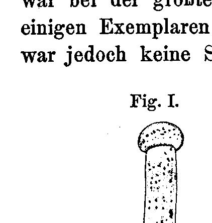
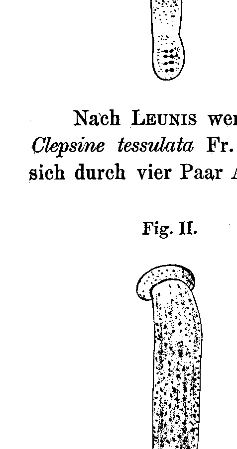
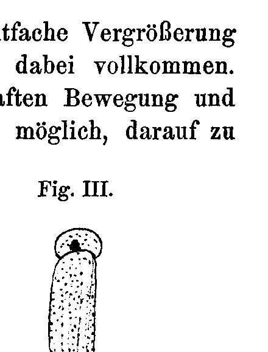
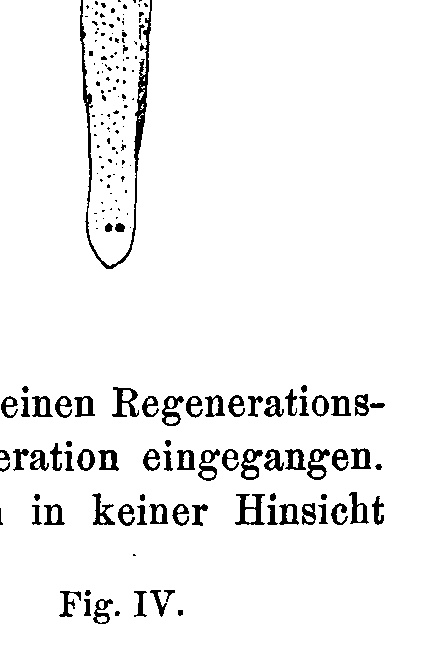

# Regeneration of the Anterior and Posterior End of Clepsine tessulata.

By

Theophil Bohdan Gluschkiewitsch.

(From the Biologische Versuchsanstalt in Vienna.)

With 4 figures in the text.

Received on 31 August 1907.

*Archiv für Entwicklungsmechanik der Organismen*, vol. 25 (1907).

> **Full translation.** A complete English rendering of the running text of “Regeneration of the Anterior and Posterior End of Clepsine tessulata” (Gluschkiewitsch, 1907), including all tables, figure and plate legends, and footnotes. Numbers and table cells were transcribed from the page images, not the noisy OCR.

There exist hitherto only very few and entirely negative data on the regenerative capacity of the snail-leeches [Schneckenegel] or *Clepsinen* [Nußbaum] and of the blood-leeches [Blutegel] or Hirudineans [Johnson, Loeb, Leuckart] in general. As a general view it holds that the capacity to regenerate both the posterior as well as the anterior end belongs to all Anneliden, with the exception of one single group, namely the Hirudineen. Nußbaum, for example, does indeed concede that the Anneliden — and namely both the Polychaeten and the Oligochaeten, and among the latter both the Terricolen and the Limicolen — are distinguished by a generally great regenerative capacity. But in the "so very closely related" animals, such as the Hirudineen, that physiological capacity is, in his opinion, almost not developed at all. This view seems to him to be confirmed by a series of experiments which he carried out on *Nephelis vulgaris*, *Aulastomum gulo*, and not more closely determined species of *Clepsine*. A great number of these worms he is said to have operated upon, and indeed in some he cut off several posterior, in others a few anterior segments, or else divided them into two halves through the middle of the body. Since the operated individuals quickly perished under the artificial conditions of the aquaria, he is said to have kept a great number of the operated worms in a clay vessel in flowing water, in a brook, and thus under nearly natural conditions. Under 2 &nbsp;&nbsp;Theophil Bohdan Gluschkiewitsch

such conditions the worms lived very well, but after 7 weeks the wound had not healed in the great majority; only in a few specimens of *Aulastomum* is it said to have closed; there was, however, no trace of an actual regeneration to be observed, no regeneration-bud formed. Loeb too reports that he kept blood-leeches, whose head had been cut off, alive for almost 1 year, without obtaining regenerates. That the animals can live so long, although they are incapable of taking up nourishment in the usual way, is also confirmed by other investigators. This is already almost all that I have been able to find in earlier works on the subject. I now wish to report briefly on my experimental object and my experiment.

**Fig. I.** *(figure not reproduced)*

According to Leunis, up to 20 species of *Clepsine* are distinguished. *Clepsine tessulata* Fr. Müll. (older nomenclature: *tessellata*) is distinguished by four pairs of eyes, which are arranged in two transverse rows, by a more or less dark-green back with several longitudinal rows of brownish-red or lighter spots, by a light belly, and by a colorless blood (in contrast to the red blood of the *Hirudo*). The rings are almost invisible. *Clepsine* belongs to those proboscis-leeches [Rüsselegeln] (Rhynchobdelliden) which devote great care to brood-care. They carry their eggs on the belly, and the young too [Fig. I] remain protected here for a long while, in that they attach themselves by suction with the posterior adhesive disc.

**Fig. II.** *(figure not reproduced)*

Small animals, 3—3½ mm long in the non-contracted state, which had not been too recently removed from the mother's body, I removed carefully with forceps and placed on a wide microscope slide. Now I had to let the animals creep about on the glass for a few moments and await their most possible complete stretching, in order at that moment to operate rapidly with

## Regeneration of the Anterior and Posterior End of Clepsine tessulata. &nbsp;&nbsp;3

a fine scalpel. The eightfold magnification of an ordinary dissecting magnifier was completely sufficient for me in this. Admittedly it was not always possible in this way, given the lively movement and strong contractility of the worms, to take care that always the same number of segments was removed; this, however, did not in the least impair the experiment itself. In 20 specimens the anterior end, and in 20 others the posterior end, was now cut off according to this manner of operating [Fig. II]. The amputated animals I kept in two glasses with clean water. After 23 days, among the individuals amputated at the anterior end, three complete and five incomplete [Fig. III] regenerates were to be seen. Two specimens were still living without any sign whatever of regeneration; the rest had perished, partly with small regeneration-buds, partly probably soon after the operation. The complete regenerates did not differ in any respect from the corresponding body-parts of normal animals. In the other glass I found only two incomplete regenerates [Fig. IV]; three specimens had

**Fig. III.** *(figure not reproduced)*

**Fig. IV.** *(figure not reproduced)*

perished without regeneration, seven with begun regeneration. Eight pieces lived with closed wound, without visible regeneration-traces. On the regenerates one could see fairly clearly that the part of the regenerated end that had grown forward most strongly lay perpendicular to the cut-surface, which is in accord with the regeneration-law of Barfurth. The cut-surface itself appears in side view as a somewhat curved line.

Let me be permitted to say something further about the attempts to explain the regenerative capacity of the Hirudineen, which, as mentioned above, has been assumed to be minimal. Weismann wishes to explain the greater 4 &nbsp;&nbsp;Theophil Bohdan Gluschkiewitsch

regenerative force of the *Lumbricus* (in relation to that of the *Clepsinen*) as a useful and expedient adaptation, by pointing out that "these animals have very many enemies and are very often injured." According to Weismann, the regenerative capacity is not (as according to Przibram and others) a fundamental, primary property, but a secondarily acquired one, an adaptation to the injurability of the organism — a capacity that belongs to the organism in differing measure, and indeed according to the degree and frequency of its injurability. But since it has been demonstrated by impeccable experiments of many investigators that the regenerative capacity stands in no direct relation to the probability of loss — for there also regenerate such organs whose loss in the struggle for existence occurs most rarely and which likewise show no autotomy — the Weismannian theory, at least as a sufficient principle of explanation, can no longer be upheld.

Nußbaum is of the opinion that it would be too daring to assert that our small Hirudinean species, e. g. *Nephelis* or *Clepsine*, are less exposed to persecutions than the Limicolen, and he attempts to ground the "striking difference" in the regenerative capacity of the Limicolen and the freshwater Hirudineen on "structural properties" of both animal groups. The skin of the Hirudineen, he says, is distinguished by an enormous abundance of deep-lying glands, which, as highly specialized elements, considerably reduce the proliferative capacity of the epidermis — that capacity which plays so important a role in the regenerative growth of other Anneliden. Secondly, the fibrous parenchyma that fills the body-cavity and is very strongly differentiated is, he says, especially resistant and tough, which, together with the great toughness, extensibility, and strength of the dermomuscular tube [Hautmuskelschlauch], on the one hand makes an injury of the body greatly more difficult, but on the other hand is supposed to diminish the proliferative capacity of the tissues. Although this hypothesis is far more satisfying than the first, it too, in view of our positive facts concerning the perfect regenerative capacity of the *Clepsine*, loses something of its justification for existence. — We thus see also in the theory of regeneration, a relatively narrow special field of natural-scientific observation, how hypotheses grow up everywhere where decisive facts are lacking, but how the hypothetical scaffolding becomes immediately dispensable as soon as even a single uncontested fact erects itself behind it.

## Regeneration of the Anterior and Posterior End of Clepsine tessulata. &nbsp;&nbsp;5

How can it be interpreted that the mentioned fact was overlooked and the regenerative capacity of the Hirudineen was set equal to zero? This may well rest on the fact that Nußbaum and the few other investigators who carried out the experiments in question used not young, but adult animals for the experiment, for from the phylogenetic position of the blood-leeches the previous results could not be understood. Since, given that the operated animals remained alive for weeks, indeed for months, mishandlings in the experimental method are not to be supposed, it can, as it seems, only have been the age of the experimental objects that exerted the unfavorable influence on the regenerative force. For it is well known that, e. g., young frog-larvae regenerate the legs, but it has also been established that this regenerative capacity quickly ceases as the larva grows up.

In later experiments I will accordingly take into account the following two points of view: 1) the influence of age on the regenerative force of my experimental animal, and 2) the histological constitution of the regenerated body-layers; while for the present I content myself with having filled, through the establishment of positive facts, a gap in the regeneration-experiments, and with having freed the Hirudineen from their position — exclusive with respect to regenerative capacity — relative to all other annelid groups.

### Experimental protocol [Versuchsprotokoll].

| Kind of operation [Art der Operation] | Number of specimens [Zahl der Exemplare] | Day of operation [Tag der Operation] | Checked on [Kontrolliert am] | Perished [Zugrunde gegangen] | Not regenerated [Nicht regeneriert] | Positive results [Positive Resultate] |
|---|---|---|---|---|---|---|
| Anterior end amputated [Vorderende amputiert] | 20 | 19. VI. 06 | 12. VII. 06 | 3 ohne, 7 mit Anfängen der Regeneration [3 without, 7 with beginnings of regeneration] | 2 | 3 vollständige, 5 unvollständige Regenerate [3 complete, 5 incomplete regenerates] |
| Posterior end amputated [Hinterende amputiert] | 20 | 19. VI. 06 | 12. VII. 06 | 3 ohne Regenerat. nach der Operat., 7 später, m. Spuren der Regeneration [3 without regenerate after the operation, 7 later, with traces of regeneration] | 8 | 2 unvollständige Regenerate [2 incomplete regenerates] |

# 6 &nbsp;Th. B. Gluschkiewitsch, Regeneration of the Anterior and Posterior End, etc.

## Bibliography [Literaturverzeichnis].

Barfurth. 1905. Regeneration und Involution. Ergebnisse d. Anat. u. Entwicklungsgesch. Bd. 15. S. 500—502.

Bürger, O. 1902. Weitere Beiträge zur Entwicklungsgeschichte der Hirudineen. Zeitschr. f. wiss. Zool. Bd. 72. S. 525.

Claus-Grobben. 1905. Lehrbuch der Zoologie. S. 387.

Grube, E. 1850. Die Familien der Anneliden. Arch. f. Naturgesch. S. 358—362.

Johnson, J. R. 1816. A treatise on the medical leech. Edinburgh.

Leuckart, R. 1869. Bericht über die Leistungen in der Naturgeschichte der niederen Tiere während der Jahre 1868 und 1869. Arch. f. Naturgesch. Bd. 35/II. S. 304.

Leunis, Joh. 1886. Synopsis der Tierkunde. Hannover. Bd. 2. § 1276.

Loeb, Jacques. 1906. Vorlesungen über die Dynamik der Lebenserscheinungen. Leipzig. S. 310.

Müller, Fr. 1844. Über Hirudo tessulata und marginalis O. F. Müll. Arch. f. Naturgesch. 10. Jahrg. S. 370—376.

Nußbaum, J. 1905. Vergleichende Regenerationsstudien. Zeitschr. f. wiss. Zool. Bd. 79. S. 295—297.

Przibram, H. 1904. Einleitung in die experimentelle Morphologie der Tiere. Wien. S. 81.

—— 1905. Versuche und Theorien über Regeneration. Centralbl. f. Physiol. Bd. 18.

Weismann, A. 1899. Tatsachen und Auslegungen in bezug auf Regeneration. Anat. Anz. Bd. 15. Nr. 23.

—— 1902. Vorträge über Descendenztheorie. Bd. II. S. 8, 12 u. 34.

Whitmann. 1878. Über die Embryologie von Clepsine. Zool. Anz. 1. Jahrg. S. 4—6.

## Figures

**Fig. I.**

**Fig. II.**

**Fig. III.**

**Fig. IV.**

---

*Translator's note.* One of the Biologische Versuchsanstalt (Vienna Vivarium) papers flagged on the project site as a modern rediscovery target. Claims are rendered as stated in the original, not endorsed.
