*(From the Biological Experimental Institute of the Academy of Sciences in Vienna, Zoological Division.)*

## DIE REGENERATION DER AM TIBIALRANDE ODER MEDIAN VERSTÜMMELTEN BEINE BEI TRITON CRISTATUS LAUR. UND EINE HETEROMORPHOSE DES LANGEN KNOCHENS NACH AUSSCHNEIDUNG DES FIBULARRANDES.

## REGENERATION OF THE LEGS MUTILATED AT THE TIBIAL EDGE OR MEDIALLY IN TRITON CRISTATUS LAUR. AND A HETEROMORPHOSIS OF THE LONG BONE AFTER EXCISION OF THE FIBULAR EDGE.

By

IGINO SCIACCHITANO, PAUL WEISS and HANS PRZIBRAM¹.

With 37 text figures.

*(Received on 22 July 1929.)*

*Wilhelm Roux' Archiv für Entwicklungsmechanik der Organismen*, vol. 122 (1930).

> **Full translation.** A complete English rendering of the running text of “Regeneration of the Tibially or Medially Mutilated Legs in Triton cristatus” (Sciacchitano, Weiss, Przibram, 1930), including all tables, figure and plate legends, and footnotes. Numbers and table cells were transcribed from the page images, not the noisy OCR.

### Table of Contents

| | Page |
|---|---|
| Statement of the problem (Fragestellung) | 300 |
| Technical (Technisches) | 301 |
| Findings and theoretical (Befunde und Theoretisches) | 304 |
| Summary of the main results (Zusammenfassung der Hauptergebnisse) | 314 |
| Literature references (Literaturhinweise) | 315 |

### Statement of the problem.

While the mirror-image regeneration from the proximally facing wound surfaces in amphibians is beyond question, it has experimentally not yet succeeded in enforcing the lateral mirror-imaging out of longitudinal cuts. To be sure, reduplications through splitting — for example of a regeneration blastema — have repeatedly been achieved in the urodeles, thus by TORNIER, but the proof of the mirror-image symmetry of the bone arrangement was not furnished. According to the more recent investigations of MILOJEVIĆ, the median splitting of the blastema leads not to a mirror-image, but to a parallel-equiasymmetric [parallel-gleichasymmetrisch] form, and the same showed itself in the experiments of SWETT on the front extremity of *Axolotl* embryos, corresponding to the scheme which was given in the 2nd volume of the Experimentalzoologie (PRZIBRAM 1909, Plate XV, 3 f). On the other hand there exist the natural findings in man, which exhibit a symmetric formation of doubled hands or feet, and indeed always around the radial edge. Recently described especially clearly by WEIL from the Breslau clinic.

> ¹ A preliminary communication under the same title appeared as No. 152 from the Biol. Versuchsanst. (Zool. Abt., Head H. PRZIBRAM) in the Akad. Anz., No. 17. Vienna 4. VII. 1929.

Similar formations appeared repeatedly in transplantations of embryonic limb anlagen in *Triton* (literature in PRZIBRAM 1929 VI).

The theoretical interpretation which PRZIBRAM attempted in the "triple-formation-at-the-break" ["Bruchdreifachbildung"] (p. 394), and which was assumed by WEIL as the only fitting one, namely that upon extinction of the radial potency ulnar mirror-images result, does not release us from the obligation to seek experimental proofs for the mirror-image reversal out of a longitudinal wound. In earlier experiments by PAUL WEISS (1924) no indications for such a possibility had emerged; out of longer wounds which were produced by splitting at the extremities of *Tritonen*, no natural "tension association" ["Spannungsverband"]-forming toe groups, but merely individual single toes projecting laterally next to one another had formed. Also the removal of split halves at various heights had indeed occasionally let a whole foot grow out from a cross-cut, but never two mirror-image symmetric ones growing out next to each other (WEISS 1926).

For the further pursuit of this problem, further series of experiments on the rearward-bred crested newts, *Triton cristatus* LAUR., were set up at the Biological Experimental Institute in Vienna under the direction of HANS PRZIBRAM by WEISS (now in Berlin-Dahlem), ABOLIN (from Riga) and SCIACCHITANO (at that time Cagliari, now Modena).

Before it came to the complete answering of the posed question, the named gentlemen had to leave our institute. It thus only remained to publish the results achieved so far, just as they stand, so as not to let the interesting cases contained therein be lost.

The experiments with removal of radially situated parts of the extremity by excision either of the parts embracing the fibula, or of the fifth toe with or without the appurtenant tarsale, or simultaneously of all these regions, ABOLIN reported on in the preceding work himself. The analogous experiments with operation of the tibial edge and also the excision of median portions had SCIACCHITANO taken over. The experiments of WEISS comprised cases for fibular and tibial edge. These have in part already been published in his work of 1924. These experiments of SCIACCHITANO and WEISS are here compiled and written down using the protocols and illustrations handed over by both, by PRZIBRAM.

### Technical.

Ether narcosis or chloretone bath, scalpel and eye scissors. For keeping and care see the preceding work by LEO ABOLIN on the same object and the earlier works by PAUL WEISS. In SCIACCHITANO's experiments the *right* hind leg was always operated upon.

**Fig. 1.** a Normal skeleton, b—s Schemata of the operations, the removed part hatched.  *(figure not reproduced)*

Legend key:
- *t* tibiale,
- *i* intermediale,
- *f* fibulare,
- *c* centrale.
- *I—IV* Tarsalia second. ord. [tarsalia of the second order]
- *1—5* phalangia.

*(continuation of Fig. 1; figure not reproduced)*

### Findings and theoretical.

For the avoidance of repetitions, the operation types together with the theoretical expectation and the resulting outcomes will be treated one after another (Fig. 1, a—s).

a) Normal, unoperated *Tritonen*. Neither among the present experiments nor on other animals available in the institute did natural multiple-formations or heteromorphoses come to observation. (Probably the toe-doubling described by BURCHARDT, see this number, in a transplantation specimen also arose only in connection with this operation.) A primary inclination toward such malformations is therefore not to be assumed in our material. Tibia and fibula (Fig. 1) are to be distinguished by their characteristic contours both in the X-ray image and in the split-wood preparation, easily from one another by preparing-out. That holds also for all those cases in which operations on neighboring or more distantly situated parts of the foot were carried out, for which the drawings of ABOLIN furnish numerous documents. The forms of the fibula and tibia are also schematically represented in the work of FLATS incorporated into this number.

b) Excision of the tibial region by two cuts running perpendicular to the longitudinal axis of the limb, which basally leave the upper leg, apically the tibiale, behind uninjured. To be expected is, according to our theoretical conceptions about the potencies of the leg regions, that — in the case of no more rapid filling-out or scarring-over of the wound —, on the basal, distally facing, "distant" (see PRZIBRAM 1927, p. 421) wound surface the repetition of the lower leg and foot with correct asymmetry, but from the apical, that is proximally facing, "proximant" wound surface a reversely oriented, inversely-asymmetric foot ought to grow.

Of 10 animals from the experiments belonging here by SCIACCHITANO, after 2 months one had died (No. 8), six showed muscle regeneration and smooth healing without multiple-formation (Nos. 1, 4—7, 10), two specimens bore supernumerary feet at the knee (Nos. 3, 9), the last (No. 2) a two-toed foot — directed oppositely both from the knee and from the carpus the one from the knee. Symmetry relationships are no longer recognizable.

c) Removal of the first toe together with its tarsale I by a transverse and a longitudinal cut. To be expected is, owing to the absence of a proximant wound surface, simple regeneration of the toe.

Among 10 animals of SCIACCHITANO, in 3 cases no regeneration occurred, but scarring-over (Nos. 5, 6, 10), in 2 cases the beginning of the simple regeneration could be (Nos. 4, 9), in a further 4 cases (Nos. 1, 2, 3, 8)

regular replacement, in the last finally (No. 7) an increase of toes be ascertained. In place of one lost one, two adjacent toes were present. From the experimental protocol it emerges that 18 days after the removal of the 1st toe the 2nd toe had degenerated. Thus probably its tarsale II too had been affected by the operation. The superregeneration can be regarded as a consequence of this more complicated wounding (Fig. 2). The series t₁ of WEISS agreeing with c in the operation type offered just as little worth noting.

d) The regions individually removed in b and c were removed in 10 *Tritonen* jointly by a basal cut below the knee and a curved longitudinal cut. Owing to the absence of a proximant wound surface no reversely directed, supernumerary formation was to be expected, yet owing to the long longitudinal wound lateral supernumerary toes, as WEISS had described them.

**Fig. 2.** *Triton* No. 7; **Fig. 3.** No. 248; **Fig. 4.** No. 191; **Fig. 5.** No. 246; **Fig. 6.** No. 0; **Fig. 7.** No. 140.  *(figures not reproduced)*

The result is, apart from one death case (No. 10), in one case scarring-over (No. 4), in one case one toe laterally on the tarsus (No. 8), in five cases two toes laterally one behind the other, partly fused (Nos. 1—3, 5, 6), in one case three toes growing out from the knee (No. 7), finally in the last (No. 9) two toes fusing with one another after the disappearance of the second toe regeneration. Evidently in this case, similarly as with c₇, the tarsale II has been cut into.

d') Although deviating only by a slight deviation in the conduct of the cut from SCIACCHITANO's series d, WEISS' series T₁, which he himself already published in 1924, must nevertheless be treated separately. I therefore conclude this from d': the tibial edge was likewise cut off from the knee up to and including the first finger, but here the longitudinal cut first parallel to the longitudinal axis up to the tarsus, from there however at an obtuse angle straight-line against the depression between the 1st and 2nd toe continued. In this way there are therefore present, in place of two now three wound surfaces. Of these, the third indeed does not face straight ahead, but yet obliquely against the proximal end of the lower leg. We therefore expect from here too a middle component of a triple-formation-at-the-break. Of 26 operated newts, 19 after 2—3 months showed no regeneration (Nos. 141—156, 188—190, 247). In three animals a regeneration bud had grown out from the knee in toe-form (Nos. 248, Fig. 3; 191, Fig. 4; 246, Fig. 5), in two at the carpal wound 2 toes each (Nos. 0, Fig. 6; 140, Fig. 7). Two specimens showed regenerates at both places, namely two toes each (Nos. 218, 219). In these, the position of the tarsal group is decidedly mirror-image with respect to the normal toes 2 and 3, the knee group arranged in parallel and all toes lie almost in one plane: the BATESONian rules are thus fulfilled. Regrettably, however, the toes are not recognizable as definite ones and therefore further interpretation is excluded. Whether with the toes it is merely a matter of individual formations, as WEISS (1924, p. 404, Plate I, Figs. 1 and 2) describes, or of the beginning of a mirror-image doubling, likewise cannot be decided owing to the lack of the sufficient investigation of the tarsus.

e) After removal of the 1st toe without appurtenant tarsale we shall expect the unchanged simple return of the same. It occurred in all 10 specimens of SCIACCHITANO after this operation (Nos. 1—10).

f) The combination of operations b and e, namely the separated removal of the tibia and 1st toe by the carpus remaining in place, ought, after regeneration of the latter, to yield mirror-image regenerates from the tibial wounds. Three newts died prematurely (Nos. 2, 4, 9), two showed merely scarring-over (Nos. 2, 5), one a regeneration-beginning at the knee (No. 10), in two further ones the tibia healed and regenerated, but not the 1st toe (Nos. 6, 7). In one case the beginning of the tibial and the 1st toe regeneration occurred (No. 3). Finally there was one case of toe regeneration in distal direction out of the knee height, merely a peg, and proximant out of the tarsal height with 2 toes to be noted (Nos. 8, Fig. 8).

g) Excision of the middle toe without injury of the tarsale III lets unchanged simple regeneration be expected. It occurred in 9 cases (Nos. 1—2, 4—10) out of 10. In one newt a double toe developed, which separated more and more. It is probably surely a matter of an inadvertent cutting-into of the tarsale III; the case therefore belongs to the following series h.

h) In this series the middle toe was again removed, but in addition a deeper incision was carried out through the wound toward the knee in the longitudinal axis. To be expected was, given sufficiently long gaping of the wound, the appearance of double-formations, in that each half had to have the striving to grow up into a whole foot. One animal died early (No. 2), one brought it only to the rudiment of regeneration (No. 9), five animals welded the split wound completely shut and regenerated a single toe (Nos. 4—7, 10), three newts finally produced on both sides of the incision one toe each (Nos. 1, Fig. 9; 3, 8, Fig. 10). Shedding of non-operated toes adjoining the wound did occur. They regenerated again.

---

**Translation notes (for the calling script, not part of the rendered Markdown):**

- Page-to-image mapping: image files p001–p008 correspond to printed pages 300–307 (p007 header = "306", p008 header = "307"). Image files p001–p007 are the owned/authoritative pages; p008 (printed page 307) is cover-only.
- Pages 1–7 fully translated. The paragraph "h)" that begins on p.7 finishes onto p.8 (printed 307), ending "...They regenerated again." The next paragraph "i)" ("Wir haben das Auftreten von Mehrfachbildungen…") begins on p.8 and is outside the assigned range, so it is not translated.
- Front matter (bracketed institute line, full German title + English rendering, authors, "With 37 text figures", received date, Table of Contents) translated faithfully.
- Figures are not reproduced; all captions/legends translated: Fig. 1 caption + its key (t/i/f/c, I–IV, 1–5), Fig. 2–7 caption block. The Fig. 8–10 caption block (Abb. 8. Triton Nr. 8; Abb. 9. Triton Nr. 1; Abb. 10. Triton Nr. 8) sits on p.8 (page 307) and is therefore not rendered; the inline references (Fig. 8/9/10) within the f) and h) paragraphs are preserved.
- Period terms preserved with German in brackets where load-bearing: "Bruchdreifachbildung" (triple-formation-at-the-break), "Spannungsverband" (tension association), "parallel-gleichasymmetrisch" (parallel-equiasymmetric), "distant"/"proximant" wound surfaces, BATESONian rules.
- *Triton cristatus* kept as printed; running text "*Tritonen*"/"*Triton*" preserved in italics.
- Author surnames printed in small caps rendered in normal case.
- Footnote 1 (p.1) placed after its paragraph per the "> ¹" convention.

Source page images at: `/Users/eranhorowitz/Documents/Claude/Projects/BVA/translations_full/_work/img/94_SciacchitanoWeissPrzibram_1930_Triton-leg-regeneration/p001.png` through `p008.png`.

> *[Continuation of section h), which began on p. 306. This is the tail of a paragraph carried over from the preceding (non-owned) page.]*

…tion (Nr. 9); five animals welded the cleft wound completely shut and regenerated a single digit (Nr. 4–7, 10); three newts, finally, produced

> Of the figures (Abb. 8–10, see below): **Abb. 8.** *Triton* Nr. 8.  **Abb. 9.** *Triton* Nr. 1.  **Abb. 10.** *Triton* Nr. 8.  *(figures not reproduced)*

We must expect here the appearance of multiple formations as a consequence of the surfaces lying at the knee as well as at the middle tarsus and separated by a longitudinal wound — but not the picture of the triple bifurcation (Bruchdreifachbildung), since a proximal wound surface is indeed lacking. In the 10 animals subjected to this operation it nowhere came to a restoration of the original form. Only from the tarsus, or from the apical end of the tibia, did regeneration of digits occur in 4 cases, but these stood more laterally apart than the normal "tension association" (*Weiss*).

It would correspond [to expectation]. In one of these cases (Nr. 10, Abb. 11) the two inner regenerated digits were fused; in another (Nr. 9, Abb. 12) the innermost was split; in one the 2nd digit had fallen off and was no longer regenerated (Nr. 3); in one, 3 digits were strongly deflected laterally (Nr. 7); in the last (Nr. 5) the 3rd digit was regenerated and, in addition, five digits had grown out of the tibial end. In 5 cases it came to regenerates both at the tip and at the knee of the leg. Here too the regenerated digits of the apical regeneration focus stood more laterally than normal, while the regenerate growing forward from the knee was approximately parallel to the long axis of the extremity. One digit from each focus was formed by Nr. 2 (Abb. 13), whereby the two

> **Abb. 11.** *Triton* Nr. 10; **Abb. 12.** Nr. 9; **Abb. 13.** Nr. 2; **Abb. 14.** Nr. 4; **Abb. 15.** Nr. 8; **Abb. 16.** Nr. 229.  *(figures not reproduced)* digits were laid next to one another. More strongly separated remained the digits in Nr. 1, which moreover cast off the 2nd digit and regenerated it along with the rest. Nr. 4 (Abb. 14) formed 3 digits from the tarsus, a broad forward outgrowth from the fibular edge of the knee. From the knee, 3 digits; apically, 2 fused digits were produced by Nr. 8 (Abb. 15). In the last case (Nr. 6) there grew apically first five, then three more, and from the knee two digits.

i') Very similar to operation-type i is the series designated F₂ in the protocol of *Weiss* (see 1924). The difference lies only in that, for the removal of the middle digit, not an angular excision but a single curved cut was used, which at Tarsale II could produce a somewhat proximal wound surface and therefore could lead to triple bifurcation (Bruchdreifachbildung).

> **Abb. 17.** Roentgenography of *Triton* Nr. 229.  *(figure not reproduced)*

Of 19 specimens only one could be followed up to regeneration. This one (Nr. 229) survived the operation 150 days. A regeneration cone came from the base of Tarsale II, two further cones emerging beneath it and more laterally (Abb. 16). The roentgenography (Abb. 17) of the conserved animal shows a further development of the lower-standing digit group and reveals, standing above it, 3 digit-regenerates, of which, however, the lowest may, by its breadth and form, consist of two fused digits. Of an ossification of the regenerate there is only at one place anything to be seen, and indeed it is a matter of a small but, by its form, distinctly recognizable fibula deposited at the right place and with the right symmetry. To this is joined the lower digit-regenerate group, which had grown into a five-digited foot, while the other regenerates, by their position and direction, derive from the cut-into tarsus (whereby the broadened lowest digit of this group could correspond to a fusion with a proximal regenerate).

j) The operation-type analogous to i, but with removal not of the tibial but of the fibular half, would on the basis of this analogy lead one to expect analogous results too. The 10 newts of *Sciacchitano*, however, show an essentially stronger tendency toward multiplication of the digits than in the earlier case. Apart from one case (Nr. 2), in which it did not even come to the formation of 3 but only of 2 digits, and from two (Nr. 4, 5) with normal restoration of the five-digited foot, crowded digit bundles are throughout to be noted. In 4 cases (Nr. 7–10) it is a matter of a group of 4 digits, which, however, do not attach themselves closely to the old ones but apparently, sprouting from the fibular edge, stand symmetrically to them. In a further 3 cases, regenerates sprouted from the tarsus and from the fibular edge and delivered digits from both places. In the case Nr. 6 (Abb. 18) the digits that remained standing appear doubled in mirror-image, and over these regenerates 3 digits push forward from the lower-standing focus. In a second case (Nr. 3) it looks as though the 3rd digit had regenerated, then 3 more had been produced in mirror-image to this normally placed 3-digit stock, and finally two further fibular-derived ones had been pushed on top (Abb. 19). In the last case (Nr. 1) there

> **Abb. 18.** *Triton* Nr. 6; **Abb. 19.** Nr. 3; **Abb. 20.** Nr. 1; **Abb. 21.** Nr. 234; **Abb. 22.** Nr. 204; **Abb. 23.** Nr. 231; **Abb. 24.** Nr. 232.  *(figures not reproduced)*

grew first from the tarsus two digits symmetrical to those that had remained standing, later from the fibular edge further down up to 6 digits, the last of which does not lie in one plane with the others (Abb. 20).

j') Just as *Weiss*' operation-type F₂ stands to *Sciacchitano*'s i, so the former's T₃ (1924) stands to the latter's j. Under j' we therefore discuss the removal of the tibial longitudinal half including the middle digit by a curved cut, which at Tarsus IV could produce an obliquely proximal cut surface and therefore could give occasion for triple bifurcation. Of 19 newts of this group, 7 yielded results. In one, after the falling-off of digits 4 and 5, it came merely to their re-budding without further regeneration (Nr. 234, Abb. 21). In two cases (Nr. 204, Abb. 22; 231, Abb. 23) an internally symmetrical four-digited foot came about, but in 231 it stands only at the tibial half and would presumably, after the falling-off of the still-retained digits 4 and 5, have come about. Likewise it seems, according to *Weiss*, to behave so with Nr. 232 (Abb. 24), where a five-digited foot appears over the tibial half, to which in another plane (plantar) a single digit attaches itself on the fibular side. The 5 digits over the tibial side, however, do not give the impression of a normal association. In two further cases, laterally from the tarsus one digit and, tibial-distal, two (Nr. 230), respectively three (Nr. 233) digits had grown, the former of which sought to crowd out the latter. Finally, in Nr. 198 (Abb. 25) a larger number of digits had sprouted, proceeding from three different places. They present, 166 days after the operation, the following picture: Two small digits standing nearest to the fibular edge can be regarded as regeneration of digits 5 and 4. Then follows a group of 5 digits, the fourth of which is split at the end and which could represent a whole foot, from which, still in the plantar direction and directed laterally toward the rear, a small four-digited foot grows.

k) The removal of the middle digit together with the belonging tarsal parts, by two longitudinal cuts and one transverse cut, leads one to expect unchanged regeneration. Of 10 newts of *Sciacchitano*, within the two-month observation period — apart from two that died in the meantime (Nr. 8, 9) — two attained only scar formation (Nr. 2, 3, 7), one a regeneration bud (Nr. 1), four a restoration (Nr. 4–6, 10).

l) With the removal of the middle digit together with Tarsale III, an incision separating the tibia from the fibula was combined, proceeding from the wound site. This group l therefore relates to k as i to g. To be expected is the appearance of supernumerary formations, if the cleft remains open long enough. One newt died (Nr. 3). In 4 of 10 cases (Nr. 1, 2, 9, 10) only scar formation occurred; in one, after 2 months a knob could be felt under the skin (Nr. 4), which later grew out into a normal middle digit; three welded completely and regenerated a single digit (Nr. 6–8); the last (Nr. 5) split the leg further and from the knee two digits emerged.

m) After the splitting of the lower leg as in l, in 10 other newts the fibular half was removed by a transverse cut just below the knee. There thus remain standing the tibial half with digits 1 and 2. We shall expect distal regeneration eventually from the two cut-into levels, but, lacking a proximal surface, no triple bifurcation. Apart from 1 death (Nr. 1), 1 newt had only scar formation (Nr. 7), 2 newts (Nr. 3, 6) only 2 digits, others regenerated 3, whereby two fused (Nr. 4) or one split at the end (Nr. 2); furthermore, 4 had multiple formations.

In Nr. 9 there emerged at the tarsus 2 digits, further up already beforehand two digits, and afterwards still further up once again a digit (Abb. 26).

> **Abb. 25.** Nr. 198; **Abb. 26.** Nr. 9.  *(figures not reproduced)* Nr. 10 gradually showed 6, of which 4 were surely to be regarded as distal regenerate from a more basal level. Nr. 5 regenerated the 3rd digit, then a more laterally standing one, and Nr. 4 a foot-forming digit from a more basal level. Nr. 8 attained, besides the supplementation of the normal foot, eight further supernumerary digits, of which, however, three did not lie in the same plane, [growing] from the more basal level.

n) Instead of the fibular half as in m, here the tibial half was removed, after the same preceding operation. Thus m relates to n as i to j. To be expected are lateral and distal regenerates from various levels. Two newts of 10 (Nr. 1, 3) died prematurely. The digits were brought to the normal number 5 in 5 cases (Nr. 4 to 8), though in this surely there always took part components pushing in from further above, not merely regenerates sprouting laterally from the tarsus (Nr. 7, Abb. 27). In 3 cases supernumerary digits appeared, one (Nr. 2, 10) or five (Nr. 9), of which the latter form a small foot over the fibular side, while a 1st digit on the main foot had not come to formation.

o) Among the experiments of *Weiss* (1924) there were still further operation-variants. Designated F₂ in his protocol was the

> **Abb. 27.** *Triton* Nr. 7; **Abb. 28.** Nr. 130; **Abb. 29.** Nr. 181; **Abb. 30.** Nr. 187; **Abb. 31.** Nr. 184; **Abb. 32.** Nr. 250; **Abb. 33.** Nr. 220; **Abb. 34.** Nr. r t₂.  *(figures not reproduced)*

removal of the fibular side of the lower leg together with the two digits 5 and 4 by a single somewhat curved cut, which therefore also struck the belonging tarsal bones partly obliquely and removed them along with the rest. Consequently the expectation: triple bifurcation. Of 16 animals, 7 yielded results. One specimen showed, 85 days after the operation, only regeneration of 3 digits from the knee (Nr. 180, Abb. 28). The others reveal regeneration laterally from the tarsus too. The following combinations are represented:

From the knee 1, from the tarsus 4 digits (Nr. 225); from the knee 2, tarsus 3 (Nr. 181, Abb. 29) or 4 (Nr. 187, Abb. 30) digits; from the knee 3, tarsus 6 digits (Nr. B); from the knee 4, tarsus 3 (Nr. 184, Abb. 31) or 4 digits (Nr. A, 226). These newts had lived 73–122 days after the operation, without the differing time having exerted any essential influence on the number or distribution of the digits. The diagnosis of the designation and position of the individual digits is impossible without the exact examination of the bones, which is not available to me.

p) Operation-type analogous to that in q, but removal of the tibial side with digits 1 and 2 (T₂ after *Weiss* 1928), instead of the fibular with 5 and 4. Analogous expectation: of 19 animals, 3 results. Nr. 167 bears, after 67 days of observation, a tibial regeneration ridge running from the knee and swelling beside the tarsus. Nr. 250 has lost the normal foot-digits and, after 51 days, laid down a three-pronged regenerate tibially from the knee (Abb. 32). Nr. 220 has, after 55 days, two digits laterally of the tarsus, and on a ridge running tibially from the knee has formed 2 digits (Abb. 33).

q) As f₂ there are found in *Weiss* experiments analogous to operation-type o, but with retention of the fibula, and

r) as t₂ experiments analogous to operation-type q, with retention of the tibia. The foot was regenerated unchanged (Abb. 34, specimen r t₂).

s) The last operation-series to be discussed, designated F₁ by *Weiss* (1924), is in principle identical with the operation D of *Abolin* (see the preceding work). It is a matter of the removal of the fibular edge including the 5th digit. Since between this and the 4th digit an oblique, straight cut was made up to the median plane of the leg, and from there a similar one between tibia and fibula up to the knee, whereupon the outlined piece was completely severed at that place by a transverse cut, we have to expect, from the oblique, proximal wound, a mirror-image doubling of the foot (with omission of the 1st digit) and a forward growth of a correctly asymmetrical foot from the knee. The occurrence of such an arrangement reminiscent of the "triple bifurcation" is clearly to be seen from the experiments of *Abolin*. The 6 newts of *Weiss*' F₁ that remained alive long enough among the 17 specimens likewise showed

> **Abb. 35.** Nr. 168; **Abb. 36.** Nr. 172.  *(figures not reproduced)* regeneration both laterally of the tarsus and from the knee, with the exception of Nr. 168, in which five digits sprouted from the knee region, but the digits that had remained standing afterwards degenerated, without any growing afresh laterally of these either (Abb. 35). Three newts (Nr. 172, Abb. 36; 176 and 223) had each formed 4 digits at the knee-regeneration site and one laterally of the tarsus. Almost the same picture, perhaps augmented by a second lateral digit fused with the fourth of the mentioned digits, is offered by Nr. 170 (Abb. 37). This *Triton* lived 247 days after the operation and could therefore be drawn upon for roentgenography, which is able to reproduce the bones well only after about ¾ year. Now it shows itself with all desirable distinctness that the four- or five-

> **Abb. 37.** Roentgenogram of *Triton* Nr. 170.  *(figure not reproduced)*

digited foot regenerated from the knee wound springs not from a fibula but from a second tibia — one that, while not yet reaching the normal length, is otherwise well formed and probably mirror-image symmetrical to it. This is apparently the first case that has become known in which, after removal of one of the long lower-leg bones, the other actually grew, and indeed apparently in mirror-image. As I have already remarked apropos of the work of *Abolin*, most of his sketches made from cleared-bone (Spalteholz) preparations point to an abnormal regeneration of the fibula, which in its form is more or less approximated to the tibia. New investigations will therefore be undertaken, following the pointers obtained through the present experimental series, to elucidate the conditions under which such heteromorphoses on long extremity bones come about, and in what relations their symmetry stands to the normal.

## Summary of the principal results.

1. The tibia, excised together with the whole tibial region, of mature *Triton cristatus* was, at least within 2 months (autumn), not regenerated.

2. Feet with digits arose as distal regenerates, after excision of the tibia and the surrounding soft parts, from transverse wound surfaces at the knee.

3. In place of the tibia, no other zeugopodial element appeared.

4. Mirror-image doubling to the side did not occur at the fibula; the lateral digits appearing at the fibular end are mostly not interpretable as definite foot parts, their symmetry being uncertain.

5. Distal regenerates from a transverse knee wound mostly had fewer digits than the digit groups appearing, after the same operations, laterally of the longitudinal tarsus wound.

6. With simple, transverse removal of one or two digits, their regeneration occurred without deviation from the normal shape.

7. Typical triple bifurcations could be produced experimentally at the zeugopodium and at the tarsus by excision of corresponding parts of the tibial edge.

8. Whereas simple, transverse basal removal of the middle digit leads to its unchanged regeneration, a doubling of the digit occurs if, in addition, a deep splitting of the transverse wound, eventually reaching into the zeugopodium, was carried out.

9. With the combination of the deep splitting with the removal of one of the longitudinal halves thereby separated, it came to the formation of lateral foot parts at the tarsus and to distal regenerates from the knee wound.

10. From these, as well as from the analogous experimental series with excision of the fibular edge treated in the preceding series of experiments by *Abolin*, it follows generally that the symmetry of the triple bifurcation appears according to *Bateson*'s rules whenever between two distally growing surfaces a proximally directed wound surface is interposed, but otherwise not. These cases therefore all correspond to the theoretical expectation.

11. Important for the assessment of the symmetry of laterally developing leg sprouts is a case from the experiments of *Weiss*, in which doubtless, after excision of the fibular edge including the 5th digit, in place of the fibula a tibia had developed, apparently in mirror-image to the old one.

12. Therewith the occurrence of such regenerative doubling, which moreover comprised the middle foot and digits, is established; in which direction, by the way, the drawings given by *Abolin* of long bones regenerated in place of the excised fibula may also be interpreted.

---

### Literature references.

**Abolins, L.:** Die Regeneration der am Fibularrande verstümmelten Beine bei *Triton cristatus* Laur. Roux' Arch. dieses Heft (1930). — **Burchardt, H.:** Die Regeneration und Symmetrie quer durch den Körper gesteckter Urodelenextremitäten. Ebenda dieses Heft (1930). — **Przibram, H.:** Experimentalzoologie. Bd. II: Regeneration. Leipzig u. Wien: F. Deuticke 1909. — Experimentalzoologie. Bd. VI: Zoonomie. Ebenda 1929.

## Figures

**Fig. 1.**

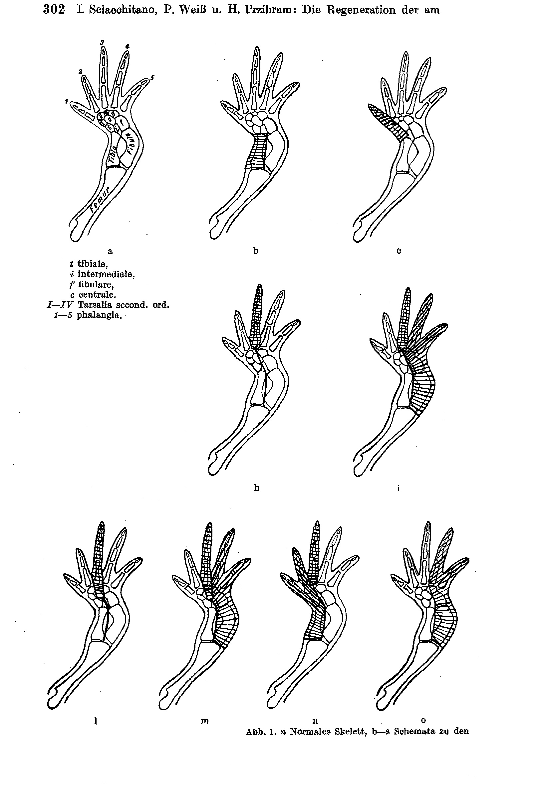

**Fig. 1 (2)**

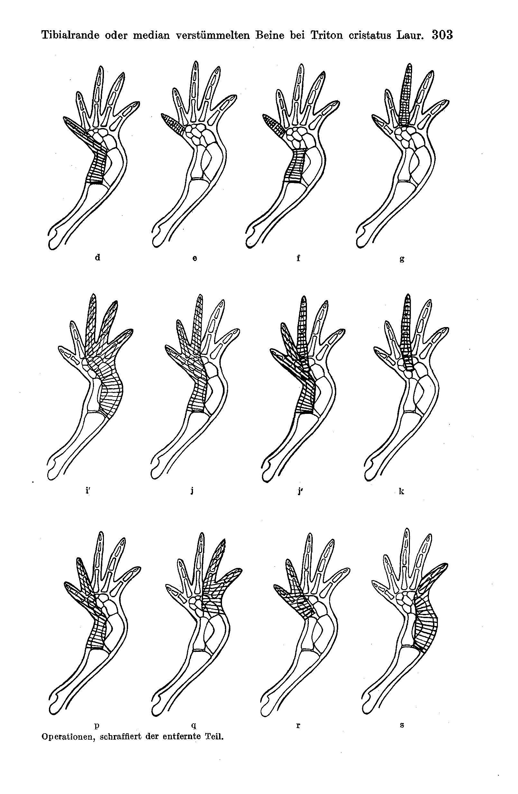

**Fig. 2–7.**

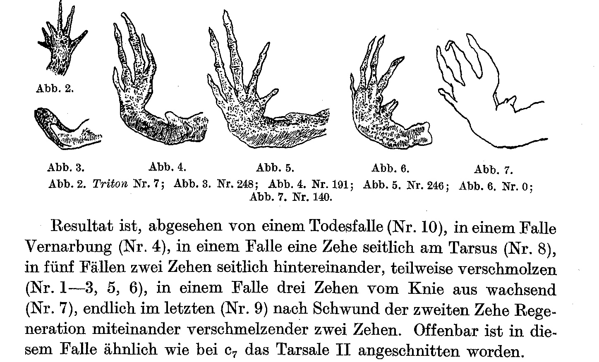

**Fig. 8–12.**

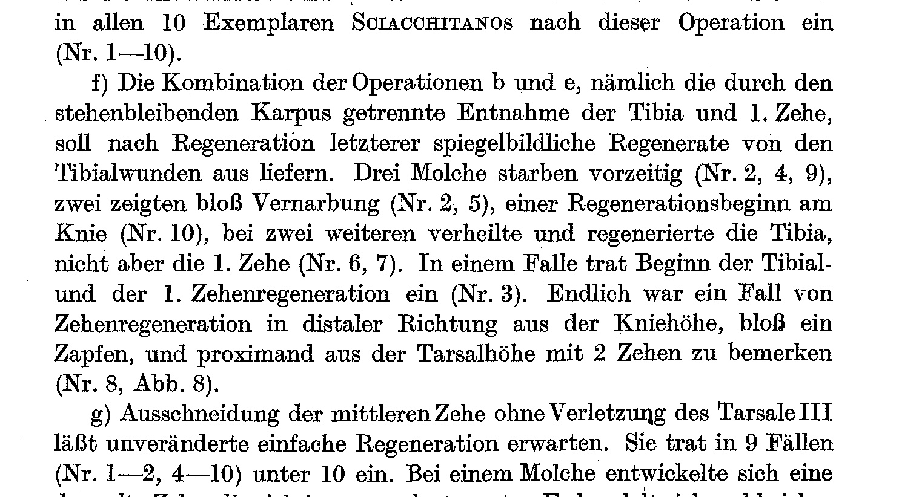

**Fig. 13–17.**

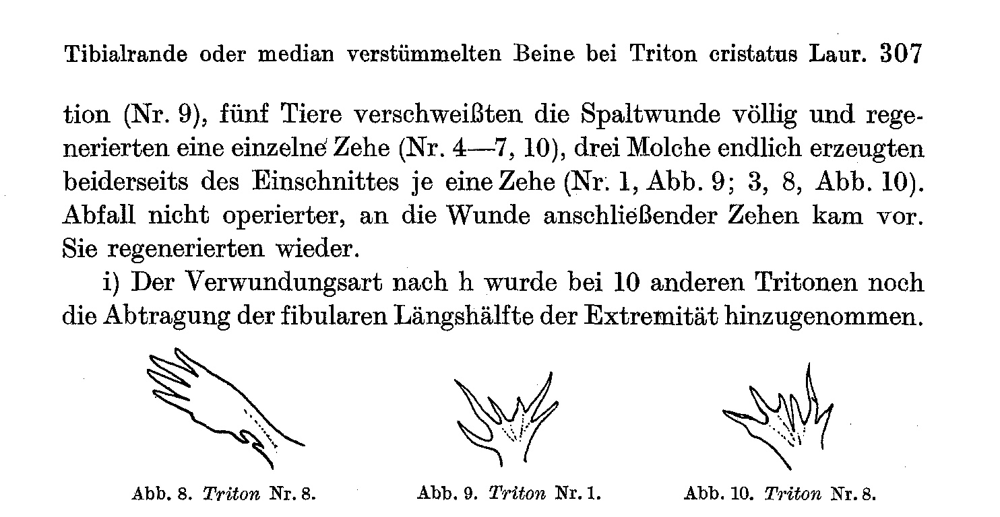

**Fig. 18–19.**

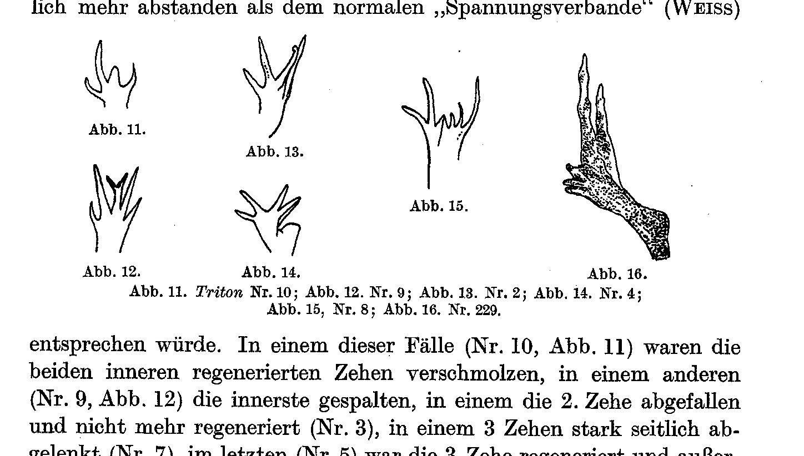

**Fig. 17.**

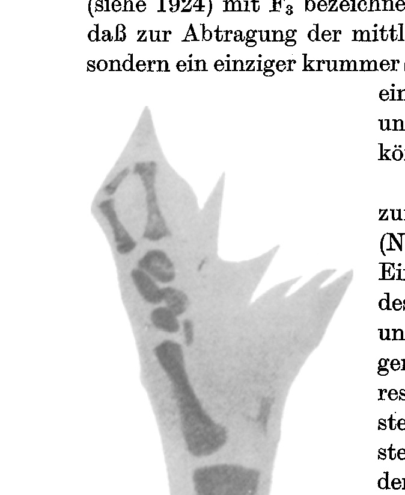

**Fig. 18–22.**

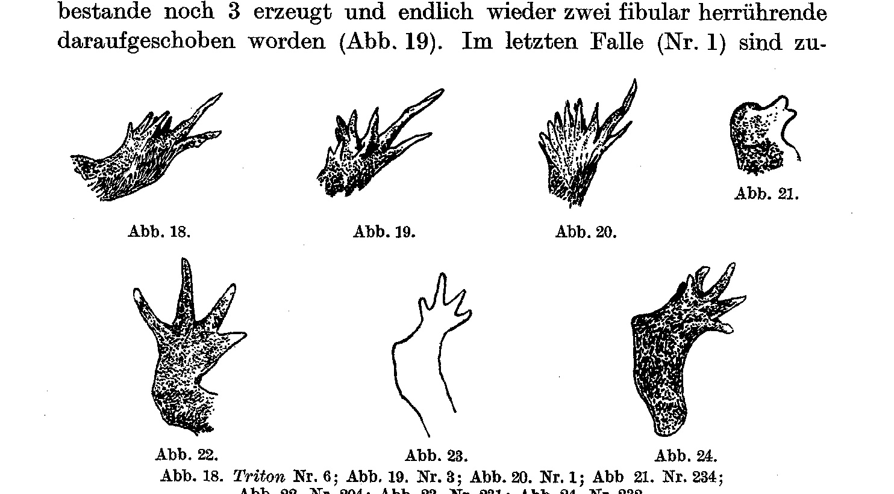

**Fig. 25–26.**

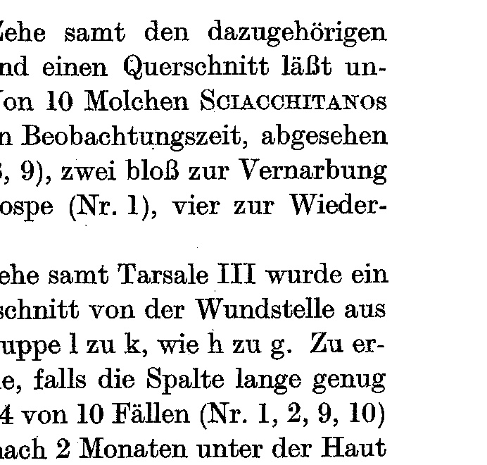

**Fig. 27–33.**

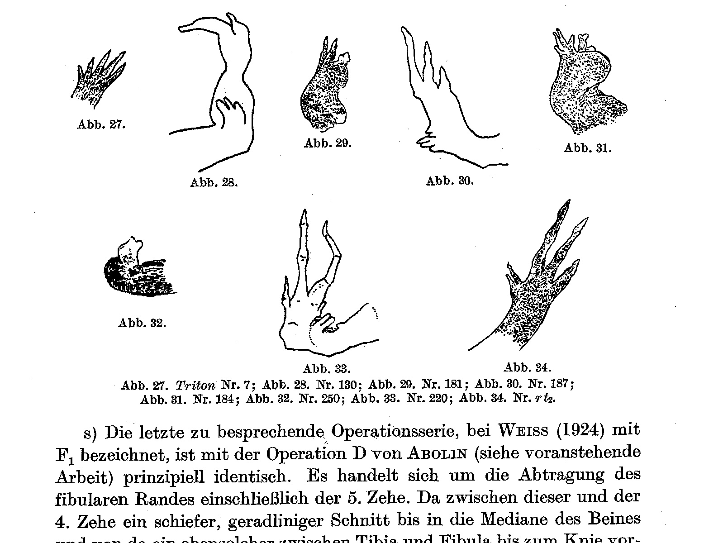

**Fig. 34–35.**

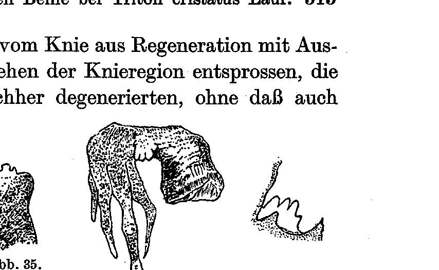

**Fig. 36.**

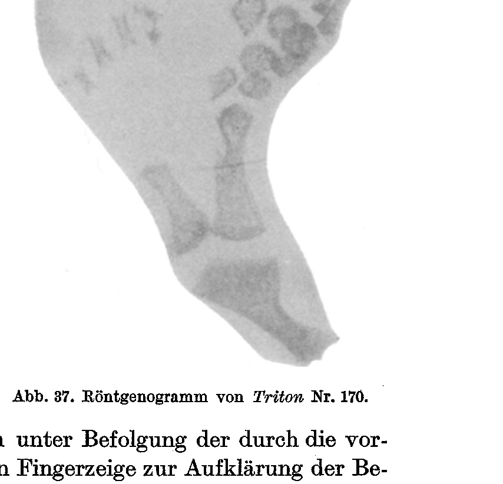

---

*Translator's note.* One of the Biologische Versuchsanstalt (Vienna Vivarium) papers flagged on the project site as a modern rediscovery target. Claims are rendered as stated in the original, not endorsed.
