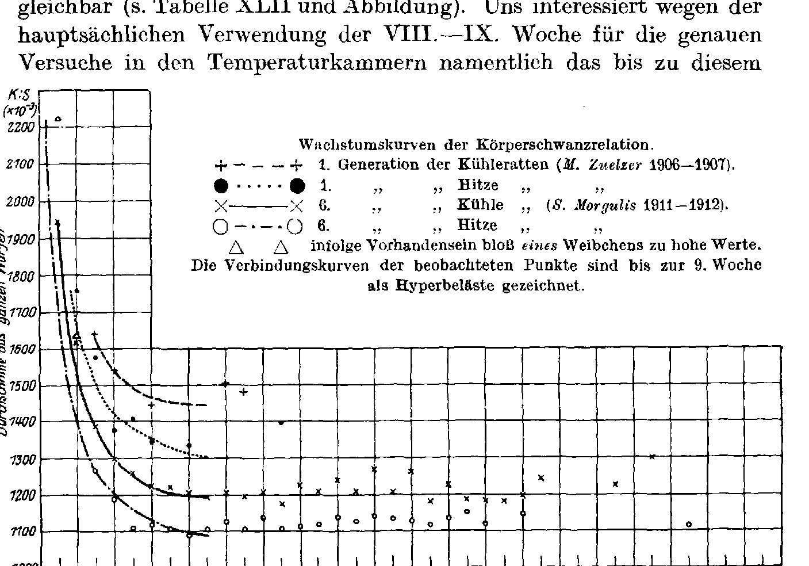

# The Growth of the Relative Tail Length and its Temperature-Quotient in the Rats *Mus (Epimys) decumanus* Pall. and *M. (Ep.) rattus* L.

### (The Environment of the Germ-Plasm. XIV.)

By

**Hans Przibram.**

(From the Biological Experimental Institute of the Academy of Sciences in Vienna [Zoological Department].)¹

With 1 text-figure.

*(Received 2 August 1924.)*

*Archiv für mikroskopische Anatomie und Entwicklungsmechanik*, vol. 104 (1925).

> **Full translation.** A complete English rendering of the running text of “The Growth of the Relative Tail Length and its Temperature-Dependence” (Przibram, 1925), including all tables, figure and plate legends, and footnotes. Numbers and table cells were transcribed from the page images, not the noisy OCR.

> ¹ An abstract of this work appeared under the title: Mitteilungen aus der Biologischen Versuchsanstalt etc. No. 92 in the Akad. Anzeiger, Vienna, No. 24–25 of 30 November 1922.

### Table of Contents.

| | Page |
|---|---|
| I. Statement of the Problem | 612 |
| II. Narcosis and Growth | 614 |
| III. Material and Course of Tail Growth (up to IX Weeks) | 615 |
| &nbsp;&nbsp;&nbsp;&nbsp;A. House rat, *Epimys rattus*, "Semmering". | 615 |
| &nbsp;&nbsp;&nbsp;&nbsp;B. Brown rat, *Epimys decumanus* | 615 |
| &nbsp;&nbsp;&nbsp;&nbsp;&nbsp;&nbsp;&nbsp;&nbsp;a) Wild, agouti-colored, &nbsp;&nbsp;α) "Vienna" | 615 |
| &nbsp;&nbsp;&nbsp;&nbsp;&nbsp;&nbsp;&nbsp;&nbsp;&nbsp;&nbsp;&nbsp;&nbsp;β) "Philadelphia" after *H. H. Donaldson* | 615 |
| &nbsp;&nbsp;&nbsp;&nbsp;&nbsp;&nbsp;&nbsp;&nbsp;b) Tame, albinotic, &nbsp;&nbsp;α) Strain "Ställe" | 615 |
| &nbsp;&nbsp;&nbsp;&nbsp;&nbsp;&nbsp;&nbsp;&nbsp;&nbsp;&nbsp;&nbsp;&nbsp;&nbsp;&nbsp;&nbsp;&nbsp;1. Preliminary experiments | 615 |
| &nbsp;&nbsp;&nbsp;&nbsp;&nbsp;&nbsp;&nbsp;&nbsp;&nbsp;&nbsp;&nbsp;&nbsp;&nbsp;&nbsp;&nbsp;&nbsp;2. Chamber experiments | 617 |
| &nbsp;&nbsp;&nbsp;&nbsp;&nbsp;&nbsp;&nbsp;&nbsp;&nbsp;&nbsp;&nbsp;&nbsp;β) Strain "Molkerei". | 617 |
| &nbsp;&nbsp;&nbsp;&nbsp;&nbsp;&nbsp;&nbsp;&nbsp;&nbsp;&nbsp;&nbsp;&nbsp;γ) Cross "Ställe" >< "Molkerei". | 617 |
| &nbsp;&nbsp;&nbsp;&nbsp;&nbsp;&nbsp;&nbsp;&nbsp;&nbsp;&nbsp;&nbsp;&nbsp;δ) "Philadelphia" after *H. H. Donaldson* | 617 |
| &nbsp;&nbsp;&nbsp;&nbsp;C. House mouse, *Mus musculus*, a) after *Sumner* | 619 |
| &nbsp;&nbsp;&nbsp;&nbsp;&nbsp;&nbsp;&nbsp;&nbsp;&nbsp;&nbsp;b) " &nbsp;&nbsp; *Sundstroem* | 620 |
| IV. Temperature-Quotients: A. Rats at various constant external temperatures (F₂), II or VIII weeks old | 620 |
| &nbsp;&nbsp;&nbsp;&nbsp;B. Transfer into strongly differing temperatures (Over-temperature of body warmth) | 621 |
| &nbsp;&nbsp;&nbsp;&nbsp;C. Application of antipyretics (Under-temperature of body warmth) | 621 |
| &nbsp;&nbsp;&nbsp;&nbsp;D. The sexes at equal temperatures | 622 |
| V. Regression of the tail length during individual life | 623 |
| VI. Causes of the different influencing of body and tail by the same temperature | 625 |
| VII. Body-tail relation and internally-secreting glands | 628 |
| &nbsp;&nbsp;&nbsp;&nbsp;A. Thyreoidea (Thyroid gland) | 628 |
| &nbsp;&nbsp;&nbsp;&nbsp;B. Thymus | 630 |
| &nbsp;&nbsp;&nbsp;&nbsp;C. Hypophysis | 630 |
| &nbsp;&nbsp;&nbsp;&nbsp;D. Adrenals | 631 |
| &nbsp;&nbsp;&nbsp;&nbsp;E. Gonads (Puberty glands) | 631 | 612 &nbsp;&nbsp; H. Przibram: The Growth of the Relative Tail Length and its

| | Page |
|---|---|
| VIII. Differences in the growth of the two sexes | 632 |
| IX. Summary | 633 |
| X. Bibliography | 634 |
| XI. Tables | 635 |
| &nbsp;&nbsp;&nbsp;&nbsp;(Tab. I–X see "Environment XI"; XI–XXI "Environment XII"; XXII to XL "Environment XIII" of this issue.) | |
| &nbsp;&nbsp;&nbsp;&nbsp;Table XLI. Body-tail relations of albinotic brown rats after repeated narcosis (Preliminary experiments, Strain "Ställe") | 638 |
| &nbsp;&nbsp;&nbsp;&nbsp;Table XLII. Preliminary experiments 1st generation, Body-tail relation of albinotic brown rats in different weeks of life (*M. Zuelzer*) | 638 |
| &nbsp;&nbsp;&nbsp;&nbsp;Table XLIII. Preliminary experiments 6th generation, Body-tail relation of albinotic brown rats in different weeks of life (*S. Morgulis*) | 635 |
| &nbsp;&nbsp;&nbsp;&nbsp;Table XLIV. Dependence of the body-tail relation (R : S) on age at various external temperatures (without regard to sex) | 640 |
| &nbsp;&nbsp;&nbsp;&nbsp;Table XLV. Dependence of the body-tail relation on age and sex, non-constant external temperatures (Preliminary experiments) | 642 |
| &nbsp;&nbsp;&nbsp;&nbsp;Table XLVI. Dependence of the body-tail relation on temperature, recalculated to a 10° body-warmth difference (Q₁₀ of the rel. tail growth) | 644 |
| &nbsp;&nbsp;&nbsp;&nbsp;Table XLVII. Body-tail relations of mice from the experiments of *Sumner* and *Sundstroem* | 646 |
| &nbsp;&nbsp;&nbsp;&nbsp;Table XLVIII. Weight of endocrine glands in albino rats after *Donaldson* | 648 |
| &nbsp;&nbsp;&nbsp;&nbsp;Table XLIX. Hyperthyreoidism; thyroid-gland mass and body-tail relation (from experiments of *Erdheim*). | 640 |
| &nbsp;&nbsp;&nbsp;&nbsp;Table L. Correlation between body-tail relation and hyperthyreoidism (after data of *Erdheim*). | 639 |

## I. Statement of the Problem.

In the preceding communications (Environment VIII–XIII) it was shown that the relative tail length in the rats (and mice) is a feature strongly influenced by the temperature kept during growth and is found to behave the same way in the various experiments, certain changes over time being found in the process. In doing so, only two measurements of the tail length in the course of life and during one and the same rat generation, namely those at II and VIII–IX weeks, were drawn upon. The relative tail length, although by no means remaining the same from birth up to old age (in young rats and mice), nevertheless reaches at about 70 days a value almost constant within its natural limits, which is maintained continually during life, after which, however — as we shall still have to appreciate — only quantitative relations between the effective degree of body warmth and the tail length come into question. The hitherto known causes for the influencing of the tail by the conditions of life are: 1. the temperature during growth and 2. the influence of temperature (1923, Chap. 3–4). It is therefore necessary to establish the course of tail growth in rats (and mice). This is the prerequisite for the taking-up of the heredity experiments, which occurred under "Vorversuchen" [preliminary experiments] that at our Temperature-Quotient in the Rats, *M. (E.)* dec. Pall. and *M. (E.)* rattus L. &nbsp;&nbsp; 613

Institute were begun in 1906 by *Margarete Zuelzer* (now Berlin-Dahlem), later continued by my assistants and *Sergius Morgulis* 1910–11 (now Professor of Biochemistry at the University of Omaha, Nebr., United States). But also in the later experiments carried out with the use of temperature chambers, some data on the relative tail length outside the two chiefly measured age-stages were gathered, which show the agreement between these — under exact temperature conditions — and the earlier ones, kept only roughly. A further welcome supplement is formed by the compilations of *Donaldson* (The Rat, Philadelphia 1915) on the changes of the tail length over the whole life of the albinotic and of the wild brown rat. With the tail growth of the mouse *Sumner* has occupied himself. He has also already posed himself the question wherein the lengthening of the heat-tails consists, whether it is a matter of a stretching of the vertebrae or of an increase in their number. He found (1909, p. 125) for the warmth-mice (♂♂) 32.09 ± 0.11 vertebrae, for the cold-mice (♂♂) 31.58 ± 0.14, thus merely half a vertebra more in the average for the former, which he designates as insufficient for the explanation of the difference in length of the tail at high and low temperature (p. 129). At a request of Court Councillor Professor *Toldt*, addressed to the lecturer after a lecture "On experimental heredity research" held before the Anthropological Society in Vienna (1918 pp. 47–51), the author answered "that an anatomical investigation of the rat tails modified in their length by the degrees of temperature has not yet been carried out, but that the differences probably do not rest on a change in the number, but rather on the proportions of the individual vertebrae." This investigation has up to now still not been able to be carried out, but would indeed well be worth the trouble in view of the possible sex-difference in the number of vertebrae given the established greater tail length of the female, as well as the recently available investigations on fishes regarding the variation of the vertebrae in correlation with the water-warmth during development (*Hubbs*, Anat. Record XXIII, 100, 1922; therein also *Johannes Schmidt*). Our present communication is to occupy itself not with the anatomical relations of the tail lengthening, but with the dependence of the length on the age and on the organs with internal secretion now usually made responsible for growth. Since the rats were narcotized during the measurements, it was also necessary to investigate first whether the later measurements of the same animals are not afflicted with errors through preceding narcotization, for the sulfur-ether used is said¹) to exert in plants a very strong 614 &nbsp;&nbsp; H. Przibram: The Growth of the Relative Tail Length and its

growth-stimulus; on the other hand, in the case of damage to the rats through repeated narcosis a lagging-behind of the overall growth could have occurred.

## II. Narcosis and Growth.

For the settling of the preliminary question, whether the narcosis was admissible without disturbance of the experiments, I have compiled Table XLI from the "Vorversuchen" [preliminary experiments]. Five cages of "cold" rats and four cages of "heat" rats were stocked with pairs of the V. generation from our original albino-rats. In each of these cages litters occurred, which thus formed the VI. generation. These young were measured at various, weekly intervals and for this purpose narcotized. For example, in the young of the first litter, cage 21, the first narcosis took place at the age of I, the second at the age of II, the third at the age of IV weeks, etc.; in the young of the second litter the first narcosis only at the age of II weeks, the second at III weeks, etc. In this manner it could come about that in the same age-week one litter had been narcotized only three times, while others had already been subjected to narcosis for the fifth time. In the cages of the "heat" rats we even find fluctuations between one- and four-fold or two- and six-fold narcotization for the VI. week of life. Now if the narcosis were to exert a definite, essential influence on the growth, then one would expect that some regularity would set in if we compare the means of such litters with one another at the same age of life, which had been narcotized in equal temperatures a different number of times. Such averages are noted at the right edge of our table. But no kind of trend can be discerned among the numbers. One should note the lower values of the body-tail relation in the same week of life at high temperature, which demonstrates the sufficient accuracy of the experiments on the average despite the considerable deviations of the numbers in the individual cases. Any damages through the narcosis itself were also never observed in the rats (apart from a few death-cases that occurred at the very beginning of the experiments as a consequence of too strong narcotization¹). We may thus conclude that no error worth considering in respect of the tail growth is introduced by the narcosis. That the rats are not changed in a physiological respect by the narcotization showed itself also in experiments of *Uhlenhuth* on the time of falling-asleep required at successive narcoses, which proved itself independent of the number of preceding narcoses.

> ¹) Such ones *Sumner* (1910 p. 335 note 3) also had to lament with his mice.

Temperature-Quotient in the Rats, *M. (E.)* dec. Pall. and *M. (E.)* rattus L. &nbsp;&nbsp; 615

## III. Material and Course of Tail Growth.

### A. House rat, *Epimys rattus* L. "Semmering".

To avoid repetitions, the measurements are to be looked up on Table I or II of the earlier communication (Environment XI). One notes there the fall of the body-tail relation also between the II. and IX. week of life and after this. The small number of the measurements makes an exact description of the course of tail growth impossible.

### B. Brown rat, *Epimys decumanus* Pall.

#### a) Wild, agouti-colored.

##### α) "Vienna".

On Table I (Environment XI) are recorded the few data gathered for the Viennese wild brown rats. The course is here not so regular as in the case of the house rat, since at VIII–IX weeks occasionally greater body-tail relations occur than at V, at XI greater than at VIII–IX. Given the small number of the litters, which in the V. and XI. week are mostly represented by only a single specimen, no weight is, however, to be placed on this, especially since for the quite similar North American brown rat a rather regular increase of the tail length with the body size will be adduced.

##### β) "Philadelphia".

According to a manuscript of *Hatai*, *Donaldson* reports (1915 p. 200, Table 85, p. 203ff.) tail lengths increasing at an accelerated tempo together with the body length. Since in warm-blooded animals length-decreases do not occur except in old age during individual life, this signifies at the same time an uninterrupted increase of the relative tail length. Unfortunately these are only captured, not bred animals, and an exact age-determination is not possible. Yet, according to our data for the Viennese race, which according to the measurements of *Donaldson* (1912, cf. 1915, p. 198) agrees with the American one, approximate age-determinations can be carried out. But attention must also be drawn to a circumstance that makes the complete regularity appear doubtful: *Hatai's* values are not directly observed ones, but arose through the fitting of a balanced curve to the scatter. Consequently, smaller deviations from the regular course would come to appearance.

#### b) Tame, albinotic.

##### α) Strain "Ställe". 1. Preliminary experiments.

The measurements carried out at the first generation by *M. Zuelzer* can in any case not at all be compared with the other absolute 616 &nbsp;&nbsp; H. Przibram: The Growth of the Relative Tail Length and its

measurement-numbers, because the measurement-method in several respects (temperature kept, narcosis, stretching, measuring apparatus) did not agree with the later one, but above all no direct transfer of the experiments to the next measurer took place, but rather the measurements were taken up again only after five further rat generations. Nevertheless, the values obtained on cold and heat rats of the 1st generation in the II.–XIII. week are, with respect to the curve-character, comparable with those at later generations (see Table XLII and figure). On account of the chief use of the VIII.–IX. week for the exact experiments in the temperature chambers, it is precisely this

**Fig. 1.** Growth-curves of the body-tail relation. *(figure not reproduced)*
> Legend:
> + − − − + 1st generation of the cold rats (*M. Zuelzer* 1906–1907).
> ● · · · · ● 1. " " heat " "
> ×———× 6. " " cold " (*S. Morgulis* 1911–1912).
> ○ − · − · ○ 6. " " heat " "
> △ △ values too high owing to the presence of merely a single female. The connecting curves of the observed points are drawn as hyperbola-branches up to the 9th week.
> *(Vertical axis labeled "K : S (×10⁻³)" with rotated descriptor "Durchschnitte aus ganzen Würfen" [averages from whole litters]; tick values 1000–2200. Horizontal axis: "Wochen" [weeks], ticks 0, 2, 4, … 28, 30, 31, 38, 52, 67, 70, 72 with a break at the right end.)*

curve-piece running up to this age. As a whole it lets itself in the large be recognized as a piece of a hyperbola-branch. That means, the body-tail relations are in this life-period inversely proportional to the attained age of life, or the relative tail lengths are directly proportional to this age. In the later age of life a fluctuation about a somewhat higher value is recorded, yet the number of measurements is too small to attribute a special significance to it. The litters of the 6th generation cold and heat rats measured by *S. Morgulis* show an entirely similar curve-character (see Table XLIII and fig.). Here too, up to VIII. or IX. week a hyperbola-branch is well pronounced, then follows strong fluctuation, which groups itself about a higher level-line. We retain again in memory that for our derivations only the piece up to the IX. week is important.

Temperature-Quotient in the Rats, *M. (E.)* dec. Pall. and *M. (E.)* rattus L. &nbsp;&nbsp; 617

##### 2. Chamber experiments.

In "Environment XI" Table I gives, for II, V, VIII–IX, XI weeks and above, the body-tail relations of the generations of the strain "Ställe" set up in the constant temperatures, at the external temperatures of 30, 25, 20, 15, 10 and 5°. With a single exception the body-tail relation falls with increasing age. The exception concerns 15°. Here the body-tail relation is at the VIII.–IX. week rather higher than at V. The very small difference, concerning the third decimal, is in particular meaningless; but that a standstill in the tail growth was present emerges from the equal behavior of the two separately calculated sexes. Remarkable it is that also in the 6. generation of the cold rats of the preliminary experiments, kept at an average of 16° C, the ancestors of the "Ställe" strain, a relative minimum is to be seen at V weeks. Whether these are thus only chance occurrences must remain undecided. At 15° of the "Molkerei" strain now to be discussed, this anomaly is lacking.

##### β) Strain "Molkerei".

In the same table with the strain "Ställe" we also find the strain "Molkerei", likewise raised in strictly constant external temperatures, namely at 40, 35, 25, 20, 15 and 10°. In it the body-tail relation falls regularly with the age, without exception up to the age important for us of VIII.–IX weeks. In higher age of life there is found at 10° C a becoming-larger of the body-tail relation beyond IX weeks, supported by only a single specimen and therefore meaningless.

##### γ) Cross "Ställe" >< "Molkerei".

shows not at 15°, but at 20° the anomaly of the minimum of the body-tail relation in the V. week inherited from the mother-strain "Ställe", in both sexes (these crosses were set up in the outer space of the cold chambers, which had 20° in summer, 15° in winter; this minimum in the "Ställe" race thus seems always to have occurred between 15 and 20°).

##### δ) "Philadelphia" (after *Donaldson*).

Just as for the wild agouti-colored brown rats, we can also from the data of *Donaldson* sketch the character of the curve of relative tail length with increasing age for the albinotic brown rat in Philadelphia. Since these are laboratory-bred stocks, the age of the rats is known. Unfortunately *Donaldson* gives no table from which one could directly take the relative tail length or body-tail relation characteristic for a given age.

But the following consideration leads to the goal: On page 39 he presents the body weight for the entire lifespan of the rats in the form of a curve for the males and females separately (Chart 4). From the 4th to the 60th day, the curves deviate from a straight line in the sense that a convexity toward the coordinate axis representing older age develops. This weight reaches 110 in the females, 120 g in the males. On page 88 he then further gives a graphical representation of the relationship between body length and weight, given for both sexes. Up to a weight of 120 g (and beyond) the body length increases proportionally to the weight, but does not, in the sense of a slowing of mass growth, increase more slowly; the concavity of the curve toward the coordinate axis representing the weight expresses precisely this. Since the length between 0 and 60, that is, at lower weight, would correspond to proportionality if the initial growth velocity were maintained, the body length therefore increases somewhat more weakly during this growth period from 50 g on (and indeed, their lengths have at that point advanced proportionally to 125 mm) than during the later period, in which the length-growth velocity has, beyond birth, advanced with the proportional velocity. On page 89 *Donaldson* finally gives the graphical representation of the correlation between tail length and body length (Chart 5). The tail length up to the 60th day corresponds quite exactly to the proportionality of the body length from 170 mm on; it is a straight line. The tail length then increases proportionally to the body length and now runs proportionally to the body length to a higher degree, that is. Now the deviation of the relative tail length proportional to the body length will, through the oppositely directed curvature, be eliminated by the deviation of the body length proportional to the body weight; the latter is, as already explained above, of such a kind that for the period of life that mostly interests us, a proportionality between the relative tail length and the older-age proportion exists. Thereby it can now be shown that in fact, even with the use of *Donaldson's* American rats — as in the case of our European albinos held in captivity — this established reverse proportionality between body-tail relation and age is just the same as that between relative tail length and age. A precise definition would here be the same, since in the case of the relative tail length, under our presupposition, the growth curve begins at the zero point of our axis of abscissae.

Table XLIV now brings a compilation of tail growth at differently constant temperatures and varying age for albinotic wander-rats, in which the trunks were recorded separately.¹

> ¹) My investigations take into account the length increase in the third quarter of growth. Cf. *Form und Formel im Tierreiche* [Form and Formula in the Animal Kingdom]. Leipzig and Vienna: F. Deuticke, 1922. Chap. 6, p. 48.

## C. House mouse, *Mus musculus* L.

### a) According to *Sumner* (1909, 1915)

In an earlier treatise (1909, 1915) I assembled in Table XLVII the scattered measurements of tail lengths of the white mouse, in order to obtain comparable average values for the various ages, generations, temperatures, sexes, age stages, etc. Unfortunately, however, the experiments cannot easily be compared because of unevennesses. Thus some rats were measured living, not narcotized, others narcotized. With regard to the treatment of the material he gives no exact details, so that a calculation of the body-tail relation cannot be undertaken according to certain data. One could indeed conclude from the values (which are given in tenths of a millimeter, that is, with greater accuracy than would correspond to the larger inaccuracy of *Sumner's* indicated values of the body length), and from the remark that the body length lies between 0 and 60, that is, at lower weight; one renounces here establishing the correlation between body weight and body length from the named magnitudes, to which foot length and trunk length belong, the largest fourth root again, as is the interpretation of the body length. Only, it appears here that the named magnitudes of the data do not agree; only first indirectly ascertained body lengths are to be used; *Sumner* also wrote (1919, p. 337) the tail length to the appended primary correlation with the body length, and indeed more indirectly than that body-tail relation, in which he is obviously right. Although *Sumner* (1915, p. 342) renounces the use of absolute tail lengths — he rejected them, since the relative ones are the comparable magnitudes — and again used neither absolute tail lengths for comparison, this requirement is again not adequately fulfilled. We have, in order to take into our table also the cases in which body length and tail length were really measured, again drawn upon the body-tail relation. For the growth in the 13th week, we leave aside the body lengths comparable to those of warmth and cold at common temperatures — the abbreviated broods C₂ to C₄, of which only the tail lengths in age C₃ at age 50, C₃ at age 90 days were measured — VII and VIII week, which were likewise excluded with our "preliminary experiments" on rats, corresponding to *Donaldson's* curve on *Hatai's* rats, but in our experiments (cf. Table XLIV) lie for earlier life weeks with *Sumner* (cf. Table XLVII, 1906–07) for average data from II to VIII week-old mice; these values would be upheld in comparison with the mentioned lesser tail lengths; doubtless we have presented this much shorter tail at the earlier age of the older mice than is here further afterward. The comparison of the 1906–07 mice of *Sumner's* is, however, then itself with 1911 broods, in that it is not compelling that here too another strain (cf. p. 1909, p. 140, note) is involved, and the present experiments are to be discussed together with *Sundstroem's*.

### β) *Sundstroem* (1922)

gives only body and tail lengths for one age, namely 60 days, corresponding to the VIII–IX weeks. These values (our Table XLVII, last row) show a much shorter tail length than our Table XLVI gives for the same age VII–VIII, as also VIII–XIII show essentially higher body-tail relations. Because both authors worked with the two strongly varying outside temperatures, the values of *Sundstroem* at the higher temperature, and these alone in the case of *Sumner*, so it works out that here it traces back to the temperature difference. Although now neither here nor there does *Sumner* actually give the relative body and tail measurements, the curve of tail growth on the back, so there is no occasion to doubt a similar course of tail growth in the first life weeks in the rats.

## IV. Temperature quotients.

### A. Rats at differently constant outside temperatures (F₈); II up to VIII–IX weeks old.

If we may presuppose the proportional growth of the relative tail length with age in the first IX life weeks of the rats, and therefore the proportional decrease of the body-tail relation, then we can in this region under certain conditions take the magnitude of the relative tail length as the measure for the velocity (v) of its growth, and in this relation as the reciprocal measure $\left(\frac{1}{v}\right)$ for the velocity of growth, because tail growth as such is here the body-tail relation, and thereby compare the deviation of the same growth velocity with one another and calculate the temperature quotients. If one now wants, from the remarks carried out hitherto over the direct dependence of tail growth on temperature, so that the temperature of the animals is simply, so we have, as expected, that the velocity of growth higher for the life processes — wishes to ascertain the generally valid formula for the reaction-velocity-temperature rule (cf. Temperatur und Temperatoren, Chap. 3 and Table G; further p. 71). Since the body warmth on its part changes with the degree of the outside temperatures held only constant (Umwelt VI, XI, Table IV and V), we obtain, for the experiments carried out in the temperature chambers, when we draw upon the cousin-kinship, here compared values of the body-tail relations at the same life weeks at v different inner temperature. The difference of these body warmths gives the temperature interval between the two velocities and must then, according to the known formula, on the velocity quotients ascertained values:

$$Q_{10} = 10^{\frac{\log v_2 - \log v_1}{t_2 - t_1} \cdot 10}.$$

Our Table XLVI furnishes in lines 1–16 the necessary data and the velocity for the v in the tail growth, with the v VIII–IX weeks. If we then twofold, the body-warmth measurements available only for these would be sufficient to reach the so-sufficient accuracy. Since this naturally first, with the lesser size of the temperature interval and secondly standing in light average values, the more measurement-exact than the small size of the temperature interval, and secondly the from the average values the from the small size of the temperature interval the rise the small size of the temperature interval ascertain. Since the average from the 16 values is 1.806, it therefore stands in good agreement with the expectation according to the RGT rule, and signifies a compensation of the errors committed according to the probability rule of the larger number.

### B. Transposition into strongly different outside temperatures with inner overtemperature, and

### C. Application of antipyretics with under-temperature of the rats

are to be drawn upon as a special case of the general consideration between inner warmth and tail length, since for both we can win quotients, as soon as only the body warmths are considered. A glance at our Table XLVI brings the average values of our preliminary experiments at normal — the table brings the larger quotient 1.316 of the day-quotients, but the average from all quotients, however, the day-quotients 2.030 — thus realizes very well the required doubling of the velocity quotient at ten-degree calculation. Among the ten cases, unfortunately, the "overtemperature" represents a single one²), which is too low; the others belong to the "under-

> ²) In this case I have, with the "Temperatur und Temperatoren," misrepresented, and have feigned a single quotient of 1.86 (p. 72). For on Table C, p. 119, it should namely read, in column K: 8 (*Przibram and Brecher*), instead of 1.194 read 1.234; cf. Umwelt X 1924.

temperature." That this individual value turns out so small is, moreover, plausible, because in the result obtained, which has already been mentioned several times, it could be applied, and therefore the average differences of the body warmths will still always have reached the same height. In the antipyrine experiments, on the other hand, the temperature chambers were still in operation; yet among the nine cases we find one (line 20) with a still lower value, namely Q₁₀ = 1.316. The attainment of the expected doubling of the velocity is therefore here too occasioned by the compensation through chance opposing errors.

### D. Sexes at equal outside temperatures.

We have in an earlier communication (Umwelt XII) described the connection between body warmth and tail length in the rats and mice. In doing so, both the objections raised against the various sexual warmth and against the actual length difference of the tail between males and females were recovered. If we were right in this, then we must now be in a position to demonstrate that, with the insertion of the temperature difference of the sexes and the body-tail relation, which respectively hold for the same various inner temperature, into the formula, the doubling of the velocity of relative tail growth for each 10° of body warmth would again result. Lines 27–34 of our Table XLVI bring the average values of our preliminary experiments, according to the sequence between albino rats, the albino rats without regard to temperature, both at VIII–IX week-old albino rats, then of *Donaldson's* albino rats at two ages, XXXVIII and LII weeks, finally *Sumner's* and *Sundstroem's* albino mice at two different outside temperatures each, the former adult, the latter VIII–IX weeks old. The general average of the Q₁₀ amounts to 2.062; the doubling is therefore very accurately averaged out. We could well, for each individual inner temperature of the chamber installation, utilize the differences of the males and females of the table. But since, as line 28 of our table shows, the quotient for all temperatures together amounts to 1.836, and the scatter about the mean value on the other hand is also considerable in this group, I will let it rest with what has gone before, because no essentially new conclusions would be to be expected. That, in those earlier temperatures in which the sexual warmths are to be identified, the same holds of the body-tail relations, was explained earlier (Umwelt XII). The small stretches of the inner temperature must bring with them large calculation errors. The average from 34 experimental series of our Table XLVI gives 1.932. It would be of a certain interest whether, within the temperature interval that is available for the rat and mouse warmth (34–39° C), an ordering of the individual quotients could be found in the sense that the smaller ones occurred at higher, the larger ones at lower temperatures. Our table instructs us about this in the negative sense. But such a connection is also not to be expected, since in most cases [the course of tail increase is to be expected only after a smaller course of tail increase, since the smaller ones would occur at lower temperatures]. Let it also be pointed out that Q₁₀ of the basal metabolism in mammals with similar inner temperature likewise fluctuates rather around the number 2 (literature table, cf. Temp. und Temp., p. 185). One could have occasion to think [in which smaller course of tail increase is to be expected], since for a life process of the cold-blooded animals a significant decrease of the Q₁₀ already pertains to the temperature interval of 30–40° C. Perhaps one can, through the comparison of the behavior of cold- and warm-blooded animals, perceive one more indication that the decrease of the quotients in the former rests partly on the temperature "comfortable" for most of them.

## V. Regression and transversion of the tail length during the individual life.

We have, for the calculation of the temperature quotients according to our measurements on rats in the II to VIII–IX age-week, merely needed to follow the course of growth up to the IX week — very much was not necessary. But the further course of tail increase still offers interesting relations. At VIII weeks in the female, at X weeks in the male, the I. generation of the "preliminary experiments" carried out even at moderate temperature (not constant 16°) reaches the greatest relative tail length. In the heat series of the same "preliminary experiments" we find at V and VIII weeks maxima for the female, at V and IX for the male. Also in the I. generation of the moderate cool as well as heat rats, the maximum of the relative tail length was reached at IX weeks (cf. Table XLIV). Later the relative tail length decreases again, as also emerges for the mouse from *Sumner's* data. Excellent curves of the tail lengths, such as *Donaldson* gives in *Hatai's* measurements, cannot give us any information about these fluctuations of the growth course of the relative tail length. In Table XLIV (a slightly altered repetition of the one brought as Table D, p. 121/122, in "Temp. und Temp."), the course of tail growth from the II preliminary-experiment generations and *Donaldson's* albino rats are placed side by side before the eyes. From the same it is to be seen that the difference between males and females, as far as both relative tail length and body warmth are concerned, is equalized shortly before the onset of reproductive capacity, but then appears again. In detail, in successive life weeks after the VIII–IX week, considerable fluctuations in the relative tail length are to be recorded, while of course the absolute tail length steadily increases. Its growth, however, now hurries ahead of that of the body, now again lags behind. It makes the impression as if every disturbance of a relation between body and tail length that had set in with sexual maturity were to be equalized again. With increasing age, however, the differences between relative tail lengths at different outside temperatures also become smaller, despite persistence of the same outside temperature. One may compare the last column of Table XLIV with the earlier ones. This regression within one and the same individual life had likewise been noticed by *Sumner* in his mice and discussed in detail (1909, p. 102–154; 1919, p. 421). He points out the similarity of this phenomenon with the "law of filial regression" introduced by *Galton* in the theory of heredity. For us it is important to have thereby gained one more indication that, for the manner of reaction of the individual organisms, the separation of the germ plasm into generations comes less into account than the duration of the external influences. We have indeed now come to know regression in the successive generations, in the successive litters of one female (Umwelt XIII), and also in the successive stages of one and the same individual! With this, the view has repeatedly prevailed that, in the later age of the mice (20, 19, 3 months, 50 days), no noteworthy shifts of the relative tail length are to be expected (1909) — but he made no direct observations on this. Since for our rats this does not hold, I conjecture the same for his mice. In any case, there results in this an unexplained contradiction if regression can still make itself felt in later months, where indeed in his view growth has already ceased. But still more: through his unjustified assumption of an error in the measurement of tail growth concluded at 3 months, he places the three broods C₁₋₄ 1911 in direct comparison, although C₃ was measured at 90 days, the others at 50 days (cf. our Table XLVII, 3rd–6th row from below). He thereupon obtains the paradoxical result that, after removal of the parents from the extreme temperatures, the first and third showed a relative retention, whereas the second showed a reversal of the tail length of their parents. (*Sumner* 1915, p. 385, 428). For this difference he could not even give, conjecturally, an explanation (p. 393). And yet such a one lies near, as soon as we more closely consider the differing ages of the C-broods.

## VI. Causes of the different influencing of body and tail by the same temperature.

When the relative tail length increases with temperature, and the quotient for 10° approaches the value valid for life processes of 2, it will be natural to trace back this behavior to the promotion of developmental velocity by warmth in general. But here two reservations present themselves, which require further examination. First, a promotion of developmental velocity need by no means be linked with an increase in size (cf. "Temp. und Temp." pp. 21 and 76); secondly, an increase in size of the tail does not in itself yet condition any displacement of the body-tail relation, for the body could after all have increased in proportional measure. In fact the influence of warmth or cold upon body length in rats and mice is a very slight one (cf. Umwelt XI, and Sumner 1909 p. 127, Sundstroem 1922 Tab. I, p. 404), and from the outset one might perhaps have expected a wholly proportional influence of temperature upon body and tail length. And yet in the warmth longer-tailed rats and mice arise, i.e. the temperature must have acted more strongly upon the tail than upon the body. A whole series of causes appears to be involved in this result.

1. As set out above (III.), the relative tail length increases, on the whole, at least up to the age of IX weeks. With more rapid growth in the warmth, a stage of greater tail length will therefore be reached sooner than with slower growth in the cold. If we measure both objects at the same moment of age, the warmer one will exhibit a later stage and therefore a greater relative tail length. If it is only a matter of promoted growth velocity, then at a later age the colder animal should still be growing at a time when the warmer one is already beginning to cease its growth, and thereby a compensation would occur, which we have likewise just come to know.

2. This compensation, however, is not a complete one even up to the end of the animals' life, and there must therefore be further factors which condition the preferential lengthening precisely of the tail as against the body length. Here it is first of all to be noted that the chief period of rapid growth of the tail falls in the first three weeks of life, in which a complete homoiothermy does not yet exist and external temperatures can therefore act especially strongly. At this time the germ cells are, according to an experiment of Sumner's (1915 p. 353), even in a certain sense directly reachable by the external temperature: when mice during their earliest youth were brought back into cool temperature and only at 14 days were again exposed to higher [temperature], their offspring, in contrast to those that had remained in high temperature from birth onward, showed no reappearance of the lengthened warmth-tail. On the other hand, however, we cannot attribute any very great role to this factor, since it has shown itself in the inheritance experiments that the interpolation of one or more poikilothermic periods is of no importance for the attainment of a definite degree of the body-tail relation.

3. If we again take into consideration, in place of the external temperature, the internal temperature itself, which, as we always saw, is the more directly effective, we recall in this connection the differences which the inner and outer organs exhibit with respect to the body warmth (cf. Umwelt XII, Section VII). The topography of the body warmth leaves no doubt that certain zones distant from the body centers (heart, liver) are exposed to fluctuation much more than the latter. The rectum, in which we take the temperatures, shows greater fluctuations than more deeply lying parts, and the tail, which takes its origin in the immediate vicinity of the same [the rectum], being little perfused with blood and exposed on all sides, will be able to follow the fluctuations still more than the rectum. The whole body (trunk, neck, head), by contrast, will better maintain the temperature constancy and therefore deviate less than the tail. A displacement of the body-tail relation follows. In favor of this interpretation speaks the behavior, corresponding only in lesser degree to that of the tail, of the remaining peripheral body appendages: the legs and ears, concerning which quantitative data are available, particularly in Sumner (1909 pp. 103, 124, 125, 129, 134, 145; 1910 pp. 329, 334, 339, 341, Tables XVI–XVIII; 1915 pp. 358, 361, 364, 367, 372, 376, 379, 383, 384, 388, 396, 400, 403 etc.). I myself, in order to avoid fragmentation in our very much more extensive rat experiments, confined myself to the measurement of body length and tail, but the general impression is in any case the same also for the legs and ears of the rats (in a further communication photographs will be presented).

4. There seems, however, to be a still more general principle at play, which likewise relates to the growth of peripheral as opposed to central parts, but in a somewhat different manner. Karl Przibram writes summarizingly in an essay published in the Naturwissenschaften (1920, 103), "Form und Geschwindigkeit, ein Beitrag zur allgemeinen Morphologie" [Form and Velocity, a Contribution to General Morphology] (p. 107): "In a series of physical spreading phenomena (splash and tear-off figures of liquids, electrical figures, skeleton formation in crystallization) there exists a relation between form and spreading velocity, such that to a greater velocity there corresponds a more elongated, radiate, and branched form, to a smaller velocity a more compact, rounded, less divided form. This morphological principle seems to hold also in many growth phenomena in organic nature: etiolation of plants, the two leaf forms of Polypodium, (heat-rats and -mice), observations on Hyalodaphnia, Artemia and Tethys, stag's antlers etc." Insofar as increasing warmth accelerates the growth velocity, the tail will accordingly, together with the general habitus, undergo a lengthening, but to a still higher degree than the body, because according to this principle the processes that once proceed in a definite direction with greater velocity are promoted more than the others, whereby precisely the transition from the compact into the elongated, drawn out into thin rays, form arises. The biologist will at once ask whether it is admissible to compare growth as a whole with a spreading phenomenon? Hitherto one was accustomed to regard the cell as the principal thing and therefore biontic growth as a definitely law-governed juxtaposition of cells. In the very latest time, however, the idea is gaining ground more, that the cells are after all only subdivisions of a growing substance, which itself prescribes the form to be attained. It is still questionable what actually occasions this growth: Podhradský (1923) wishes to have the growth-drive located in the skeleton, above all in the chorda dorsalis, which the muscles merely follow passively, because in starvation the skeleton does after all strive to assume its normal proportions at the cost of the other tissues. But such a conception is contradicted by the well-known cases of the formation of extremities without the presence of the belonging bone in the first development (Mammalia — Rabaud et Hovelacque 1923) and in cold-blooded animals also in regeneration (Triton — Paul Weiss 1924). But it is probable that the principal axes of the developing egg possess from the outset a different developmental tendency and thereby velocity, on which the formation of form in living beings generally may rest. It would lead us too far away from our special experiments on the tail lengths of the Murids to go into these matters.

5. Yet a fifth factor, which might condition the greater dependence of the tail upon temperature as against the body length, would be its specific dependence upon internal-secretory glands. In modern endocrinology one is accustomed to make endocrine glands responsible for growth in general, but also for that of definite organs. It would accordingly not be to be rejected that the temperature acting especially upon definite endocrine glands might influence by an indirect path the organs dependent upon these. Since concrete data for the discussion, though not the decision, of this question are before us, a section of its own is devoted to it.

## VII. Body-tail relation and internal-secretory glands.

### A. Thyreoidea (thyroid gland).

The thyroid gland is regarded as an organ promoting growth (cf. Lit. Exper. Zool. V p. 66; Biedl, Innere Sekretion, newest edition). It is therefore of interest to become acquainted with the relation of the thyroid-gland size to the body-tail relation. According to the measurements of Jackson (1913) and Hatai (1913), Donaldson (The rat 1915 p. 98) drew a scatter curve and computed a table (71, p. 133) according to a smoothed curve for males and females.

The former relates to body weight, the latter to body length. There is supposed to be, at equal body weight, no difference in the thyroid weight between the sexes. From this I concluded (Temp. und Temp. p. 75) that, given the substantially greater weight of the male, the relative thyroid weight in the female would, at least in later weeks of life, have to be greater. For our purpose, therefore, the data had to be recomputed to equal age of the males and females, which was done with the help of Table 62 for age-weight (Donaldson p. 106) and 68 weight-length (ibid. p. 115). (For the compilation I am indebted to Dr. Paul Weiß.) An abbreviated reproduction of this collation is to be found in our Table XLVIII. According to it, males and females at equal age would have an almost exactly equal absolute weight of the thyroid gland. If, by means of division of the thyroid weight by the body length, a ratio number is obtained for the relation of the length growth to the thyroid-gland mass, there results in the last column of our table the surprising result, that this ratio number too becomes the same at equal age of the sexes. Since the relative thyroid weight decreases with increasing age and therefore also with the size of the rat, the female, standing at equal age with the male, will have a more favorable ratio of the thyroid weight relative to its total weight, because this is after all smaller than that of the male. The greater tail length of the female could thus be brought into connection with a relatively larger thyroid gland and the higher warmth-tone dependent on it. But conversely the higher warmth-tone could also be claimed for a relative enlargement of the thyroid gland.

This higher warmth-tone could in turn go back to the presence of the female germ gland (cf. Umwelt XII and further below E). Preliminary experiments, which Professor Jakob Erdheim had the kindness to carry out in the year 1909 on my rats in the stalls of our Institute with various diet, yielded no such relation between the weight, the ratio of body to tail length, and the size or the weight of the Thyreoidea (Table XLIX). The rat material of the temperature experiments could unfortunately not be examined fresh with regard to this behavior; but it will perhaps be possible to examine the sizes of the thyroid gland on the conserved rats. Sundstroem (1922 p. 435) found in his heat-albino-mice a so-called resting stage of the Thyreoidea, the cuboidal vesicular epithelium distended by colloidal content; Hart (1922) saw in gray mice, already after a transient sojourn in the heat, an atrophy of the thyroid gland set in.

It thus seems, then, that a good function of the thyroid gland can scarcely be made responsible for the lengthening of the heat-tail. On the other hand, in the mentioned breeds of wander-rats examined by Erdheim, cases of strongly enlarged thyroid glands were found. Our small Table L shows that here, with increasing absolute as well as relative weight of the thyroid gland, a decrease of the relative tail length took place. If we compare only the albinos among themselves, then precisely the two females had absolutely and relatively the smallest Thyreoidea and, as usual, greater relative tail length than the three males. Of these, those with strongly enlarged thyroid gland also had an increased body-tail relation. It thus seems that pathological hyperthyroidism impaired the tail growth (poor length growth in "goiter," which here is not externally visible). It must be pointed out that, contrary to Donaldson's statements, in these cases the relative weight of the Thyreoidea had increased with the weight (age) of the animals. Whether this, just like the greater relative Thyreoidea of the males, really rests merely on pathological causes, or whether the conclusions drawn from Donaldson's data perhaps do not possess that general validity which I ascribed to them, can for the present scarcely be decided.

### B. Thymus (Birsel gland).

Just as for the thyroid gland, so also for the Birsel gland there follows, according to Donaldson's statements (pp. 102, 139; our Table XLVIII), a relatively more considerable size in the female. For the absolute weight of the Thymus in albino rats of equal age is the same in both sexes, whereas the total body mass of the female is smaller than that of the male. In the Thymus too there shows itself, at the same age stage, the same behavior as in the Thyreoidea, namely equality of the quotient, gland weight : body length, in both sexes. If the consumption of the Thymus at sexual maturity is connected with the cessation of further growth (cf. Funktion p. 65; Temp. und Temp. p. 75; Biedl), then the still present more considerable mass in the female could favor the long-tailedness. High temperature, however, with its earlier sexual maturity, should then lead one to expect the opposite effect, which is not correct. The role of the Thymus therefore remains unclarified; perhaps it could acquire an importance for the regression phenomenon.

### C. Hypophysis (cerebral appendage).

At the age of 40–50 days there begins, according to Donaldson (p. 98), a difference in the weight of the hypophysis in favor of the female, and it increases more and more with advancing age. His scatter curve 19 (p. 99) gives weights of the hypophysis of the males and females for equal body weight. Since the females are smaller than the males, in reality the relative weight of the hypophysis is not so very different in the sexes as it appears according to Donaldson's figure; yet the differences must still be considerable. A connection of this more considerable size-increase of the female hypophysis with the more considerable relative tail length is, however, little probable, already for the reason that the latter is at the age of 40 days already well pronounced and also does not increase the difference against the male with advancing age.

### D. Adrenales (adrenal glands).

The adrenal glands behave, according to Donaldson's account (p. 99; Chart 20, p. 100), quite similarly to the cerebral appendage, but the difference between the sexes seems to be smaller. It is natural to think of the blood-pressure-raising action of the adrenalin present in the adrenal glands, which could bring to the females higher temperature and thereby greater tail length. With this we come to speak of the question whether the primary sexual organs, the germ glands themselves, do not take an influence upon the body temperature through direct or indirect blood-pressure-raising action.

### E. Ovarium und Testis (germ glands).

It is probably now generally assumed that the germ glands in the mammals are decisive for a whole series of characters. We have no occasion to concern ourselves with the particular seat of the postulated "hormones," whether located in the germ cells (generative cells) themselves or in the interstitial cells (puberty cells), until the isolation of the active substances has been achieved. Certainly, with the maturing of the germ glands, considerable changes in the length proportions of the body parts are connected, just as are differences in the rectal temperature (cf. Umwelt XII). But, as with the thyroid gland, it is not without further ado clear whether the internal temperature is dictated by the germ gland, or whether sexuality depends on the internal temperature. If the number of generations is not decisive for the transmission of a definite body warmth and thereby body-tail relation (cf. Umwelt XIII and above Section V), but rather this is left to the strength and duration of the influencing factor, then external circumstances too could be active in the determination of the internal temperature and thereby of the sex, before even the separation of the germ-beds had taken place. The ever more increasing cases, in which even during the individual life primary sexual characters are interchanged — right up to the birds! —, let a determination of sex through external factors no longer appear absurd.

[…continuation of Section VII from p. 21:] — already as far up as the birds! —, no longer make a determination of sex by external factors appear absurd. Such a view is by no means incompatible with the doctrine of the sex chromosomes, for these too must somehow arise — a question which, given the possibility of obtaining both sexes from artificially parthenogenetically developed eggs, is already accessible to experimental investigation in cold-blooded animals (cf. Exp. Zool. V. Funktion inkl. Sex. Kap. VIII/4). If there is no doubt that male and female differ through the kind of metabolism, then small differences of disposition (Stimmungsverschiedenheiten) of this same kind can likewise be made responsible — just as for the transmission of the modifications in tail length brought about by external temperature — also for sex, for the difference of sex-warmth and of sex-conditioned tail length. For the present, further points of reference for defining these differences of disposition are lacking. Let it be pointed out, in conclusion, only with regard to the coinciding of the maximum of the relative tail length with the minimum of the sex-difference of this measure, and likewise with regard to the coinciding of the maximum of the body warmth with the minimum of the sex-warmth-difference at the approaching puberty (Tab. XLV), a phenomenon which recurs at various outside temperatures. This speaks an eloquent word for the causal connection between germ glands, body warmth, and tail length, even if we are not yet able to establish this connection without gaps.

## VIII. Differences of Growth between the Two Sexes.

So far we have compared the sexes at equal age-stages, without taking account of the difference in their absolute size. To be sure, in the preceding communications (Umwelt XI and XII) I have established the independence of the body–tail relation from the absolute size of rats (and mice) of the same age. Yet one might wish to make the difference in the course of growth of the male and the female — known from other mammals — responsible for the greater relative tail length of the female compared with the male of the same age. Were such a direct connection to exist, then, given the described decrease — extending to both sexes — of the body–tail relation in the first weeks of life, the male's lead in absolute body length at equal age would result precisely in a more considerable tail length for this sex. Now in the cool the male does indeed lead the female in size (cf. Table XLV, preliminary experiments < 20°), but actually has a smaller relative tail length. In ordinary, medium temperature, male and female are (according to *Donaldson*) almost equal in length up to the VIIth week; only from the VIIth week on does the male lead more strongly, but the difference of the relative tail lengths, which throughout reads in favor of the female, falls with increasing age. In the heat, finally (preliminary experiments > 30°), the males are almost always smaller than the females up to the Vth week of life, without the ratio of their tail lengths reversing in comparison with the cool rats. The differences between the body–tail relations of the sexes vanish, however, transiently at the approaching puberty, in order then to increase again (in *Donaldson*'s equalized curve this does not come to expression). The difference was, in the first III–IV weeks of life, smaller in the cool rats, just as large in the rats at ordinary temperature, larger in the heat rats than in the following ones before the growing-up to puberty. This would agree with the holding-back of the males in the heat, just as the equalization of the difference could be traced back to the heightened body warmth of the males (which approaches that of the females) before puberty. The more considerable size of the males in the cold, of the females in the heat, was also observed by *Sumner* (1909 S. 141, 144; 1915 S. 367, 368) in his mice. On the whole it indeed seems as though the cold offers more favorable conditions for the male, the warmth for the female (cf. Umwelt XII, Abschn. V B; und Lit. Exp. Zool. V. Funktion inkl. Sexualität S. 92 Daphnien, S. 91 Aphiden, S. 87 Anuren fraglich bei Rotatorien S. 94 und *Dinophilus* umgekehrt?).

## IX. Summary.

1. The relative tail length increases from the birth of the rats (and of the house mouse) during body growth, on the whole.

2. Yet multiple fluctuations of the increase are interpolated, which exhibit a maximum shortly before sexual maturity, that is, at that time at which, according to *Congdon* (Umwelt II), a maximum body temperature is likewise present.

3. If we take such periods of growth in which a still quite regular increase of the relative tail length, proportional to time, takes place, then we can obtain a measure of the velocity with which the tail growth proceeds, when we measure the relative tail length (S : K) or its reciprocal value (K : S) on one and the same day of life of different rats.

4. When rats that had already been reared in different constant temperatures in the second generation were compared, at 14 days or in the IXth week of life, with respect to the relative tail length, the velocity of the tail growth showed itself to be in agreement with the reaction-velocity–temperature law (RGT rule of *Kanitz*, *van't Hoff*'s temperature rule), if not the outside temperature, but rather the values of the body warmth (see Umwelt VI) are entered into the formula.

5. The same regularity is obtained by comparing the different tail lengths in the sexes with their different body warmths (see Umwelt XII) at one and the same outside temperature.

6. The temperature law likewise remains valid for those cases in which, through a sudden strong temperature change, a value of the tail length deviating from the normal value of the body warmth at the new outside temperature is to be ascertained (see Umwelt X), or in which, through antipyretics, at one and the same outside temperature a lowering of the body warmth was brought about (Umwelt IX).

7. The RGT law can accordingly also find just such an application for the growth of warm-blooded animals as for that of the cold-blooded.

8. There remains the question to be answered, why body and tail are influenced by the same factor, namely warmth, in unequal proportion, so that with increasing temperature longer-tailed rats (and mice) arise (see Umwelt XI).

9. The answer is given in part already by the first point of this communication; for if, with increasing age, the relative tail length increases, then the same tail length will, with faster growth, be reached earlier than its corresponding body length.

10. Only when growth slackens at higher age will the more slowly grown animal catch up in relative tail length with the more rapidly grown one, and so a certain equalization (individual "Regression") will take place, such as has been observed in the rats (and also in *Sumner's* mice).

11. But since a difference nevertheless remains throughout life, a further principle must be drawn upon for the complete answering of the (in Point 8 posed) question, and we find the same in the general-morphological proposition of *Karl Przibram*, according to which, with an increase of the spreading velocity of any form, the drawing-out into thin rays is favored, in comparison with uniform expansion, at slower growth.

## X. Bibliography.
(See also the preceding communications Umwelt XI–XIII, this Heft.)

*Podhradsky, J.:* Das Wachstum bei absolutem Hungern. Arch. f. Entwicklungsmech. d. Organismen 52, 532. 1923. — *Przibram, Karl:* Form und Geschwindigkeit, ein Beitrag zur allg. Morphologie. Die Naturwissenschaft. 103, 1920. — *Rabaud, Et.* und *Hovelacque, A.:* Etudes sur l'Ectromélie. Bull. biol. 57, 401. 1923. — *Weiss, Paul:* Unabhängigkeit der Extremitätenregeneration vom Skelett (bei *Triton cristatus*). Arch. f. mikroskop. Anat. u. Entwicklungsmech. Dieses Heft.

## XI. Tables.

**Tabelle XLIII.** Preliminary experiments, 6th generation, body–tail relation of albinotic migratory rats in different weeks of life (*S. Morgulis; K. u. U.*) 1910–1911.

*(This table is printed sideways and spans pages 25–27; weeks I–X on p. 25, XI–XX on p. 26, XXI–LXX on p. 27. Each week-column has three sub-columns: Zahl [number], K, K : S. Reproduced below in three parts, one per source page; every cell is given exactly, blank cells shown empty. In the per-litter rows the K sub-column is mostly empty in the original; only the average rows D. ♂♂ and D. ♀♀ carry K-values.)*

### Tabelle XLIII (part 1, p. 25) — Weeks I–X

| Käfig, Wurf, Geschlecht | I — Zahl | I — K | I — K:S | II — Zahl | II — K | II — K:S | III — Zahl | III — K | III — K:S | IV — Zahl | IV — K | IV — K:S | V — Zahl | V — K | V — K:S | VI — Zahl | VI — K | VI — K:S | VII — Zahl | VII — K | VII — K:S | VIII — Zahl | VIII — K | VIII — K:S | IX — Zahl | IX — K | IX — K:S | X — Zahl | X — K | X — K:S |
|---|---|---|---|---|---|---|---|---|---|---|---|---|---|---|---|---|---|---|---|---|---|---|---|---|---|---|---|---|---|---|
| **a) Hitze (inkonst. 33°)** | | | | | | | | | | | | | | | | | | | | | | | | | | | | | | |
| 28 I  ♂♀ | 6 | | 2,232 | 6 | | 1,723 | | | | 5 | | 1,232 | 5 | | 1,144 | 5 | | 1,124 | | | | 5 | | 1,106 | 5 | | 1,112 | 5 | | 1,106 |
| 31 I  ♂♀ | | | | | | | | | | 6 | | 1,122 | | | | 6 | | 1,102 | 6 | | 1,139 | | | | 6 | | 1,098 | | | |
| 31 II  ♂♀ | 3 | | 1,870 | 3 | | 1,413 | | | | | | | 3 | | 1,083 | 3 | | 1,113 | 3 | | 1,117 | 3 | | 1,077 | 3 | | 1,077 | 3 | | 1,083 |
| 32 I  ♂♀ | | | | | | | | | | | | | | | | | | | | | | | | | 9 | | 1,115 | | | 1,134 |
| 32 II  ♂♀ | 3 | | 2,548 | 2 | | 1,900 | 2 | | 1,300 | 2 | | 1,185 | 2 | | 1,115 | 2 | | 1,035 | 2 | | 1,085 | 2 | | 1,060 | 2 | | 1,085 | | | 1,090 |
| 32 III  ♂♀ | | | | | | | 4 | | 1,132 | 4 | | 1,117 | 4 | | 1,035 | 4 | | 1,050 | 4 | | 1,050 | 4 | | 1,045 | 4 | | 1,075 | 4 | | 1,047 |
| 51 I  ♂♀ | 2 | | 2,140 | 2 | | 1,700 | | | | 1 | | 1,300 | 1 | | 1,230 | | | | 1 | | 1,230 | 1 | | 1,110 | 1 | | 1,370 | | | 1,370 |
| 51 II  ♂♀ | | | | 4 | | 1,447 | 4 | | 1,290 | 4 | | 1,175 | 4 | | 1,152 | 4 | | 1,165 | 4 | | 1,132 | 4 | | 1,120 | 3 | | 1,153 | 3 | | 1,153 |
| D. Würfe | | | 2,221 | | | 1,637 | | | 1,262 | | | 1,188 | | | 1,106 | | | 1,117 | | | 1,105 | | | 1,086 | | | 1,102 | | | 1,126 |
| D. Expl. | | | 2,251 | | | 1,622 | | | 1,231 | | | 1,165 | | | 1,108 | | | 1,113 | | | 1,110 | | | 1,097 | | | 1,104 | | | 1,117 |
| D. ♂♂ | 2 | 58,5 | 2,005 | 2 | 65,5 | 1,555 | 1 | 80,0 | 1,230 | 5 | 92,0 | 1,148 | 1 | 93,0 | 1,070 | 5 | 104,6 | 1,142 | 4 | 108,5 | 1,127 | 3 | 116,7 | 1,100 | 6 | 117,0 | 1,080 | 4 | 124,5 | 1,092 |
| D. ♀♀ | 1 | 61,0 | 1,790 | 1 | 73,0 | 1,430 | 1 | 82,0 | 1,080 | 6 | 91,5 | 1,117 | 1 | 100,0 | 1,010 | 5 | 103,0 | 1,090 | 6 | 107,2 | 1,107 | 2 | 110,0 | 1,005 | 8 | 114,4 | 1,104 | 4 | 118,2 | 1,085 |
| **b) Kühle (inkonst. 16°)** | | | | | | | | | | | | | | | | | | | | | | | | | | | | | | |
| 21 I  ♂♀ | 8 | | 1,471 | 8 | | 1,400 | | | | 7 | | 1,280 | 7 | | 1,231 | 7 | | 1,219 | 7 | | 1,223 | 7 | | 1,213 | 7 | | 1,227 | 7 | | 1,237 |
| 21 II  ♂♀ | | | | 7 | | 1,842 | 7 | | 1,340 | 7 | | 1,240 | 7 | | 1,210 | 7 | | 1,186 | 7 | | 1,183 | 7 | | 1,167 | 7 | | 1,169 | 7 | | 1,171 |
| 30 I  ♂♀ | 2 | | 2,180 | 2 | | 1,485 | 2 | | 1,390 | | | | 2 | | 1,340 | 2 | | 1,320 | 2 | | 1,220 | 2 | | 1,250 | | | | 2 | | 1,180 |
| 30 II  ♂♀ | | | | 2 | | 1,530 | | | | | | | | | | | | | | | | | | | | | | | | |
| 34 I  ♂♀ | | | | | | | 6 | | 1,483 | 7 | | 1,343 | | | | 7 | | 1,203 | | | | 6 | | 1,152 | | | | 5 | | 1,182 |
| 45 I  ♂♀ | 4 | | 2,175 | | | | | | | | | | | | | | | | | | | | | | 8 | | 1,188 | | | |
| 45 II  ♂♀ | | | | 7 | | 1,769 | 7 | | 1,426 | 7 | | 1,306 | 7 | | 1,243 | 7 | | 1,260 | 6 | | 1,240 | 6 | | 1,240 | | | | 6 | | 1,263 |
| 54 I  ♂♀ | | | | 8 | | 1,686 | 8 | | 1,305 | 8 | | 1,255 | 8 | | 1,212 | 8 | | 1,160 | | | | | | | 8 | | 1,188 | | | |
| D. Würfe | | | 1,942 | | | 1,619 | | | 1,389 | | | 1,300 | | | 1,260 | | | 1,222 | | | 1,221 | | | 1,204 | | | 1,195 | | | 1,207 |
| D. Expl. | | | 1,774 | | | 1,646 | | | 1,383 | | | 1,298 | | | 1,245 | | | 1,207 | | | 1,222 | | | 1,197 | | | 1,194 | | | 1,212 |
| D. ♂♂ | 2 | 79,0 | 2,180 | 5 | 83,0 | 1,656 | 6 | 91,0 | 1,373 | 5 | 97,4 | 1,304 | 5 | 114,2 | 1,296 | 4 | 125,0 | 1,267 | 5 | (123,6) | 1,206 | 4 | 137,7 | 1,225 | 3 | (120,0) | 1,203 | 4 | 140,5 | 1,187 |
| D. ♀♀ | | | | 3 | 74,3 | 1,607 | 5 | 79,8 | 1,368 | 5 | 95,0 | 1,278 | 3 | 106,3 | 1,147 | 2 | 109,5 | 1,220 | 3 | 111,7 | 1,097 | 2 | 121,5 | 1,135 | 3 | 122,0 | 1,157 | 2 | 128,5 | 1,185 |
| **c) Rückversetzt i. Kühle. Tage alt:** | 9 | | | 16 | | | 23 | | | | | | 37 | | | 44 | | | 51 | | | 65 | | | | | | | | |
| 6 I  ♂♀ Exemplar 1 | 73 | 1,66 | | 90 | 1,55 | | 102 | 1,36 | | | | | 125 | 1,21 | | 131 | 1,19 | | 141 | 1,26 | | 147 | 1,23 | | 152 | 1,19 | | | | |
| Exemplar 2 | 73 | 1,59 | | 90 | 1,50 | | 105 | 1,36 | | | | | 131 | 1,26 | | 138 | 1,25 | | 145 | 1,31 | | 148 | 1,28 | | 152 | 1,23 | | | | |
| 6 I  ♂♀ Durchschnitt | 2 | 73 | 1,625 | 2 | 90 | 1,525 | 2 | 103,5 | 1,360 | | | | 2 | 128,0 | 1,235 | 2 | 134,5 | 1,220 | 2 | 143,0 | 1,285 | 2 | 147,5 | 1,255 | 2 | 152,0 | 1,210 | | | |

### Tabelle XLIII (Fortsetzung) (part 2, p. 26) — Weeks XI–XX

| Käfig, Wurf, Geschlecht | XI — Zahl | XI — K | XI — K:S | XII — Zahl | XII — K | XII — K:S | XIII — Zahl | XIII — K | XIII — K:S | XIV — Zahl | XIV — K | XIV — K:S | XV — Zahl | XV — K | XV — K:S | XVI — Zahl | XVI — K | XVI — K:S | XVII — Zahl | XVII — K | XVII — K:S | XVIII — Zahl | XVIII — K | XVIII — K:S | XIX — Zahl | XIX — K | XIX — K:S | XX — Zahl | XX — K | XX — K:S |
|---|---|---|---|---|---|---|---|---|---|---|---|---|---|---|---|---|---|---|---|---|---|---|---|---|---|---|---|---|---|---|
| **a) Hitze (inkonst. 33°)** | | | | | | | | | | | | | | | | | | | | | | | | | | | | | | |
| 28 I  ♂♀ | 5 | | 1,096 | 5 | | 1,104 | 5 | | 1,136 | 5 | | 1,120 | 5 | | 1,114 | | | | | | | | | | 6 | | 1,132 | 6 | | 1,142 |
| 31 I  ♂♀ | 6 | | 1,109 | | | | 6 | | 1,092 | | | | 6 | | 1,065 | | | | 6 | | 1,083 | 2 | | 1,140 | 2 | | 1,125 | 2 | | 1,145 |
| 31 II  ♂♀ | 3 | | 1,090 | 2 | | 1,090 | 2 | | 1,100 | 2 | | 1,115 | 2 | | 1,110 | 2 | | 1,140 | | | | 4 | | 1,115 | | | | 3 | | 1,090 |
| 32 I  ♂♀ | 7 | | 1,119 | 7 | | 1,119 | | | | 5 | | 1,114 | | | | 5 | | 1,116 | | | | 1 | | 1,180 | | | | | | |
| 32 II  ♂♀ | 2 | | 1,080 | 2 | | 1,110 | 2 | | 1,110 | 2 | | 1,105 | 2 | | 1,145 | 2 | | 1,125 | 2 | | 1,118 | 3 | | 1,127 | 3 | | 1,137 | | | |
| 32 III  ♂♀ | 3 | | 1,073 | 3 | | 1,087 | 3 | | 1,090 | 3 | | 1,033 | 3 | | 1,143 | 3 | | 1,157 | 3 | | 1,163 | 3 | | 1,127 | | | | | | |
| 51 I  ♂♀ | | | | 1 | | 1,320 | | | | | | | | | | | | | | | | | | | | | | | | |
| 51 II  ♂♀ | 3 | | 1,157 | | | | | | | | | | | | | | | | | | | | | | | | | | | |
| D. Würfe | | | 1,105 | | | 1,138 | | | 1,106 | | | 1,111 | | | 1,115 | | | 1,134 | | | 1,136 | | | 1,140 | | | 1,131 | | | 1,126 |
| D. Expl. | | | 1,107 | | | 1,116 | | | 1,107 | | | 1,113 | | | 1,106 | | | 1,132 | | | 1,132 | | | 1,130 | | | 1,132 | | | 1,128 |
| D. ♂♂ | 5 | 125,6 | 1,104 | 4 | 129,7 | 1,117 | 4 | 131,2 | 1,110 | 3 | (130,7) | 1,113 | 4 | 136,5 | 1,106 | 4 | 136,7 | 1,134 | 4 | 143,2 | 1,132 | 4 | (137,0) | 1,137 | 4 | 151,5 | 1,155 | 4 | 158,5 | 1,152 |
| D. ♀♀ | 8 | 122,0 | 1,105 | 4 | 124,5 | 1,100 | 6 | 129,7 | 1,093 | 4 | (129,2) | 1,092 | 6 | 132,7 | 1,072 | 4 | 135,7 | 1,112 | 6 | 138,2 | 1,083 | 4 | (137,5) | 1,092 | 4 | 147,2 | 1,117 | 4 | 148,9 | 1,114 |
| **b) Kühle (inkonst. 16°)** | | | | | | | | | | | | | | | | | | | | | | | | | | | | | | |
| 21 I  ♂♀ | 7 | | 1,199 | 7 | | 1,126 | 7 | | 1,174 | 7 | | 1,189 | 7 | | 1,196 | 7 | | 1,197 | | | | 7 | | 1,210 | 7 | | 1,207 | 7 | | 1,197 |
| 21 II  ♂♀ | 7 | | 1,184 | 6 | | 1,180 | 6 | | 1,173 | 6 | | 1,215 | 6 | | 1,218 | 6 | | 1,227 | | | | 6 | | 1,242 | | | | | | |
| 30 I  ♂♀ | | | | 2 | | 1,230 | | | | 2 | | 1,225 | 1 | | 1,250 | | | | | | | 2 | | 1,360 | | | | 2 | | 1,345 |
| 30 II  ♂♀ | | | | | | | | | | | | | | | | | | | | | | | | | | | | | | |
| 34 I  ♂♀ | 5 | | 1,226 | 5 | | 1,236 | | | | 4 | | 1,292 | | | | 4 | | 1,282 | | | | 5 | | 1,240 | | | | | | |
| 45 I  ♂♀ | 6 | | 1,270 | | | | | | | 7 | | 1,210 | 6 | | 1,194 | 6 | | 1,240 | | | | 3 | | 1,277 | | | | 2 | | 1,240 |
| 45 II  ♂♀ | | | | | | | | | | 7 | | 1,228 | 5 | | 1,228 | 6 | | 1,238 | | | | | | | | | | | | |
| 54 I  ♂♀ | 8 | | 1,212 | | | | | | | 4 | | 1,222 | 7 | | 1,202 | 6 | | 1,235 | | | | | | 1,201 | | | | | | |
| D. Würfe | | | 1,198 | | | 1,206 | | | 1,173 | | | 1,228 | | | 1,202 | | | 1,238 | | | | | | 1,266 | | | 1,207 | | | 1,261 |
| D. Expl. | | | 1,199 | | | 1,218 | | | 1,174 | | | 1,222 | | | 1,202 | | | 1,235 | | | 1,200 | | | 1,246 | | | 1,207 | | | 1,232 |
| D. ♂♂ | 3 | (129,3) | 1,210 | 4 | 149,0 | 1,232 | 3 | (138,0) | 1,233 | 4 | 155,0 | 1,245 | 3 | (137,7) | 1,227 | 3 | 157,3 | 1,250 | 1 | (143,3) | 1,257 | 4 | 169,2 | 1,310 | 1 | (143,3) | 1,205 | 2 | 190,5 | 1,345 |
| D. ♀♀ | 3 | 131,3 | 1,220 | 2 | 139,0 | 1,245 | 3 | (133,0) | 1,177 | 2 | 147,5 | 1,230 | 3 | (131,7) | 1,153 | 2 | 149,0 | 1,225 | 2 | (142,0) | 1,205 | 2 | 151,0 | 1,235 | | | | | | |
| **c) Rückversetzt in Kühle. Tage alt:** | 72 | | | 79 | | | 86 | | | 93 | | | 100 | | | 107 | | | 114 | | | 121 | | | 128 | | | | | |
| 6 I ♂♀ Ex. | 156 | 1,20 | | 157 | 1,15 | | 159 | 1,12 | | 169 | 1,12 | | 173 | 1,10 | | 173 | 1,13 | | 173 | 1,10 | | 175 | 1,12 | | | | |
| 6 I ♂♀ Ex. | 156 | 1,25 | | 167 | 1,31 | | 167 | 1,28 | | 167 | 1,23 | | 173 | 1,20 | | 180 | 1,24 | | 180 | 1,18 | | 186 | 1,22 | | | | |
| Durchschn. | 156,0 | 1,225 | | 162,0 | 1,230 | | 163,0 | 1,200 | | 164,0 | 1,166 | | 171,0 | 1,160 | | 176,5 | 1,196 | | 176,5 | 1,155 | | 176,5 | 1,140 | | 180,5 | 1,170 | | |

### Tabelle XLIII (Schluß) (part 3, p. 27) — Weeks XXI–LXX

| Käfig, Wurf, Geschlecht | XXI — Zahl | XXI — K | XXI — K:S | XXII — Zahl | XXII — K | XXII — K:S | XXIII — Zahl | XXIII — K | XXIII — K:S | XXIV — Zahl | XXIV — K | XXIV — K:S | XXV — Zahl | XXV — K | XXV — K:S | XXVI — Zahl | XXVI — K | XXVI — K:S | XXVIII — Zahl | XXVIII — K | XXVIII — K:S | XXXI — Zahl | XXXI — K | XXXI — K:S | XXXVIII — Zahl | XXXVIII — K | XXXVIII — K:S | LXX — Zahl | LXX — K | LXX — K:S |
|---|---|---|---|---|---|---|---|---|---|---|---|---|---|---|---|---|---|---|---|---|---|---|---|---|---|---|---|---|---|---|
| **a) Hitze (inkonst. 33°)** | | | | | | | | | | | | | | | | | | | | | | | | | | | | | | |
| 28 I  ♂♀ | | | | | | | | | | | | | | | | | | | | | | | | | | | | | | |
| 31 I  ♂♀ | | | | | | | | | | | | | | | | | | | | | | | | | | | | | | |
| 31 II  ♂♀ | 2 | | 1,115 | 2 | | 1,145 | 2 | | 1,150 | 2 | | 1,095 | | | | | | | | | | | | | | | | 4 | | 1,117 |
| 32 I  ♂♀ | | | | 3 | | 1,117 | 3 | | | 3 | | 1,143 | | | | 3 | | 1,143 | | | | | | | | | | | | |
| 32 II  ♂♀ | | | | | | | | | | | | | | | | | | | | | | | | | | | | | | |
| 32 III  ♂♀ | | | | | | | | | | | | | | | | | | | | | | | | | | | | | | |
| 51 I  ♂♀ | | | | | | | | | | | | | | | | | | | | | | | | | | | | | | |
| 51 II  ♂♀ | | | | | | | | | | | | | | | | | | | | | | | | | | | | | | |
| D. Würfe | | | 1,115 | | | 1,131 | | | 1,150 | | | 1,119 | | | | | | 1,143 | | | | | | | | | | | | 1,117 |
| D. Expl. | | | 1,115 | | | 1,128 | | | 1,150 | | | 1,124 | | | | | | 1,43 | | | | | | | | | | | | 1,117 |
| D. ♂♂ | 1 | 162,0 | 1,160 | 2 | (153,5) | 1,145 | 1 | 164,0 | 1,160 | 2 | (162,0) | 1,135 | | | | 1 | (161,0) | 1,150 | | | | | | | | | | 1 | 195,0 | 1,180 |
| D. ♀♀ | 1 | 152,0 | 1,070 | 3 | (147,3) | 1,117 | 1 | 164,0 | 1,140 | 3 | (155,0) | 1,117 | | | | 2 | (158,5) | 1,140 | | | | | | | | | | 3 | 168,7 | 1,097 |
| **b) Kühle (inkonst. 16°)** | | | | | | | | | | | | | | | | | | | | | | | | | | | | | | |
| 21 I  ♂♀ | 7 | | 1,181 | 7 | | 1,177 | 7 | | 1,187 | 7 | | 1,184 | 7 | | 1,181 | 7 | | 1,196 | 7 | | 1,241 | 7 | | 1,223 | | | | | | |
| 21 II  ♂♀ | | | | | | | | | | | | | | | | | | | | | | | | | | | | | | |
| 30 I  ♂♀ | | | | | | | | | | | | | | | | | | | | | | | | | | | | | | |
| 30 II  ♂♀ | | | | | | | | | | | | | | | | | | | | | | | | | | | | | | |
| 34 I  ♂♀ | | | | | | | | | | | | | | | | | | | | | | | | | | | | | | |
| 45 I  ♂♀ | | | | 1 | | 1,270 | | | | | | | | | | | | | | | | | | | 4 | | 1,302 | | | |
| 45 II  ♂♀ | | | | | | | | | | | | | | | | | | | | | | | | | | | | | | |
| 54 I  ♂♀ | | | | | | | | | | | | | | | | | | | | | | | | | | | | | | |
| D. Würfe | | | 1,181 | | | 1,223 | | | 1,187 | | | 1,184 | | | 1,181 | | | 1,196 | | | | | | 1,223 | | | 1,302 | | | |
| D. Expl. | | | 1,181 | | | 1,199 | | | 1,187 | | | 1,184 | | | 1,181 | | | 1,196 | | | | | | 1,223 | | | 1,302 | | | |
| D. ♂♂ | | | | | | | | | | | | | | | | | | | | | | | | | 2 | (175,0) | 1,310 | | | |
| D. ♀♀ | | | | | | | | | | | | | | | | | | | | | | | | | 2 | (175,0) | 1,295 | | | | **Tabelle XLI.** Body–tail relations of albinotic migratory rats, *Epimys*, under repeated narcosis, in the preliminary experiments stock "Ställe".

*(The week-columns I–VI carry, for each entered cell, a narcosis number ["Nark." or "N." = Narkose] and the body–tail-relation value; "„" in the original repeats "N." Blank cells are shown empty.)*

| Kühleratten | Wurf | I | II | III | IV | V | VI |
|---|---|---|---|---|---|---|---|
| | | (Alter in Wochen) | | | | | |
| Käfig V  21 | I | Nark. 1  1,471 | N. 2  1,400 | | N. 3  1,280 | N. 4  1,231 | N. 5  1,219 |
| „   „ | II | | „ 1  1,842 | N. 2  1,340 | „ 3  1,240 | „ 4  1,210 | „ 5  1,186 |
| „   „  30 | I | „ 1  2,180 | „ 2  1,485 | „ 3  1,390 | | „ 4  1,340 | „ 5  1,320 |
| „   „ | II | | „ 1  1,530 | | | | |
| „   „  34 | I | | | „ 1  1,483 | „ 2  1,343 | | „ 3  1,203 |
| „   „  45 | I | „ 1  2,175 | | | | | |
| „   „ | II | | „ 1  1,769 | „ 2  1,426 | „ 3  1,380 | „ 4  1,306 | „ 5  1,243 |
| „   „  54 | I | | „ 1  1,686 | „ 2  1,305 | „ 3  1,255 | „ 4  1,212 | „ 5  1,160 |

| Hitzeratten | Wurf | I | II | III | IV | V | VI |
|---|---|---|---|---|---|---|---|
| | | (Alter in Wochen) | | | | | |
| Käfig V  28 | I | Nark. 1  2,332 | N. 2  1,723 | | N. 3  1,232 | N. 4  1,144 | N. 5  1,124 |
| „   „  31 | I | | | | „ 1  1,122 | | „ 2  1,102 |
| „   „ | II | „ 1  1,870 | „ 2  1,413 | | | „ 3  1,083 | „ 4  1,113 |
| „   „  32 | I | | | | | | |
| „   „ | II | „ 1  2,543 | „ 2  1,900 | N. 3  1,300 | „ 4  1,185 | „ 5  1,115 | „ 6  1,035 |
| „   „ | III | | | „ 1  1,132 | „ 2  1,117 | „ 3  1,035 | „ 4  1,050 |
| „   „  51 | I | „ 1  2,140 | „ 2  1,700 | | „ 3  1,300 | | „ 4  1,230 |
| „   „ | II | | „ 1  1,447 | „ 2  1,295 | „ 3  1,175 | „ 4  1,152 | „ 5  1,165 |

**Tabelle XLII.** Preliminary experiments, 1st generation, body–tail relation of albinotic migratory rats in different weeks of life (*Zuelzer*). 1906–1907.

*(This table spans pages 28–29: week-columns I–VI on p. 28, VII–XIII on p. 29. Each week-column has three sub-columns: Zahl [number], K, K : S. Reproduced below in two parts, one per source page; blank cells shown empty.)*

### Tabelle XLII (part 1, p. 28) — Weeks I–VI

| Käfig, Wurf, Geschlecht | I — Zahl | I — K | I — K:S | II — Zahl | II — K | II — K:S | III — Zahl | III — K | III — K:S | IV — Zahl | IV — K | IV — K:S | V — Zahl | V — K | V — K:S | VI — Zahl | VI — K | VI — K:S |
|---|---|---|---|---|---|---|---|---|---|---|---|---|---|---|---|---|---|---|
| **a) Hitze (inkonstant 33°)** | | | | | | | | | | | | | | | | | | |
| 27 I  ♂♀ | | | | 4 | 9,85 | 1,738 | 3 | 12,33 | 1,573 | 3 | 13,75 | 1,373 | 2 | 14,75 | 1,405 | 2 | 15,37 | 1,255 |
| 29 I  ♂♀ | | | | 7 | 8,43 | 1,776 | | | | | | | | | | 5 | 14,20 | 1,428 |
| Durchschnitt Hitze Würfe | | | | | | 1,757 | | | 1,573 | | | 1,373 | | | 1,405 | | | 1,341 |
| „     „ einz. Exp. | | | | | | 1,762 | | | 1,573 | | | 1,373 | | | 1,405 | | | 1,379 |
| **b) Kühle (inkonstant 16°)** | | | | | | | | | | | | | | | | | | |
| 23 I  ♂♀ | | | | | | | 4 | 10,06 | 1,692 | 4 | 13,06 | 1,470 | | | | 3 | 13,83 | 1,443 |
| 24 I  ♂♀ | | | | | | | 5 | 10,50 | 1,590 | 4 | 12,50 | 1,610 | | | | | | |
| Durchschnitt Kühle Würfe | | | | | | | | | 1,641 | | | 1,540 | | | | | | 1,443 |
| „     „ einz. Exp. | | | | | | | | | 1,635 | | | 1,540 | | | | | | 1,443 |

### Tabelle XLII (Fortsetzung) (part 2, p. 29) — Weeks VII–XIII

Caption continuation (across the page break): "…tischer Wanderratten in verschiedenen Lebenswochen (*Zuelzer*). 1906—1907." Week-columns VII, IX and XII contain no entered values.

| Käfig, Wurf, Geschlecht | VII — Zahl | VII — K | VII — K:S | VIII — Zahl | VIII — K | VIII — K:S | IX — Zahl | IX — K | IX — K:S | X — Zahl | X — K | X — K:S | XI — Zahl | XI — K | XI — K:S | XII — Zahl | XII — K | XII — K:S | XIII — Zahl | XIII — K | XIII — K:S |
|---|---|---|---|---|---|---|---|---|---|---|---|---|---|---|---|---|---|---|---|---|---|
| **a) Hitze (inkonstant 33°)** | | | | | | | | | | | | | | | | | | | | | |
| 27 I  ♂♀ | | | | 2 | 15,60 | 1,335 | | | | | | | | | | | | | 2 | 18,50 | 1,395 |
| 29 I  ♂♀ | | | | | | | | | | | | | | | | | | | | | |
| Durchschnitt Hitze Würfe | | | | | | 1,335 | | | | | | | | | | | | | | | 1,395 |
| „     „ einz. Exp. | | | | | | 1,335 | | | | | | | | | | | | | | | 1,395 |
| **b) Kühle (inkonstant 16°)** | | | | | | | | | | | | | | | | | | | | | |
| 23 I  ♂♀ | | | | | | | | | | | | | 3 | 17,00 | 1,480 | | | | | | |
| 24 I  ♂♀ | | | | | | | | | | 4 | 14,94 | 1,505 | | | | | | | | | |
| Durchschnitt Kühle Würfe | | | | | | | | | | | | 1,505 | | | 1,480 | | | | | | |
| „     „ einz. Exp. | | | | | | | | | | | | 1,505 | | | 1,480 | | | | | | |

*Note on the placement of Tabellen XLI–XLII:* On the printed page 28 the narcosis table **Tabelle XLI** and the start of **Tabelle XLII** both appear; the week-columns VII–XIII of Tabelle XLII continue on the source page 29. The remaining content of page 29 (the start of the next communication's tables) lies outside this paper.

**Tabelle L.** Correlation between body–tail relation and hyperthyroidism, in the albinotic migratory rats [brown rats] from the experiments of *Erdheim* listed in Table XLIX. The numbers of the rats arranged from left to right with increasing values of the measure designated at the beginning of each row.

|  | ♀♀ |  | ♂♂ |  |  |
|---|---|---|---|---|---|
| K : S [body : tail] | 4 | 1 | 6 | 5 | 8 |
| abs. thyroid weight [abs. Thyreoideagewicht] | 4 | 1 | 6 | 8 | 5 |
| Thyr. : total weight (P) [Thyr. : Gesamtgewicht (P)] | 4 | 1 | 6 | 8 | 5 |
| Total weight P [Gesamtgewicht P] | 4 | 1 | 5 | 6 | 8 |
| Body length K [Körperlänge K] | 4 | 1 | 5 | 6 | 8 |
| Thyr. : body length (K) [Thyr. : Körperlänge (K)] | 8 ♂ | 4 1 | 6 | 5 |  |

*(In the last row, the leading "8" stands alone with "♂" printed beneath it; the remaining ♀♀ sequence reads 4 1, and the ♂♂ sequence reads 6 5.)* **Tabelle XLIV.** Dependence of the body–tail relation (K : S) on age at various external temperatures (without regard to sex), in different weeks of life.

*(This table is a two-page spread: the left half — Material, Autor, Außentemperatur, and Age-columns I–IV — is on p. 30 (printed 640); the right half — Age-columns V, VI, VII, "ohne Rücks. Gen." [without regard to gen.], VIII–IX, "berechnet 5° Diff. 0,0374" [calculated, 5° difference 0,0374], X, XI …, … > XI Wochen [weeks] — is on p. 31 (printed 641). Reassembled into a single wide table below. In the "ohne Rücks. Gen." column the entries carry generation markers F₁ / F₂. The sub-labels "VIII" and "IX" of the VIII–IX column-group are printed at the level of the Constant-5° row.)*

| Material | Autor [Author] | Außentemperatur [External temperature] | I | II | III | IV | V | VI | VII | ohne Rücks. Gen. [without regard to gen.] | VIII–IX | berechnet 5° Diff. 0,0374 [calculated] | X | XI … | … > XI Wochen [weeks] |
|---|---|---|---|---|---|---|---|---|---|---|---|---|---|---|---|
| Stamm "Ställe" und "Molkerei" in Temperatur­anlage [Stock "Ställe" and "Molkerei" in temperature installation] | *Przibram* (Umwelt XI) — Durchschnitte aus den beiden Geschlechtsmitteln in jedem Wurfe [Averages from the two sex-means in each litter] | Konstant [Constant] 40° C |  | 1,384 |  |  | 1,070 |  |  | F₁ 1,101 | 1,101 | 1,087 |  | 1,085 |  |
|  |  | „ 35 |  | 1,608 |  |  | 1,133 |  |  | F₂ 1,124 | 1,124 | 1,124 |  | 1,122 |  |
|  |  | „ 30 |  | 1,656 |  |  | 1,176 |  |  | F₂ 1,157 | 1,157 | 1,161 |  | 1,136 |  |
|  |  | „ 25 |  | 1,756 |  | 1,47 | 1,252 |  | 1,33 | F₂ 1,224 | 1,224 | 1,199 |  | 1,194 |  |
|  |  | „ 20 |  | 1,690 |  |  | 1,287 |  |  | F₂ 1,248 | 1,248 | 1,236 |  | 1,221 |  |
|  |  | „ 15 |  | 1,773 | 1,42 |  | 1,327 |  |  | F₂ 1,259 | 1,259 | 1,274 |  | 1,242 |  |
|  |  | „ 10 |  | 1,818 | 1,318 |  | 1,395 | 1,215 | 1,175 | F₂ 1,314 | 1,314 | 1,311 |  | 1,195 |  |
|  |  | „ 5 |  | 1,793 |  |  | 1,350 ♂ |  |  | F₁ 1,359 | 1,359 | 1,348 |  | 1,140 |  |
| Vorversuche 1. Generation [Preliminary experiments, 1st generation] | *Zuelzer* (unpubl.) | Inkonstant [Inconstant] 33° C |  | 1,757 | 1,573 | 1,373 | 1,405 | 1,341 |  | 1,335 |  |  |  | 1,395 |  |
|  |  | „ 16 |  | 1,641 | 1,540 |  |  | 1,443 |  |  |  |  | 1,505 | 1,480 |  |
| Vorversuche 6. Generation [Preliminary experiments, 6th generation] | *Morgulis*, | „ 33° C | 2,221 | 1,637 | 1,262 | 1,188 | 1,106 | 1,117 | 1,105 | 1,086 | 1,102 |  | 1,126 | 1,105 … | 1,117 |
| 6. „ | *K. u. U.* (unpubl.) | „ 16 | 1,942 | 1,619 | 1,389 | 1,300 | 1,260 | 1,222 | 1,221 | 1,204 | 1,195 |  | 1,207 | 1,198 … | 1,262 |
| 6. „ | „ | Rückversetzt in normal [Re-transferred to normal] 16 | 1,625 | 1,525 | 1,360 | 1,235 | 1,220 | 1,285 | 1,255 | 1,210 |  |  | 1,225 | 1,230 … | 1,170 |
| Tabelle 68 [Table 68] | *Donaldson* | 20—25 °? | 1,813 | 1,54 | 1,435 | 1,36 | 1,305 | 1,265 | 1,24 | 1,225 | 1,205 |  | 1,19 | 1,18 …. | 1,15 |

**Tabelle XLIX.** Hyperthyroidism; thyroid-gland mass and body–tail relation in migratory rats, *Epimys decumanus* Pall. (Data of J. *Erdheim*, obtained in the stables of the Biological Experimental Institution at normal external temperature 909.)

*(Two-page spread: columns Nr. through K : S are on p. 30; columns Schilddrüse-Gewicht [thyroid weight] through Thyr. : K are on p. 31. Reassembled below. In the Kost [diet] column the brace groups: rows 1–2 = "Brot, Milch"; rows 3–5 = "Körner, Wasser"; rows 6–7 = "Brot, Milch"; row 8 = "Körner, Wasser".)*

| Nr. | Kost [Diet] | Farbe [Colour] | Geschlecht [Sex] | Todestag [Day of death] | Gesamtgewicht P g [Total weight] | Körperlänge K [Body length] mm | Schwanzlänge S [Tail length] mm | K : S | Schilddrüse-Gewicht g [Thyroid weight] | P : g | Form | Rechte Schilddrüsenmasse mm [Right thyroid mass] — Höhe [Height] | Breite [Breadth] | Dicke [Thickness] | Linke Schilddrüsenmasse mm [Left thyroid mass] — Höhe [Height] | Breite [Breadth] | Dicke [Thickness] | Thyr. : K |
|---|---|---|---|---|---|---|---|---|---|---|---|---|---|---|---|---|---|---|
| 1 | Brot, Milch [Bread, milk] | weiß [white] | ♀ | 11. X. | 160 | 200 | 155 | 1,30 | 0,10 | 1600 | plump | 9,5 | 3 | 3 | 8 | 3,25 | 3 | 0,00050 |
| 2 | Brot, Milch [Bread, milk] | S. Scheck [black piebald] | ♂ | „ | 185 | 190 | 160 | 1,19 | 0,03 | 5700 | flach [flat] | 8,5 | 2,5 | 2 | 8 | 2,5 | 3 | 0,00016 |
| 3 | Körner, Wasser [Grain, water] | schwarz [black] | ♂ | „ | 195 | 200 | 175 | 1,14 | 0,19 | 915 | plump | 10,5 | 4 | 4,75 | 10 | 4,25 | 4 | 0,00095 |
| 4 | Körner, Wasser [Grain, water] | weiß [white] | ♀ | „ | 158 | 190 | 155 | 1,20 | 0,09 | 1756 | flach [flat] | 11 | 3,5 | 3,5 | 8,75 | 4,5 | 2,5 | 0,00048 |
| 5 | Körner, Wasser [Grain, water] | weiß [white] | ♂ | „ | 193 | 210 | 155 | 1,35 | 0,17 | 1195 | plump | 10 | 6 | 4,25 | 12,25 | 4,5 | 3,25 | 0,00081 |
| 6 | Brot, Milch [Bread, milk] | weiß [white] | ♂ | „ | 207 | 210 | 165 | 1,31 | 0,13 | 1592 | flach [flat] | 11,5 | 4 | 3,5 | 10 | 4,5 | 4,5 | 0,00062 |
| 7 | Brot, Milch [Bread, milk] | S. Scheck [black piebald] | ♂ | 9. XI.? | 278 | 400 | 160 | 1,50 | 0,16 | 1738 | ? | — | — | — | — | — | — | 0,00040 |
| 8 | Körner, Wasser [Grain, water] | weiß [white] | ♂ | „ „ | 248 | 360 | 150 | 1,40 | 0,16 | 1550 | „ | — | — | — | — | — | — | 0,00045 | **Tabelle XLV.** Dependence of the body–tail relation (K : S) on age and sex (inner body warmth at various non-constant external temperatures, according to the preliminary experiments on migratory rats, *Epimys decumanus* Pall.).

*(Two-page spread: the left half — "Kühle"-Ratten [cool rats] of the preliminary experiments (Albinos, S. *Morgulis*, 6th generation) and "Normale Ratten" [normal rats] of the control (Albinos, after 1915, S. 115, Tab. 68, or *Przibram*⁴⁾) — is on p. 32 (printed 642); the right half — "Hitze"-Ratten [heat rats], the inner-temperature columns of *Donaldson*²⁾ (Umwelt X), and the Agouti-coloured rats (*Przibram* Umw. X | *Donaldson* S. 203) — is on p. 33 (printed 643). For each "Körperlänge mm" [body length] and "K : S" group the three sub-columns are ♂ − ♀ = Diff.; on the "Kühle" inner-temperature side they are ♀ − ♂ = Diff. Reassembled into one wide table below. An "*" marks the cells so printed in the original; "—" marks empty cells; bracketed values ( ) are as printed.)*

| Alter (Wochen) [Age (weeks)] | Kühle [Cool]: Körperlänge mm ♂ | ♀ | Diff. | Kühle: K:S ♂ | ♀ | Diff. | Durchschn.-Diff. [Mean diff.] | Außentemp. < 20° / Innentemp. τ°C¹⁾ [Inner temp.] ♀ | ♂ | Diff. | Normale [Normal]: Körperlänge mm ♂ | ♀ | Diff. | Normal: K:S ♂ | ♀ | Diff. | Durchschn.-Diff. [Mean diff.] | *Donaldson* Außentp. 20(−25°) / Innentemp. τ°C¹⁾ ♂ | ♀ | Diff. | Hitze [Heat]: Körperlänge mm ♂ | ♀ | Diff. | Hitze: K:S ♂ | ♀ | Diff. | Durchschn.-Diff. [Mean diff.] | Außentemp. > 30° / Innentemp. τ°C¹⁾ ♂ | ♀ | Diff. | Aguti, Normale Außentemp. 20°C: K:S ♂ | ♀ | Diff. | (−25°?) K:S ♂ | ♀ | Diff. |
|---|---|---|---|---|---|---|---|---|---|---|---|---|---|---|---|---|---|---|---|---|---|---|---|---|---|---|---|---|---|---|---|---|---|---|---|---|
| I | 70 | — | — | 2,180 | — | — |  | noch nicht, [not yet,] |  |  | 65 | 64 | 1 | 1,85 | 1,78 | 0,07 | 0,070 | noch nicht, [not yet,] |  |  | 58,5 | 61 | −2,5 | 2,005 | 1,790 | 0,215 | 0,163 | 37,5 | 37,5 | 0,00 | 1,848 | 1,844 | 0,004 | 1,634 | 1,600 | 0,034 |
| II¹⁾ | — | — | — | — | — | — |  | unvollkommen [incompletely] | * |  | * |  |  | 1,711 | 1,666 | 0,045 | 0,046 | unvollkommen [incompletely] |  |  | 65,5 | 73 | −7,5 | 1,555 | 1,430 | 0,125 |  |  |  |  |  |  |  |  |  |  |
| II | 83 | 74 | 9 | 1,656 | 1,607 | 0,049 | 0,027 | homoiotherm [homoiothermic] | 79 | 78 | 1 | 1,57 | 1,51 | 0,06 |  | homoiotherm [homoiothermic] | 80 | 82 | −2 | 1,230 | 1,080 | 0,150 |  | 37,5 | 37,5 | 0,00 |  |  |  |  |  |  |  |
| III | 91 | 80 | 11 | 1,373 | 1,368 | 0,005 |  | 36,30 | 36,15 | 0,15 | 88 | 89 | −1 | 1,47 | 1,40 | 0,07 |  | 36,85 | 36,80 | 0,05 | 92 | 91,5 | 0,5 | 1,148 | 1,117 | 0,031 |  |  |  |  |  |  |  |
| IV | 97 | 95 | 2 | 1,304 | 1,278 | 0,026 |  |  |  |  | 99 | 99 | 0 | 1,39 | 1,33 | 0,06 |  |  | 93 | 100 | −7 | 1,070 | 1,010 | 0,060 |  |  |  |  |  |  |  |
| V | 114 | 106 | 8 | 1,296 | 1,147 | 0,149 |  |  |  |  | 111 | 110 | 1 | 1,33 | 1,28 | 0,05 |  |  | 105 | 103 | 2 | 1,142 | 1,090 | 0,052 |  |  |  |  |  |  |  |
| VI | 125 | 109,5 | 15,5 | 1,267 | 1,220 | 0,047 | 0,089 |  |  |  | 122 | 121 | 1 | 1,29 | 1,24 | 0,05 |  | 36,87 | 36,13 | 0,73 | 108,5 | 107 | 1,5 | 1,127 | 1,107 | 0,020 |  |  |  |  |  |  |  |
| VII¹⁾ | (124) | 112 | (12) | 1,206 | 1,097 | 0,109 |  |  |  |  | 134 | 131 | 3 | 1,27 | 1,21 | 0,06 |  |  | 116,5 | 110 | 6,5 | 1,100 | 1,005 | 0,095 |  |  |  |  |  |  |  |
| VIII²⁾ | 138 | 121,5 | 16,5 | 1,225 | 1,135 | 0,090 |  |  |  |  | 145 | 140 | 5 | 1,25 | 1,20 | 0,05 |  | — | — | — | — | — | — |  |  | zeugungsfähig [capable of reproduction] |  |  |  |  |  |
| VIII–IX | — | — | — | — | — | — |  |  |  |  | * | 1,274 | 1,245 | 0,029 |  |  | — | — | — | 117 | 114 | 3 | 1,080 | 1,104 | −0,024 | 0,007 |  |  |  | 1,307 | 1,279 | 0,028 | 1,337 | 1,303 | 0,034 |
| IX²⁾ | 120 | 122 | (−2) | 1,203 | 1,157 | 0,046 |  |  |  |  | 155 | 149 | 6 | 1,23 | 1,18 | 0,05 |  |  | 124,5 | 118 | 6,5 | 1,092 | 1,185 | 0,007 |  |  |  |  |  |  |  |
| X²⁾ | 140,5 | 128,5 | 12 | 1,187 | 1,185 | 0,002 | 0,007 |  |  |  | 165 | 158 | 7 | 1,21 | 1,17 | 0,04 |  |  | 126 | 122 | 4 | 1,104 | 1,105 | −0,001 |  |  | zeugungsfähig |  |  |  |  |  |
| XI | (129) | 131 | (−2) | 1,210 | 1,220 | −0,010 |  |  |  |  | 174 | 166 | 8 | 1,20 | 1,16 | 0,04 |  |  | 130 | 124,5 | 5,5 | 1,117 | 1,100 | 0,017 |  |  |  |  |  |  |  |
| XII | 149 | 139 | 10 | 1,232 | 1,245 | −0,013 |  |  |  |  | (181,5) | 172 | 9,5 | 1,20 | 1,16 | 0,04 |  |  | 131 | 130 | 1 | 1,110 | 1,093 | 0,017 |  |  |  |  |  |  |  |
| XIII | (138) | (133) | (5) | 1,233 | 1,177 | 0,056 |  |  |  |  | 186 | (175,5) | 10,5 | 1,19 | 1,15 | 0,04 |  | 36,05 | 35,95 | 0,10 | 131 | 129 | 2 | 1,153 | 1,092 | 0,061 |  |  |  |  |  |  |  |
| XIV¹⁾ | 155 | 147,5 | 7,5 | 1,245 | 1,238 | 0,015 |  | 35,6 | 35,1 | 0,50 zeugungsfähig | 190 | 179 | 11 | 1,19 | 1,15 | 0,04 |  |  |  |  |  |  |  |  |  | 36,5 | 36,1 | 0,40 |  |  |  |  |
| … |  |  |  |  |  |  |  |  |  |  |  |  |  |  |  |  |  |  |  |  |  |  |  |  |  |  |  |  |  |  |  |  |  |  |  |
| XXVIII LXX | (175) | 175 | (0) | 1,310 | 1,295 | 0,015 |  |  |  |  | (219,5) | (204) | 15,5 | 1,17 | 1,13 | 0,04 |  |  | 195 | 168,7 | 26,3 | 1,180 | 1,097 | 0,083 |  |  |  |  |  |  |  |

> ¹⁾ The inner body temperatures are taken, for week III—IV, from the treatise *Bierens de Haan*, 1922, S. 8, Tabelle X (Umwelt VIII); VII there S. 9, Tabelle I; XIV and following from H. *Przibram*, 1917, S. 39, Tabelle A (Umwelt VI), and refer to constant external temperatures.

> ²⁾ The series was computed by *Donaldson* according to a formula representing an empirical scatter curve, and so, in the smoothing of the curve, the values of the weeks marked with ²) have probably been shifted in such a way that they allow a regular decrease of the body–tail relation to be perceived, but not a correct ordering between the values for "Kühle" [cool] and "Hitze" [heat] with their directly observed insertion of lower values at the approach of sexual maturity.

> ( ) means, in the column "Körperlänge mm" [body length] of the "Kühle- und Hitze"-Ratten [cool and heat rats], that the bracketed values — because a part of the experimental animals was not measured — do not fit into the growth series and therefore have no value for the calculation of the body-length difference in the sexes; in the column "Mittlere Temperatur" [mean temperature], that the values were added to *Donaldson*'s tables by interpolation.

**Tabelle XLVI.** Dependence of the body–tail relation on temperature, calculated according to the formula:

$$Q_{10} = 10^{\frac{\log v_2 - \log v_1}{T_2 - T_1} \cdot 10}$$

reduced to a 10° body-warmth difference (Q₁₀ of the relative tail-length growth); the difference of the absolute temp. equals the difference Θ₂ − Θ₁.

*(Two-page spread: columns a–m on p. 34 (printed 644), columns n–s on p. 35 (printed 645); reassembled below. Column key — a = Zeile [row]; b = Gattung [genus]; c = Art [species]; d = Rasse [race]; e = Stamm [stock]; f = Gen.; g = äußere höhere [outer higher] (Θ₂); h = äußere tiefere [outer lower] (Θ₁); i = innere höhere [inner higher] (τ₂); k = innere tiefere [inner lower] (τ₁); l = innere Differenz [inner difference] (τ₂−τ₁); m = Alter (Wochen) [age (weeks)]; n = K:S höhere Temp. [higher temp.] (= 1/v₂); o = K:S niedrigere [lower] (= 1/τ₁); p = Versuchsart [type of experiment]; q = K:S (Q₁₀); r = Autor für innere Temp. τ [author for inner temp. τ]; s = Autor für K:S [author for K:S]. In columns g–l and p–s, repeated quotation marks "„" mean "the same as above"; the bracketed "( „ )" in the p column repeats the Versuchsart entry above.)*

| a Zeile | b Gattung | c Art | d Rasse | e Stamm | f Gen. | g Θ₂ | h Θ₁ | i τ₂ | k τ₁ | l τ₂−τ₁ | m Alter (Wochen) | n = 1/v₂ | o = 1/τ₁ | p Versuchsart | q Q₁₀ | r Autor für innere Temp. τ | s Autor für K:S |
|---|---|---|---|---|---|---|---|---|---|---|---|---|---|---|---|---|---|
| 1 | *Epimys* | *rattus* | niger | Semmering | F₂ | 30 | 15 | 37,5 | 35,5 | 2,00 | II | 1,18 | 1,43 | Versch. Außentemp. (ohne Rücks. auf Sex.) [Various ext. temp. (without regard to sex)] | 2,614 | *Bierens* (dec. alb.) | *Przibram* (rat.) |
| 2 | „ | „ | „ | „ | „ | „ | „ | „ | „ | „ | VIII–IX | 0,87 | 0,95 | „ | 1,552 | „ | „ |
| 3 | „ | *decum.* | aguti | Wien | F₂ | 25 | 10 | 33,80 | 34,75 | 2,05 | II | 1,785 | 2,010 | „ | 1,784 | „ | „ |
| 4 | „ | „ | „ | „ | „ | „ | „ | „ | „ | „ | VIII–IX | 1,24 | 1,46 | „ | 2,218 | „ | „ |
| 5 | „ | „ | „ | „ | F₁, F₂ | 20 A | 10 | 36,20 | 34,75 | 1,45 | II | 1,785 | 2,010 | „ | 2,312 | „ | „ |
| 6 | „ | „ | „ | „ | „ | „ | „ | „ | „ | „ | VIII–IX | 1,28 | 1,46 | „ | 2,478 | „ | „ |
| 7 | „ | „ | albino | Ställe | F₂ | 30 | 10 | 37,50 | 34,75 | 2,75 | II | 1,157 | 1,311 | „ | 1,575 | „ | „ |
| 8 | „ | „ | „ | „ | „ | „ | „ | „ | „ | „ | VIII–IX | 1,568 | 1,734 | „ | 1,442 | „ | „ |
| 9 | „ | „ | „ | Molkerei | F₁, F₂ | 40 | 20 A | < 40 | 36,20 | < 3,80 | II | 1,379 | 1,701 | „ | 1,737 | „ | „ |
| 10 | „ | „ | „ | „ | „ | „ | „ | „ | „ | „ | VIII–IX | 1,101 | 1,264 | „ | 1,468 | „ | „ |
| 11 | „ | „ | „ | „ | F₂ | 35 | 15 | 37,85 | 35,50 | 2,35 | II | 1,547 | 1,570? | „ | 1,065? | „ | „ |
| 12 | „ | „ | „ | „ | „ | „ | „ | „ | „ | „ | VIII–IX | 1,155 | 1,294 | „ | 1,629 | „ | „ |
| 13 | „ | „ | „ | „ | {F₃ = F₂ 15°} | 35 | 15 | 37,85 | 35,50 | 2,35 | II | 1,547 | 1,778 | „ | 1,994 | „ | „ |
| 14 | „ | „ | „ | „ | {F₃ 15°} | „ | „ | „ | „ | „ | VIII–IX | 1,155 | 1,244 | „ | 1,371 | „ | „ |
| 15 | „ | „ | „ | St. × M. | F₂ | 20 | 10 | 36,20 | 35,50 | 0,70 | II | 1,631 | 1,728 | „ | 2,284 | „ | „ |
| 16 | „ | „ | „ | (diverse) | „ | „ | „ | „ | „ | „ | VIII–IX | 1,232 | 1,260 | „ | 1,378 | „ | „ |
| 17 | „ | „ | „ | „ | „ | 25? | 10? | 37,90 | 36,50 | 1,40 | V–VI | 1,234 | 1,292 | Hyperthermie durch Versetzung ( „ ) [Hyperthermia by transfer] | 1,388 | *Prz. u. Wiesner* | *Prz. u. Wiesner* |
| 18 | „ | „ | „ | „ | „ | A 25 | A 25 | 37,90 | 37,56 | 0,34 | „ | 1,300 | 1,327 | Hypothermie „ Antipyretika ( „ ) [Hypothermia by antipyretics] | 1,832 | *Prz. u. Bierens* | *B. u. Prz.* Tb. XVIII |
| 19 | „ | „ | „ | „ | „ | 20 = 20 | 36,20 | 35,86 | „ | „ | „ | 1,135 | 1,165 | „ „ „ „ „ | 2,154 | „ | XIX |
| 20 | „ | „ | „ | „ | „ | A 15 = A 15 | 35,50 | 35,16 | „ | „ | „ | 1,385 | 1,398 | „ „ „ „ „ | 1,316 | „ | XXI |
| 21 | „ | „ | „ | „ | „ | „ | „ | „ | „ | „ | „ | 1,347 | 1,363 | „ „ „ „ „ | 1,416 | „ | XXII |
| 22 | „ | „ | „ | „ | „ | A 25 = A 25 | 37,90 | 37,56 | „ | „ | „ | 1,32 | 1,335 | „ nur ♂ ; e; a, c [only ♂] | 1,396 | „ | XVIII |
| 23 | „ | „ | „ | „ | „ | A 15 = A 15 | 35,50 | 35,16 | „ | „ | „ | 1,35 | 1,41 | „ „ „ l; b, e | 3,597 | „ | XXII |
| 24 | „ | „ | „ | „ | „ | A 25 = A 25 | 37,90 | 37,56 | „ | „ | „ | 1,28 | 1,31 | „ „ „ ♀ d; b | 1,977 | „ | XVIII |
| 25 | „ | „ | „ | „ | „ | 20 = 20 | 36,20 | 35,86 | „ | „ | „ | 1,15 | 1,195 | „ „ „ a; b, c | 3,091 | „ | XIX |
| 26 | „ | „ | „ | „ | „ | A 15 = A 15 | 35,50 | 35,16 | „ | „ | „ | 1,345 | 1,380 | „ „ „ e, g; b, c | 2,133 | „ | XXI |
| 27 | „ | „ | „ | „ | Vorversuche inkonstant 16 [Preliminary experiments inconstant 16] | — | — |  |  | 0,74 | VIII–IX | 1,135 | 1,225 | Vergleich ♀ mit ♂ bei derselben Außentp. [Comparison ♀ with ♂ at the same ext. temp.] | 2,805 | *Bierens* (b. 25°) | *Przibram* |
| 28 | „ | „ | „ | „ | alle ohne Unterschied der Außentemp. [all without distinction of ext. temp.] |  |  |  |  | „ | „ | 1,000 | 1,046 | „ „ | 1,836 | „ | „ |
| 29 | „ | „ | „ | „ | Philadelphia, gewöhnl. Labor-temp. [usual laboratory temp.] > 20? |  |  |  |  | 0,30 | XXXVIII | 1,121 | 1,160 | „ „ | 3,581 | *Przibram* | *Donaldson* |
| 30 | „ | „ | „ | „ | „ |  |  |  |  | 0,45 | LII | 1,000 | 1,037 | „ „ | 2,276 | „ | „ |
| 31 | *Mus* | *musc.* | „ | „ | Woods Hole Kaltserie [cold series] | direkt i. Bedingung [directly according to condition] |  |  |  | 0,76 | erwachsen [adult] | 1,084 | 1,121 | „ „ | 1,556 | *Sumner* 1913 | *Sumner* 1915 |
| 32 | „ | „ | „ | „ | California — Warmserie [warm series] | gebrachte A₂ |  |  |  | „ | VIII–IX | 1,076 | 1,094 | „ „ | 1,684 | „ S. 351 | „ S. 358 |
| 33 | „ | „ | „ | „ | California — Kontrollserie [Control series] |  |  |  |  | „ | „ | 1,397 | 1,431 | „ „ | 1,372 | „ | *Sundstroem* |
| 34 | „ | „ | „ | „ | California — Hitzeserie [Heat series] |  |  |  |  | „ | „ | 1,235 | 1,265 | „ „ | 1,371 | „ | „ 1922 |
| 35 |  |  |  |  | Durchschnitt aus allen Quotienten 1—34 [Average of all quotients 1—34] |  |  |  |  |  |  |  |  |  | 1,932 |  |  |

*[p. 646]* H. Przibram: The increase of relative tail length and its temperature quotient in the rats *Mus (Epimys) decumanus* Pall. and *M. (Ep.) rattus* L.

**Table XLVII.** Body-tail relations of mice, *Mus musculus albinus*, compiled chronologically and made comparable with our rats according to the experiments of *Sumner* (1909–1915) and *Sundstroem* (1922).

| Year of Publ. | Page | Table | Author | Series | Age in Days (approximate) | Age in Weeks (approximate) | Number raised ♂♂ Warm | ♂♂ Cold | ♀♀ Warm | ♀♀ Cold | Body length [K] mm ♂♂ Warm | ♂♂ Cold | ♀♀ Warm | ♀♀ Cold | Tail length [S] mm ♂♂ Warm | ♂♂ Cold | ♀♀ Warm | ♀♀ Cold | K : S ♂♂ Warm | ♂♂ Cold | ♀♀ Warm | ♀♀ Cold | Special Remark |
|---|---|---|---|---|---|---|---|---|---|---|---|---|---|---|---|---|---|---|---|---|---|---|---|
| 1909 | 110 | 1 | *Sumner* | 1906–07 | 15–55 | II–VIII | 12 | 13 | 8 | 8 | 24,7 | 24,8 | 21,4 | … | 24,7 | 24,8 | … | … | 1,005 | 1,003 | … | … | Measured alive |
| | 117 | 3 | | 1907–08 | 42 | VI | 29 | 31 | 33 | 33 | 18,0 | 18,1 | 18,7 | … | … | … | … | … | … | … | … | … | ″ ″ |
| | 121 | 5; 4 | | | 75 | XI | 7 | 6 | 33 | 21 | 17,8 | 20,1 | … | … | … | … | … | … | … | … | … | … | ″ ″ |
| | 125 | 6 c | | | 210 | XXX | 22 | 21 | … | … | 17,0 | 17,2 | … | … | … | … | … | … | … | … | … | … | nicht gepaart, tot gemessen / not paired, measured dead |
| | 134 | 10; 9 | | | 210 | XXX | 7 | 6 | 27 | 18 | 23,7 | 25,2 | … | … | … | … | … | … | … | … | … | … | alle getötet, tot gemessen / all killed, measured dead |
| | 138 | 12 | | 1908–09 | 42 | VI | 55 | 50 | 43 | 38 | 12,6 | 13,2 | 12,1 | … | … | … | … | … | … | … | … | … | Measured alive |
| | 143 | 13 | | | 90 | XIII | … | … | … | … | 20,9 | 20,9 | 17,7 | … | … | … | … | … | … | … | … | … | ″ ″ |
| 1915 | 358 | 3 | ″ | 1911 a | 285; 330 | XLI; XLVII | 50 | 25 | 58 | 60 | 25,5 | 26,4 | 23,9 | … | … | … | … | … | 1,076 | 1,084 | … | … | alle getötet, tot gemessen / all killed, measured dead |
| | 361 | 4 | | | b | 90 | … | 101 | 65 | 79 | 72 | 14,6 | 14,4 | … | … | … | … | … | … | … | … | … | … | Männchen anästhesiert / male anaesthetized |
| | | 5 | | 'a','b' | … | … | … | 68 | 33 | 64 | 25 | 14,4 | 13,1 | … | … | … | … | … | … | … | … | … | … | 'b' nur 14 Tage in Kälte, dann W. / 'b' only 14 days in cold, then warm |
| | 364 | 6 | | b₁ | 120 | … | … | … | … | … | … | … | … | … | … | … | … | … | … | … | … | … | nicht gepaart, tot gemessen / not paired, measured dead |
| | 367 | 6 | | 270–300 | XXXIX–XLIII | 29 | 24 | 56 | 53 | 24,3 | 25,3 | … | … | … | … | … | … | … | … | … | … | … | alle getötet, tot gemessen / all killed, measured dead |
| | 372 | 7 | | b₂ | 50 | VII | … | 30 | … | 30 | 11,2 | 12,1 | … | … | … | … | … | … | … | … | … | … | alle getötet, tot gemessen / all killed, measured dead |
| | 376 | 8 | | c₁ | … | … | 31 | 44 | 34 | 50 | 10,3 | 10,6 | … | … | … | … | … | … | 1,041 | 1,073 | … | … | bei Geburt in gemeinsame Temperatur versetzt; mit Ausnahme von C₃ 50 Tage alt, alle tot gemessen / placed in common temperature at birth; with the exception of C₃ aged 50 days, all measured dead |
| | 383 | 10 | | c₂ | 90 | XIII | 45 | 42 | 42 | 54 | 9,9 | 10,2 | … | … | … | … | … | … | 1,129 | 1,106 | … | … | |
| | 384 | 11 | | c₃ | 50 | VII | 48 | 60 | 41 | 58 | 10,4 | 7,8 | … | … | … | … | … | … | 1,048 | 1,107 | … | … | |
| | 388 | 12 | | c₄ | … | … | 52 | 60 | 41 | 56 | 10,4 | 7,8 | … | … | … | … | … | … | … | … | … | … | |
| 1922 | 418; 419 | 1; 17 | *Sund­stroem* | 1921 | 60 | VIII–IX | | | | | | | | | | | | | 1,235 | 1,397 | … | … | * in Korrektur ein Druckfehler, 6,6 cm / * a printing error corrected, 6.6 cm |

*[p. 647]* Temperature quotient in the rats, M. (E.) dec. Pall. and M. (E.) rattus L.

*(Continuation of Table XLVII — the right-hand columns carried over from the facing page; values for Body length [K] mm, Tail length [S] mm, K : S, and the Special Remark for each row as tabulated above.)*

| | Body length [K] mm ♂♂ Warm | ♂♂ Cold | ♀♀ Warm | ♀♀ Cold | Tail length [S] mm ♂♂ Warm | ♂♂ Cold | ♀♀ Warm | ♀♀ Cold | K : S ♂♂ Warm | ♂♂ Cold | ♀♀ Warm | ♀♀ Cold | Special Remark |
|---|---|---|---|---|---|---|---|---|---|---|---|---|---|
| | 94,06 | 93,67 | 92,25 | 93,25 | 89,3 | 0,772 | 67 | 84,30 | 80,3 | 0,068 | 1,008 | 1,205 | 1,092 / 1,163 | Lebend gemessen / measured alive |
| | 13,4 | — | — | — | 68,83 | 84,16 | 69,96 | 81,91 | — | — | — | — | — | ″ ″ |
| | 13,2 | — | — | — | 78,00 | 66,00 | 76,18 | 60,19 | — | — | — | — | — | ″ ″ |
| | 88,41 | 90,71 | — | — | 70,32 | 61,10 | — | — | 1,055 | 1,321 | — | — | — | nicht gepaart, tot gemessen / not paired, measured dead |
| | 93,5 | 93,33 | 96,19 | 94,03 | 87,52 | 80,72 | 88,26 | 79,67 | 1,059 | 1,227 | 1,089 | 1,223 | — | alle getötet, tot gemessen / all killed, measured dead |
| | 11,9 | — | — | — | 67,19 | 60,11 | 68,86 | 59,67 | — | — | — | — | — | lebend gemessen / measured alive |
| | 11,2 | — | — | — | 80,94 | 73,81 | 79,85 | 70,51 | — | — | — | — | — | ″ ″ |
| | 87,30 | 86,30 | 95,99 | 96,91 | 87,72 | 83,55 | 86,86 | 90,05 | 90,15 | 1,094 | 1,121 | 1,076 | 1,084 | alle getötet, tot gemessen / all killed, measured dead |
| | 14,5 | — | — | — | 71,29 | 70,48 | 72,85 | 73,00 | — | — | — | — | — | Männchen anästhesiert / male anaesthetized |
| | 89,41 | 70,16 | — | — | 71,09 | 70,48 | 79,64 | 70,10 | 1,122 | 1,181 | 1,124 | 1,191 | — | 'b' nur 14 Tage in Kälte, dann W. / 'b' only 14 days in cold, then warm |
| | 11,5 | 71,70 | 74,51 | 72,53 | 73,38 | 67,92 | 69,26 | 69,03 | 69,44 | 1,051 | 1,057 | 1,051 | 1,051 | alle getötet, tot gemessen / all killed, measured dead |
| | 11,5 | 70,11 | 70,28 | 71,16 | 67,82 | 64,47 | 65,17 | 66,06 | 67,99 | 1,040 | 1,069 | 1,041 | 1,073 | alle getötet, tot gemessen / all killed, measured dead |
| | 11,3 | 70,87 | 71,00 | 70,78 | 71,16 | 64,47 | 65,11 | 65,69 | 65,19 | 1,147 | 1,128 | 1,129 | 1,106 | bei Geburt in gemeinsame Temperatur versetzt; mit Ausnahme von C₃ 50 Tage alt, alle tot gemessen / placed in common temperature at birth; with the exception of C₃ aged 50 days, all measured dead |
| | 35,86 | 84 | 88 | 65 | 68* | 63 | 1,265 | 1,431 | 1,235 | 1,397 | * in Korrektur ein Druckfehler, 6,6 cm / * a printing error corrected, 6.6 cm |

*[p. 648]* 648    H. Przibram: The increase of relative tail length etc.

**Table XLVIII.** Weight of endocrine glands in albino rats, computed from the tables of *Donaldson* for both sexes and equal age, and set in relation to body length (and K : S).

| Sex | Age in Days | Age in Weeks | Weight of Thyroid | Weight of Thymus | Body length | Tail length | S : K | Thyroid : Body length | Thymus : Body length |
|---|---|---|---|---|---|---|---|---|---|
| Males | 0 | I | 6,5 | 6,5 | 50,2 | 38,5 | 2,38 | 0,0016 | 0,0086 |
| | 7 | I | 9,0 | 9,4 | 60,6 | 36,3 | 1,67 | 0,0035 | 0,00277 |
| | 14 | II | 9,4 | 17,1 | 65,3 | 38,3 | 1,57 | 0,0042 | 0,00373 |
| | 21 | III | 13,0 | 20,9 | 80,4 | 49,9 | 1,47 | 0,0032 | 0,00269 |
| | 28 | IV | 19,5 | 30,0 | 89,4 | 53,1 | 1,32 | 0,0040 | 0,00337 |
| | 35 | V | 30,0 | 36,9 | 97,3 | 61,5 | 1,29 | 0,0048 | 0,00229 |
| | 42 | VI | 40,7 | 45,4 | 122,2 | 73,8 | 1,33 | 0,0033 | 0,00227 |
| | 49 | VII | 53,2 | 51,9 | 132,6 | 80,7 | 1,28 | 0,0040 | 0,00211 |
| | 56 | VIII | 60,1 | 61,7 | 151,3 | 91,9 | 1,29 | 0,0040 | 0,00214 |
| | 63 | IX | 71,2 | 65,8 | 161,5 | 99,1 | 1,24 | 0,0044 | 0,00181 |
| | 70 | X | 77,1 | 67,1 | 166,1 | 104,4 | 1,21 | 0,0046 | 0,00164 |
| | 77 | XI | 84,0 | 70,7 | 174,9 | 110,2 | 1,18 | 0,0048 | 0,00159 |
| | 84 | XII | 90,2 | 73,5 | 183,1 | 116,5 | 1,17 | 0,0049 | 0,00152 |
| | 91 | XIII | 95,4 | 75,0 | 188,8 | 119,9 | 1,17 | 0,0050 | 0,00141 |
| | 98 | XIV | 98,8 | 76,1 | 192,9 | 122,6 | 1,16 | 0,0051 | 0,00120 |
| | 105 | XV | 100,4 | 78,4 | 196,5 | 125,8 | 1,15 | 0,0052 | 0,00112 |
| | 119 | XVII | 106,5 | 80,8 | 202,3 | 129,8 | 1,15 | 0,0053 | 0,00104 |
| | 133 | XIX | 110,4 | 81,9 | 206,7 | 132,5 | 1,14 | 0,0053 | 0,00099 |
| | 161 | XXIII | 116,2 | 84,1 | 213,3 | 137,1 | 1,13 | 0,0054 | 0,00095 |
| | 189 | XXVII | 119,4 | 85,8 | 217,3 | 140,1 | 1,13 | 0,0055 | 0,00091 |
| | 217 | XXXI | 121,4 | 87,1 | 220,1 | 142,0 | 1,12 | 0,0055 | 0,00086 |
| | 245 | XXXV | 122,5 | 87,8 | 222,1 | 143,3 | 1,12 | 0,0055 | 0,00082 |
| | 273 | XXXIX | 123,2 | 88,2 | 223,7 | 144,4 | 1,12 | 0,0055 | 0,00079 |
| | 301 | XLIII | 123,8 | 88,5 | 224,9 | 145,4 | 1,12 | 0,0055 | 0,00076 |
| | 329 | XLVII | 124,2 | 88,7 | 225,7 | 146,1 | 1,12 | 0,0055 | 0,00075 |
| | 365 | LII | 124,8 | 88,9 | 226,9 | 147,1 | 1,12 | 0,0055 | 0,00072 |
| Females | 0 | I | 6,3 | 6,3 | 49,4 | 38,3 | 2,39 | 0,0016 | 0,00868 |
| | 7 | I | 8,8 | 9,1 | 58,3 | 35,1 | 1,67 | 0,0038 | 0,00747 |
| | 14 | II | 16,8 | 16,9 | 64,1 | 38,4 | 1,57 | 0,0042 | 0,00642 |
| | 21 | III | 18,9 | 25,8 | 71,8 | 45,8 | 1,42 | 0,0035 | 0,00477 |
| | 28 | IV | 23,8 | 35,3 | 79,2 | 53,0 | 1,33 | 0,0035 | 0,00385 |
| | 35 | V | 28,9 | 39,6 | 86,9 | 60,3 | 1,30 | 0,0033 | 0,00322 |
| | 42 | VI | 35,3 | 41,1 | 94,9 | 67,0 | 1,28 | 0,0035 | 0,00281 |
| | 49 | VII | 40,5 | 42,4 | 102,6 | 73,0 | 1,26 | 0,0034 | 0,00246 |
| | 56 | VIII | 44,9 | 43,5 | 110,2 | 79,0 | 1,24 | 0,0034 | 0,00215 |
| | 63 | IX | 48,5 | 44,4 | 116,4 | 84,2 | 1,22 | 0,0035 | 0,00191 |
| | 70 | X | 51,4 | 45,1 | 121,0 | 87,9 | 1,22 | 0,0036 | 0,00177 |
| | 77 | XI | 53,5 | 45,5 | 124,2 | 90,2 | 1,21 | 0,0037 | 0,00164 |
| | 84 | XII | 55,1 | 45,7 | 126,4 | 92,2 | 1,21 | 0,0038 | 0,00153 |
| | 91 | XIII | 56,2 | 45,8 | 127,8 | 93,5 | 1,21 | 0,0038 | 0,00147 |
| | 98 | XIV | 56,9 | 45,9 | 128,8 | 94,3 | 1,20 | 0,0039 | 0,00136 |
| | 105 | XV | 57,3 | 45,9 | 129,5 | 94,9 | 1,20 | 0,0039 | 0,00128 |
| | 119 | XVII | 58,1 | 45,9 | 130,2 | 95,5 | 1,20 | 0,0039 | 0,00117 |
| | 133 | XIX | 58,5 | 46,0 | 131,0 | 96,1 | 1,20 | 0,0040 | 0,00112 |
| | 161 | XXIII | 59,1 | 46,0 | 132,3 | 97,1 | 1,20 | 0,0040 | 0,00104 |
| | 189 | XXVII | 59,5 | 46,0 | 133,3 | 97,9 | 1,19 | 0,0040 | 0,00100 |
| | 217 | XXXI | 59,8 | 46,0 | 134,1 | 98,5 | 1,19 | 0,0040 | 0,00096 |
| | 245 | XXXV | 60,0 | 46,0 | 134,7 | 99,0 | 1,18 | 0,0040 | 0,00093 |
| | 273 | XXXIX | 60,1 | 46,0 | 135,2 | 99,4 | 1,18 | 0,0040 | 0,00090 |
| | 301 | XLIII | 60,2 | 46,0 | 135,6 | 99,8 | 1,18 | 0,0040 | 0,00088 |
| | 329 | XLVII | 60,3 | 46,0 | 135,9 | 100,1 | 1,18 | 0,0040 | 0,00086 |
| | 365 | LII | 60,4 | 46,0 | 136,2 | 100,4 | 1,18 | 0,0040 | 0,00084 |

*Note: Owing to the heavily degraded period print, several numeric cells in the multi-column continuation of Table XLVII (p. 647) and in Table XLVIII (p. 648) cannot be read with full certainty from the source images; values are transcribed as legible. Em-dashes (—) in the source indicate empty cells; ellipses (…) mark values not legible in the source.*

## Figures

**Fig. (p.6)**

---

*Translator's note.* One of the Biologische Versuchsanstalt (Vienna Vivarium) papers flagged on the project site as a modern rediscovery target. Claims are rendered as stated in the original, not endorsed.
