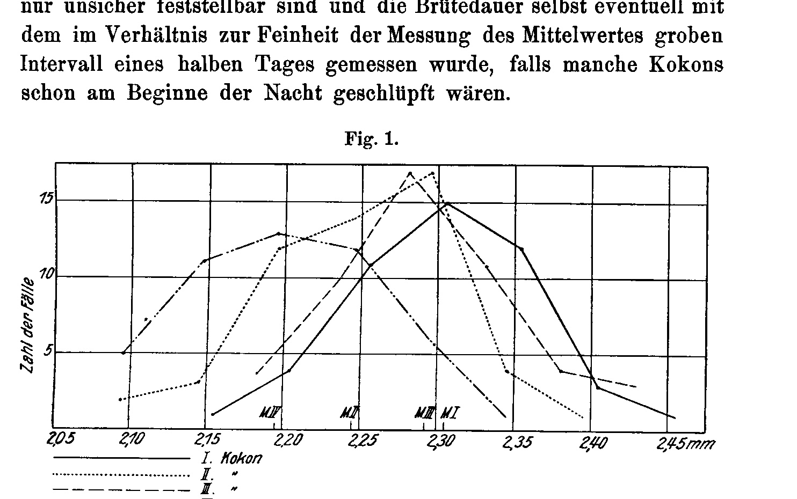
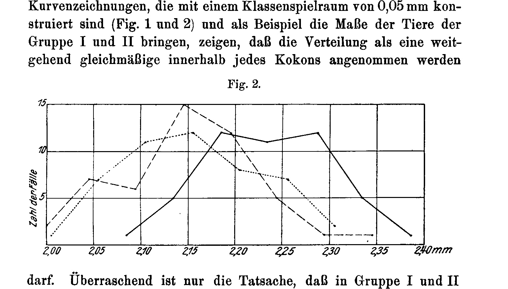

## Keine Größenzunahme der frischgeschlüpften Sphodromantis mit dem Alter der Mutter.

# No Increase in Size of the Freshly-Hatched Sphodromantis with the Age of the Mother.

### (At the same time: Rearing of the Praying Mantises, V. Communication.)

By

**Hans Przibram** (Vienna) and **Adolf Walther** (Gießen).

(From the Biological Experimental Institute of the Imperial Academy of Sciences in Vienna, Zoological Division¹.)

With 3 Figures in the Text.

Received on 5 April 1914.

*Archiv für Entwicklungsmechanik der Organismen*, vol. 40 (1914).

> **Full translation.** A complete English rendering of the running text of “No Increase in Size of Freshly-Hatched Sphodromantis with...” (Przibram/Walther, 1914), including all tables, figure and plate legends, and footnotes. Numbers and table cells were transcribed from the page images, not the noisy OCR.

> ¹ An abstract of this work appeared under the title: Mitteilungen aus der Biologischen Versuchsanstalt der kaiserl. Akademie der Wissenschaften, Zoologische Abteilung, Vorstand H. Przibram. 4. Keine Größenzunahme der frischgeschlüpften *Sphodromantis* mit dem Alter der Mutter (zugleich: Aufzucht der Gottesanbeterinnen, V. Mitteilung) von Hans Przibram in Wien und Adolf Walther in Gießen, im Akademischen Anzeiger. Nr. VIII. 1914. [An abstract of this work appeared under the title: Communications from the Biological Experimental Institute of the Imperial Academy of Sciences, Zoological Division, Director H. Przibram. 4. No increase in size of the freshly-hatched *Sphodromantis* with the age of the mother (at the same time: Rearing of the praying mantises, V. Communication) by Hans Przibram in Vienna and Adolf Walther in Gießen, in the Akademischer Anzeiger. No. VIII. 1914.]

### 1. Statement of the Problem.

#### (H. Przibram.)

On experimental material from our Institute, Professor Josef Halban (1910) has found confirmed, for the remaining classes of the vertebrates as well, the rule — long known for mammals (human, dog, horse, cattle) and birds (chicken) — of the increase in size of the newborn of successively following litters or clutches, respectively; namely for reptiles (pond turtle, *Emys orbicularis*; brook turtle, *Clemmys caspica*; land tortoise, *Testudo graeca*), amphibians (pond frog, *Rana esculenta*; grass frog, *R. temporaria*; fire salamander, *Salamandra maculosa*; alpine salamander, *S. atra*), and fishes (river perch, *Perca fluviatilis*).

In so doing, it was at the same time shown that the increase in size of the freshly-hatched young in those kinds which lay eggs and therefore permit a measurement of the same, stands in direct connection with the various egg size in the various clutches.

It therefore seemed an obvious conclusion that, in the case of those vertebrates as well which bear live young, the increasing size of the young of successively following litters of one and the same female is to be traced back to the size of the eggs increasing with the age of the mother animal — which conclusion Halban draws namely with respect to humans.

Since all vertebrates do not cease their growth once sexual maturity is attained, but beyond that continue to grow further in length, weight, and especially with respect to the renewal of worn-out tissues, it seemed desirable to me to draw in for comparison an animal group which completely ceases its growth by [the time of] the maturation of the sexual products, already before the first act of procreation.

A favorable experimental object for this presented itself in the Egyptian praying mantis bred by us for many years, *Sphodromantis bioculata* Burm. (cf. Przibram 1906, 1909).

In the winter of 1909/10 I had 50 specimens each of the egg-cocoons hatching at a mean temperature of 30° conserved on the forenoon of the hatching day in 5% formol (the hatching takes place mostly in the early morning). After Professor Halban had declined the working-up of the material for lack of time, *Privatdozent* Adolf Walther, who had come to our Institute for the purpose of carrying out other experimental works, took over the measurement of the conserved little animals.

As the comparison-stretch, the length of the prothorax was taken, which had already earlier served us for growth measurements and is sufficiently well defined to vouch for reliable results (cf. H. Przibram and F. Megušar 1912).

### 2. Method of Measurement and Calculation.

#### (A. Walther.)

In the majority of the animals, namely those of Groups I and II, measured on 26.X.1910 and 10.III.1911, the measurements were made as follows: Under the magnifying glass the distance was measured between the rear edge of the prothorax — always determinable without difficulty — and (since the front end of the prothorax itself is often hard to fix exactly) the deepest point in the notch between head and prothorax, which is almost identical with the front end of the thorax, [is]. The distance was determined with the help of a compass with legs 8 cm long, whose ends were especially sharply pointed, and which was adjusted by means of a screw, one single turn of which moved the ends of the compass 1.25 mm against one another. On a scale provided with a fixable vernier [Nonius], which allowed the determination of 0.05 mm with certainty, the distance of the points of the compass from one another was then determined under a second magnifying glass. On each animal the measure was taken in this way four times; only in case the difference between the longest and shortest measure thus obtained on the same animal exceeded 0.2 mm (not [in] 3% of the measured animals) was the number of the measurements increased in order to arrive at a reliable mean value. After each individual measurement the compass was screwed apart and then set anew quite from the beginning. There were always investigated, one after the other in the series, five specimens each of every group, in order thus to eliminate the influence of practice in measuring.

For the measurement of Group III, which was carried out in the period from 18.XI. to 2.XII.1913, the new stage micrometer of Leitz was used; for this, as objective, the back lens of objective No. 3 alone (without the front lens), the tube being completely pushed in, so that one scale-division of the micrometer corresponds to 0.0252 mm. The total prothorax length thus came to about 80 scale-divisions, so that a sufficiently exact measurement was possible. Each animal was measured twice, once from the one side, then from the other side; in case of uncertainty then still existing (with a difference of more than one scale-division, or with prothorax ends not completely surely determinable), the measurement was repeated one to two more times and the average taken from all the measurements. Here the front end of the prothorax was always taken exactly as the endpoint of the stretch to be measured, so that Group III thereby appears somewhat too small compared with Groups I and II. Since, however, our investigations, owing to the large individual fluctuations, can only concern comparisons within each individual group, the in-itself already slight difference of the measurement methods plays no role.

The calculations were made by means of the formulae given by Johannsen (1909), and indeed with a class-division of 0.03 mm; for the mean value according to the formula $M = A + b$, for the scattering $\sigma = \sqrt{\dfrac{\Sigma p a^2}{n} - b^2}$.

**Table I.**

| 1 | 2 | 3 | 4 | 5 | 6 | 7–8 | 9 | 10 | 11 | 12 | 13 | 14 | 15 | 16 | 17 |
|---|---|---|---|---|---|---|---|---|---|---|---|---|---|---|---|
| Investigated Group | Birth | Transformation [pupation/metamorphosis] | Death | Prothorax length ¹/₁₀₀ mm | Age at the time of laying — Days | No. of the egg-cocoon | Size of the cocoon, cf. Fig. 3! | Time available for ripening before laying — Days | Date of the laying of the egg-cocoon | Date of the hatching of the young | Brooding time in Days | Number of the measured animals | Prothorax length, Mean value in ¹/₁₀₀ mm | Scattering | Ratio of the prothorax length of the mother to the prothorax length of young brooding for 34 days |
| | colspan 2–6: Data about the mother | | | | | | | | | | | | | | |
| I | 5. VII. 09 | 14. X. 09 | 7. IV. 10 (276 Tage alt) [276 days old] | 2755 | 167 | 11 *p*  I | *c* | (66) | 19. XII. 09 | 24. I. 10 | 36 | 47 | 230,5 ± 0,853 | ± 5,850 ± 0,603 | 12,27 |
| | | | | | 191 | II | *d* | 24 | 12. I. 10 | 15. II. 10 | **34** | 53 | 224,5 ± 0,851 | ± 6,192 ± 0,610 | |
| | | | | | 215 | III | *c* | 24 | 5. II. 10 | 12. III. 10 | 35 | 49 | 229,2 ± 0,845 | ± 5,916 ± 0,598 | |
| | | | | | 255 | IV | *a* | 40 | 17. III. 10 | 13. IV. 10 | 27 | 48 | 219,6 ± 0,937 | ± 6,495 ± 0,663 | |
| II | 27. VII. 09 | 24. X. 09 | 16. IV. 09 (263 Tage alt) [263 days old] | 2665 | 145 | 12 *r*  I | *c* | (56) | 19. XII. 09 | 22. I. 10 | **34** | 47 | 223,1 ± 0,998 | ± 6,846 ± 0,706 | 11,94 |
| | | | | | 180 | II | *c* | 35 | 23. I. 10 | 23. II. 10 | 31 | 48 | 215,6 ± 1,031 | ± 7,141 ± 0,729 | |
| | | | | | 219 | III | *c* | 39 | 3. III. 10 | 3. IV. 10 | 31 | 49 | 214,7 ± 1,035 | ± 7,248 ± 0,732 | |
| III | 27. VII. 09 | 26. X. 09 | 12. IV. 10 (259 Tage alt) [259 days old] | 2460 | 145 | 12 *s*  I | *b* | (54) | 19. XII. 09 | 22. I. 10 | 34 | 15¹⁾ | 208,7 ± 1,430 | ± 5,536 ± 1,010 | 11,79²⁾ |
| | | | | | 174 | II | *b* | 29 | 17. I. 10 | 23. II. 10 | 37 | 49 | 209,6 ± 0,719 | ± 5,032 ± 0,508 | |
| | | | | | 224 | III | *b* | 50 | 8. III. 10 | 11. IV. 10 | **34** | 50 | 208,8 ± 0,694 | ± 4,911 ± 0,491 | |

> ¹ No more animals had hatched; therefore this cocoon was not taken into account in Column 17.

> ² This number, in accordance with the method of measurement of the prothorax of the young given in the text for Group III, is somewhat too small, and so in reality approaches still more closely the ratios standing above it.

### 3. Results of the Measurements.

#### (A. Walther.)

The results of the measurements are compiled in Table I (Columns 15 and 16). Striking in this — always first comparing only the animals of the same group with one another — is the direct correlation between prothorax length on the one hand and on the other hand the time which the young required for development from the laying of the cocoon up to the hatching (»brooding duration«). The following Table II presents the differences between two mean values of the prothorax lengths in all the cases in which these differences exceed their threefold mean error.

**Table II.**

| Group | Difference determined for the cocoons No. | Difference in the brooding duration | Difference in the size of the mean value |
|---|---|---|---|
| I | I/II | 2 | 6,0 ± 1,205 |
| | I/IV | 9 | 10,9 ± 1,267 |
| | III/II | 1 | 4,7 ± 1,199 |
| | II/IV | 7 | 4,9 ± 1,266 |
| | III/IV | 8 | 9,6 ± 1,262 |
| II | I/II und I/III [I/II and I/III] | 3 | 8,0 ± 1,436 |

In all these cases, in which a secured difference of the mean values exists, it lies in such a way that, with growing brooding duration, the size of the hatching animals increases. But this holds also for the cases in which, although a difference of the mean values at differing brooding duration exists, this difference does not, however, exceed its threefold mean error and so cannot count as secured. These are the cases: Group I: cocoon I / cocoon III; Group III: cocoon II / cocoon I and cocoon II / cocoon III.

While we thus in general have a very good agreement of all the investigated cases, consideration of Table II yields only a very slight correlation between the absolute magnitude of the difference of the mean values and the absolute magnitude of the difference of the brooding duration. Yet one may not be permitted to attribute too great an importance to this, since on the one hand the differences of the mean values still show relatively high mean errors, but above all on the other hand the two end-points of the brooding duration are naturally only uncertainly determinable, and the brooding duration itself was eventually measured with the interval of a half day — coarse in relation to the fineness of the measurement of the mean value — in case some cocoons had already hatched at the beginning of the night.

**Fig. 1.** *(figure not reproduced)*

[Y-axis label: Zahl der Fälle (Number of cases). X-axis: 2,05 — 2,10 — 2,15 — 2,20 — 2,25 — 2,30 — 2,35 — 2,40 — 2,45 mm, with markers M IV, M II, M III, M I along the axis. Legend: solid line — I. Kokon (I. cocoon); dotted line — II. " (II. cocoon); dashed line — III. " (III. cocoon).]

As regards the variability, the adjoining curve-drawings, in which the class-ranges of 0.03 mm are constructed (Fig. 1 and 2) and which present as an example the measures of the animals of Groups I and II, may show that the distribution may be assumed to be a largely uniform one within each cocoon

**Fig. 2.** *(figure not reproduced)*

[Y-axis label: Zahl der Fälle (Number of cases). X-axis: 2,00 — 2,05 — 2,10 — 2,15 — 2,20 — 2,25 — 2,30 — 2,35 — 2,40 mm.]

. Surprising is only the fact that in Group I and II (Group III must, in this consideration, be excluded owing to the partly too small number of the measured animals) the scattering decreases with a rising mean value. A behavior which at first remains unaccountable.

### 4. Working-up of the Results in the Sense of the Statement of the Problem.

#### (H. Przibram.)

In order to make use, for the problem mentioned at the outset, of the data obtained by Dr. Walther, I have supplemented the established Table I by Columns 2–6, 9–10, and 17 according to the dry material — present in our Institute — of the mother animals used and of the cocoons; in what manner is readily to be seen from the column-headings of the named columns.

If we, to begin with, stay with the comparison of the cocoons within each individual group, then we find within none of the three groups an increase in size of the young of successively following clutches; in ascending order of the prothorax lengths the cocoons order themselves (according to Column 15) for the mother 11 *p*: IV, II, III, I; those of the mother 12 *r*: III, II, I; those of the mother 12 *s*: I, III, II; a particular regularity does not come to expression, in no way does the size of the freshly-hatched increase with the successively following clutches.

One might now indeed think that various factors are present which are able to cross out or to conceal entirely an otherwise existing correlation of the increase in size of the newborn with the age of the mother. First of all, the influence of various fathers could be thought of. This influence is completely eliminated by the fact that each female among the praying mantises needs to be mounted only once in order to be able to lay fertilized eggs for its whole life. This procedure was also adhered to in all our breedings. Since therefore all the young of one group have the same father and the same mother, it is also little probable that any possible hereditary size differences among the young of various clutches — where indeed no selection of the 50 specimens to be conserved took place — could have played any role within one and the same group, especially since lengths in the animals tend to come out intermediate.

The influence of the paternal age is, moreover, at the same time eliminated, since indeed all the sperm stems from the same act of procreation.

Essentially, the correlation of size with the brooding time found by Dr. Walther could blur a possible increase in size of the mother. Fortunately, however, here too our data are quite unequivocal: In Group II the II. and the III. cocoon have the same brooding duration of 31 days, but precisely the later cocoon has a trace of smaller young; in Group III the I. and the III. cocoon have, at the same brooding duration of 34 days, a prothorax length equal within noteworthy error limits, etc.

later cocoon has slightly smaller young; in Group III, the I. and the III. cocoon, at the same brooding duration of 34 days, have — within noteworthy error limits — the same prothorax length, etc.

Since in humans and in *Salamandra atra*, apparently after the attainment of a certain maximum, no further increase in the size of the increase takes place at further births (cf. Halban), I must further remark that the cocoons used were all those which the female praying mantises in question had laid up to their natural death (cf. Table I, column 4), and that the animals were not, for instance, first mounted at an advanced age.

After all this we may regard it as established that in the insect examined no increase of the newborn with the age of the mother takes place, which I bring into connection with the complete cessation of body growth before the attainment of sexual maturity.

If we now compare the groups with one another, we can nonetheless very well recognize the influence of the differently sized mothers on the size of the newborn. For this purpose I measured the prothorax lengths of the imagines in the same way (only with omission of the magnifying lens) as Dr. Walther did this for the young of Groups I and II (cf. Table I, col. 5). If we compare clutches with the same brooding duration of 34 days for the three groups, that is, cocoon 11p II, 12r I and 12s III with their mothers, we find them correctly ordered according to size, and the division of the imaginal prothorax of the mother by the corresponding figure for her young brooded for 34 days is, rounded to whole numbers in all cases, 12, with an error not exceeding 2%. (For the fathers I unfortunately lack the corresponding data.)

In connection with the use of the sperm stored in the receptaculum seminis of the female, there arises the further objection whether the lesser freshness of the sperm at the fertilization of the later clutches might not exert an unfavorable influence on the size of the young, and thus cross out the increase in size of the young that might otherwise be present with the age of the mother. Although this objection is in fact already refuted, in view of the clear emergence of the influence of the size of the mother on the young, even for our object, I can nevertheless also adduce for a vertebrate, from my own observation, the proof that the stored sperm here does not cross out the increase in size of the young with the increasing age of the mother. I have, namely, for other purposes (together with our then assistant Franz Megušar), kept cultures of *Girardinus caudimaculatus*. This is a live-bearing fish of the family of the toothcarps or cyprinodonts. We observed that a single copulation suffices to enable the female to bring forth young for her lifetime. Although, therefore, quite similarly as in the praying mantis, the sperm must have steadily decreased in freshness, the newborn young nonetheless increased from brood to brood, and this to such a degree that the newborn young of a later brood could be absolutely larger on the same day than those of the earlier brood, which in the meantime had been fed and had grown. Since the experiments, as said, had not been set up for the solution of our problem, no newborn were preserved either, so that I could not undertake any subsequent measurements.

The live-bearing of the toothcarps, by the way, prevents the determination of the brooding period, which hinders the drawing of any further parallel to the conditions in the praying mantises. It scarcely needs to be pointed out first that it is not, for instance, the live-bearing or egg-laying itself that brings about the difference in the behavior of the size of successive broods in the toothcarp and the praying mantis, since indeed the egg-laying species among the vertebrates (river perch, frogs, turtles, hen) behave just as the toothcarp does.

It would now further be desirable to know to what the differing brooding duration of the cocoons is to be traced back, in order thereby also to arrive at that factor which produces the differences in the size of the freshly hatched praying mantises. Hereditary influences are improbable for the reasons already set out earlier.

With regard to the observations on vertebrates that, with an increase of the number of young in a clutch, the size of the newborn decreases while the brooding period rises (*Salamandra maculosa* and *atra* P. Kammerer 1904; guinea pig, *Cavia cobaja* Read 1912–13), which seems to hold also for poecilogenetic forms among the invertebrates (*Alpheus saulcyi* — Brooks and Herrick 1892 and other crustaceans), knowledge of all the larvae hatched from the cocoons would be of interest.

**Fig. 3.** 11p — I, II, III, IV; 12r — I, II, III; 12s — I, II, III.  *(figure not reproduced)* In the absence of the counting of all the freshly hatched, which had not been undertaken at that time, I attempted to obtain an approximate picture of a possible connection between brooding period and number of young of each individual cocoon by taking into consideration the size of the cocoons. In text-figure 3 I give outline drawings of the cocoons from the side and from the base. In Table I, column 9, the smallest occurring cocoon size is designated with *a*, the next following with *b*, etc., up to the largest *e*.

If we compare this column with column 13 (brooding duration), no correlation between cocoon size and brooding duration shows itself, at any rate not in the expected manner, for precisely the shortest brooding duration, cocoon 11p IV, corresponds to the smallest cocoon, hence the one presumably occupied by the smallest number of embryos. That dying embryos, too, do not contribute to the increase in size of the hatching ones is shown by cocoon 13s I, from which altogether only 15 larvae emerged, whereas from the equally large 12s III a large number, at any rate over 50, issued.

The simplest explanation for the differing brooding duration would be furnished by deviations from the mean temperature of 30°; although now, with the then-existing installations of our institute, a constant temperature could not be maintained, several reasons nonetheless speak against our having to do, in the differing brooding duration of our cocoons, with the known influence of temperature (cf. Przibram 1909). Since the organdy cages with the cocoons were set up next to one another in one room and at approximately equal distance from the heating, a difference in the temperature would have to come to expression in such a way that the cocoons brooding at one and the same time would show the same, whereas those brooding at different times would show a different brooding duration. That is now evidently not the case, as our Table I, columns 11–13, show: for the differing brooding durations distribute themselves quite irregularly over the individual months.

We intend to carry the investigation further in this direction, in that the cocoons of one and the same female are brought, by temperature influence, arbitrarily to a strongly deviating brooding duration, and the hatching young are measured. The cultures are already in full progress.

### Summary:

1) *Sphodromantis bioculata* Burm., an Egyptian praying mantis, was examined, as an example of an animal that ceases its body growth even before the attainment of sexual maturity, as to whether the successive clutches of one and the same mother let young of increasing size hatch out.

2) For comparison of the sizes, the measurement of the prothorax on 50 larvae of each individual cocoon served.

3) There showed itself a striking dependence of these prothorax lengths on the brooding duration, in that a longer brooding duration also corresponded to a greater prothorax length.

4) The young of successive clutches of one and the same female did not increase in size.

a) An influence of different fathers was here excluded, because each female was inseminated only once for the duration of its life.

b) An influence of the decreasing freshness of the sperm stored in the receptaculum seminis of the female may likewise not be made responsible for the prevention of the increase in size of later broods, since analogous experiments on a vertebrate, namely the live-bearing toothcarp *Girardinus caudimaculatus*, yielded a considerable increase in size of the young of successive broods of one and the same female inseminated only once for its lifetime.

c) An influence of different mothers was clearly demonstrable in the comparison of clutches of equal brooding duration.

d) The number of young at all present in a cocoon (inferred from the size of the cocoon) had no influence on the brooding duration and therefore also none on the size of the young.

e) Whether the cause for the differing brooding duration lay exclusively or at all in temperature changes appears, given the simultaneous keeping of the cocoons at an average temperature of 30° C, very questionable. Artificial alteration of the brooding duration by rearing at different temperatures is intended, in the further continuation of the experiments, to provide clarification on this point.

5) The contrast between the vertebrates, which in successive broods or clutches yield newborn increasing in size, and the praying mantis, confirms the connection, also assumed by Halban, between body growth and the increase in size of the eggs in the vertebrates.

### Bibliography.

Brooks, W. K., and Herrick, F. H., The Embryology and Metamorphosis of the Macroura. Memoirs of the National Acad. of Sciences, Washington. 1892. (With earlier literature.)

Halban, Josef, Die Größenzunahme der Eier und Neugeborenen mit dem fortschreitenden Alter der Mutter. Arch. f. Entw.-Mech. Bd. 29. S. 439. 1910.

Johannsen, W., Elemente der exakten Erblichkeitslehre. Jena, Fischer. VI u. 516 S. 1909.

Kammerer, Paul, Beitrag zur Erkenntnis der Verwandtschaftsverhältnisse von *Salamandra atra* und *maculosa*. Arch. f. Entw.-Mech. Bd. 17. S. 165. 1904.

Przibram, Hans, Aufzucht, Farbwechsel und Regeneration einer ägyptischen Gottesanbeterin (*Sphodromantis bioculata* Burm.). Arch. f. Entw.-Mech. Bd. 22. S. 149. 1906.

— Aufzucht, Farbwechsel und Regeneration der Gottesanbeterinnen (Mantidae). III. Temperatur- und Vererbungsversuche. Arch. f. Entw.-Mech. Bd. 28. S. 561. 1909.

Przibram, H., und Megušar, F., Wachstumsmessungen an *Sphodromantis bioculata* Burm. I. Länge und Masse (zugleich: Aufzucht der Gottesanbeterinnen. IV. Mitteilung). Arch. f. Entw.-Mech. Bd. 34. S. 679. 1912.

Read, J. Marison, The Intra-Uterine Growth-Cycles of the Guinea-Pig. Arch. f. Entw.-Mech. Bd. 35. S. 708. 1913.

### Postscript during printing.

(H. Przibram.)

After the completion of the present work, statements have come to my knowledge that in invertebrates which still grow on after the attainment of sexual maturity, an increase in the size of the young takes place with each clutch, which thus furnishes us a welcome counterpart to our investigations and further supports the view put forward. The statements are found in:

Agar, W. E., Parthenogenetic and Sexual Reproduction in Simocephalus vetulus and other Cladocera. Journal of Genetics. III. p. 179. 1914.

wherein on the same subject are cited:

Papanicolau, G., Über die Bedingungen der sexuellen Differenzierung bei Daphniden. Biologisches Zentralblatt. Bd. 30. S. 430. 1910.

Agar, W. E., Transmission of Environmental Effects from Parent to Offspring in Simocephalus vetulus. Philosophical Transactions of Royal Society London. B. p. 203. 1913.

## Figures

**Fig. 1.**

**Fig. 2.**

---

*Translator's note.* One of the Biologische Versuchsanstalt (Vienna Vivarium) papers flagged on the project site as a modern rediscovery target. Claims are rendered as stated in the original, not endorsed.
